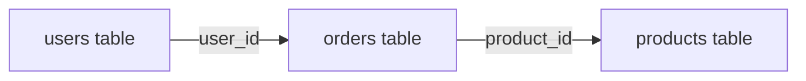

# SQL Basics

#database/sql #database/fundamentals #concepts/querying

> **Definition**: SQL (Structured Query Language) is a declarative domain-specific language designed for managing and querying data held in a relational database management system (RDBMS). You describe *what* data you want, and the query optimizer figures out *how* to retrieve it efficiently.

## Why SQL Matters at Scale

Even if your job title is "Backend Engineer" or "Site Reliability Engineer" — not "DBA" — SQL proficiency is non-negotiable for building high-throughput systems. A single poorly-written query can degrade the performance of an entire application by holding database connections, locking tables, or consuming excessive I/O. Conversely, understanding SQL deeply allows you to identify bottlenecks that tools like [[10.2 Database Indexing]] and [[10.3 SELECT with ORDER BY RANDOM]] expose.

## CRUD Operations

CRUD — Create, Read, Update, Delete — maps directly to four SQL statements that form the backbone of all database interactions.

### SELECT (Read)

```sql
-- Basic selection
SELECT id, name, email FROM users;

-- Filtered selection with WHERE
SELECT id, name FROM users WHERE active = true AND created_at > '2024-01-01';

-- Sorted and limited
SELECT id, name FROM users ORDER BY created_at DESC LIMIT 10 OFFSET 20;
```

The `WHERE` clause supports operators: `=`, `!=`, `<`, `>`, `<=`, `>=`, `LIKE`, `ILIKE`, `IN`, `BETWEEN`, `IS NULL`, `IS NOT NULL`. The `ORDER BY` clause sorts results and accepts `ASC` (default) or `DESC`. `LIMIT` restricts row count; `OFFSET` skips rows (pagination). Be warned: large `OFFSET` values cause PostgreSQL to scan and discard rows — use keyset pagination instead at scale.

### INSERT (Create)

```sql
-- Single row
INSERT INTO users (name, email) VALUES ('Alice', 'alice@example.com');

-- Multiple rows (batch — much faster)
INSERT INTO users (name, email) VALUES
  ('Alice', 'alice@example.com'),
  ('Bob', 'bob@example.com'),
  ('Charlie', 'charlie@example.com');
```

Batch inserts are dramatically faster than individual inserts because they reduce the number of round-trips, transaction commits, and index updates. See [[11.4 Batch Processing]] for why this matters at 1M RPS.

### UPDATE (Update)

```sql
UPDATE users SET last_login = NOW() WHERE id = 42;
UPDATE users SET status = 'inactive' WHERE last_login < '2023-01-01';
```

Always include a `WHERE` clause. An `UPDATE` without `WHERE` modifies every row in the table — a catastrophic mistake on a production table with millions of rows.

### DELETE (Delete)

```sql
DELETE FROM sessions WHERE expires_at < NOW();
```

Like `UPDATE`, always use `WHERE`. For large deletions, consider `TRUNCATE` (non-transactional but instantaneous) or batch deletes to avoid long-running transactions that block other queries.

## JOINs: Combining Data Across Tables

JOINs are where SQL's relational power truly shines. They combine rows from two or more tables based on related columns.



| JOIN Type | Description | Use Case |
|-----------|-------------|----------|
| `INNER JOIN` | Returns only matching rows from both tables | Default — when you only want related data |
| `LEFT JOIN` | All rows from left table + matching from right | When you want all users even if they have no orders |
| `RIGHT JOIN` | All rows from right table + matching from left | Rarely used — same as LEFT JOIN with tables swapped |
| `FULL OUTER JOIN` | All rows from both tables, NULLs where no match | Finding discrepancies between two datasets |

```sql
-- INNER JOIN: users who have placed orders
SELECT u.name, o.total
FROM users u
INNER JOIN orders o ON u.id = o.user_id;

-- LEFT JOIN: all users, with their order totals (NULL if none)
SELECT u.name, COALESCE(SUM(o.total), 0) as total_spent
FROM users u
LEFT JOIN orders o ON u.id = o.user_id
GROUP BY u.name;
```

## Aggregate Functions

Aggregate functions compute a single result from a set of rows:

| Function | Description | Example |
|----------|-------------|---------|
| `COUNT(*)` | Count all rows | `SELECT COUNT(*) FROM users` |
| `COUNT(column)` | Count non-NULL values | `SELECT COUNT(email) FROM users` |
| `SUM(column)` | Sum of values | `SELECT SUM(total) FROM orders` |
| `AVG(column)` | Average of values | `SELECT AVG(total) FROM orders` |
| `MIN(column)` | Minimum value | `SELECT MIN(created_at) FROM users` |
| `MAX(column)` | Maximum value | `SELECT MAX(created_at) FROM users` |

**Critical warning**: `SELECT COUNT(*) FROM table` on [[9.3 PostgreSQL]] is **O(n)** — it must scan every row because of MVCC. See [[10.4 COUNT Performance]] for why this becomes a serious bottleneck at scale.

## GROUP BY and HAVING

`GROUP BY` collapses rows into groups, and aggregate functions operate on each group. `HAVING` filters groups (analogous to `WHERE` filtering rows):

```sql
-- Total revenue per user, only for users who spent > $1000
SELECT user_id, SUM(total) as revenue
FROM orders
GROUP BY user_id
HAVING SUM(total) > 1000
ORDER BY revenue DESC;
```

A common mistake: using `WHERE` to filter on an aggregate. `WHERE` runs *before* `GROUP BY` and cannot see aggregates. Use `HAVING` for post-aggregation filtering.

## Subqueries and CTEs

### Subqueries

A subquery is a query nested inside another query:

```sql
-- Find users who have placed more orders than the average
SELECT name FROM users
WHERE id IN (
  SELECT user_id FROM orders
  GROUP BY user_id
  HAVING COUNT(*) > (SELECT AVG(order_count) FROM (
    SELECT COUNT(*) as order_count FROM orders GROUP BY user_id
  ) sub)
);
```

Nested subqueries become unreadable quickly. Enter CTEs.

### Common Table Expressions (CTEs)

CTEs use the `WITH` keyword to create named temporary result sets. They improve readability and allow recursive queries:

```sql
WITH user_order_counts AS (
  SELECT user_id, COUNT(*) as order_count, SUM(total) as total_spent
  FROM orders
  GROUP BY user_id
),
average_stats AS (
  SELECT AVG(order_count) as avg_orders, AVG(total_spent) as avg_spent
  FROM user_order_counts
)
SELECT uoc.user_id, uoc.order_count, uoc.total_spent
FROM user_order_counts uoc, average_stats ast
WHERE uoc.order_count > ast.avg_orders
  AND uoc.total_spent > ast.avg_spent;
```

## SQL and the 1M RPS Benchmark

Understanding SQL is essential because the 1M RPS benchmark's database challenges — [[10.3 SELECT with ORDER BY RANDOM]] (an O(n log n) query masquerading as "simple"), [[10.4 COUNT Performance]] (an O(n) count that should be instant), and [[10.5 Connection Pooling]] (managing thousands of concurrent connections) — all require you to *read* SQL, *understand* what the query planner will do, and *rewrite* it for performance. SQL is not just a tool; at scale, it is a performance-critical skill.

## Common Mistakes

- **`SELECT *` in production**: Fetches all columns including large TEXT/JSONB fields you don't need. Always specify columns.
- **Missing WHERE clauses on UPDATE/DELETE**: Will modify every row. Always double-check.
- **Using OFFSET for deep pagination**: `OFFSET 1000000` scans and discards a million rows. Use keyset pagination: `WHERE id > last_seen_id LIMIT 100`.
- **Ignoring EXPLAIN ANALYZE**: Always check the query plan. See [[10.2 Database Indexing]].

## Further Reading

- [[9.3 PostgreSQL]] — PostgreSQL-specific SQL features and architecture
- [[10.2 Database Indexing]] — how to make SELECT queries fast
- [[10.3 SELECT with ORDER BY RANDOM]] — a case study in pathological SQL