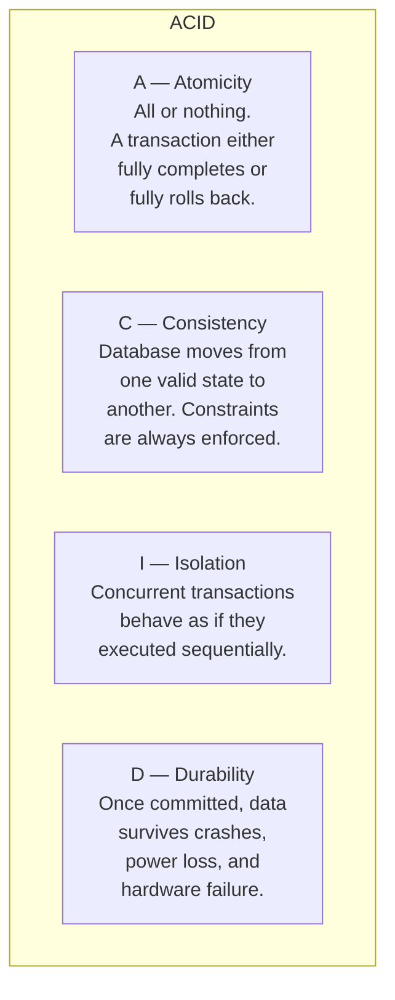
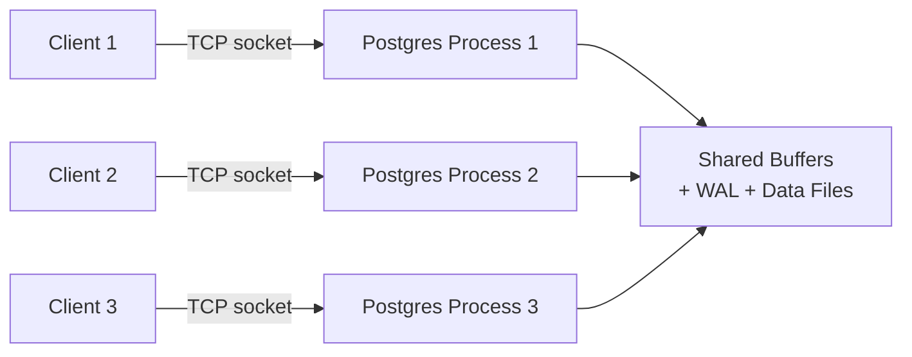

# PostgreSQL

#database/postgresql #database/relational #technology/postgresql

> **Definition**: PostgreSQL is the world's most advanced open-source relational database management system. It is ACID-compliant, extensible, and supports a wide range of data types, indexes, and concurrent access patterns — making it the default choice for production-grade applications that require reliability and correctness.

## Why PostgreSQL for the 1M RPS Benchmark?

In the "Handling 1 Million Requests Per Second" series, PostgreSQL was chosen as the primary relational database for several reasons:

1. **Open source and free** — no licensing costs, full control over configuration
2. **ACID compliance** — data integrity guarantees critical for a benchmark measuring correctness, not just throughput
3. **Extensible** — supports custom types, functions, and extensions (like TimescaleDB, PostGIS, pg_stat_statements)
4. **Strong community** — extensive documentation, active development, battle-tested in production at companies like Instagram, Spotify, and Stripe
5. **MVCC architecture** — readers never block writers, a critical property under high concurrency

## ACID Compliance

ACID is the gold standard for database transaction guarantees:



- **Atomicity**: If you transfer $100 from account A to account B (debit A, credit B), either both operations succeed or neither does. PostgreSQL uses Write-Ahead Logging (WAL) to guarantee this — if the server crashes mid-transaction, the WAL is replayed on recovery, and incomplete transactions are rolled back.

- **Consistency**: CHECK constraints, NOT NULL, UNIQUE, and FOREIGN KEY constraints ensure the database never enters an invalid state. If a transaction violates any constraint, it is rejected entirely.

- **Isolation**: PostgreSQL implements isolation through MVCC (detailed below). The default isolation level is "Read Committed," and it also supports "Repeatable Read" and "Serializable."

- **Durability**: Committed data is written to the WAL on disk before the transaction is reported as committed. The `fsync` system call ensures the OS actually flushes data to persistent storage, not just to the kernel's page cache.

## MVCC: Multi-Version Concurrency Control

MVCC is PostgreSQL's most important architectural feature for understanding performance at scale. In a naive locking system, a writer would block all readers and vice versa. MVCC eliminates this by maintaining **multiple versions of each row**:

```mermaid
sequenceDiagram
    participant T1 as Transaction 1 (SELECT)
    participant DB as PostgreSQL
    participant T2 as Transaction 2 (UPDATE)

    T1->>DB: BEGIN; SELECT balance FROM accounts WHERE id = 1;
    DB-->>T1: balance = 1000 (sees old version)
    T2->>DB: BEGIN; UPDATE accounts SET balance = 900 WHERE id = 1;
    DB-->>T2: OK (creates new row version)
    T2->>DB: COMMIT;
    T1->>DB: SELECT balance FROM accounts WHERE id = 1;
    DB-->>T1: balance = 1000 (still sees old version — snapshot isolation)
    T1->>DB: COMMIT;
```

Each row has hidden system columns: `xmin` (the transaction that created this version) and `xmax` (the transaction that deleted or updated it). When a transaction reads a row, PostgreSQL checks whether the creating transaction was committed and whether the deleting transaction was committed *as of the reading transaction's snapshot*. This means:

- **Readers never block writers**: A long-running SELECT does not prevent UPDATE/INSERT/DELETE.
- **Writers never block readers**: An UPDATE creates a new row version; the old version remains visible to concurrent readers.
- **Dead rows accumulate**: Updated or deleted rows ("dead tuples") are not immediately reclaimed. The `VACUUM` process runs periodically to clean them up. This is why `SELECT COUNT(*)` is O(n) — see [[10.4 COUNT Performance]].

## Data Types

PostgreSQL offers a rich type system that goes far beyond basic SQL types:

| Type Category | Examples | Notes |
|--------------|----------|-------|
| Numeric | `integer`, `bigint`, `numeric`, `real`, `double precision` | Use `bigint` for IDs that may exceed 2.1 billion |
| Text | `varchar(n)`, `text`, `char(n)` | `text` and `varchar` have identical performance in PostgreSQL |
| Temporal | `timestamp`, `timestamptz`, `date`, `time`, `interval` | Always use `timestamptz` (with timezone) for production |
| Boolean | `boolean` | Stores TRUE/FALSE/NULL |
| JSON | `json`, `jsonb` | `jsonb` is binary-stored and indexable — prefer it |
| UUID | `uuid` | 128-bit universally unique identifiers |
| Serial | `serial`, `bigserial` | Auto-incrementing integer (creates a sequence) |
| Network | `inet`, `cidr`, `macaddr` | Native IP address types |
| Binary | `bytea` | Binary data — but store large blobs in S3, not the DB |

The `jsonb` type is particularly noteworthy: it allows you to store semi-structured data with the full power of SQL queries and GIN indexes. This bridges the gap between relational and document databases.

## Connection Model

PostgreSQL uses a **process-per-connection** model:



Each client connection spawns a separate OS process (via `fork()`). This has important implications:

- **Memory per connection**: Each PostgreSQL backend process uses approximately **10MB of RAM** for its work_mem, maintenance_work_mem, and other buffers. At 1,000 connections, that's ~10GB just for connection overhead.
- **Connection setup cost**: Each new connection requires TCP handshake, SSL negotiation (if enabled), authentication, and session initialization — typically 5-50ms.
- **Context switching**: 5,000 processes means the OS scheduler must context-switch between them, adding CPU overhead.

This is precisely why [[10.5 Connection Pooling]] is critical. In the 1M RPS benchmark, 128 Node.js instances × 10 connections each = 1,280 PostgreSQL connections — already well above the default `max_connections` of 100.

## Configuration Files

| File | Purpose |
|------|---------|
| `postgresql.conf` | Main configuration: memory, WAL, parallelism, logging |
| `pg_hba.conf` | Host-Based Authentication: which users can connect from which IPs |
| `pg_ident.conf` | Maps OS usernames to PostgreSQL usernames |
| `postgresql.auto.conf` | Auto-generated overrides (from `ALTER SYSTEM`) |

Key `postgresql.conf` settings for high throughput:
- `shared_buffers`: 25% of system RAM (default 128MB — far too low for production)
- `effective_cache_size`: 75% of system RAM (hint to the query planner)
- `wal_level`: `replica` if using [[11.2 Read Replicas]]
- `max_connections`: default 100 — see [[10.6 Maximum Connections]]
- `work_mem`: per-operation memory for sorts, hashes, merges

## PostgreSQL in the 1M RPS Architecture

PostgreSQL serves as the durable source of truth for the benchmark application. It stores the generated codes and handles the write workload. However, as the benchmark demonstrates, even a well-tuned PostgreSQL instance tops out at roughly 30,000-35,000 writes per second on typical cloud hardware. This is why [[11.4 Batch Processing]] and [[11.5 Caching with Redis]] become essential strategies for reaching 1M RPS — PostgreSQL alone cannot get there.

## Common Mistakes

- **Leaving default settings**: The default `shared_buffers` of 128MB is designed for development, not production. Always tune for your workload.
- **Ignoring VACUUM**: Long-running transactions prevent VACUUM from reclaiming dead tuples, leading to table bloat and degraded performance.
- **Not using connection pooling**: Each connection costs ~10MB. 1,000 un-pooled connections = 10GB wasted. See [[10.5 Connection Pooling]].
- **Using `SELECT COUNT(*)` on large tables**: It's O(n). See [[10.4 COUNT Performance]].

## Further Reading

- [[10.1 IOPS (Input-Output Operations Per Second)]] — the storage bottleneck beneath PostgreSQL
- [[10.2 Database Indexing]] — how to make PostgreSQL queries fast
- [[13.5 RDS and Aurora]] — running PostgreSQL as a managed service on AWS