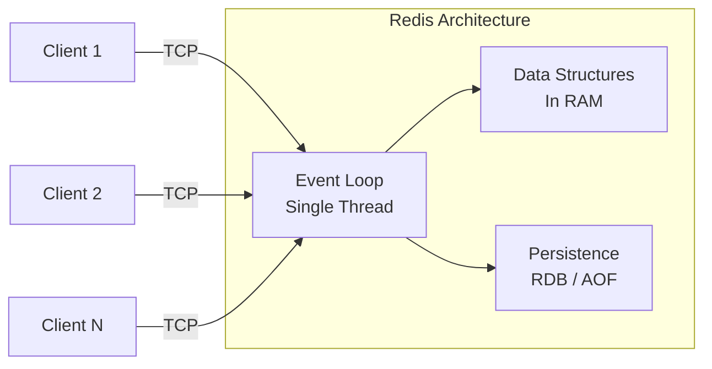
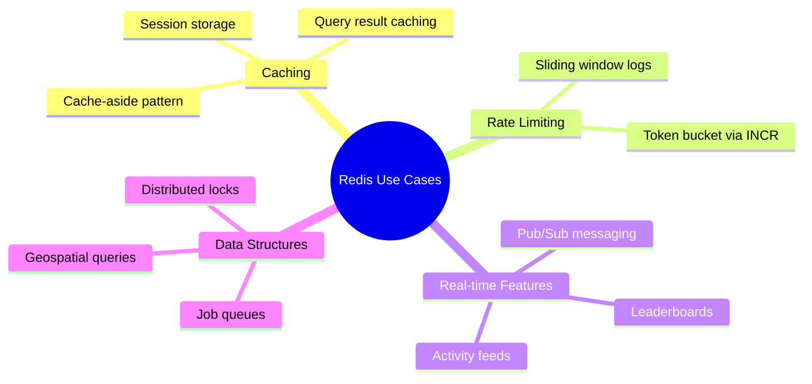

# Redis

#database/redis #database/nosql #caching/fundamentals #technology/redis

> **Definition**: Redis (Remote Dictionary Server) is an open-source, in-memory data structure store used as a database, cache, message broker, and streaming engine. It achieves microsecond-level latency by keeping all data in RAM and using a single-threaded event loop for command processing.

## Why Redis is Fast

Redis's speed comes from three architectural decisions:

1. **Everything in RAM**: RAM access latency is ~100 nanoseconds, compared to ~100 microseconds for SSD and ~10 milliseconds for HDD. That's a **1,000× to 100,000×** speedup over disk-based databases. See [[6.4 O(1) Constant Time]] for why constant-time operations on in-memory data structures are the fastest possible.

2. **Single-threaded event loop**: Redis processes all commands on a single thread using an I/O multiplexing model (epoll on Linux, kqueue on macOS). This eliminates lock contention, context switching, and thread-safety complexity. Sound familiar? This is the same architecture as Node.js (see [[4.1 Processes and Threads]]). One implication: a single slow command (like `KEYS *`) blocks the entire server.

3. **Highly optimized data structures**: Redis implements its own versions of hash tables, skip lists, compressed lists, and radix trees — each tuned for specific access patterns and memory efficiency.



## Core Data Structures

| Data Structure | Commands | Complexity | Use Cases |
|---------------|----------|------------|-----------|
| **Strings** | `GET`, `SET`, `INCR`, `DECR` | O(1) | Caching, counters, rate limiting |
| **Hashes** | `HGET`, `HSET`, `HMGET`, `HGETALL` | O(1) per field | User profiles, session data, objects |
| **Lists** | `LPUSH`, `RPUSH`, `LPOP`, `RPOP`, `LRANGE` | O(1) ends, O(n) middle | Queues, stacks, recent activity feeds |
| **Sets** | `SADD`, `SREM`, `SMEMBERS`, `SISMEMBER` | O(1) per element | Unique collections, tags, followers |
| **Sorted Sets** | `ZADD`, `ZRANGE`, `ZRANK`, `ZSCORE` | O(log n) per element | Leaderboards, ranking, priority queues |

Nearly all core operations are **O(1)** — constant time regardless of dataset size. This is why Redis can handle millions of operations per second on modest hardware.

### Strings: More Than Just Text

Redis strings are binary-safe byte arrays. They can hold:
- Plain text: `SET user:1000:name "Alice"`
- Serialized JSON: `SET user:1000:profile '{"age":30,"city":"NYC"}'`
- Integers (with atomic operations): `INCR page:views` (atomic increment)
- Raw binary: images, serialized protocol buffers, etc.

### Sorted Sets: The Swiss Army Knife

Sorted sets (ZSETs) map members to floating-point scores and maintain them in order:

```sql
-- Leaderboard example
ZADD leaderboard 1500 "alice"
ZADD leaderboard 2300 "bob"
ZADD leaderboard 1800 "charlie"
ZREVRANGE leaderboard 0 9 WITHSCORES  -- Top 10 players
ZRANK leaderboard "alice"              -- Alice's rank
ZINCRBY leaderboard 100 "alice"        -- Alice gains 100 points
```

This single data structure replaces what would require a complex database table + index + sort query in [[9.3 PostgreSQL]].

## Persistence Options

Redis is "in-memory," but it offers two persistence mechanisms so data survives restarts:

### RDB Snapshots

RDB creates point-in-time snapshots of the dataset stored as binary `.rdb` files. Think of it as a photograph of the database at a specific moment.

- **Pros**: Compact files, fast to reload, minimal impact on performance during normal operation
- **Cons**: Data loss between snapshots (default: save every 60 seconds if 1000+ keys changed)
- **Configuration**: `save 900 1`, `save 300 10`, `save 60 10000`

### AOF (Append Only File)

AOF logs every write command to a file, like a transaction journal. On restart, Redis replays the log to reconstruct the dataset.

- **Pros**: Much better durability (lose at most 1 second of data with `appendfsync everysec`)
- **Cons**: Larger files (but can be rewritten/compacted), slightly slower than RDB during normal writes
- **Configuration**: `appendonly yes`, `appendfsync everysec`

In production, many deployments use **both**: RDB for fast backups and AOF for durability between backups.

## Common Use Cases at Scale



### Session Storage

Storing user sessions in Redis is the industry standard. When a user authenticates, the session data (user ID, permissions, CSRF token) is stored with a TTL:

```
SET session:abc123 '{"user_id":42,"role":"admin"}' EX 3600
```

Every subsequent request checks Redis (O(1) lookup) instead of querying PostgreSQL. At 1M RPS, this alone eliminates millions of database queries per hour.

### Rate Limiting

Redis enables distributed rate limiting across multiple application servers:

```
INCR rate_limit:user:42
EXPIRE rate_limit:user:42 60
```

If the counter exceeds the limit within the window, the request is rejected. [[11.5 Caching with Redis]] expands on this pattern.

### Pub/Sub

Redis Pub/Sub enables real-time messaging between processes: `PUBLISH channel message` and `SUBSCRIBE channel`. Useful for invalidating caches across multiple servers, real-time notifications, and event-driven architectures.

## Redis vs Memcached

| Feature | Redis | Memcached |
|---------|-------|-----------|
| Data structures | Strings, hashes, lists, sets, sorted sets | Strings only |
| Persistence | RDB + AOF | None (pure cache) |
| Replication | Master-slave, Redis Cluster | None built-in |
| Maximum value size | 512 MB | 1 MB |
| Memory efficiency | Varies by data structure | Highly optimized slab allocation |
| Pub/Sub | Yes | Limited |
| Lua scripting | Yes | No |
| Use case | Cache + database + message broker | Cache only |

Redis has effectively superseded Memcached in most modern architectures because it offers a superset of Memcached's capabilities.

## Redis at 1M RPS

In the benchmark, the database ([[9.3 PostgreSQL]]) could handle approximately 35,000 writes per second. Redis, by contrast, can easily handle **millions** of operations per second. This asymmetry is the fundamental reason why [[11.5 Caching with Redis]] is not an optimization — it is a **requirement** for reaching 1M RPS. The architecture uses PostgreSQL as the durable source of truth and Redis as the high-speed access layer, combining the strengths of both systems.

## Common Mistakes

- **Using `KEYS *` in production**: O(n) and blocks the event loop. Use `SCAN` instead.
- **No memory limits**: Without `maxmemory` configuration, Redis can consume all available RAM and be killed by the OOM killer.
- **Ignoring eviction policy**: Set `maxmemory-policy` to `allkeys-lru` or `volatile-lru` to handle memory pressure.
- **Large values**: Storing multi-MB values in Redis wastes memory and increases latency. Store large objects in S3 and cache the URL.

## Further Reading

- [[6.4 O(1) Constant Time]] — the complexity theory behind Redis's speed
- [[11.5 Caching with Redis]] — cache patterns and strategies at scale
- [[9.3 PostgreSQL]] — the durable database Redis complements