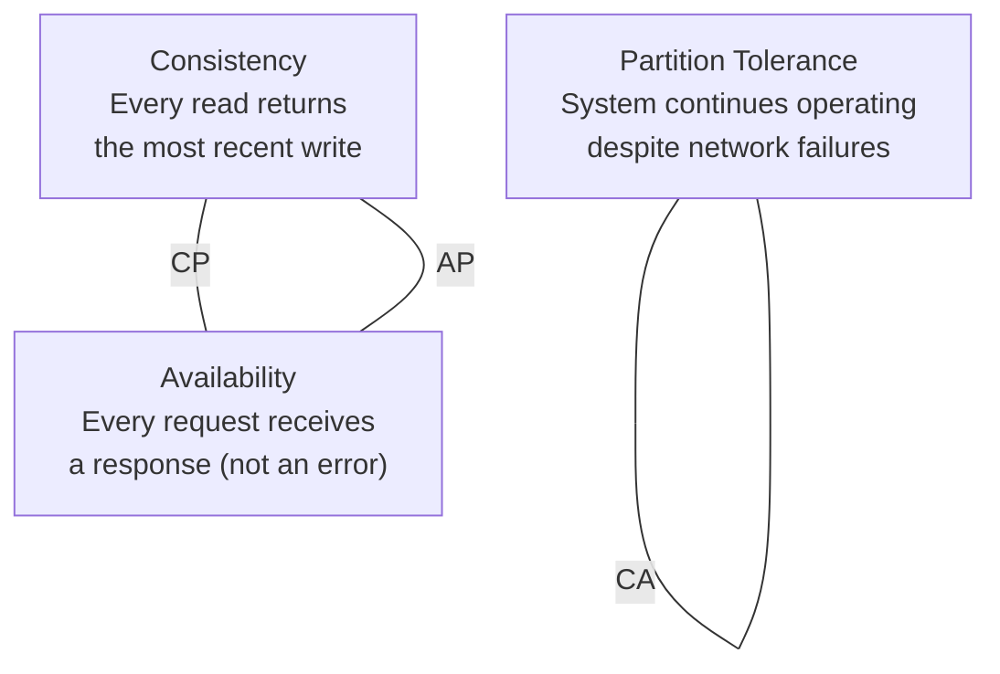
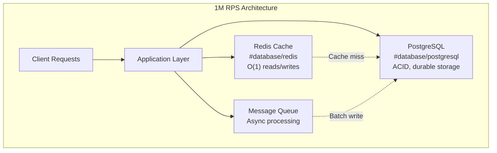

# RDBMS vs NoSQL

#database/comparison #database/fundamentals #architecture/data-modeling

> **Definition**: The RDBMS vs NoSQL debate centers on the fundamental trade-off between structured, consistent, transactional data management (RDBMS) and flexible, scalable, specialized data management (NoSQL). In practice, most large-scale systems use both.

## Relational Databases (RDBMS)

Relational databases organize data into tables (relations) with a fixed schema. Each table has columns with defined data types, and relationships between tables are enforced through foreign keys. [[9.3 PostgreSQL]] and MySQL are the dominant open-source RDBMS.

**Core characteristics**:
- **Structured schema**: Tables and columns are defined upfront via `CREATE TABLE`. Changing the schema requires migrations.
- **SQL interface**: Declarative query language — see [[9.2 SQL Basics]].
- **ACID transactions**: All four ACID properties are guaranteed. See [[9.3 PostgreSQL]] for details.
- **Strong consistency**: Reads always return the most recently written data (within the same isolation level).
- **Vertical scaling**: Performance improves by upgrading the hardware (CPU, RAM, IOPS) of a single server. See [[11.1 Vertical Scaling]].

**When to use RDBMS**:
- Financial systems where every cent must be accounted for
- User accounts and authentication data
- Order management and inventory systems
- Any data with complex relationships (JOINs between users, orders, products, payments)
- When regulatory compliance requires audit trails and strong consistency

## NoSQL Databases

NoSQL is not a single technology but a category of databases that relax relational constraints in favor of scalability, flexibility, or specialized access patterns.

```mermaid
mindmap
  root((NoSQL Databases))
    Document Stores
      MongoDB
      CouchDB
      "Schema-flexible JSON docs"
      "Rich queries on nested data"
    Key-Value Stores
      Redis
      DynamoDB
      "O(1) lookup by key"
      "Caching, sessions, config"
    Column-Family Stores
      Cassandra
      HBase
      "Massive write throughput"
      "Time-series, IoT, analytics"
    Graph Databases
      Neo4j
      Amazon Neptune
      "Relationship traversal"
      "Social, fraud, recommendations"
```

### Document Stores (MongoDB)

Document stores save data as JSON-like documents within collections. Each document can have a different structure — there is no rigid schema. They excel when:
- Your data model evolves rapidly and migrations are painful
- Entities have heterogeneous attributes (e.g., products with vastly different properties)
- You primarily access data by a single key (document ID) and rarely need complex JOINs

### Key-Value Stores ([[9.4 Redis]], DynamoDB)

The simplest NoSQL model: store a value under a key, retrieve it by key. Every operation is O(1). They excel when:
- You need sub-millisecond latency
- Your access pattern is simple (get/put by key)
- You need a caching layer (see [[11.5 Caching with Redis]])
- You need counters, leaderboards, or rate limiting (Redis sorted sets)

### Column-Family Stores (Cassandra, HBase)

Data is organized by columns rather than rows, and stored contiguously on disk. This makes them extremely efficient for:
- Time-series data (sensor readings, metrics, logs)
- Write-heavy workloads (millions of writes per second)
- Wide rows with many columns (user activity histories)

### Graph Databases (Neo4j)

Graph databases store entities (nodes) and relationships (edges) as first-class citizens. They excel when:
- Your queries involve traversing relationships (friends of friends, shortest path)
- The relationship structure is as important as the data itself
- Use cases: social networks, recommendation engines, fraud detection (circular money flows)

## The CAP Theorem

The CAP theorem, formulated by Eric Brewer, states that a distributed data store can provide at most **two** of the following **three** guarantees simultaneously:



- **CP (Consistency + Partition Tolerance)**: [[9.3 PostgreSQL]] with synchronous replication, MongoDB with majority write concern, HBase. Will reject requests rather than return stale data during a partition.
- **AP (Availability + Partition Tolerance)**: Cassandra, DynamoDB, CouchDB. Will return potentially stale data during a partition but remain available.
- **CA (Consistency + Availability)**: Single-node databases (SQLite, single-node PostgreSQL). CA is only possible without partition tolerance — and in distributed systems, partitions are inevitable, so CA is theoretical for distributed databases.

**In practice**: Most modern distributed databases allow you to configure the consistency level per operation. Cassandra, for example, lets you choose between `ONE`, `QUORUM`, and `ALL` for both reads and writes, effectively sliding along the C-A spectrum.

## Hybrid Approaches: The Real-World Answer

The "RDBMS vs NoSQL" question is a false dichotomy. Production systems at scale use **both**:



In the 1M RPS benchmark:
- **PostgreSQL** ([[9.3 PostgreSQL]]) stores the codes durably with ACID guarantees. It is the source of truth.
- **Redis** ([[9.4 Redis]]) serves as the caching layer and handles real-time operations (rate limiting, session storage). It absorbs the vast majority of read requests, allowing PostgreSQL to handle only the writes that must be durable.

This pattern — RDBMS for durability + NoSQL (Redis) for speed — is the de facto standard at companies like Instagram, Uber, and Airbnb.

## Decision Framework

| Question | RDBMS | NoSQL |
|----------|-------|-------|
| Is your data highly structured with clear relationships? | ✅ | ❌ (use document store if semi-structured) |
| Do you need complex JOINs and aggregations? | ✅ | ❌ |
| Do you need multi-row ACID transactions? | ✅ | ⚠️ (limited support in some NoSQL) |
| Do you need sub-millisecond reads by key? | ⚠️ | ✅ (Redis) |
| Do you need to store millions of time-series points per second? | ❌ | ✅ (Cassandra) |
| Will your data model change frequently? | ⚠️ (migrations needed) | ✅ (schema-flexible) |
| Do you need to traverse complex relationship graphs? | ⚠️ (expensive JOINs) | ✅ (Neo4j) |
| Must every read see the latest write? | ✅ (strong consistency) | ⚠️ (eventual consistency in some) |

## Common Mistakes

- **Choosing NoSQL to avoid learning SQL**: SQL is a powerful, well-understood tool. Avoiding it usually creates more problems than it solves.
- **Using NoSQL "because it scales":** RDBMS scales fine for most workloads with [[11.1 Vertical Scaling]], [[11.2 Read Replicas]], and [[11.4 Batch Processing]]. Only reach for NoSQL when you have a specific need.
- **Ignoring consistency requirements**: If your application is financial, medical, or compliance-regulated, the defaults of many NoSQL databases (eventual consistency) may be unacceptable.

## Further Reading

- [[9.3 PostgreSQL]] — deep dive into the benchmark's relational database
- [[9.4 Redis]] — deep dive into the benchmark's NoSQL caching layer
- [[11.2 Read Replicas]] — scaling RDBMS reads without NoSQL
- [[11.3 Sharding]] — scaling RDBMS writes via horizontal partitioning