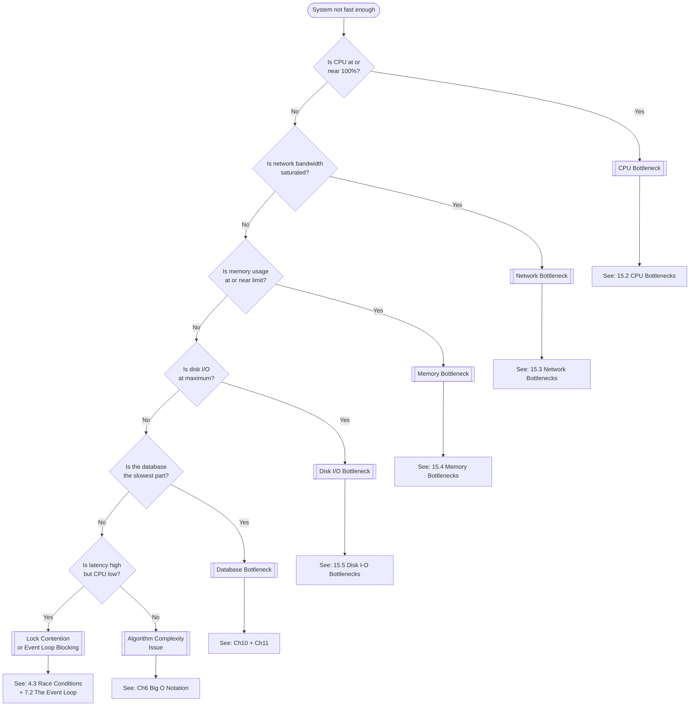

# Bottleneck Identification Guide

> [!abstract] What's Slowing Down My System?
> A practical decision tree and guide for identifying performance bottlenecks in web services. Use this when your system isn't hitting its target RPS.

---

## Quick Diagnosis Flowchart



---

## Detailed Guides

### CPU Bottleneck — [[15.1 Identifying Bottlenecks]] & [[15.2 CPU Bottlenecks]]

> [!danger] Symptoms
> - `top` / `htop` shows all cores at 90–100%
> - RPS stops increasing even with more connections
> - Latency increases under load

> [!tip] Common Causes & Fixes
> | Cause | Fix | Notes |
> |-------|-----|-------|
> | Single-threaded Node.js on multi-core machine | [[12.1 Process Clustering]] with [[12.2 PM2 Process Manager]] | Utilize all cores |
> | Inefficient algorithm | See [[6.6 Why Algorithms Matter at Scale]] | O(n) → O(log n) can be 10x improvement |
> | JSON parsing overhead | [[8.3 RapidJSON]] (C++) or [[7.5 Custom Framework (CP)]] | Parsing is a hidden CPU cost |
> | Language overhead | [[8.1 C++ for High Performance]] or [[8.4 Language Performance Comparison]] | Consider Go or Rust |
> | Synchronous blocking in event loop | [[7.2 The Event Loop]] — avoid blocking ops | Use async alternatives |

### Network Bottleneck — [[15.1 Identifying Bottlenecks]] & [[15.3 Network Bottlenecks]]

> [!danger] Symptoms
> - CPU is NOT at 100% but RPS won't increase
> - `ifconfig` or `nload` shows bandwidth near interface limit
> - Latency increases with larger response sizes
> - The video hit this at ~100K RPS with 30KB responses on a 10Gbps NIC

> [!tip] Common Causes & Fixes
> | Cause | Fix | Notes |
> |-------|-----|-------|
> | NIC bandwidth limit | Larger instance / multiple NICs / [[17.3 Network Interface Cards at Scale]] | Calculate: RPS × response_size = required bandwidth |
| | Too many TCP connections | [[5.4 Connections, Pipelining, and Workers]] — use pipelining | Reduce connection overhead |
> | Large response payloads | [[14.3 CDNs (Content Delivery Networks)]], compress responses | Reduce bytes on the wire |
> | Geographic latency | [[14.2 Geographic Distribution]] | Move servers closer to users |
> | DNS resolution overhead | [[14.4 DNS-Based Routing]] | Cache DNS, use IP directly |

**Bandwidth Quick Math:**
```
Required Bandwidth (Gbps) = RPS × Response Size (bytes) × 8 / 1,000,000,000

Example: 1,000,000 RPS × 100 bytes × 8 = 0.8 Gbps (easy)
Example: 100,000 RPS × 30,000 bytes × 8 = 24 Gbps (need multiple NICs!)
```

### Memory Bottleneck — [[15.1 Identifying Bottlenecks]] & [[15.4 Memory Bottlenecks]]

> [!danger] Symptoms
> - High memory usage (>80% of available RAM)
> - Swap activity (check `vmstat` or `free -m`)
> - OOM (Out of Memory) killer events in `dmesg`
> - Increasing latency over time (garbage collection pressure)

> [!tip] Common Causes & Fixes
> | Cause | Fix | Notes |
> |-------|-----|-------|
> | Too many DB connections | [[10.5 Connection Pooling]] | Each connection uses 5-10MB |
> | In-memory data structures growing | [[11.5 Caching with Redis]] | Offload to dedicated cache |
> | Memory leak | Profile with heap dumps | Node.js: `--inspect`, Chrome DevTools |
> | Garbage collection pauses | [[8.5 Memory Management]] | Consider non-GC language |
> | Large response buffering | Stream responses instead of buffering | Reduces peak memory |

### Disk I/O Bottleneck — [[15.1 Identifying Bottlenecks]] & [[15.5 Disk I-O Bottlenecks]]

> [!danger] Symptoms
> - High `iowait` in `top` (should be <5%)
> - `iostat` shows disk at 100% utilization
> - Database writes slow down under load
> - IOPS接近磁盘限制 (IOPS near disk limit)

> [!tip] Common Causes & Fixes
> | Cause | Fix | Notes |
> |-------|-----|-------|
> | Too many individual writes | [[11.4 Batch Processing]] | Group writes into bulk operations |
> | Missing database indexes | [[10.2 Database Indexing]] | Reduces disk reads dramatically |
| | Slow storage (HDD) | Upgrade to SSD/NVMe | [[2.4 RAM vs Disk vs Network Speeds]] |
> | Write-ahead log overhead | [[11.2 Read Replicas]] | Offload read queries |
> | Full table scans | [[10.3 SELECT with ORDER BY RANDOM]] — avoid! | Use indexed queries instead |

---

## Diagnostic Commands Cheat Sheet

| Check | Command | What to Look For |
|-------|---------|-----------------|
| CPU usage | `top` or `htop` | All cores near 100%? |
| CPU per process | `top -o %CPU` | Which process is using CPU? |
| Memory usage | `free -m` | Available memory < 20%? |
| Memory per process | `ps aux --sort=-%mem` | Which process uses most RAM? |
| Disk I/O | `iostat -x 1` | %util near 100%? await > 10ms? |
| Network bandwidth | `nload` or `iftop` | Near interface limit? |
| Network connections | `ss -s` | Too many TIME_WAIT? |
| DB connections | `SELECT count(*) FROM pg_stat_activity;` | Near [[10.6 Maximum Connections]]? |
| Event loop lag | Node.js `process.eventLoopUtilization()` | Lag increasing? |
| System load | `uptime` | Load average > core count? |

---

## The Diagnostic Process

> [!steps] Step-by-step approach from [[15.1 Identifying Bottlenecks]]

1. **Establish baseline** — Run [[5.2 Autocannon]] and [[5.6 Resource Monitoring]] to capture CPU, memory, network, and disk metrics
2. **Increase load gradually** — Watch which metric hits its limit first
3. **Identify the constraint** — Use the flowchart above
4. **Fix the bottleneck** — Apply the relevant fix from the tables above
5. **Re-test** — Run benchmarks again to confirm improvement
6. **Repeat** — Fixing one bottleneck often reveals the next one

> [!quote] The Law of Bottlenecks
> A system is only as fast as its slowest component. After fixing one bottleneck, another will emerge. This is the iterative process that takes you from 18K RPS to 1M+ RPS.

---

## Related

- [[MOCs/Concept Relationship Map]] — How bottlenecks connect to other concepts
- [[MOCs/Video Journey - From 18K to 6M RPS]] — See how bottlenecks appeared in the actual video
- [[MOCs/Comparison - Frameworks]] — Framework choice affects which bottleneck you hit first
- [[MOCs/Comparison - Languages]] — Language choice determines your CPU ceiling
- [[MOCs/Comparison - Database Strategies]] — Database scaling to resolve DB bottlenecks