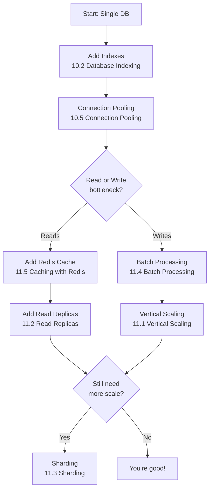

# Comparison — Database Scaling Strategies

> [!abstract] Database Scaling Decision Matrix
> A practical comparison of the five database scaling strategies covered in this vault, with guidance on when to apply each one.

---

## Strategies Compared

- [[11.1 Vertical Scaling]] — Bigger machine, faster disk, more RAM
- [[11.2 Read Replicas]] — Copy data to read-only databases
- [[11.3 Sharding]] — Split data across multiple database instances
- [[11.4 Batch Processing]] — Group writes to reduce IOPS
- [[11.5 Caching with Redis]] — Serve reads from memory instead of disk

---

## Strategy Comparison Table

| Strategy | Scales | Read/Write | Complexity | Data Consistency | Downtime Risk | Cost Increase |
|----------|--------|-----------|------------|-----------------|---------------|---------------|
| **Vertical Scaling** | Up (single node) | Both | Low | Strong | Low (resize) | High (diminishing returns) |
| **Read Replicas** | Out (read only) | Reads only | Low | Eventual | Low | Moderate |
| **Sharding** | Out (both) | Both | Very High | Per-shard strong | High (migration) | Moderate |
| **Batch Processing** | N/A (optimization) | Writes | Low | Delayed | None | Minimal |
| **Caching with Redis** | N/A (optimization) | Reads | Moderate | Eventual/TTL | Low | Low |

---

## Decision Matrix — When to Use Each

### Step 1: Are you CPU or I/O bound?

```
Is your database CPU-bound (complex queries)?
├── Yes → Optimize queries first (Ch6, Ch10) → then consider Sharding
└── No → You're likely I/O bound → continue below
```

### Step 2: What's the bottleneck?

| Your Situation | First Strategy | Second Strategy | Third Strategy |
|----------------|---------------|-----------------|----------------|
| **Disk IOPS maxed out on writes** | [[11.4 Batch Processing]] | [[11.1 Vertical Scaling]] (faster disk) | [[11.3 Sharding]] |
| **Disk IOPS maxed out on reads** | [[11.5 Caching with Redis]] | [[11.2 Read Replicas]] | [[11.1 Vertical Scaling]] |
| **Too many connections** | [[10.5 Connection Pooling]] | [[11.2 Read Replicas]] (offload reads) | [[11.3 Sharding]] |
| **Single query too slow** | [[10.2 Database Indexing]] (O(log n)) | [[11.5 Caching with Redis]] | Query redesign |
| **Data too large for one machine** | [[11.3 Sharding]] | [[11.1 Vertical Scaling]] (temporary) | [[11.2 Read Replicas]] |
| **Read-heavy workload (90%+ reads)** | [[11.5 Caching with Redis]] | [[11.2 Read Replicas]] | [[11.4 Batch Processing]] (for writes) |
| **Write-heavy workload** | [[11.4 Batch Processing]] | [[11.3 Sharding]] | [[11.1 Vertical Scaling]] |
| **Need zero-downtime scaling** | [[11.2 Read Replicas]] | [[11.5 Caching with Redis]] | [[11.3 Sharding]] (planned) |

---

## Deep Dive: Each Strategy

### 1. Vertical Scaling — [[11.1 Vertical Scaling]]

> [!check] Do this FIRST before anything else

- Upgrade to a larger EC2 instance ([[13.3 Instance Types]])
- Switch from HDD to SSD to NVMe
- Add more RAM for larger buffer pools
- **Pros**: Zero code changes, zero architecture changes
- **Cons**: Expensive at high end, single point of failure, hard limit exists
- **When to stop**: When the next instance size costs 2x but gives only 20% more performance

### 2. Read Replicas — [[11.2 Read Replicas]]

> [!check] Do this when reads dominate your traffic

- Copy your PostgreSQL database ([[9.3 PostgreSQL]]) to one or more read replicas
- Application routes read queries to replicas, writes to primary
- **Pros**: Simple to implement, linear read scaling
- **Cons**: Eventual consistency (replication lag), writes still go to one node
- **Good for**: Dashboards, reporting, product catalogs, user profiles
- **Bad for**: Write-heavy workloads, real-time consistency requirements

### 3. Sharding — [[11.3 Sharding]]

> [!warning] Do this LAST — highest complexity

- Split data by a shard key (user ID, region, etc.) across multiple databases
- Each shard owns a subset of the data
- **Pros**: Scales both reads and writes, near-linear scaling
- **Cons**: Cross-shard queries are expensive, rebalancing is hard, application must be shard-aware
- **Good for**: Massive datasets, multi-tenant systems, global applications
- **Bad for**: Small datasets, teams without dedicated DBA

### 4. Batch Processing — [[11.4 Batch Processing]]

> [!check] Do this EARLY — low-hanging fruit for write performance

- Group multiple database writes into a single transaction or bulk operation
- Reduces round-trips and IOPS consumption ([[10.1 IOPS]])
- **Pros**: Dramatic write improvement, simple to implement
- **Cons**: Data is not immediately visible (delayed consistency)
- **Good for**: Analytics, logging, metrics, non-real-time updates
- **Bad for**: User-facing writes that need instant visibility

### 5. Caching with Redis — [[11.5 Caching with Redis]]

> [!check] Do this EARLY for read-heavy workloads

- Store frequently accessed data in [[9.4 Redis]] (in-memory)
- Reads hit Redis (O(1)) instead of PostgreSQL (O(log n))
- **Pros**: Massive read speedup, reduces database load dramatically
- **Cons**: Cache invalidation complexity, memory cost, data staleness
- **Good for**: Session data, configuration, frequently accessed records
- **Bad for**: Frequently changing data, large objects, data requiring strong consistency

---

## Recommended Scaling Progression



---

## Real-World Numbers from the Vault

| Scenario | Without Optimization | With Optimization | Strategy Used |
|----------|---------------------|-------------------|---------------|
| Database writes | ~35K RPS | ~35K RPS (IOPS limited) | [[10.1 IOPS]] — disk bound |
| DB reads with ORDER BY RANDOM | Crashed | N/A (unfixable) | [[10.3 SELECT with ORDER BY RANDOM]] — algorithm problem |
| DB reads with ID lookup + index | Unknown | ~400K RPS | [[10.2 Database Indexing]] + [[6.3 O(log n) Logarithmic Time]] |

---

## Related

- [[MOCs/Comparison - Frameworks]] — How the app layer framework affects DB interaction
- [[MOCs/Comparison - Languages]] — Language choice affects DB driver performance
- [[MOCs/Bottleneck Identification Guide]] — Is the database actually your bottleneck?
- [[MOCs/Concept Relationship Map]] — How database concepts connect to the rest of the system