# Video Journey — From 18K to 6M RPS

> [!abstract] The Full Story
> This MOC traces the narrative arc of the video — every benchmark, every bottleneck discovery, every optimization — from a simple Express server at 18K RPS to a 128-instance cluster hitting 6 million requests per second.

---

## The Journey at a Glance

```mermaid
graph LR
    S1["1. Express Simple<br/>18K RPS"] --> S2["2. Fastify<br/>66K RPS"]
    S2 --> S3["3. CP Framework<br/>73K RPS"]
    S3 --> S4["4. 12-Instance Cluster<br/>42K RPS<br/>(complex route)"]
    S4 --> S5["5. 128-Instance Cluster<br/>6M RPS<br/>(C8i.32xlarge, simple)"]
    S5 --> S6["6. Network Bottleneck<br/>100K RPS<br/>(complex, 30KB)"]
    S6 --> S7["7. Database Writes<br/>35K RPS<br/>(IOPS limited)"]
    S7 --> S8["8. ORDER BY RANDOM<br/>CRASHED"]
    S8 --> S9["9. Indexed ID Lookup<br/>400K RPS"]
    S9 --> S10["10. C++ Drogon<br/>1M RPS<br/>(single instance)"]

    style S8 fill:#ff4444,color:#fff
    style S10 fill:#44bb44,color:#fff
```

---

## Stage 1: Express Simple — 18,000 RPS

> The starting point: a basic Express server returning a simple JSON response.

- **Framework**: [[7.3 Express Framework]]
- **RPS**: ~18,000
- **Setup**: Single Node.js process, simple `res.json()` response
- **Key takeaway**: Express is feature-rich but carries significant overhead per request. Middleware chains, routing, and built-in JSON serialization all add latency.
- **What we learned**: Even a "simple" Express endpoint has many layers of abstraction under the hood.

---

## Stage 2: Fastify — 66,000 RPS

> Swapping Express for Fastify — same language, 3.7x improvement.

- **Framework**: [[7.4 Fastify Framework]]
- **RPS**: ~66,000
- **Improvement**: +267% over Express
- **Key takeaway**: Fastify's schema-based approach and optimized internals make a huge difference. Built-in JSON serialization is significantly faster than Express.
- **What we learned**: Framework choice within the same language can yield 3-4x differences.

---

## Stage 3: Custom Framework (CP) — 73,000 RPS

> Stripping away all abstractions to the bare minimum.

- **Framework**: [[7.5 Custom Framework (CP)]]
- **RPS**: ~73,000
- **Improvement**: +10% over Fastify, +305% over Express
- **Key takeaway**: Even Fastify has overhead. By removing routing, middleware, and schema validation, we squeeze out more performance.
- **What we learned**: Every abstraction has a cost. At scale, those costs compound.
- **Full data**: [[7.6 Framework Benchmarking Results]]

---

## Stage 4: 12-Instance Cluster on Mac — 42,000 RPS (Complex Route)

> Moving from 1 process to 12 — but a complex route reveals Node.js limitations.

- **Concept**: [[12.5 Cluster Mode Scaling]]
- **Tool**: [[12.2 PM2 Process Manager]]
- **RPS**: ~42,000 (complex route with DB-like operations)
- **Setup**: 12 Node.js processes on a Mac (utilizing all CPU cores)
- **Key takeaway**: Clustering helps with CPU utilization ([[12.1 Process Clustering]]), but with complex routes the improvement is non-linear due to shared resource contention.
- **What we learned**: Multi-core helps, but it doesn't solve algorithmic or architectural problems.

---

## Stage 5: 128-Instance Cluster on C8i.32xlarge — 6,000,000 RPS (Simple)

> Moving to the cloud with massive compute — the numbers get crazy.

- **Infrastructure**: [[13.2 EC2 (Elastic Compute Cloud)]] → [[13.3 Instance Types]]
- **Concept**: [[12.1 Process Clustering]] at extreme scale
- **RPS**: ~6,000,000 (128 instances, simple route)
- **Setup**: AWS c8i.32xlarge (128 vCPUs), 128 Node.js processes
- **Key takeaway**: With enough CPU cores and a trivial workload, you can achieve astronomical RPS numbers. But real-world workloads tell a different story...
- **What we learned**: Raw RPS on simple routes is impressive but misleading. The real test is complex routes.

---

## Stage 6: Network Bottleneck Discovery — 100,000 RPS (Complex, 30KB)

> The illusion shatters. Complex routes with real data hit a wall.

- **Discovery**: [[15.3 Network Bottlenecks]]
- **RPS**: ~100,000 (complex route returning 30KB responses)
- **The problem**: 100,000 × 30KB × 8 bits = ~24 Gbps — saturating the network interface card
- **Key concepts**: [[2.6 Network Cards and Bandwidth]], [[3.6 Network Latency and Bandwidth]], [[17.3 Network Interface Cards at Scale]]
- **Key takeaway**: CPU was no longer the bottleneck — the network card became the constraint. This is the most important bottleneck discovery in the entire video.
- **What we learned**: `RPS × response_size = bandwidth_required`. Always calculate this before provisioning.

---

## Stage 7: Database Writes — 35,000 RPS

> Adding a database brings us back to earth. IOPS is the new limit.

- **Database**: [[9.3 PostgreSQL]]
- **Bottleneck**: [[10.1 IOPS (Input-Output Operations Per Second)]]
- **RPS**: ~35,000 (each request does a DB write)
- **Key takeaway**: Disk I/O is orders of magnitude slower than CPU or network. Even a fast SSD has limited IOPS.
- **What we learned**: Database writes are often the first real bottleneck in any application. See [[2.4 RAM vs Disk vs Network Speeds]] for the speed hierarchy.

---

## Stage 8: ORDER BY RANDOM — CRASHED

> The most dramatic moment. One bad query brings everything down.

- **Problem Query**: [[10.3 SELECT with ORDER BY RANDOM]]
- **Result**: Database crashed, zero RPS
- **Algorithm**: This is O(n) — it reads every row, assigns a random number, sorts, and returns one
- **Key concepts**: [[6.2 O(n) Linear Time]], [[6.6 Why Algorithms Matter at Scale]]
- **Key takeaway**: Algorithm choice is not an optimization — it's a survival requirement. An O(n) query on a large table is catastrophic.
- **What we learned**: Always know the Big O of your database queries. See [[6.5 Database Query Complexity]].

---

## Stage 9: Indexed ID Lookup — 400,000 RPS

> Fixing the algorithm: from crashed to 400K RPS.

- **Solution**: [[10.2 Database Indexing]] → B-tree index on ID column
- **Algorithm**: [[6.3 O(log n) Logarithmic Time]] instead of O(n)
- **RPS**: ~400,000
- **Key takeaway**: A single database index transforms performance by 10x or more. O(log n) vs O(n) is not a subtle difference — it's the difference between working and not working.
- **What we learned**: Indexes are the most impactful database optimization. Always index your query columns.

---

## Stage 10: C++ with Drogon + RapidJSON — 1,000,000+ RPS

> The finale: leaving Node.js behind for compiled C++ performance.

- **Language**: [[8.1 C++ for High Performance]]
- **Framework**: [[8.2 Drogon Framework]]
- **JSON Library**: [[8.3 RapidJSON]]
- **RPS**: ~1,000,000+ (single instance)
- **Key concepts**: [[8.4 Language Performance Comparison]], [[8.5 Memory Management]]
- **Key takeaway**: With C++, you can achieve 1M+ RPS on a single machine — no clustering needed. The combination of compiled code, zero-cost abstractions, and RapidJSON's parsing speed is unmatched.
- **What we learned**: Language choice is the biggest lever. When Node.js maxes out at ~73K RPS per process, C++ delivers 1M+ — that's a 14x difference.

---

## Lessons from the Journey

| Lesson | Stage | Notes |
|--------|-------|-------|
| Frameworks matter within a language | 1 → 2 → 3 | Express → Fastify → CP: 4x improvement |
| Clustering multiplies capacity | 4 → 5 | But only scales linearly for simple workloads |
| Network can be the real bottleneck | 6 | Always calculate bandwidth requirements |
| Databases are the great equalizer | 7 | IOPS limits trump CPU speed |
| Algorithm choice is existential | 8 → 9 | O(n) crashes, O(log n) does 400K RPS |
| Language is the biggest lever | 10 | C++ vs Node.js: 14x per-process improvement |
| Real 1M RPS needs all of the above | All | [[17.6 Real-World Architecture for 1M RPS]] |

---

## Related

- [[MOCs/Learning Roadmap]] — Study these topics in order
- [[MOCs/Comparison - Frameworks]] — Detailed framework comparison
- [[MOCs/Comparison - Languages]] — Detailed language comparison
- [[MOCs/Comparison - Database Strategies]] — How to scale the database layer
- [[MOCs/Bottleneck Identification Guide]] — Systematic approach to finding bottlenecks
- [[MOCs/Concept Relationship Map]] — How all concepts connect