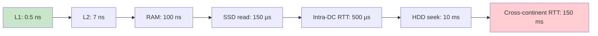
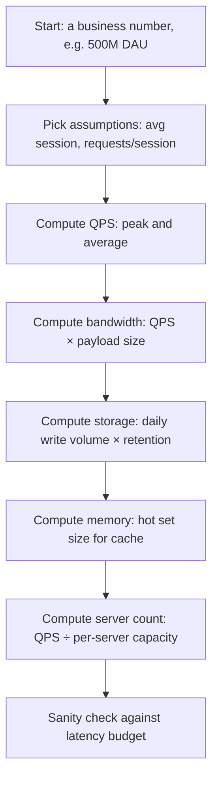
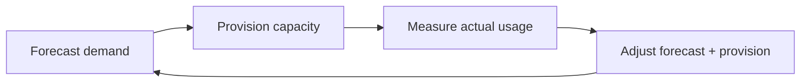

# Chapter 1. Foundations of System Design

> [!abstract] Chapter Goal
> Before designing any system, you must internalize two things: **how fast each building block of a computer actually is**, and **how to translate a vague business requirement ("500 million daily active users") into concrete hardware numbers** (requests per second, bandwidth, RAM, storage). This chapter gives you the mental scaffolding used in every system design conversation that follows.

## 1. What "System Design" Actually Means

System design is **the discipline of choosing, composing, and sizing the building blocks of a distributed application so that they meet functional and non-functional requirements under realistic load, failure, and evolution constraints**. It is *not* coding, and it is *not* network administration. It sits between product requirements and implementation.

There are three layers every system design decision touches:

```mermaid
graph TD
    A[Product Requirement: "Users can post a message"]
    B[Functional Design: API contract, data model, lifecycle]
    C[Non-Functional Design: latency, throughput, availability, cost]
    D[Building Blocks: LB, cache, queue, DB, CDN]
    E[Capacity: how many boxes, how much RAM, how much disk]
    A --> B
    B --> C
    C --> D
    D --> E
```

A senior engineer designs at all five layers. A junior engineer often jumps straight to D ("let's use Kafka") without first quantifying C or E. This chapter forces you to do C and E first.

## 2. Functional vs Non-Functional Requirements

Every design conversation starts with **requirements gathering**. Skipping this step is the single most common cause of bad designs.

### 2.1 Functional Requirements

These describe **what the system does**. They are usually expressed as user stories or API contracts:

- "A user can upload a video."
- "A user can see a personalized feed of posts from people they follow."
- "A user can send a direct message to another user."

Functional requirements determine the **data model**, the **API surface**, and the **lifecycle of an entity** through the system.

### 2.2 Non-Functional Requirements (NFRs)

NFRs describe **how well** the system does its job. They are usually expressed as measurable targets. The canonical NFRs are:

| NFR | Definition | Typical Target |
|-----|------------|----------------|
| **Latency** | Time from request to first/last response byte | p99 < 200 ms for read APIs |
| **Throughput** | Requests per second the system sustains | 10 k QPS read, 1 k QPS write |
| **Availability** | Fraction of time the system is up | 99.9 % (three nines) |
| **Durability** | Probability of data loss per year | 99.999999999 % (11 nines) for object storage |
| **Consistency** | How soon a write is visible to all readers | Strong / eventual / causal |
| **Scalability** | How the system behaves as load grows | Linear horizontal scaling |
| **Security** | Confidentiality, integrity, authentication | TLS 1.3, OAuth 2.0, signed payloads |
| **Cost** | $/request or $/user/month | < $0.01 per active user / month |
| **Maintainability** | How easy it is to operate and evolve | < 1 hour MTTR for common incidents |

> [!warning] Common Mistake
> Beginners obsess over latency and forget **durability**. A payments system with 50 ms latency but 99 % durability is useless. Always rank NFRs **per use case** before designing.

### 2.3 The CAP-PACELC Reminder

You already have CAP in your original vault. The extension you should internalize is **PACELC** (pronounced *pack-elk*):

- **If a Partition (P) happens**, the system chooses between **Availability (A)** and **Consistency (C)**.
- **Else (E), when running normally**, the system chooses between **Latency (L)** and **Consistency (C)**.

This means even a perfectly healthy system has a trade-off: lower latency usually means weaker consistency. DynamoDB is PA/EL. Spanner is PC/EC. MongoDB (with majority writes) is PC/EC. Cassandra is PA/EL. Knowing this lets you predict a system's behavior without reading its source code.

## 3. Latency Numbers Every Programmer Should Know

These numbers, originally compiled by Jeff Dean at Google, are the **single most useful cheat sheet** in system design. You should be able to recite the *order of magnitude* of each from memory.

### 3.1 The Reference Table

| Operation | Approximate Time | Comparable Analogy |
|-----------|------------------|--------------------|
| L1 cache reference | 0.5 ns | 1 second |
| Branch mispredict | 5 ns | 10 seconds |
| L2 cache reference | 7 ns | 14 seconds |
| Mutex lock / unlock | 25 ns | 50 seconds |
| Main memory reference | 100 ns | 3 minutes |
| Compress 1 KB with Zstd | 3,000 ns (3 µs) | 1 hour |
| Send 1 KB over 1 Gbps network | 10,000 ns (10 µs) | 3 hours |
| Read 4 KB randomly from SSD | 150,000 ns (150 µs) | 12 days |
| Read 1 MB sequentially from memory | 250,000 ns (250 µs) | 21 days |
| Round trip within same datacenter | 500,000 ns (500 µs) | 1.5 months |
| Read 1 MB sequentially from SSD | 1,000,000 ns (1 ms) | 3 months |
| HDD seek | 10,000,000 ns (10 ms) | 2.5 years |
| Read 1 MB sequentially from HDD | 30,000,000 ns (30 ms) | 8 years |
| Send packet CA → Netherlands → CA | 150,000,000 ns (150 ms) | 5 years |

> [!tip] Mnemonic
> Memory is ~100 ns, SSD is ~100 µs, network within a DC is ~500 µs, cross-continent round trip is ~150 ms. Each step is roughly **1000× slower** than the previous.

### 3.2 Why These Numbers Matter

The numbers tell you which designs are **physically impossible**:

- You cannot do 1,000 sequential HDD seeks inside a 100 ms API budget — that's 10 seconds.
- You cannot call 5 microservices in series with a 1 ms timeout each from a server that already takes 100 ms to process — the network alone eats the budget.
- You cannot fetch 10 rows from a database with disk-based indexes for a sub-millisecond response.



### 3.3 Implications for Design

1. **Cache aggressively** — main memory is 1,000× faster than SSD.
2. **Batch disk reads** — 1 MB sequential SSD read is the same time as 1 random 4 KB read.
3. **Co-locate services** — intra-DC calls are 300× faster than cross-region calls.
4. **Avoid synchronous cross-region calls** — 150 ms is half of a 300 ms user-perceived "instant" budget.
5. **Prefer SSD for any user-facing workload** — HDDs only belong in cold storage and archival tiers.

## 4. Back-of-the-Envelope Estimation

Back-of-the-envelope (BotE) estimation is the practice of **computing rough numbers from first principles** to sanity-check a design before writing any code. The goal is *order-of-magnitude accuracy*, not precision. If your estimate says "1,000 servers" and the real answer is "3,000", you were close enough. If it says "1 server" and the real answer is "1,000", your design was wrong.

### 4.1 The BotE Workflow



### 4.2 Standard Assumptions to Memorize

These are the round numbers every system designer uses. Memorize them:

| Quantity | Value |
|----------|-------|
| Seconds per day | 86,400 (≈ 10^5) |
| Requests per second that one box handles | ~1,000 for typical web app, ~10,000 for read-only |
| Network bandwidth inside a DC | 1 Gbps to 25 Gbps per host |
| A "small" server | 4–8 cores, 16–32 GB RAM, 100 GB–1 TB SSD |
| A "big" server | 32–64 cores, 128–256 GB RAM, multiple TB NVMe |
| SSD random read IOPS | 50,000–500,000 |
| HDD random read IOPS | 100 |
| Max TCP connections per host | ~65,000 source ports, but realistically 50,000 active |
| Average HTTP request payload | 1–10 KB |
| Average image size | 100 KB–1 MB |
| Average video chunk | 2–10 MB |
| Cache hit ratio target | 90–99 % for hot content |

### 4.3 Worked Example 1: Twitter-Style Read API

**Assumption**: 200 million daily active users, each scrolls their feed 5 times per day, each feed load triggers 1 API call that returns 20 tweets.

**Step 1 — QPS**:
- Daily requests = 200 M × 5 = 1,000 M = 10^9 requests/day.
- Average QPS = 10^9 / 10^5 = **10,000 QPS**.
- Peak QPS ≈ 3× average (people use social media at peak hours) = **30,000 QPS**.

**Step 2 — Bandwidth**:
- 20 tweets × 500 bytes each (text + metadata) = 10 KB per response.
- 30,000 QPS × 10 KB = 300,000 KB/s = **300 MB/s = 2.4 Gbps** at peak.
- This is comfortably served by 3–4 hosts on 1 Gbps NICs.

**Step 3 — Storage**:
- Assume 5 % of users post a tweet per day, average 200 bytes per tweet.
- Daily write volume = 200 M × 0.05 × 200 B = 2 GB/day = 730 GB/year.
- With 5-year retention = ~4 TB. Trivial.

**Step 4 — Cache**:
- Hot set = active users in last 24 hours. Assume 10 M users have at least 1 cached feed.
- 10 M × 10 KB cached feed = 100 GB.
- Use Redis at 50 % load = 200 GB RAM total. Two 128 GB Redis hosts in primary-replica = enough.

**Step 5 — Servers**:
- Each backend box handles ~5,000 read QPS.
- 30,000 / 5,000 = 6 boxes for compute.
- Add 2 more for spikes, failover, deploys = 8 backend boxes.

> [!tip] Always Round Up and Add Headroom
> Real-world capacity planning adds **30 % headroom** for traffic spikes and **N+1 redundancy** for deploys and failures. 6 boxes becomes 8. 10 boxes becomes 14.

### 4.4 Worked Example 2: Video Upload Service

**Assumption**: 1 million video uploads per day, average 100 MB each.

**Step 1 — Ingestion bandwidth**:
- 1 M × 100 MB = 10^8 MB = 100 TB/day.
- 100 TB / 86,400 s ≈ 1.16 GB/s ≈ **9.3 Gbps average**, peaks probably 25 Gbps.

**Step 2 — Storage growth**:
- 100 TB/day = 36.5 PB/year raw.
- With 3× replication = 110 PB/year.
- With erasure coding (1.4× overhead) = 51 PB/year.

**Step 3 — Transcoding compute**:
- Assume transcoding 1 minute of video takes 1 CPU-minute (realistic for 1080p H.264 with multiple bitrates).
- Average video is 5 minutes → 5 CPU-minutes per upload.
- 1 M × 5 = 5 M CPU-minutes/day = 83,333 CPU-hours/day.
- A 32-core box gives 768 CPU-hours/day.
- Need ~110 boxes for transcoding alone.

This is why video platforms have enormous transcoding farms.

### 4.5 Worked Example 3: WhatsApp-Style Connections

**Assumption**: 1 billion users, 30 % online at peak, each maintains a persistent WebSocket.

**Step 1 — Concurrent connections**:
- 1 B × 0.3 = 300 M concurrent connections.

**Step 2 — Gateway servers**:
- Each gateway box holds ~500 K connections (memory-bound: ~30 KB per connection state × 500 K = 15 GB).
- 300 M / 500 K = **600 gateway boxes**.

**Step 3 — Bandwidth**:
- Each user sends ~50 messages/day, average 200 bytes.
- 1 B × 50 × 200 B = 10^12 bytes/day = 1 TB/day.
- Average = 1 TB / 86,400 s ≈ 12 MB/s. Tiny.
- **But** presence updates and acknowledgements multiply this by 5–10×.

**Step 4 — Connection state storage**:
- Each user's session state ~1 KB.
- 1 B × 1 KB = 1 TB. Need a distributed KV store (Redis Cluster, DynamoDB).

You will see this expanded into a full case study in [[Chapter 17. Case Study Real-Time Chat]].

## 5. Capacity Planning Beyond BotE

BotE gives you a starting point. **Capacity planning** is the continuous process of refining that estimate against real measurements. The four-step loop is:



### 5.1 Utilization Targets

Do not provision for 100 % utilization. Industry-standard targets:

- **CPU**: 60 % average, 80 % peak. Above 80 %, latency degrades non-linearly because of queueing.
- **Memory**: 70 %. You need headroom for spikes and OS page cache.
- **Disk**: 75 %. Filesystems slow down above 90 % full.
- **Network**: 40 %. Above 70 %, packet loss and retransmits spike.

### 5.2 Headroom Math

For an NFR of 99.9 % availability with 30-day provisioning cycles, you need enough headroom to absorb:

- A 2× traffic spike (viral content, marketing push).
- One failed server in each cluster (N+1 redundancy).
- A deploy that takes 30 % of capacity offline for rolling restart.

So a service that needs 10 boxes at steady state actually needs **10 × 2 × 1.3 ≈ 26 boxes** provisioned. This is why real fleets are bigger than BotE suggests.

### 5.3 The Cost Angle

Capacity planning is meaningless without a cost number. Always compute **$ / request**:

```
cost_per_request = (monthly_server_cost) / (monthly_requests)
```

If your BotE estimate gives you $0.001 per request but the business model only allows $0.0001, you have a design problem, not an engineering problem. Either re-architect or renegotiate the product.

## 6. Common Estimation Mistakes

### 6.1 Forgetting the Read/Write Ratio

A system with 99 % reads and 1 % writes is designed very differently from a 50/50 system. Always state the R/W ratio explicitly. Most social platforms are 100:1 read:write. Most payment systems are 1:10 (writes dominate).

### 6.2 Ignoring the Long Tail

Average latency is meaningless. **p99 latency** is what users actually experience. If your average is 50 ms but p99 is 2 seconds, the system feels slow. Always design to a p99 or p99.9 budget.

### 6.3 Confusing Bandwidth with Throughput

- **Bandwidth** is the maximum rate the network can move (e.g. 10 Gbps).
- **Throughput** is what your application actually achieves (often 30–70 % of bandwidth due to protocol overhead, packet loss, TCP slow start).

A 10 Gbps link delivers maybe 6 Gbps of useful application throughput.

### 6.4 Forgetting Time Zones

"500 M daily active users" is not "500 M concurrent users". Users in different time zones peak at different times. A global service's peak is roughly **1.5× the average**, while a regional service's peak is **3–4× average**.

### 6.5 Not Accounting for Failure Modes

When one node fails, its traffic redistributes to the others. If you provisioned at exactly 80 % utilization, the remaining nodes are now at 100 % and the system falls over. Always provision so that **N-1 nodes can still handle peak**.

## 7. Tips and Reminders

> [!tip] Quick Estimation Anchors
> - 1 day = ~10^5 seconds.
> - 1 year = ~10^7.5 seconds (~31.5 M seconds).
> - A 1 Gbps link moves ~10^8 bytes/s ≈ 100 MB/s.
> - 1 TB = 10^12 bytes; 1 PB = 10^15 bytes.
> - 1 million QPS = ~10^6 QPS = a Tier-1 internet service.

> [!warning] Don't Quote BotE Numbers as SLAs
> BotE gives you *design targets*, not promises. The real SLA must be measured after launch.

> [!tip] Always Carry a Multiple
> When asked "how many servers?", give a range: "20 for steady state, 30 with headroom, 40 for a deploy window". This shows you understand real operations.

> [!tip] Map NFRs to Sub-Systems
> A 99.99 % availability target for the whole system does *not* mean every sub-system needs 99.99 %. The checkout flow might, but the recommendations engine can be 99.9 % and the user-bio service can be 99 %. Apportion the SLA to sub-systems based on user impact.

## 8. Chapter Summary

- System design = choosing building blocks + sizing them against NFRs.
- Latency numbers give you the physical limits of what is possible.
- BotE estimation translates business numbers into engineering numbers.
- Always compute: QPS, bandwidth, storage, memory, server count, cost per request.
- Add 30 % headroom and N+1 redundancy to every estimate.
- The estimate is the *starting* point — real capacity planning requires measurement.

The next chapter ([[Chapter 2. Networking Fundamentals]]) zooms into what happens before a request even reaches your application: DNS resolution, TCP/UDP transport, HTTP versions, and the proxy layer that shields your servers from the open internet.
