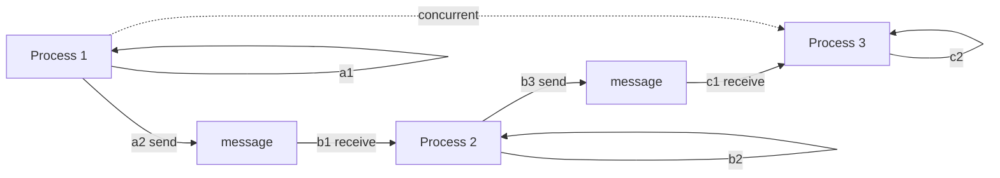
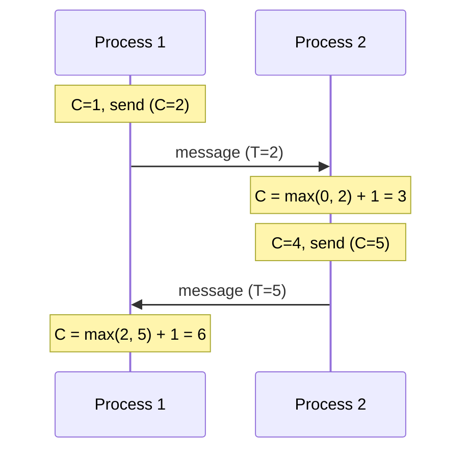
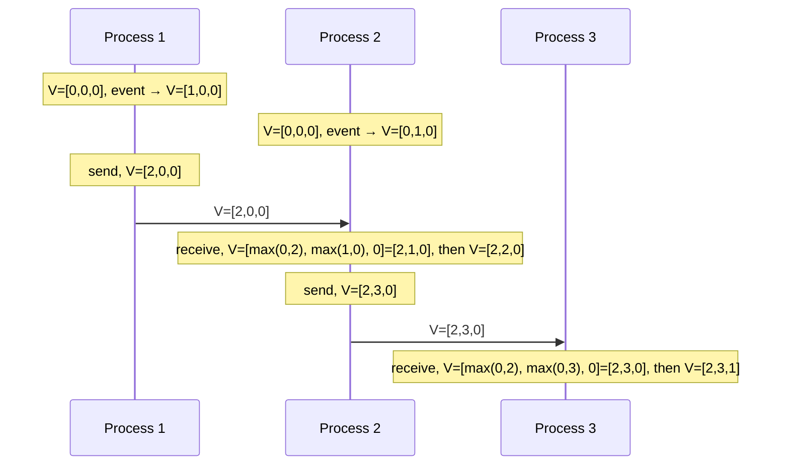
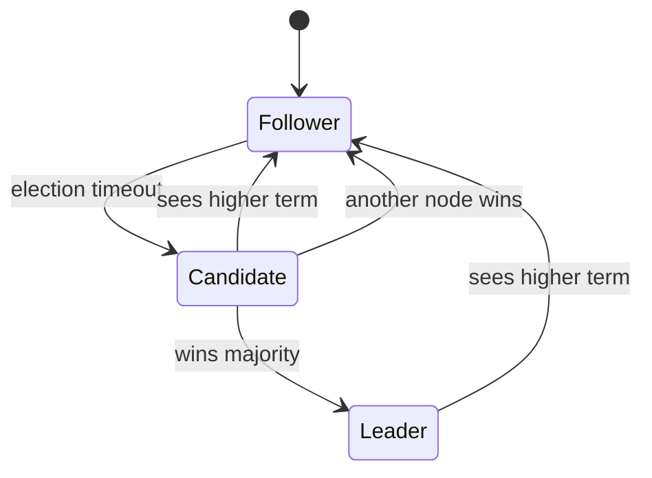
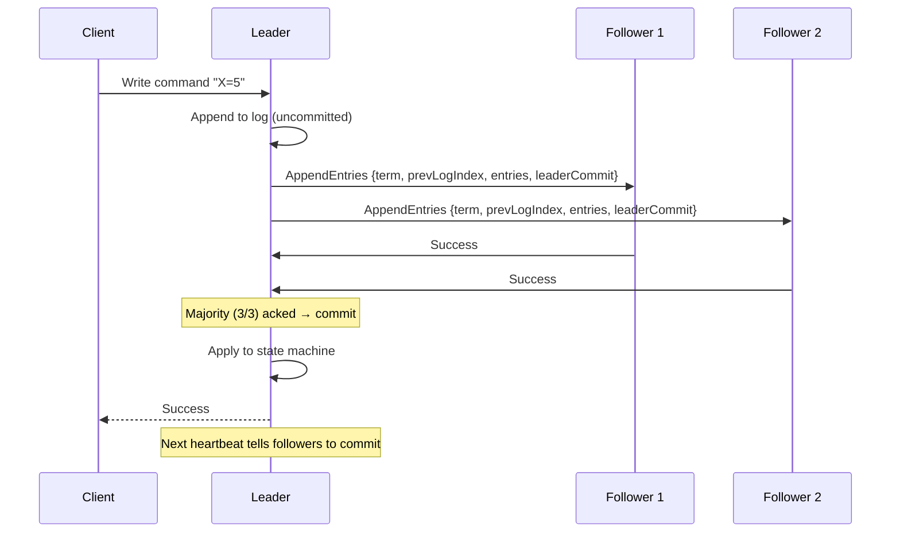
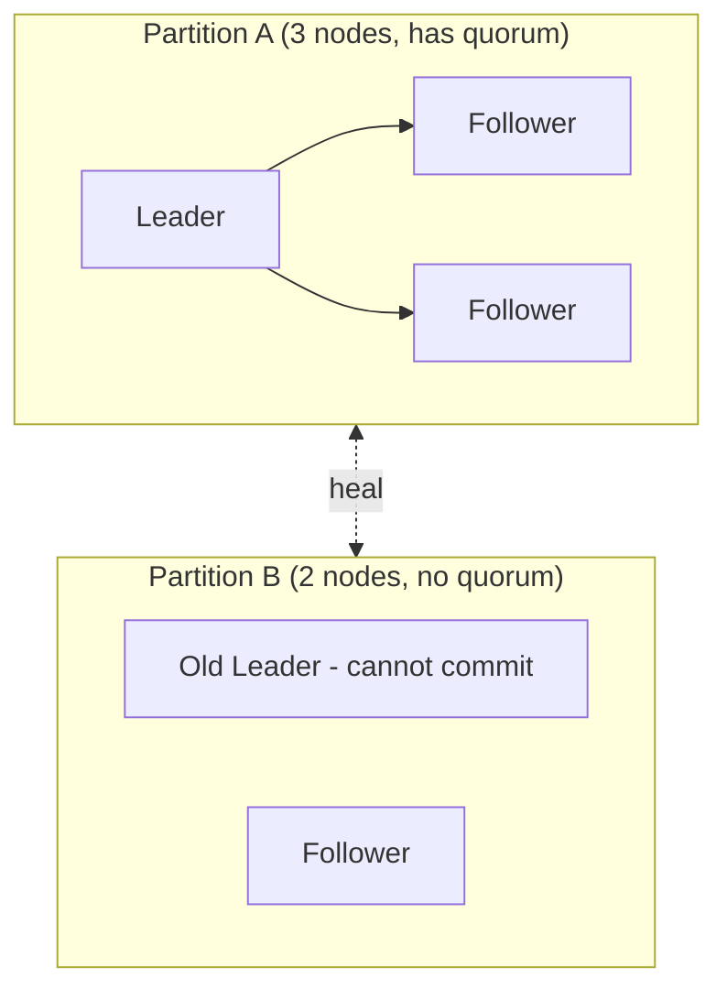
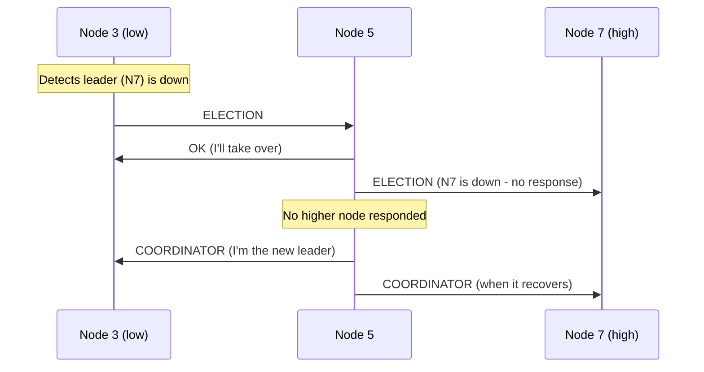
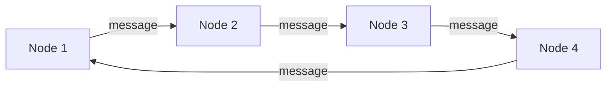
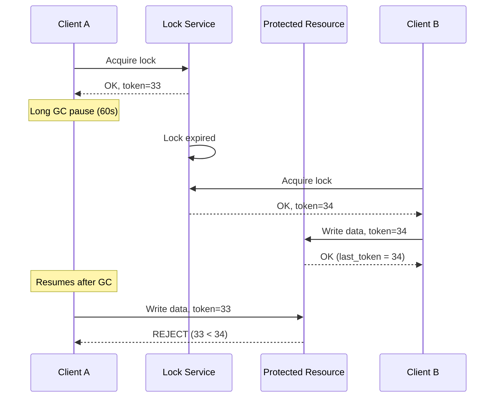
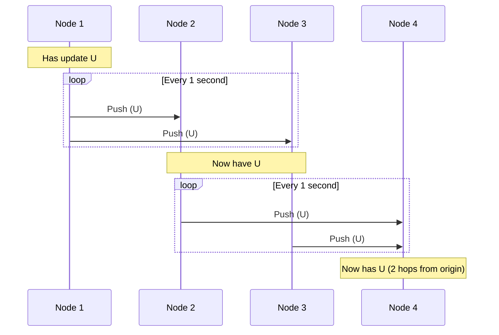

# Chapter 10. Distributed Coordination, Consensus, and Time

> [!abstract] Chapter Goal
> Your original vault covers Consul (which uses Raft and Gossip) at an implementation level. This chapter zooms out to the **general theory** that Consul, etcd, ZooKeeper, and all coordination services share: the problem of time in distributed systems (clock drift, Lamport Timestamps, Vector Clocks), consensus protocols (Raft in depth), leader election algorithms (Bully, Ring), distributed locks and fencing tokens, and Gossip protocols. After this chapter, you will understand *why* coordination services work the way they do, not just how to configure them.

## 1. The Challenge of Time in Distributed Systems

### 1.1. Why Time Matters

Time is the foundation of order. In a single process, you can determine "A happened before B" by looking at the wall clock. In a distributed system, this fails — different machines have different clocks, and you cannot trust any of them.

Why time matters in practice:
- **Logging and debugging**: you need to reconstruct "what happened first" across 100 servers.
- **Database conflicts**: two users update the same record; which update wins?
- **Cache invalidation**: "this cache entry expires at 12:00" — but whose 12:00?
- **Distributed transactions**: should commit A happen before or after commit B?
- **Leader leases**: "the leader's lease expires at 12:00" — if clocks differ, two nodes might both think they're the leader.
- **Cybersecurity**: TLS certificates have validity windows; if clocks skew, certs may be rejected.

### 1.2. Physical Clock Drift

Every computer has a **hardware clock** (often a quartz crystal oscillator). These clocks drift — they gain or lose time relative to "true" time. Typical drift rates:

- **Quartz crystal** (most servers): ~10–100 ppm (parts per million), meaning 1–10 seconds per day.
- **Atomic clocks** (datacenter-grade): ~10^-11, meaning seconds per millennium.
- **GPS receivers**: ~10^-13, very accurate but require line-of-sight to satellites.

Even with NTP synchronization, clocks drift between syncs. A 100 ppm clock drifts 6 ms/minute. If you sync every 10 minutes, your clock can be 60 ms off.

### 1.3. NTP and Its Limitations

**NTP (Network Time Protocol)** synchronizes clocks against upstream time servers, typically to within 1–50 ms on a LAN. But NTP has serious limitations for distributed systems:

1. **Network asymmetry**: if the path to the time server takes 100 ms one way and 200 ms back, NTP's calculation is wrong by 50 ms.
2. **Slew vs. step**: NTP can either slowly adjust (slew — 500 ppm max, so fixing a 1-second drift takes 33 minutes) or jump (step — risks breaking applications that don't expect time to go backward).
3. **Leap seconds**: when a leap second is inserted, clocks go 23:59:60 → 00:00:00. Many systems crash. Google "smears" the leap second over 24 hours (slew), but most systems don't.
4. **No causal order**: even with perfect clocks, two events happening "simultaneously" on different machines have no defined order.

> [!warning] Never Use Wall Clock for Ordering
> The naive approach "use the latest timestamp" fails because clocks skew. Two updates with timestamps 12:00:01.000 and 12:00:01.001 might actually have happened in the reverse order. Use logical clocks (next section) for ordering.

### 1.4. The Leap Second Bug

On June 30, 2012, a leap second was inserted. Many Linux kernels went into a tight loop checking the clock, causing CPU spikes that took down Reddit, Mozilla, LinkedIn, StumbleUpon, Yelp, and parts of Amazon. The fix is "leap smearing" (gradually adjust over 24 hours), which Google, AWS, and now most cloud providers use.

### 1.5. Google's TrueTime

Google's Spanner database solves the clock problem with **TrueTime**, an API that returns a time **interval** `[earliest, latest]` rather than a single value. The interval is bounded by uncertainty (currently ~7 ms in Google's network).

```python
earliest, latest = truetime.now()
# The actual time is somewhere in [earliest, latest]
# Spanner waits for `latest` to pass before committing a transaction
# This guarantees that transactions are correctly ordered across datacenters
```

TrueTime is backed by GPS receivers and atomic clocks in Google's datacenters. It's not generally available outside Google, but its existence proves that **strong consistency across datacenters is possible** if you can bound clock uncertainty.

## 2. Logical Clocks

Since physical clocks are unreliable for ordering, distributed systems use **logical clocks** that track causality rather than wall time.

### 2.1. The "Happened-Before" Relation (→)

We say event A **happened before** event B (written A → B) if:
1. A and B are on the same process, and A came first, OR
2. B is the receipt of a message sent by A, OR
3. There exists C such that A → C and C → B (transitivity).

If neither A → B nor B → A, the events are **concurrent** (written A || B). This doesn't mean simultaneous — it means they have no causal relationship.



In this diagram: a1 → a2 → b1 → b2 → b3 → c1 → c2. But a1 || c2 (concurrent — they have no causal link).

### 2.2. Lamport Timestamps

Leslie Lamport's 1978 algorithm assigns a logical timestamp to every event such that if A → B, then `TS(A) < TS(B)`.

**Algorithm** (per process):
- Each process maintains a counter `C`, initially 0.
- Before each local event, `C = C + 1`. The event's timestamp is `C`.
- Before sending a message, `C = C + 1`, then attach `C` to the message.
- On receiving a message with timestamp `T`: `C = max(C, T) + 1`. The receive event's timestamp is `C`.



**Properties**:
- If A → B (causal), then `TS(A) < TS(B)`.
- The converse is NOT true: `TS(A) < TS(B)` does NOT imply A → B. Two concurrent events may have different timestamps.
- Total order: to break ties, append the process ID. `(TS, PID)` gives a total order.

**Limitation**: Lamport timestamps cannot detect concurrent events. You can't look at two timestamps and tell whether they are causally related or concurrent. For that, you need vector clocks.

### 2.3. Vector Clocks

A vector clock is an array of N counters (one per process). Each process maintains its own vector.

**Algorithm** (per process `i`):
- Initialize `V = [0, 0, ..., 0]`.
- Before each local event: `V[i] = V[i] + 1`. The event's timestamp is a copy of `V`.
- Before sending a message: `V[i] = V[i] + 1`, attach `V` to the message.
- On receiving a message with vector `W`: `V[j] = max(V[j], W[j])` for all `j`. Then `V[i] = V[i] + 1`.



**Comparing vectors**:
- `V(A) < V(B)` iff every component of V(A) ≤ V(B) and at least one is strictly less. Then A → B.
- `V(A) || V(B)` (concurrent) iff neither V(A) < V(B) nor V(B) < V(A).

**Properties**:
- Detects concurrency — unlike Lamport timestamps.
- Cost: O(N) memory per timestamp, where N is the number of processes. Impractical at large scale.

**Practical version: Version Vectors** (Dotted Version Vectors, DVV). Used by Riak, Cassandra, and others. Optimized for the common case of N being small (typically <100 nodes).

### 2.4. When to Use Which

| Need | Use |
|------|-----|
| Total order, no concurrency detection | Lamport Timestamps |
| Detect concurrent updates | Vector Clocks |
| Conflict resolution in distributed storage | Version Vectors (DVV) |
| Strict serializability across regions | TrueTime (Spanner) or Paxos/Raft per key |

## 3. Distributed Consensus

Consensus is the problem of getting N independent nodes to **agree on a single value** despite failures. It sounds simple — but it's one of the deepest problems in distributed systems, with entire books written about it.

### 3.1. Why Consensus Is Hard

The fundamental obstacles:
1. **Crash failures**: a node may stop responding at any time.
2. **Network partitions**: the network may split, preventing some nodes from communicating.
3. **Byzantine failures**: a node may behave arbitrarily (lie, send conflicting messages). Most practical systems assume non-Byzantine failures.
4. **Asynchrony**: there's no global clock, and message delays are unbounded.

The **FLP impossibility result** (Fischer, Lynch, Paterson, 1985) proves: in an asynchronous system with even one faulty process, no deterministic consensus algorithm can guarantee termination. Practical systems work around this with randomization (Paxos) or additional assumptions (leader-based systems with timeouts).

### 3.2. Use Cases for Consensus

- **Leader election**: elect one node to coordinate writes.
- **Configuration changes**: agree on the new cluster membership.
- **Distributed locks**: only one client holds the lock at a time.
- **Atomic broadcast**: deliver messages to all nodes in the same order.
- **Service discovery**: agree on the list of healthy services.

### 3.3. Raft Consensus Protocol

Raft (2014) was designed to be **understandable** (Paxos, the older alternative, is famously hard to understand). It powers etcd, Consul, CockroachDB, and many others.

#### 3.3.1. Node Roles

Every node is in one of three states:
- **Follower**: passive; accepts RPCs from leaders and candidates.
- **Candidate**: actively campaigning to become leader.
- **Leader**: handles all client writes; replicates to followers.



#### 3.3.2. Leader Election

- Each node has a randomized **election timeout** (150–300 ms).
- If a follower doesn't hear from the leader before its timeout, it becomes a candidate, increments its **term**, votes for itself, and sends RequestVote RPCs to others.
- A node votes for at most one candidate per term (first-come-first-served).
- If a candidate wins a **majority** of votes, it becomes leader.
- The leader sends heartbeats (AppendEntries RPCs with no entries) to maintain authority.

The randomized timeout ensures split votes are rare — different nodes time out at different times, so one usually starts an election first.

#### 3.3.3. Log Replication



1. Client sends a command to the leader.
2. Leader appends the command to its log (uncommitted).
3. Leader sends AppendEntries RPCs to all followers in parallel.
4. Followers append to their logs and ACK.
5. Once a **majority** of followers ACK, the leader commits the entry (applies it to its state machine).
6. Leader responds to the client.
7. On the next heartbeat, the leader tells followers to commit (via `leaderCommit` field).

#### 3.3.4. Safety Guarantees

- **Election Safety**: at most one leader per term.
- **Leader Append-Only**: a leader never overwrites or deletes entries in its log.
- **Log Matching**: if two logs contain an entry with the same index and term, then the logs are identical in all entries up through that index.
- **Leader Completeness**: if a log entry is committed in a given term, that entry is present in the logs of the leaders for all higher-numbered terms.
- **State Machine Safety**: if a server has applied a log entry at a given index to its state machine, no other server will ever apply a different log entry for the same index.

#### 3.3.5. Quorum

```
Quorum = floor(N / 2) + 1
```

- 3 nodes → quorum = 2 (tolerates 1 failure).
- 5 nodes → quorum = 3 (tolerates 2 failures).
- 7 nodes → quorum = 4 (tolerates 3 failures).

Adding more nodes beyond 5–7 rarely helps and increases write latency (more nodes to ACK).

> [!tip] Why Odd Numbers of Nodes
> A 4-node cluster has quorum 3, tolerating 1 failure — same as 3 nodes. But 4 nodes cost 33 % more. Always use odd numbers.

#### 3.3.6. Network Partitions

If the network partitions:
- The side with quorum elects a leader and continues.
- The side without quorum cannot commit (writes fail).
- When the partition heals, the smaller side's leader sees a higher term from the larger side, steps down, and discards its uncommitted entries.



This is exactly the CAP theorem: during a partition, the side without quorum becomes unavailable (cannot commit) to preserve consistency.

### 3.4. Paxos (Briefly)

Paxos (Lamport, 1998) is the original consensus algorithm. Raft is essentially a simplified Paxos. Paxos comes in:
- **Basic Paxos**: agree on a single value.
- **Multi-Paxos**: agree on a log of values (what Raft does).

Paxos is mathematically elegant but famously hard to implement correctly. Most production systems use Raft or Paxos-derived algorithms (Chubby, Spanner's Paxos groups).

### 3.5. Byzantine Fault Tolerance (BFT)

If nodes can lie (maliciously or due to bugs), you need BFT consensus. The classic PBFT algorithm tolerates `f` Byzantine failures with `3f + 1` nodes. Used in blockchain systems (Hyperledger, Tendermint) and some financial infrastructure.

For most practical web services, non-Byzantine consensus (Raft, Paxos) is sufficient — we trust our own infrastructure.

## 4. Leader Election Algorithms

When a cluster needs a single coordinator (e.g., "who processes writes"), the nodes must **elect a leader**. Raft has a built-in election, but the classical algorithms are also worth knowing.

### 4.1. The Bully Algorithm

The Bully Algorithm elects the node with the **highest ID** as leader. Algorithm:

1. A node detects the leader is down.
2. It sends an ELECTION message to all nodes with higher IDs.
3. If no higher-ID node responds, this node becomes leader and sends COORDINATOR messages to all lower-ID nodes.
4. If a higher-ID node responds, it takes over the election (this node waits).



**Properties**:
- O(N^2) messages in the worst case.
- "Bully" because the highest-ID node always wins.
- Not resilient to network partitions (a partitioned high-ID node causes chaos).

### 4.2. The Ring Algorithm

Nodes are arranged in a logical ring. Each node knows its successor.

1. A node sends an ELECTION message to its successor, containing its own ID.
2. Each node appends its ID and forwards to its successor.
3. When the message returns to the originator, the highest ID in the list becomes the new leader.
4. The originator sends a COORDINATOR message around the ring announcing the new leader.



**Properties**:
- O(N^2) messages (each node forwards to all others).
- More resilient to partitions than Bully.
- Used in some peer-to-peer systems.

### 4.3. Comparison with Raft

Raft's leader election is **better** than both for production systems because:
- Randomized timeouts avoid collisions.
- Majority quorum handles partitions correctly.
- Term numbering prevents "ghost" leaders from causing damage.

The Bully and Ring algorithms are mostly **textbook** for understanding the problem; real systems use Raft or Paxos.

## 5. Distributed Locks and Fencing Tokens

### 5.1. The Naive Distributed Lock

A common pattern: "use Redis SET NX to acquire a lock". The client that successfully sets the key holds the lock.

```python
lock = redis.set("lock:resource1", my_id, nx=True, ex=30)
if lock:
    try:
        # do critical work
    finally:
        redis.delete("lock:resource1")
```

### 5.2. Why the Naive Lock Fails

Two problems:

1. **Lock expiry + slow client**: client A acquires the lock with 30s TTL. Client A's process gets paused (GC pause, swap, slow network). After 30s, the lock expires. Client B acquires the lock. Now both A and B think they hold the lock — and A is about to do something dangerous (write to a database, charge a credit card).

2. **No mutual exclusion across failures**: if Redis fails over (primary dies, replica promoted), the new primary may not have all the lock state. Two clients may both think they hold a lock that the new primary doesn't know about.

### 5.3. Fencing Tokens (The Solution)

A **fencing token** is a monotonically increasing number granted with the lock. Every write to the protected resource must include the token. The resource rejects writes with tokens lower than the last seen token.



The resource tracks the highest token it has seen. Client A's stale token (33) is rejected because Client B already wrote with token 34.

**Implementations**:
- ZooKeeper: lock acquisition returns a `zxid` (transaction ID) — use as fencing token.
- etcd: lock acquisition returns a `revision` — use as fencing token.
- Redis: harder — no built-in monotonic token. Use a separate counter or Redlock (controversial; see Martin Kleppmann's critique).

### 5.4. The Redlock Controversy

Redlock is a Redis-based distributed lock algorithm that uses multiple Redis instances (typically 5) and requires majority to acquire. It's controversial because:

- It relies on wall clocks across instances. If clocks jump (NTP step), the algorithm can fail.
- It does not provide fencing tokens.
- It assumes non-Byzantine failures but is sensitive to timing assumptions.

For most use cases, use **ZooKeeper or etcd** for distributed locks. Use Redis for **advisory locks** (best-effort coordination where occasional failures are OK).

### 5.5. Locks vs. Leases

A **lock** is held until released. A **lease** is held until time T. Leases are better for distributed systems because they automatically expire if the holder dies.

- If a lease holder crashes, the lease expires after T, and another node can take over.
- The lease holder must renew before T to keep holding.
- The holder must stop using the resource after T (even if it hasn't been renewed) — this is critical for correctness.

## 6. Distributed Coordination Services

### 6.1. What They Provide

Coordination services like etcd, ZooKeeper, and Consul expose a small set of primitives:

- **Key-value store**: strongly consistent, replicated.
- **Watch API**: clients get notified when keys change.
- **Leases / ephemeral nodes**: keys that disappear when the holding session ends.
- **Sequential keys**: keys that get a monotonically increasing suffix.
- **Locks**: built on the above.

### 6.2. etcd

- Used by Kubernetes as its backing store.
- Strongly consistent (Raft).
- gRPC API; JSON-over-HTTP gateway.
- Supports leases, watches, transactions.
- Default port 2379 (client) and 2380 (peer).

### 6.3. ZooKeeper

- Older than etcd; used by Kafka, Hadoop, and many Hadoop-ecosystem projects.
- Hierarchical namespace (like a filesystem).
- ZAB consensus protocol (similar to Raft).
- Ephemeral nodes, sequential nodes, watches.
- Default port 2181 (client), 2888 (peer), 3888 (leader election).

### 6.4. Consul

You have this in your original vault. Key features: KV store, service discovery, health checks, service mesh. Uses Raft.

### 6.5. Common Use Cases

| Use Case | How |
|----------|-----|
| Service discovery | Services register ephemeral nodes; clients watch the parent node. |
| Leader election | Each candidate creates an ephemeral sequential node; lowest-numbered is leader. |
| Configuration | Store config in KV; services watch for changes. |
| Distributed locks | Create a node; if it exists, wait. |
| Cluster membership | Each node creates an ephemeral node; the parent's children = current members. |

### 6.6. The CAP Trade-off

All these services are **CP** (consistent + partition-tolerant): during a network partition, the side without quorum rejects writes. This is correct for coordination — better to refuse writes than to allow split-brain.

But it means: if your coordination service is unavailable (3 of 5 nodes down), your entire cluster cannot make progress. **Don't overload coordination services** with high-throughput data; use them only for low-volume metadata.

## 7. Gossip Protocols

Gossip (epidemic) protocols spread information through a cluster by having each node periodically share state with a few random peers. The information propagates like a rumor through a population — eventually reaching everyone.

### 7.1. The Algorithm



Each round, each node picks K random peers and shares its state. After O(log N) rounds, all nodes have the update with high probability.

### 7.2. Push, Pull, and Push-Pull

- **Push**: sender pushes its state to receivers.
- **Pull**: receiver asks senders for their state.
- **Push-pull**: both. Best for fast convergence when nodes have different state.

### 7.3. Anti-Entropy (Reconciliation)

When two nodes exchange state, they need to reconcile differences. Approaches:
- **Full state exchange**: send the entire state. Simple but bandwidth-heavy.
- **Merkle trees**: hash the state into a tree; only exchange subtrees that differ. Used by Dynamo, Cassandra.
- **Digests**: compact summaries (e.g., bloom filters) to detect what's missing.

### 7.4. Use Cases

- **Cluster membership**: who is alive? Each node gossips its heartbeat; if you don't hear from a node in T seconds, mark it dead.
- **Failure detection**: gossip-based failure detectors are more robust than heartbeats to a single failed link.
- **Service discovery**: lightweight alternative to a centralized registry. Used by Consul (WAN gossip), Serf, memberlist.
- **Distributed config**: spread config changes without a central server.

### 7.5. SWIM and Memberlist

**SWIM** (Scalable Weakly-consistent Infection-style Process Group Membership) is a gossip protocol with two improvements:
- **Indirect probes**: if node A can't reach node C, A asks node B to probe C. This avoids false positives from transient A-C link failures.
- **Suspicion**: a node is "suspected" before being declared dead, reducing false positives.

HashiCorp's **memberlist** library (used by Consul, Serf, Nomad) implements an SWIM variant with state compression and other refinements.

### 7.6. LAN vs WAN Gossip

- **LAN gossip** (within a datacenter): port 8301 TCP/UDP in Consul. Fast (10ms latency), frequent (1s intervals).
- **WAN gossip** (across datacenters): port 8302 TCP/UDP in Consul. Slower (100ms+ latency), less frequent (5s intervals), fewer peers.

Consul uses LAN gossip within each datacenter for fast failure detection, and WAN gossip to bridge datacenters.

## 8. Tips, Tricks, and Common Pitfalls

> [!tip] Use Logical Clocks for Ordering, Not Wall Clocks
> If you need to determine "which event happened first" across machines, use Lamport timestamps or vector clocks. Wall clocks lie.

> [!warning] Don't Build Your Own Consensus
> Consensus is famously hard to implement correctly. Use etcd, ZooKeeper, or Consul instead. They've been hardened by years of production use.

> [!danger] Never Use a Distributed Lock Without a Fencing Token
> Locks without fencing tokens are race conditions waiting to happen. A paused process can release the lock, then resume and act on stale assumptions. Fencing tokens prevent this.

> [!tip] Use Odd Numbers of Nodes
> For Raft/Paxos clusters, use 3, 5, or 7 nodes. Even numbers waste resources (4 nodes have the same fault tolerance as 3).

> [!warning] Don't Treat Coordination Services as Databases
> etcd and ZooKeeper are designed for small amounts of metadata (<1 MB per key, <1 GB total). Storing large data in them degrades performance and risks consensus instability.

> [!tip] Set Conservative Election Timeouts
> Too short → false leader changes during transient slowness. Too long → slow recovery from real failures. Typical: 150–300 ms for LAN, 1–5 s for WAN.

> [!tip] Monitor Consensus Health
> Key metrics: leader changes per hour, proposal commit latency, quorum availability. A healthy cluster has near-zero leader changes and sub-10 ms commit latency.

## 9. Chapter Summary

- Physical clocks drift and are unreliable for ordering. NTP helps but has limitations (asymmetry, leap seconds).
- Lamport timestamps give total order but cannot detect concurrency.
- Vector clocks detect concurrency but are memory-heavy.
- Consensus is hard; FLP proves it's impossible in the most general case. Practical systems use timeouts and randomization.
- Raft: leader-based consensus with three roles (follower, candidate, leader). Quorum = floor(N/2) + 1.
- Leader election: Bully (highest ID wins), Ring (round-robin), Raft (randomized timeouts, majority vote).
- Distributed locks need fencing tokens to handle paused clients and failovers.
- Coordination services (etcd, ZooKeeper, Consul) provide KV, watches, leases, locks on top of consensus.
- Gossip protocols spread information in O(log N) rounds with random peer selection.
- Use odd node counts, conservative timeouts, and never store large data in coordination services.

The next chapter ([[Chapter 11. Modern Identity and Federation]]) covers enterprise identity: OAuth 2.0, OIDC, SAML, SSO architecture, PKCE, and refresh token rotation — the protocols that let users log in once and access many services.
