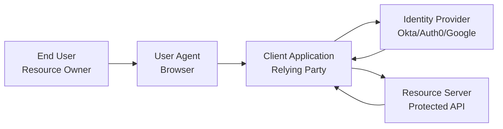
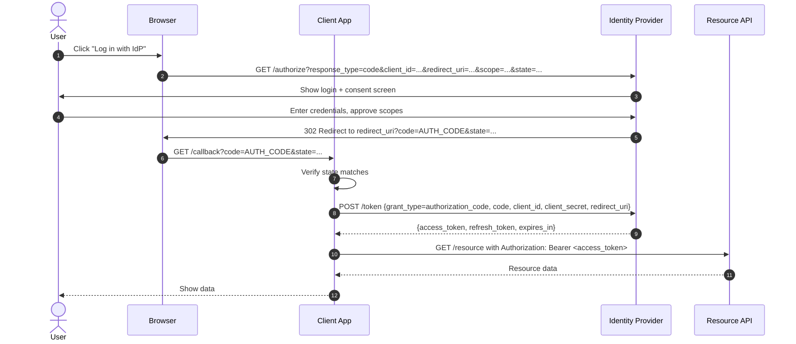
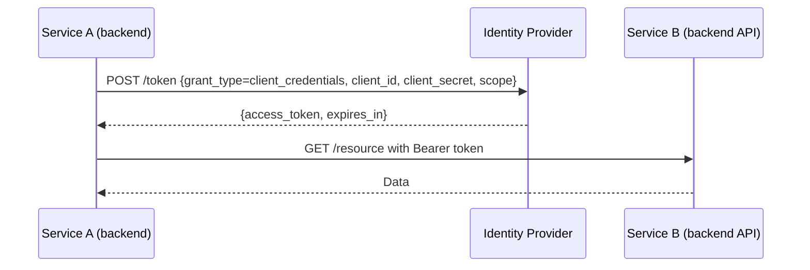
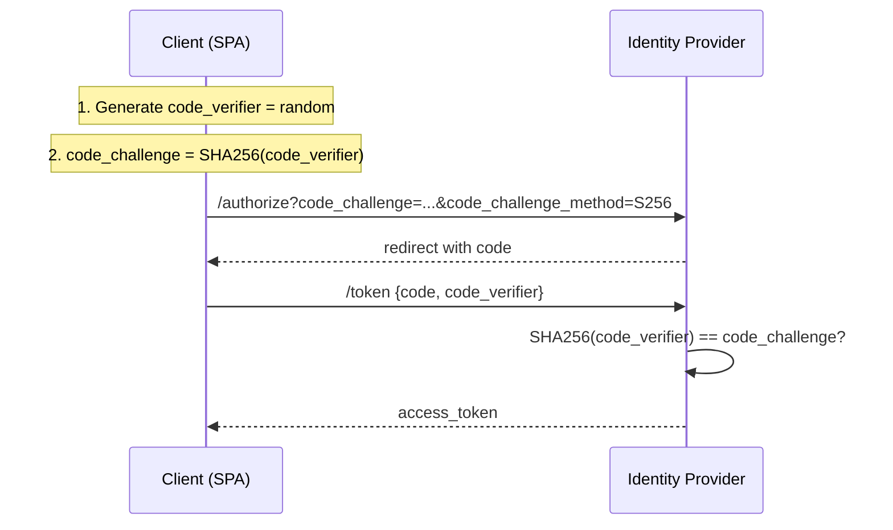
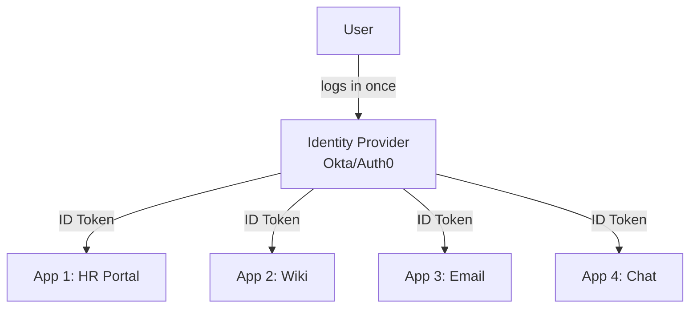
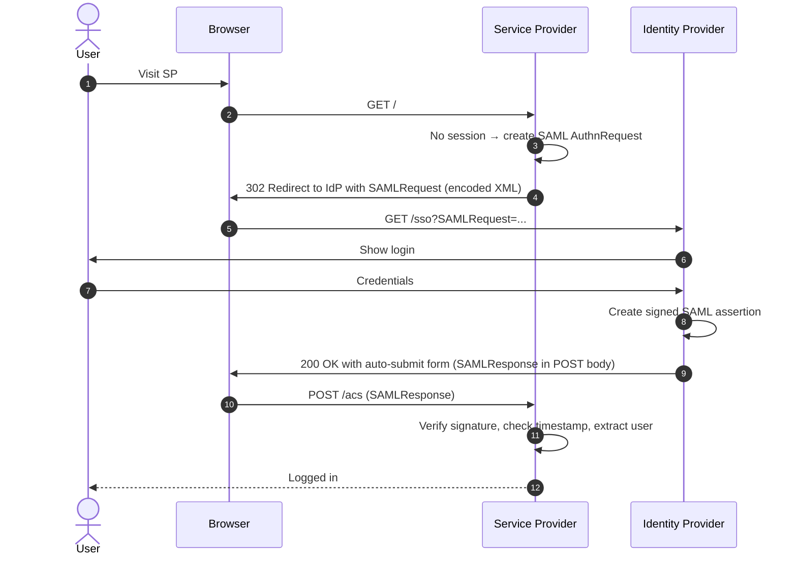
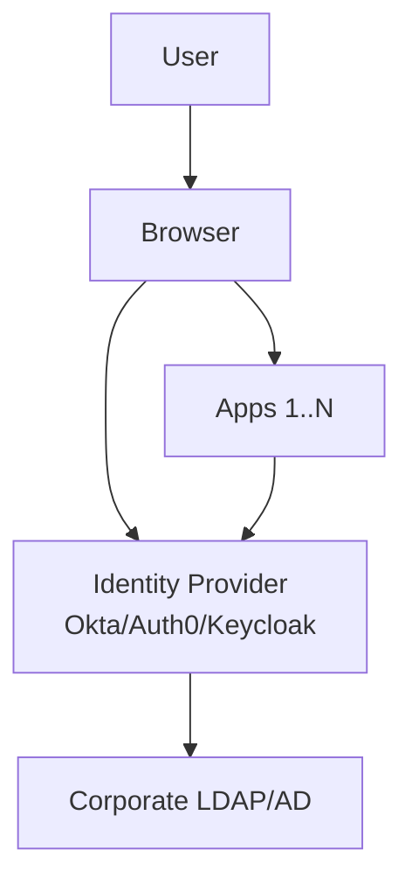
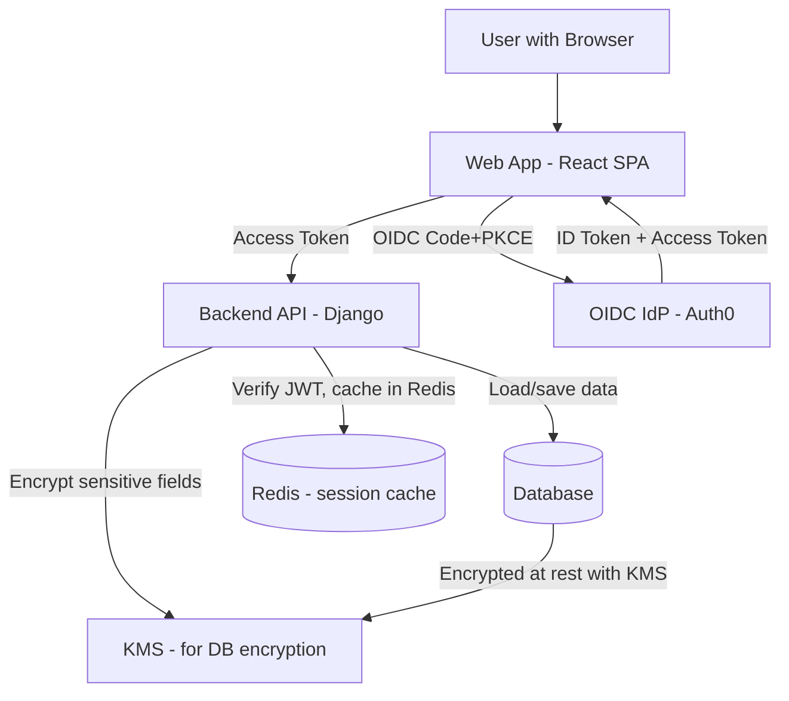

# Chapter 11. Modern Identity and Federation

> [!abstract] Chapter Goal
> Your original vault covers Django's session auth and SimpleJWT. This chapter covers the **enterprise identity layer** that builds on top of those primitives: OAuth 2.0 (authorization), OIDC (identity on top of OAuth), SAML (the XML-based legacy protocol still dominant in enterprise SSO), Single Sign-On architecture, PKCE for mobile clients, refresh token rotation, and the role of KMS / HSM in key management. After this chapter you will be able to design a "Log in with Google" flow, integrate with Okta for enterprise SSO, and explain why each step exists.

## 1. The Three A's: Authentication, Authorization, Accounting

Before diving into protocols, let's fix the vocabulary.

- **Authentication (AuthN)**: proving who you are. "I am Alice, and here's my password to prove it."
- **Authorization (AuthZ)**: deciding what you can do. "Alice is allowed to read this file but not delete it."
- **Accounting / Audit**: recording what you did. "Alice deleted file X at 12:34."

The protocols in this chapter handle AuthN and AuthZ. Accounting is usually done by your application's audit log.

### 1.1. The Actor Model in Identity



- **Resource Owner**: the user who owns their data.
- **User Agent**: the browser or mobile app.
- **Client / Relying Party (RP)**: the application the user wants to use.
- **Identity Provider (IdP)**: the service that authenticates the user.
- **Resource Server**: the API that holds the user's data.

## 2. OAuth 2.0

OAuth 2.0 (RFC 6749, 2012) is an **authorization** framework. It lets a user grant a third-party application access to their data on another service, **without sharing their password**.

### 2.1. The Problem OAuth Solves

Before OAuth, the "password anti-pattern" was common: if you wanted to use a third-party Twitter client, you gave it your Twitter password. The client then had full access to your account — including the ability to change the password and lock you out. There was no way to grant limited access or revoke a specific client.

OAuth fixes this by:
- Never sharing the password with the client.
- Granting the client a limited **access token** with specific **scopes** (e.g., "read:profile", "write:posts").
- Allowing the user to revoke a specific client's access at any time.

### 2.2. The Authorization Code Flow (Most Common)



The flow has these key steps:

1. **Redirect to IdP**: the client sends the user's browser to the IdP with a request including `client_id`, `redirect_uri`, `scope`, and a random `state` value.
2. **User authenticates**: the user logs in to the IdP (which they trust) and approves the requested scopes.
3. **Redirect back with code**: the IdP redirects back to the client's `redirect_uri` with a short-lived **authorization code** (typically expires in 10 minutes).
4. **Token exchange**: the client makes a **server-to-server** POST to the IdP's token endpoint, exchanging the code for an access token (and refresh token).
5. **Use the token**: the client uses the access token to call the resource API.

### 2.3. Why the Two-Step (Code → Token)?

Why not just return the access token directly in the redirect? Because the redirect happens **through the browser**, and the URL would be visible in:
- Browser history.
- HTTP Referer headers when the client loads external resources.
- Server logs of any intermediate proxies.

The authorization code is **single-use** and short-lived. Even if an attacker intercepts it, they have only 10 minutes to use it, and they need the `client_secret` (which only the legitimate client has) to exchange it.

### 2.4. The `state` Parameter

The `state` parameter prevents **CSRF attacks**. Without it, an attacker could initiate the OAuth flow themselves and trick the user into completing it, linking the attacker's account to the user's session.

The client generates a random `state` value, stores it in the user's session, and includes it in the authorize request. On callback, the client verifies the returned `state` matches the stored one.

### 2.5. Scopes

A **scope** is a string describing what access the client wants. Examples:
- `openid` — request OIDC identity (see §3).
- `profile` — read user's name, picture, etc.
- `email` — read user's email.
- `read:posts` — read user's posts (custom scope).
- `write:posts` — write posts on user's behalf.

The user sees the requested scopes on the consent screen and can approve or deny. The access token will only allow the granted scopes.

### 2.6. Access Tokens vs. Refresh Tokens

| Property | Access Token | Refresh Token |
|----------|--------------|----------------|
| Purpose | Authorize API calls | Obtain new access tokens |
| Lifetime | Short (minutes to hours) | Long (days to weeks) |
| Storage | Sent with every API call | Stored securely, sent only to IdP |
| Revocation | Hard (often JWT, can't revoke) | Easy (one call to IdP revokes the session) |
| Use | In `Authorization: Bearer` header | In POST to `/token` endpoint |

**Best practice**: short-lived access tokens (15–60 minutes) + long-lived refresh tokens (30–90 days). When the access token expires, the client uses the refresh token to get a new one. If the user logs out, the refresh token is revoked — the access token still works until it expires, but no new ones can be minted.

### 2.7. The Client Credentials Flow

For **machine-to-machine** communication (no user involved), use the Client Credentials flow:



No browser, no user, no redirect. Service A proves its identity with `client_id` + `client_secret` and gets an access token scoped to its permissions.

Use this for:
- Backend microservices calling each other.
- Cron jobs calling your API.
- Webhooks calling other services.

### 2.8. Other Flows (Briefly)

| Flow | Use Case |
|------|----------|
| **Authorization Code** | Web apps with a backend (most common) |
| **Authorization Code + PKCE** | Mobile / SPA / any public client (see §4) |
| **Client Credentials** | Machine-to-machine |
| **Resource Owner Password** | Deprecated; only for trusted first-party apps |
| **Implicit** | Deprecated; was for SPAs but replaced by Code+PKCE |
| **Device Code** | TVs, IoT devices with no keyboard |

### 2.9. PKCE (Proof Key for Code Exchange)

PKCE (RFC 7636) is an extension to the Authorization Code flow designed for **public clients** — apps that cannot keep a secret, like SPAs, mobile apps, and desktop apps.

#### 2.9.1. The Problem

In the standard Authorization Code flow, the client proves its identity with `client_secret` during the token exchange. But:
- A SPA's source code is public — anyone can extract the `client_secret`.
- A mobile app's binary can be reverse-engineered — same problem.

Without PKCE, an attacker who steals the `client_id` (which is public) and intercepts the authorization code can complete the flow themselves.

#### 2.9.2. The PKCE Solution

PKCE replaces the static `client_secret` with a **dynamic, per-request secret**:

1. Client generates a random `code_verifier` (43–128 chars).
2. Client computes `code_challenge = BASE64URL(SHA256(code_verifier))`.
3. Client sends `code_challenge` and `code_challenge_method=S256` in the authorize request.
4. IdP stores the `code_challenge` with the authorization code.
5. On token exchange, client sends `code_verifier`.
6. IdP hashes the verifier and compares to the stored challenge. If they match, issue the token.



Even if an attacker intercepts the authorization code, they don't have the `code_verifier` and cannot exchange it.

> [!tip] Always Use PKCE
> Modern guidance (OAuth 2.1 draft) is to use PKCE for **all** clients, even confidential ones. It adds no cost and prevents several attacks. Auth0, Google, and Microsoft now require PKCE for public clients.

### 2.10. Refresh Token Rotation

To reduce the impact of a stolen refresh token, use **rotation**: each time the client uses the refresh token, the IdP issues a new refresh token (in addition to the new access token) and invalidates the old one.

If an attacker steals a refresh token and uses it, the legitimate client will eventually try to use the now-invalidated token and fail. This detects the theft.

**Detection**: the IdP can keep a "refresh token replay" list. If a token is used twice, both clients are immediately logged out (both the legitimate user and the attacker).

**Risk**: if the rotation and revocation aren't atomic, you can accidentally log out legitimate users. Implement carefully.

## 3. OpenID Connect (OIDC)

OIDC is an **identity layer** built on top of OAuth 2.0. While OAuth is about authorization (what can the client do), OIDC is about authentication (who is the user).

### 3.1. Why OIDC Exists

OAuth 2.0 alone has a gap: there's no standardized way for the client to know **who the user is**. Workarounds (custom `/me` endpoints, putting user info in the access token) proliferated. OIDC standardizes this with:
- **ID Token**: a JWT containing the user's identity.
- **UserInfo endpoint**: a standard API to fetch user profile.
- Standard scopes (`openid`, `profile`, `email`).

### 3.2. The ID Token

The ID Token is a **JWT** (JSON Web Token) signed by the IdP. Its payload contains:

```json
{
  "iss": "https://idp.example.com",
  "sub": "user-123",
  "aud": "client-abc",
  "exp": 1614556800,
  "iat": 1614553200,
  "nonce": "random-string",
  "email": "alice@example.com",
  "email_verified": true,
  "name": "Alice Lee",
  "picture": "https://..."
}
```

- `iss`: issuer (the IdP).
- `sub`: subject (user identifier, stable per IdP).
- `aud`: audience (the client ID).
- `exp` / `iat`: expiration / issued-at time.
- `nonce`: a value the client sent in the authorize request; the IdP echoes it back to prevent replay.
- Standard claims: `email`, `name`, `picture`.

The client **must verify** the ID Token:
1. Signature is valid (signed by the IdP's key).
2. `iss` matches the expected IdP.
3. `aud` matches this client's ID.
4. `exp` is in the future.
5. `nonce` matches what the client sent.

### 3.3. The OIDC Flow

OIDC is OAuth 2.0 with the `openid` scope. The flow is identical to Authorization Code Flow:

1. Client redirects to `/authorize?scope=openid profile email&...`.
2. User authenticates.
3. IdP redirects back with `code`.
4. Client exchanges `code` for tokens. The response now contains:
   ```json
   {
     "access_token": "...",
     "id_token": "eyJ...",  // <-- NEW: the ID Token
     "refresh_token": "...",
     "expires_in": 3600,
     "token_type": "Bearer"
   }
   ```
5. Client verifies the ID Token and extracts the user's identity.
6. Client can optionally call `/userinfo` for additional claims.

### 3.4. OIDC vs. OAuth 2.0

| Aspect | OAuth 2.0 | OIDC |
|--------|-----------|------|
| Purpose | Authorization | Authentication |
| Standard scopes | Custom | `openid`, `profile`, `email` |
| Returns identity? | No (just access token) | Yes (ID Token) |
| Built on | Standalone | OAuth 2.0 + identity layer |

If you need to know who the user is, use OIDC. If you only need to act on their behalf (without knowing who they are), plain OAuth is sufficient.

### 3.5. Single Sign-On with OIDC

OIDC is the foundation of modern SSO. A user logs in to the IdP once. Multiple client applications trust the same IdP and accept its ID Tokens. The user moves between apps without re-authenticating.



When the user visits App 1:
1. App 1 redirects to IdP.
2. IdP sees the user already has a session (cookie).
3. IdP redirects back to App 1 with code, no login prompt.
4. App 1 exchanges code for ID Token, logs the user in.

Same flow for App 2, 3, 4 — no re-authentication needed.

### 3.6. Single Logout (SLO)

OIDC supports Single Logout: when the user logs out of one app, they're logged out of all. The flow:
1. User clicks logout in App 1.
2. App 1 redirects to IdP's `/logout` endpoint.
3. IdP clears its session.
4. IdP redirects to all other apps' logout URLs (via iframes or back-channel HTTP calls).
5. All apps clear their sessions.

This is harder to implement reliably than SSO; some implementations only do "front-channel" logout (via iframes, which can be blocked by browser policies).

## 4. SAML (Security Assertion Markup Language)

SAML 2.0 (2005) is an XML-based identity federation protocol. It's older than OIDC, more complex, and still dominant in **enterprise SSO** (Okta, Azure AD, ADFS, Ping Identity).

### 4.1. Why SAML Still Exists

- **Enterprise inertia**: large enterprises invested in SAML infrastructure in the 2010s; replacing it is expensive.
- **Richer assertions**: SAML can carry arbitrary attributes (department, manager, group memberships) in a standardized way.
- **Signed XML**: SAML assertions are signed XML, which some compliance regimes prefer over JWT.
- **Federation metadata**: SAML has standardized metadata exchange between IdPs and SPs.

OIDC is gradually replacing SAML, especially in new deployments, but SAML will be around for another decade.

### 4.2. SAML Actors

- **Identity Provider (IdP)**: authenticates users and issues assertions.
- **Service Provider (SP)**: the application the user wants to access.

Same roles as OIDC, different terminology (SP = client/RP, IdP = IdP).

### 4.3. The SAML Flow (SP-Initiated)



The SAMLResponse is an XML document containing:
- The user's identity (NameID).
- Attributes (email, groups, etc.).
- The issuer (IdP).
- A signature (XML Signature).
- Conditions (validity window, audience).

### 4.4. SAML Bindings

SAML can be transported via:
- **HTTP Redirect**: the request/response is in the URL query string (used for AuthnRequest, often for Response).
- **HTTP POST**: the request/response is in an HTML form's POST body (used for Response, to avoid URL length limits).
- **HTTP Artifact**: just an ID is sent; the receiver fetches the full message via a back-channel SOAP call (rarely used).

### 4.5. SAML vs. OIDC

| Aspect | SAML | OIDC |
|--------|------|------|
| Format | XML | JSON / JWT |
| Transport | HTTP Redirect / POST | HTTP |
| Complexity | High | Medium |
| Signing | XML Signature (XMLDSig) | JWT (JWS) |
| Encryption | XML Encryption | JWE |
| Single Logout | Standardized | Optional, less mature |
| Enterprise adoption | High | Growing |
| New projects | Decreasing | Default |

If you're starting fresh, use OIDC. If you're integrating with an enterprise customer's existing IdP, you may need SAML.

### 4.6. SAML Pitfalls

- **XML Signature Wrapping attacks**: an attacker wraps the signed assertion in a different XML structure; naive parsers extract from the wrong location. Use a verified library.
- **Clock skew**: SAML assertions have a validity window (typically 60 seconds). If the SP's clock differs from the IdP's, assertions are rejected.
- **Certificate rotation**: SAML signing certificates must be rotated carefully; both old and new certs must be valid during the transition.

## 5. Single Sign-On (SSO) Architecture

### 5.1. The Big Picture

SSO is the **user experience**: log in once, access many apps. The technical implementation uses one of:
- OIDC (modern).
- SAML (enterprise).
- A proprietary protocol (rare in new systems).

### 5.2. Architecture Components



- **IdP**: the central authentication authority. Can be a SaaS (Okta, Auth0, Azure AD) or self-hosted (Keycloak, Dex).
- **Directory**: the source of truth for users and groups (LDAP, Active Directory, Google Workspace). The IdP federates to the directory.
- **Apps**: each trusts the IdP and accepts its tokens/assertions.

### 5.3. SAML SSO vs. OIDC SSO

- **SAML SSO**: SP-initiated or IdP-initiated. XML assertions. Common in enterprise.
- **OIDC SSO**: SP-initiated (redirect to `/authorize`). JWT ID Tokens. Common in consumer and modern enterprise.

### 5.4. Multi-Factor Authentication (MFA)

Modern SSO includes MFA: after the user enters their password, the IdP requires a second factor (SMS code, TOTP, hardware key, biometric). The IdP enforces MFA centrally; individual apps don't need to implement it.

MFA factors:
- **Knowledge**: password, PIN.
- **Possession**: phone (SMS, TOTP app), hardware key (Yubikey), smart card.
- **Inherence**: fingerprint, face, voice.

**TOTP** (Time-based One-Time Password, RFC 6238) is the most common second factor: a 6-digit code that changes every 30 seconds, derived from a shared secret and the current time. Apps like Google Authenticator and Authy implement TOTP.

**WebAuthn / FIDO2** is the modern standard: hardware-backed public-key cryptography. The user's device signs a challenge from the server; no shared secret, no phishing (the private key is bound to the origin).

## 6. JSON Web Tokens (JWT) Deep Dive

Your original vault covers JWT basics. Here we cover the parts often missed.

### 6.1. JWT Structure

A JWT has three base64url-encoded parts separated by dots:
```
header.payload.signature
```

- **Header**: `{"alg": "RS256", "typ": "JWT", "kid": "key-id-1"}`.
- **Payload**: the claims (issuer, subject, audience, expiration, custom claims).
- **Signature**: `RS256(header + "." + payload, private_key)`.

### 6.2. Signing Algorithms

- **HS256** (HMAC-SHA256): symmetric. Both issuer and verifier share a secret. Simple but requires sharing the secret.
- **RS256** (RSA-SHA256): asymmetric. Issuer has private key; verifier has public key. Public key can be freely shared.
- **ES256** (ECDSA-SHA256): asymmetric, elliptic curve. Smaller signatures than RSA, faster.
- **none**: no signature. **Never use this** — it's a known attack vector.

> [!warning] Reject `alg: none`
> A classic attack: take a valid JWT, change the header to `{"alg": "none"}`, and remove the signature. Naive parsers accept this. Always explicitly allowlist acceptable algorithms in your verifier.

### 6.3. Key Rotation via JWKS

For asymmetric algorithms, the IdP publishes its public keys at a **JWKS (JSON Web Key Set) endpoint**:
```
GET /.well-known/jwks.json
{
  "keys": [
    {"kid": "key-1", "kty": "RSA", "use": "sig", "alg": "RS256", "n": "...", "e": "AQAB"},
    {"kid": "key-2", "kty": "RSA", "use": "sig", "alg": "RS256", "n": "...", "e": "AQAB"}
  ]
}
```

Each JWT header has a `kid` (key ID) telling the verifier which key to use. To rotate keys:
1. Generate a new key pair. Add the public key to JWKS with a new `kid`.
2. Wait for caches to expire (typically the JWKS endpoint is cached for 15 minutes).
3. Start signing new JWTs with the new key.
4. After all old JWTs have expired, remove the old key from JWKS.

### 6.4. JWT Validation Checklist

Every JWT verifier must check:
1. **Signature** is valid (using the correct key from JWKS).
2. **Algorithm** is in the allowlist (reject `none`).
3. **`iss`** matches the expected issuer.
4. **`aud`** includes this verifier.
5. **`exp`** is in the future.
6. **`nbf`** (not-before) is in the past.
7. **`iat`** is in the past (within reasonable clock skew).
8. **`kid`** is present and matches a known key.
9. (For refresh tokens / authorization codes) **`jti`** (JWT ID) has not been replayed.

### 6.5. The Stateless JWT Problem

JWTs are stateless: the verifier doesn't need to call the IdP. This is great for performance but creates a problem: **how do you revoke a JWT before it expires?**

Since the JWT is self-contained and signed, the verifier cannot invalidate it without checking back with the IdP. Solutions:
- **Short-lived access tokens**: 15-minute expiry. Stolen tokens become useless quickly.
- **Refresh token revocation**: revoke the refresh token; access tokens still work until they expire.
- **Token blacklist**: maintain a list of revoked JWTs (`jti`). Verifiers check the list (defeats statelessness but only for revoked tokens).
- **Token introspection (RFC 7662)**: an endpoint where the verifier asks the IdP "is this token still valid?". Defeats statelessness entirely.

In practice, use short-lived access tokens + long-lived revocable refresh tokens. Accept that a stolen access token is valid for its short lifetime.

## 7. Key Management: KMS and HSM

Signing JWTs, encrypting databases, securing TLS — all require cryptographic keys. Managing these keys is the domain of **Key Management Systems (KMS)** and **Hardware Security Modules (HSM)**.

### 7.1. Key Management System (KMS)

A KMS is a service that generates, stores, rotates, and controls access to cryptographic keys. Examples:
- AWS KMS.
- Google Cloud KMS.
- Azure Key Vault.
- HashiCorp Vault.

Features:
- **Key generation**: create keys inside the KMS; the private key never leaves.
- **Key rotation**: automatic periodic rotation (e.g., annually).
- **Access control**: IAM policies specify which services can use which keys for what operations.
- **Audit log**: every key use is logged.
- **Envelope encryption**: encrypt your data with a data key; encrypt the data key with a KMS key. The data key can be transient; the KMS key never leaves the KMS.

```mermaid
graph TD
    App[Application] -->|Generate data key| KMS[KMS]
    KMS -->|Return plaintext + encrypted data key| App
    App -->|Encrypt data with plaintext key| DB[(Database)]
    App -->|Store encrypted data key| DB
    Note over App,DB: To decrypt: ask KMS to decrypt the encrypted data key
```

### 7.2. Hardware Security Module (HSM)

An HSM is a **physical device** that stores cryptographic keys and performs cryptographic operations. The keys never leave the device — even the operator cannot extract them.

Properties:
- **Tamper-resistant**: physical sensors detect intrusion and destroy the keys.
- **Certified**: FIPS 140-2 Level 3+ (US), Common Criteria EAL4+ (international).
- **Performance**: dedicated crypto hardware can do thousands of RSA operations per second.
- **Cost**: $5,000–$50,000+ per device.

Use cases:
- **Certificate Authority private keys**: the root key that signs all TLS certificates.
- **Banking**: signing financial transactions.
- **Compliance**: regulations like PCI DSS may mandate HSM use.
- **Root of trust**: the foundation that other systems trust.

Cloud HSMs (AWS CloudHSM, Azure Dedicated HSM) provide dedicated HSM instances in the cloud.

### 7.3. KMS vs. HSM

| Aspect | KMS | HSM |
|--------|-----|-----|
| Cost | Cheap (per-call pricing) | Expensive (dedicated hardware) |
| Performance | Limited (API calls) | High (dedicated crypto) |
| Multi-tenant | Yes (usually) | No (dedicated) |
| Compliance | FIPS 140-2 Level 2–3 | FIPS 140-2 Level 3–4 |
| Use case | App data encryption, JWT signing | CA root keys, financial signing |

### 7.4. Envelope Encryption Pattern

The standard pattern for encrypting application data:

1. **Generate a data encryption key (DEK)** locally in your application.
2. **Encrypt your data** with the DEK (e.g., AES-256-GCM).
3. **Encrypt the DEK** with a KMS key (the Key Encryption Key, KEK).
4. **Store** the encrypted data and the encrypted DEK together.
5. To decrypt: ask the KMS to decrypt the DEK, then use the plaintext DEK to decrypt the data.

Benefits:
- The KMS key never leaves the KMS.
- The DEK is unique per record, so compromising one DEK compromises only one record.
- The KMS only sees the small DEK (32 bytes), not the full data — so KMS call latency is small.

## 8. Putting It All Together: A Modern Auth Architecture



Flow:
1. User clicks "Log in" → SPA redirects to Auth0 with PKCE.
2. User authenticates at Auth0 (with MFA).
3. Auth0 redirects back with code → SPA exchanges for ID Token + Access Token.
4. SPA includes Access Token in `Authorization: Bearer` header for API calls.
5. API verifies the JWT signature (JWKS), checks claims, caches the result in Redis (5 min TTL).
6. API uses KMS to encrypt/decrypt sensitive database fields.
7. Database is encrypted at rest with a KMS-managed key.

## 9. Tips, Tricks, and Common Pitfalls

> [!danger] Never Use `alg: none`
> Reject any JWT with `alg: none` in the header. This is a classic attack vector — attackers strip the signature and naive verifiers accept it.

> [!tip] Use PKCE Everywhere
> Even for confidential clients (with a backend), PKCE adds no cost and prevents several attacks. Make it the default.

> [!warning] Don't Put Sensitive Data in JWTs
> JWTs are base64-encoded, not encrypted. Anyone who intercepts the token can read its contents. Don't put passwords, SSNs, or secrets in a JWT.

> [!tip] Short-Lived Access Tokens, Long-Lived Refresh Tokens
> 15-minute access tokens, 30-day refresh tokens. Stolen access tokens become useless quickly. Stolen refresh tokens can be revoked.

> [!warning] Always Validate All JWT Claims
> A valid signature doesn't mean a valid token. Check `iss`, `aud`, `exp`, `nbf`. A token issued by a different IdP for a different app should be rejected even if the signature is mathematically valid.

> [!tip] Use JWKS for Key Rotation
> Don't hardcode the IdP's public key in your app. Fetch it from the JWKS endpoint and cache for 15 minutes. Rotate keys annually.

> [!warning] SAML XML Signatures Are Tricky
> Use a battle-tested library (python3-saml, OneLogin, Spring Security SAML). Don't write your own XML Signature verification — XML Signature Wrapping attacks are subtle and dangerous.

> [!tip] Centralize Auth in a Gateway
> For microservices, centralize JWT verification in an API gateway or service mesh sidecar. Individual services trust the gateway and don't need to verify tokens themselves.

> [!warning] Don't Roll Your Own Crypto
> Use established libraries (jose, PyJWT,jsonwebtoken). Don't implement your own JWT signing, OIDC flows, or SAML parsing.

## 10. Chapter Summary

- Three A's: Authentication (who are you), Authorization (what can you do), Accounting (what did you do).
- OAuth 2.0 is authorization; OIDC adds identity; SAML is the XML-based enterprise alternative.
- Authorization Code Flow is the standard; PKCE is mandatory for public clients (SPAs, mobile).
- Access tokens are short-lived; refresh tokens are long-lived and revocable.
- OIDC ID Tokens are JWTs with verified user identity claims.
- SAML uses signed XML assertions; common in enterprise, being replaced by OIDC.
- SSO lets users log in once and access many apps via a trusted IdP.
- JWT validation must check signature, algorithm, all claims (iss, aud, exp, nbf, kid).
- KMS manages keys without exposing them; HSM is tamper-resistant hardware for the most sensitive keys.
- Envelope encryption: encrypt data with DEK, encrypt DEK with KMS-managed KEK.

The next chapter ([[Chapter 12. Multi-Tenant SaaS Architecture]]) covers how to design a SaaS application that serves many customers from a single codebase: database isolation patterns, tenant routing, noisy neighbor mitigation, and whitelabeling.
