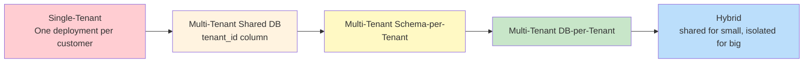
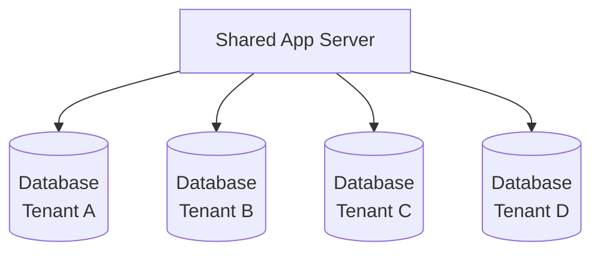
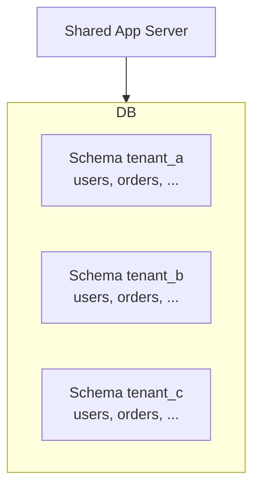
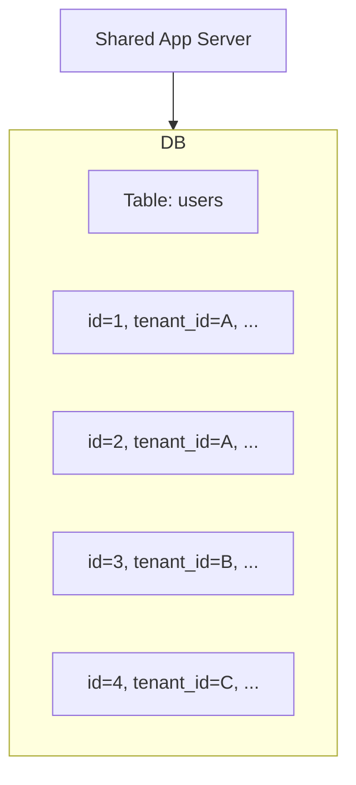
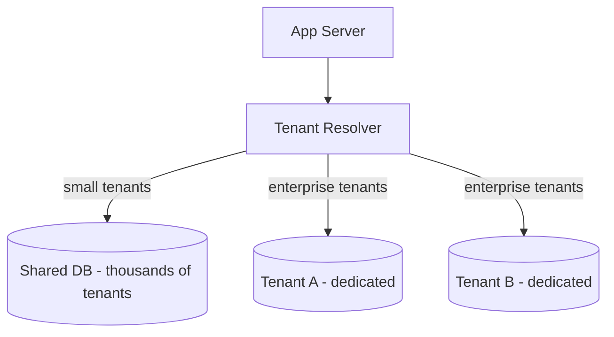
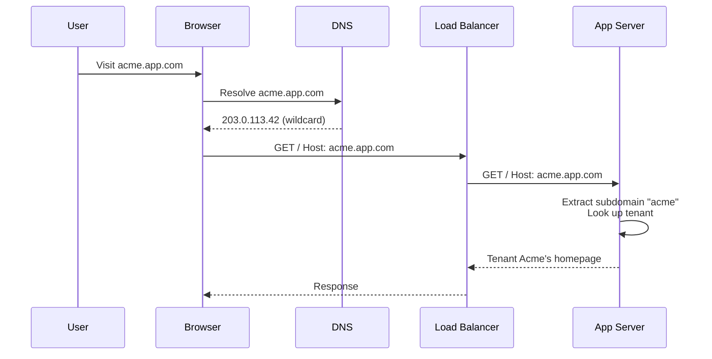
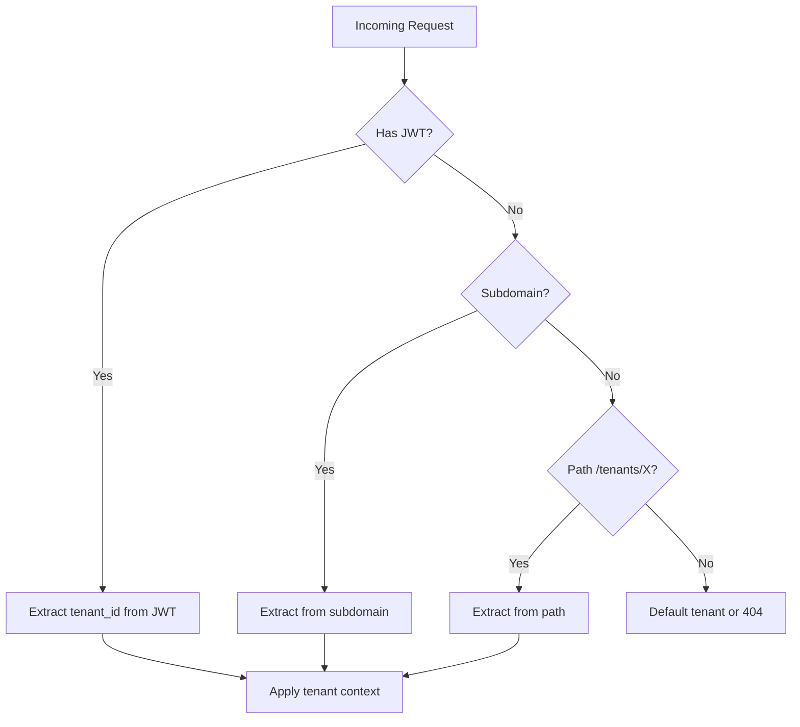
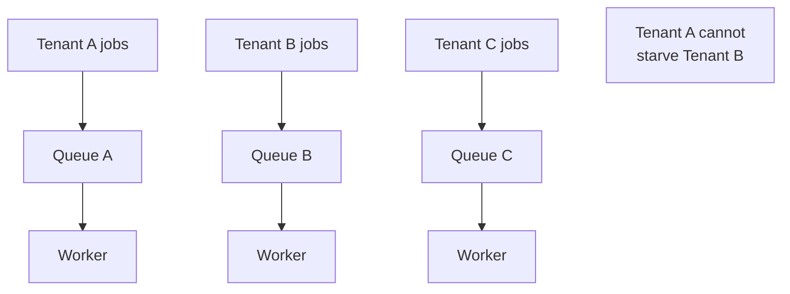
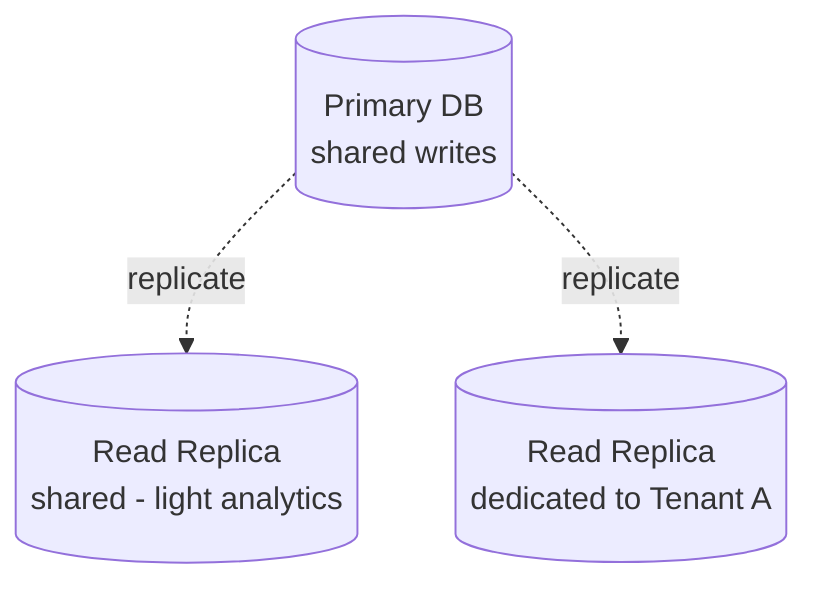
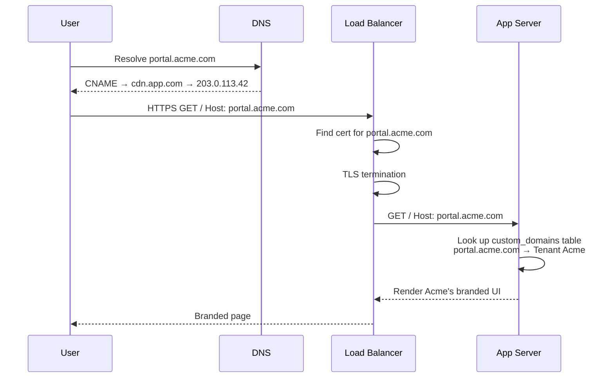

# Chapter 12. Multi-Tenant SaaS Architecture

> [!abstract] Chapter Goal
> Multi-tenancy is the architectural choice that lets one application serve many customers (tenants) from shared infrastructure, dramatically lowering per-customer cost. But it introduces hard design questions: how do you isolate tenant data? How do you route requests to the right tenant? How do you prevent one tenant's traffic spike from degrading service for everyone else? How do you let tenants customize branding and even bring their own domain? This chapter answers all four, with concrete patterns and trade-offs.

## 1. What Is Multi-Tenancy?

A **tenant** is an organization (or sometimes a single user) that uses your SaaS product. A multi-tenant application serves multiple tenants from a single deployment, with strong isolation between them. Examples:

- **Slack**: each workspace is a tenant. Tenants share the Slack infrastructure but cannot see each other's data.
- **Salesforce**: each customer organization is a tenant.
- **GitHub Enterprise**: each organization is a tenant.
- **Shopify**: each store is a tenant.

Contrast with **single-tenant**: a separate deployment per customer. Common in regulated industries (healthcare, finance) and for very large customers. Single-tenant is simpler but more expensive — you pay for infrastructure per customer.

### 1.1. The Multi-Tenancy Spectrum

Multi-tenancy is not binary. It's a spectrum:



The further right, the stronger the isolation — but the higher the cost and operational complexity.

## 2. Database Isolation Patterns

The most important multi-tenancy decision is **how to isolate tenant data at the data layer**. There are three canonical patterns.

### 2.1. Database-per-Tenant (Physical Isolation)

Each tenant has a completely separate database instance.



**Pros**:
- **Strongest isolation**: a bug in the app might leak data, but database-level access cannot cross tenants.
- **Per-tenant backup/restore**: you can restore Tenant A's database without affecting B, C, D.
- **Per-tenant scaling**: large tenants can be on bigger hardware.
- **Per-tenant encryption keys**: each tenant's data is encrypted with its own key.
- **Easy compliance**: data residency per tenant (EU tenant → EU database).

**Cons**:
- **Highest cost**: each database has fixed overhead (compute, storage minimums).
- **Operational complexity**: schema migrations must run on N databases; monitoring must cover N databases.
- **Cross-tenant queries are hard**: "show me all users across all tenants" requires querying N databases and merging.
- **Connection pool exhaustion**: each database needs its own connection pool. With 1000 tenants and 10 connections each, that's 10,000 connections.

**Best for**: large enterprise tenants, regulated industries, tenants with strict data residency requirements.

### 2.2. Schema-per-Tenant (Logical Isolation)

Tenants share the same database engine but have separate **schemas** (namespaces). Each tenant's tables live in `tenant_a.users`, `tenant_b.users`, etc.



**Pros**:
- **Moderate isolation**: a `SELECT * FROM users` query in the wrong schema does not leak data across tenants.
- **Lower cost than DB-per-tenant**: shared database engine.
- **Per-tenant backup**: PostgreSQL supports per-schema dumps.
- **Easier cross-tenant queries**: `SELECT * FROM tenant_a.users UNION SELECT * FROM tenant_b.users`.

**Cons**:
- **Schema migrations are tenant-scoped**: must run for each schema.
- **Connection overhead**: each connection is bound to a specific search_path / schema.
- **Schema leak risk**: if the app doesn't set `search_path` correctly per request, queries hit the wrong schema.
- **Connection pool complexity**: most ORMs don't natively support per-request schema switching.

**Best for**: medium-density multi-tenancy (10–500 tenants per database) where strong isolation is desired but per-tenant DB is too expensive.

### 2.3. Shared Database, Shared Schema (Row-Level Isolation)

All tenants share the same tables. Every row includes a `tenant_id` column that identifies the owner.

```sql
CREATE TABLE users (
    id UUID PRIMARY KEY,
    tenant_id UUID NOT NULL,
    email TEXT NOT NULL,
    name TEXT,
    ...
);
CREATE INDEX ON users (tenant_id, email);
```

Every query must include `WHERE tenant_id = ?`. Forget the WHERE clause, and you've leaked data across tenants.



**Pros**:
- **Cheapest**: one database for all tenants. Maximum density.
- **Simplest operations**: one schema, one migration, one backup.
- **Easiest cross-tenant queries**: just don't filter on `tenant_id`.
- **Easy analytics**: aggregate across all tenants in a single query.

**Cons**:
- **Data leak risk**: a forgotten `WHERE tenant_id = ?` exposes one tenant's data to another. The most common multi-tenancy bug.
- **No per-tenant backup**: must export/import individual rows.
- **Noisy neighbor**: one tenant's heavy query slows down everyone.
- **Tenant-specific schema customization is hard**: all tenants share the same columns.

**Best for**: consumer SaaS, B2C apps, small tenants, early-stage startups with cost pressure.

### 2.4. Row-Level Security (RLS)

To mitigate the "forgotten WHERE" risk in shared-schema multi-tenancy, PostgreSQL offers **Row-Level Security**. RLS policies are evaluated on every query and automatically filter rows.

```sql
ALTER TABLE users ENABLE ROW LEVEL SECURITY;

CREATE POLICY tenant_isolation ON users
    USING (tenant_id = current_setting('app.current_tenant_id')::uuid);
```

Now, when the application sets `SET app.current_tenant_id = 'tenant-a-uuid'` for a connection, every query on `users` automatically includes `WHERE tenant_id = 'tenant-a-uuid'`. The app cannot forget — the database enforces it.

```python
# Django / psycopg2 example
with connection.cursor() as cur:
    cur.execute("SET app.current_tenant_id = %s", [str(tenant_id)])
    # All subsequent queries on RLS-enabled tables are filtered
    cur.execute("SELECT * FROM users")  # Automatically only Tenant A's users
```

> [!tip] Use RLS for Defense-in-Depth
> Even if your ORM is "supposed to" always filter by tenant, add RLS as a safety net. If a developer writes raw SQL and forgets the filter, RLS catches it. The cost is a few microseconds per query.

### 2.5. Comparison Matrix

| Aspect | DB-per-Tenant | Schema-per-Tenant | Shared Schema |
|--------|---------------|---------------------|---------------|
| Isolation | Strongest | Strong | Weakest (unless RLS) |
| Cost | Highest | Medium | Lowest |
| Cross-tenant queries | Hard | Medium | Easy |
| Migrations | N times | N times | Once |
| Backup granularity | Per tenant | Per schema | Per row (hard) |
| Connection overhead | High | Medium | Low |
| Scale (tenants/DB) | 1–10 | 10–500 | 500–100,000+ |

### 2.6. The Hybrid Pattern

Many SaaS companies use a hybrid: small tenants on shared schema, large tenants on their own database. The application abstracts the difference behind a "tenant store" that knows where each tenant's data lives.



This gives you the cost efficiency of shared infrastructure for the long tail of small customers, plus the isolation and customization for premium customers willing to pay for it.

## 3. Dynamic Tenant Resolution

How does the application know which tenant a request belongs to? Three common strategies, often combined.

### 3.1. Subdomain-Based Routing

Each tenant gets a unique subdomain: `tenant-a.app.com`, `tenant-b.app.com`. The application inspects the HTTP `Host` header.

```python
def get_tenant_from_request(request):
    host = request.headers["Host"]
    subdomain = host.split(".")[0]
    if subdomain == "www" or subdomain == "app":
        return None  # marketing site or admin
    return Tenant.objects.get(subdomain=subdomain)
```



**Setup**: a wildcard DNS record `*.app.com → 203.0.113.42` and a wildcard TLS certificate `*.app.com`.

**Pros**:
- Clean URLs.
- Intuitive for users.
- Easy to share links.

**Cons**:
- Requires wildcard DNS and TLS (easy to mess up).
- Hard for tenants to remember which subdomain is theirs.
- Cannot use cookies across subdomains without careful `Domain` attribute.

### 3.2. Path-Based Routing

Tenant is encoded in the URL path: `app.com/tenants/acme/...`.

```python
def get_tenant_from_path(request):
    match = re.match(r"^/tenants/([^/]+)/", request.path)
    if match:
        return Tenant.objects.get(slug=match.group(1))
    return None
```

**Pros**:
- Works on any domain (no DNS setup).
- Easy to support custom domains later.

**Cons**:
- Ugly URLs (`app.com/tenants/acme/dashboard`).
- Cookies are shared across tenants (must use prefix or careful scoping).

### 3.3. JWT / Header-Based Routing

The user authenticates and receives a JWT containing their `tenant_id`. Every API call includes the JWT; the server extracts the tenant from the verified token.

```python
def get_tenant_from_jwt(request):
    token = request.headers["Authorization"].split(" ")[1]
    payload = verify_jwt(token)
    return Tenant.objects.get(id=payload["tenant_id"])
```

**Pros**:
- Works for API-only clients (no domain/path dependence).
- Tamper-proof (signed JWT).
- One user can be a member of multiple tenants (the JWT lists all of them).

**Cons**:
- Doesn't work for unauthenticated pages (login screen, marketing site).
- Requires token refresh logic.

### 3.4. The Combined Approach

Most real SaaS apps combine all three:

- **Subdomain** for the main UI (`acme.app.com`).
- **JWT** for API calls (carries `tenant_id` claim).
- **Path-based** for the marketing site and admin (`app.com/admin`).



### 3.5. The Tenant Context Middleware

Centralize tenant resolution in middleware. Every request passes through; the resolved tenant is stored in a request-scoped context that all subsequent code (ORM, audit log, etc.) reads from.

```python
class TenantMiddleware:
    def __init__(self, get_response):
        self.get_response = get_response

    def __call__(self, request):
        request.tenant = resolve_tenant(request)
        if not request.tenant:
            return HttpResponse(404, "Tenant not found")
        # Set the tenant context for the database layer
        set_current_tenant(request.tenant.id)
        response = self.get_response(request)
        clear_current_tenant()
        return response
```

The `set_current_tenant` function configures the ORM to automatically filter by `tenant_id`. Django has `django-tenants`; SQLAlchemy has session-level filters.

## 4. Noisy Neighbor Mitigation

In a shared infrastructure, one tenant experiencing a traffic spike or running heavy queries can consume resources (CPU, RAM, DB connections) that should be shared with others. This is the **noisy neighbor** problem.

### 4.1. Resource Contention Examples

- Tenant A runs a query that scans 1M rows → DB CPU spikes → Tenants B, C, D see slow queries.
- Tenant A's background job saturates the queue → Tenants B, C, D's jobs wait.
- Tenant A uploads a 10 GB file → object storage bandwidth is consumed → uploads from B, C, D are slow.
- Tenant A's traffic spikes to 10k QPS → app server thread pool is full → B, C, D get 503s.

### 4.2. Tenant-Aware Rate Limiting

The first defense: rate-limit per tenant, not just per IP. Each tenant gets a quota (e.g., 1000 req/min for the basic tier, 10000 req/min for enterprise). Enforce this at the API gateway or in middleware.

```python
def rate_limit_check(tenant_id):
    key = f"ratelimit:tenant:{tenant_id}"
    allowed = redis.incr(key)
    if allowed == 1:
        redis.expire(key, 60)  # 1 minute window
    return allowed <= tenant_quota(tenant_id)
```

For tenants that consistently exceed limits, the system should:
1. Return `429 Too Many Requests` with `Retry-After`.
2. Alert the account team (potential upsell to higher tier).
3. Optionally queue excess requests (if the API is idempotent).

### 4.3. Resource Quotas per Tenant

Beyond rate limits, enforce quotas on:
- **Storage**: Tenant A can store up to 100 GB; further writes return 402 Payment Required.
- **API calls per day**: hard cap, not just rate.
- **Compute time**: background jobs have a CPU-minute budget per day.
- **Concurrent connections**: per-tenant WebSocket limit.
- **Database connections**: cap the pool per tenant.

### 4.4. Tenant-Aware Queuing

If background jobs share a single queue, one tenant's bulk job can starve others. Solutions:

- **Per-tenant queues**: each tenant has its own queue. No tenant can fill another tenant's queue.
- **Fair scheduling**: a single queue, but the scheduler ensures round-robin across tenants. If Tenant A submits 1000 jobs and Tenant B submits 10, B's jobs are still processed within reasonable time.



### 4.5. Database-Level Isolation for Heavy Queries

If Tenant A runs analytics queries, route those queries to a **read replica** dedicated to analytics. The primary database continues to serve transactional queries from all tenants without contention.

For very heavy tenants, dedicate a read replica just for them:


### 4.6. Kubernetes Resource Quotas

At the infrastructure level, use Kubernetes `ResourceQuota` and `LimitRange` to cap resources per namespace. If each tenant gets its own namespace, you can enforce CPU/memory/pod count limits.

For shared-namespace deployments, use container-level `resources.limits` to cap each pod. A pod that exceeds its memory limit is OOMKilled; a pod that exceeds its CPU limit is throttled.

## 5. Tenant-Specific Customization and Whitelabeling

Enterprise tenants often demand customization: their own branding, custom domain, custom email templates, even custom fields and workflows.

### 5.1. Dynamic Custom Domains

The tenant wants `portal.acme.com` to point to your SaaS. Steps:

1. **Tenant configures CNAME**: `portal.acme.com → cdn.app.com`.
2. **You issue a TLS certificate**: use Let's Encrypt or AWS Certificate Manager with DNS validation. The cert covers `portal.acme.com`.
3. **Your load balancer routes by Host header**: when a request arrives for `portal.acme.com`, look up which tenant it belongs to (in a `custom_domains` table), and route to that tenant's context.



For thousands of custom domains, use SNI-based TLS termination (Nginx, HAProxy, or a cloud LB that supports SNI). Each domain gets its own cert.

### 5.2. Runtime Theme Loading

Each tenant's branding (colors, logo, fonts) is stored in a `tenant_branding` table:

```sql
CREATE TABLE tenant_branding (
    tenant_id UUID PRIMARY KEY,
    primary_color TEXT,
    secondary_color TEXT,
    logo_url TEXT,
    custom_css_url TEXT,
    custom_domain TEXT
);
```

When a request comes in:
1. Resolve the tenant.
2. Fetch branding (cached in Redis).
3. Inject CSS variables into the HTML template.

```html
<style>
  :root {
    --primary-color: {{ branding.primary_color }};
    --secondary-color: {{ branding.secondary_color }};
  }
</style>
```

### 5.3. Custom Email Templates

Per-tenant email templates stored in the database. When sending an email, the system loads the tenant's template and fills in the variables:

```python
def send_welcome_email(user, tenant):
    template = tenant.email_templates.get("welcome")
    body = render_template(template.body, {"user": user, "tenant": tenant})
    send_email(
        to=user.email,
        subject=template.subject,
        body=body,
        from_email=f"{tenant.name} <no-reply@{tenant.email_domain}>",
    )
```

### 5.4. Custom Fields and Schemas

For database-level customization (custom fields on entities), two patterns:

#### 5.4.1. EAV (Entity-Attribute-Value)

```sql
CREATE TABLE custom_fields (
    tenant_id UUID,
    entity_type TEXT,  -- 'user', 'order', etc.
    entity_id UUID,
    field_name TEXT,
    field_value TEXT
);
```

- **Pros**: any tenant can add any field.
- **Cons**: hard to query, no type safety, slow.

#### 5.4.2. JSONB Columns

```sql
ALTER TABLE users ADD COLUMN custom_fields JSONB;
-- Query:
SELECT * FROM users WHERE custom_fields->>'department' = 'Engineering';
```

- **Pros**: structured (within the JSON), queryable, type-flexible.
- **Cons**: schema is implicit; no referential integrity.

Most modern SaaS uses JSONB for custom fields.

### 5.5. Tenant-Specific Configuration

Beyond visual customization, tenants may want:
- **SSO configuration**: each tenant connects to its own IdP (Okta, Azure AD, custom SAML).
- **Webhooks**: each tenant registers its own webhook URLs.
- **API keys**: each tenant has its own keys with its own rate limits.
- **Audit log retention**: 30 days for basic tier, 7 years for compliance tier.

All of this is stored in tenant-scoped configuration tables.

## 6. Operational Concerns

### 6.1. Schema Migrations in Multi-Tenant DBs

For shared-schema: one migration runs once. Easy.
For schema-per-tenant: the migration must run for each schema. Automate with a script:
```bash
for schema in $(psql -c "SELECT schema_name FROM information_schema.schemata WHERE schema_name LIKE 'tenant_%'"); do
    psql -c "SET search_path TO $schema; ALTER TABLE users ADD COLUMN department TEXT;"
done
```

For DB-per-tenant: same, but per database. Some tools (Liquibase, Flyway, django-tenants) handle this automatically.

### 6.2. Backup and Restore Granularity

- **DB-per-tenant**: trivial — backup each database independently.
- **Schema-per-tenant**: dump each schema with `pg_dump --schema=tenant_a`.
- **Shared schema**: must export `WHERE tenant_id = ?`. Restoration is more complex (must not overwrite other tenants' data).

### 6.3. Monitoring per Tenant

Track per-tenant metrics:
- API call volume.
- Error rate.
- p99 latency.
- Storage used.
- Active users.

This lets you identify noisy neighbors, capacity issues, and at-risk tenants (sudden usage drop = likely churn).

### 6.4. Tenant Onboarding and Offboarding

- **Onboarding**: create the tenant record, set up the schema/database, seed default configuration, send welcome email.
- **Offboarding**: schedule data deletion after a grace period (e.g., 30 days), revoke all sessions, delete SSO config, send confirmation.

GDPR's "right to be forgotten" requires that you can completely delete a tenant's data on request. Design with this in mind — every table that might contain tenant data should have a `tenant_id` for easy deletion.

## 7. Tips, Tricks, and Common Pitfalls

> [!danger] Never Trust Client-Supplied Tenant IDs
> A common bug: the client sends `tenant_id` in the request body, and the server trusts it. An attacker changes the `tenant_id` and accesses another tenant's data. Always derive the tenant from the authenticated session (JWT claim), not from request body.

> [!tip] Use RLS as Defense-in-Depth
> Even with tenant-aware ORM filtering, enable PostgreSQL RLS. If a developer writes raw SQL and forgets the filter, RLS catches it. The cost is microseconds per query.

> [!tip] Tenant Context Should Be Request-Scoped
> Set the tenant context in middleware at request start; clear it at request end. Never store it in a global variable that persists across requests (thread-pool reuse bug waiting to happen).

> [!warning] Beware Cross-Tenant Caching
> If your cache key is `user:42`, two tenants with a user ID 42 will share a cache entry. Always include `tenant_id` in cache keys: `tenant:A:user:42`.

> [{tip} Monitor Per-Tenant Quota Usage
> Track each tenant's usage and alert before they hit limits. A warning at 80% lets the customer upgrade gracefully; a hard block at 100% causes churn.

> [!tip] Plan for Tenant Migration
> Eventually you'll need to move a tenant from shared to dedicated infrastructure (or vice versa). Design the data layer so a single tenant can be exported and re-imported without disrupting others.

> [!warning] Don't Share Cookies Across Tenants
> If `acme.app.com` and `zebra.app.com` share a cookie scoped to `.app.com`, a user logged in to Acme can access Zebra's pages (assuming they have a valid session). Scope cookies to the full subdomain unless you explicitly want SSO across tenants.

> [!tip] Use Feature Flags per Tenant
> Different tenants have different feature tiers. Use feature flags (LaunchDarkly, Unleash, or a homegrown `tenant_features` table) to gate functionality per tenant. This avoids forking the codebase per tenant.

## 8. Chapter Summary

- Multi-tenancy is a spectrum: shared schema (cheap, risky) → schema-per-tenant (middle) → DB-per-tenant (expensive, safe).
- Use Row-Level Security as defense-in-depth against forgotten `WHERE tenant_id = ?` clauses.
- Tenant resolution: subdomain (clean URLs), path (works anywhere), JWT (API-only). Most apps combine all three.
- Centralize tenant resolution in middleware; set request-scoped tenant context.
- Noisy neighbor mitigation: per-tenant rate limits, resource quotas, tenant-aware queues, dedicated read replicas for heavy tenants.
- Whitelabeling: custom domains via CNAME + SNI cert, runtime theme loading from DB, custom email templates, JSONB for custom fields.
- Operations: per-tenant schema migrations, per-tenant backup granularity, per-tenant monitoring, planned onboarding/offboarding.
- Never trust client-supplied tenant IDs; always derive from the authenticated session.

The next chapter ([[Chapter 13. Large-Scale Data Architectures]]) covers the higher-level data patterns: Data Lakes vs Data Warehouses, OLTP vs OLAP, columnar storage, the Lambda and Kappa architectures for stream + batch processing, and when to choose which.
