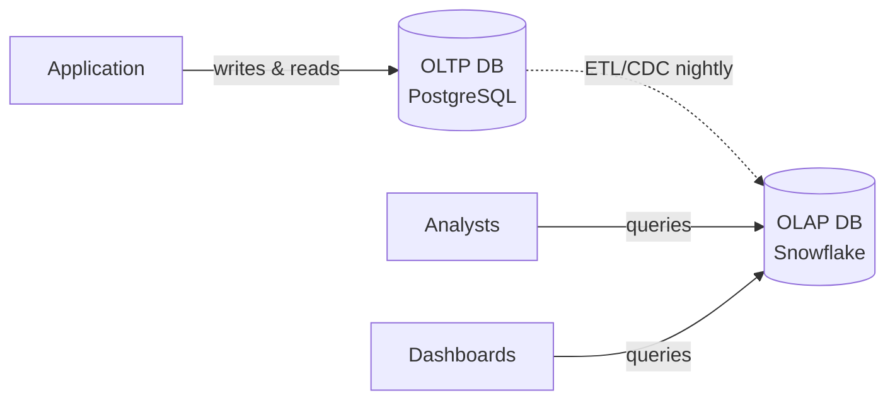
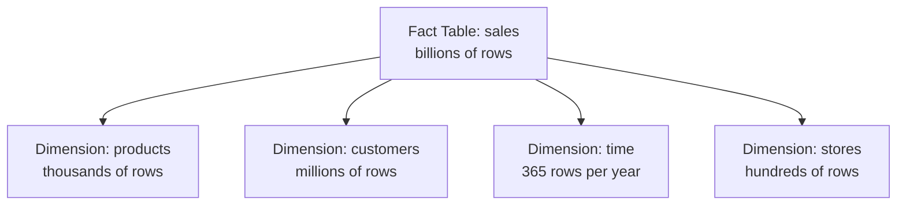
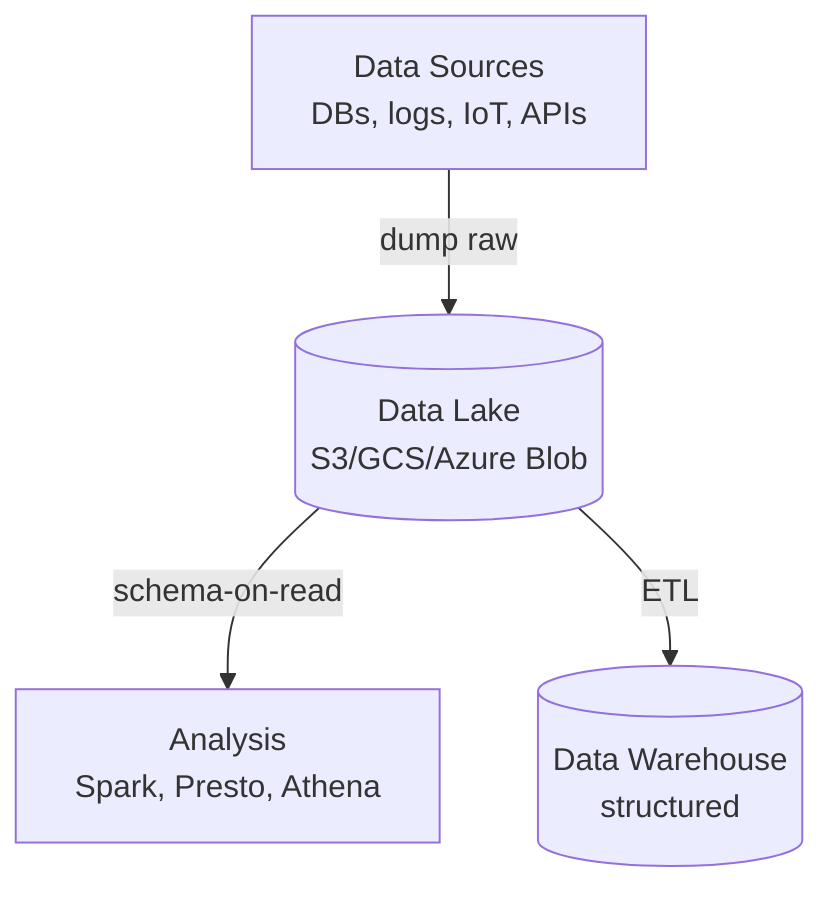
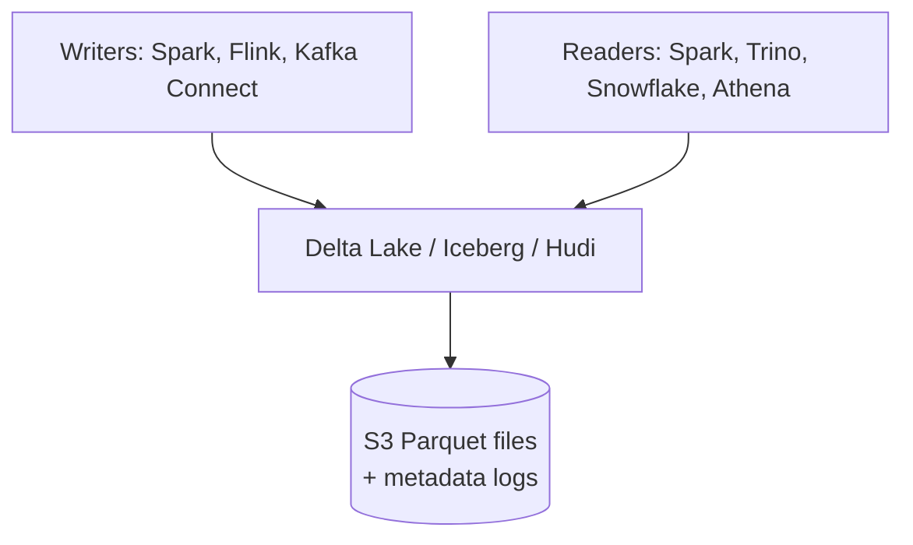
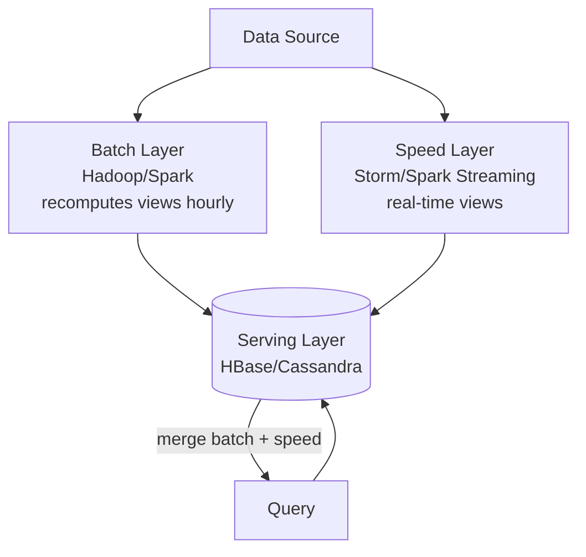
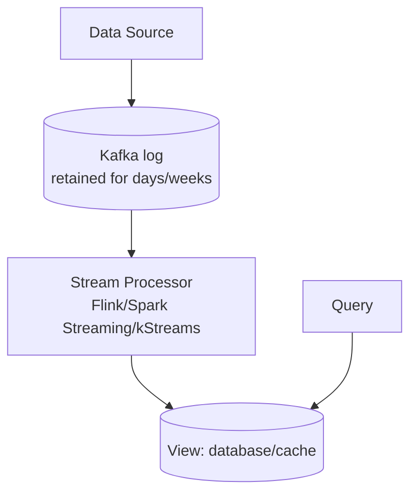
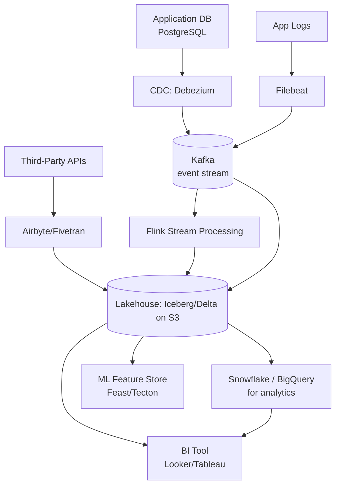

# Chapter 13. Large-Scale Data Architectures

> [!abstract] Chapter Goal
> Your original vault covers HDFS, MapReduce, and Spark at the execution-engine level. This chapter zooms out to the architectural patterns that decide **where data lives** and **how it flows** at company scale: OLTP vs OLAP, Data Warehouses vs Data Lakes vs Lakehouses, columnar storage, the Lambda vs Kappa debate for batch + stream processing, and the modern lakehouse pattern (Delta Lake, Iceberg, Hudi). After this chapter you will understand why a single database cannot serve both your transactional app and your analytics dashboard, and how modern data platforms are structured.

## 1. OLTP vs OLAP

The single most important distinction in data architecture is between **operational** and **analytical** workloads. They have completely different access patterns and demand different systems.

### 1.1. OLTP (Online Transaction Processing)

OLTP systems serve **live application traffic**. Characteristics:
- **Short, frequent transactions** (INSERT, UPDATE, SELECT single row).
- **Strict consistency** (ACID).
- **Indexed access** by primary key or specific columns.
- **High write rate**, moderate read rate.
- **Rows are small** (kilobytes).
- **Schema is well-defined and stable**.

Examples: PostgreSQL, MySQL, Oracle, SQL Server for your application's primary database. Every user signup, every order, every "like" is an OLTP transaction.

### 1.2. OLAP (Online Analytical Processing)

OLAP systems serve **analytical queries** over large datasets. Characteristics:
- **Long, complex queries** (GROUP BY, JOIN across millions of rows).
- **Eventual consistency is OK** (analytics don't need to be real-time).
- **Sequential scans** of large data ranges.
- **Low write rate, high read rate**.
- **Aggregations** (SUM, COUNT, AVG) over billions of rows.
- **Schema evolves frequently** (new metrics, new dimensions).

Examples: Snowflake, BigQuery, Redshift, ClickHouse, Apache Druid, DuckDB.

### 1.3. Why You Cannot Use One System for Both

Trying to use a single database for both workloads fails:

- An OLTP system has B-tree indexes optimized for single-row lookups. An analytics query that scans 100M rows will not use these indexes and will be slow.
- An OLAP system is columnar (next section); updating a single row is expensive.
- Running a heavy analytics query on the OLTP database steals CPU/IO from the live application, causing user-facing latency.
- ACID transactions on OLAP systems are often weaker (no row-level locking across the cluster).

The standard pattern: **OLTP for the app, OLAP for analytics, with an ETL pipeline copying data between them**.



## 2. Columnar Storage

OLAP databases are almost universally **columnar**. Understanding why is the foundation of understanding OLAP performance.

### 2.1. Row-Oriented vs Column-Oriented

A row-oriented database stores rows together on disk:
```
Row 1: [id=1, name=Alice, age=30, city=NYC, ...]
Row 2: [id=2, name=Bob, age=25, city=LA, ...]
Row 3: [id=3, name=Carol, age=40, city=SF, ...]
```

A column-oriented database stores columns together:
```
id column: [1, 2, 3, ...]
name column: [Alice, Bob, Carol, ...]
age column: [30, 25, 40, ...]
city column: [NYC, LA, SF, ...]
```

### 2.2. Why Columnar Wins for Analytics

Consider the query: `SELECT AVG(age) FROM users WHERE city = 'NYC'`.

**Row-oriented**:
- Read all columns of all rows (even though we only need `age` and `city`).
- If each row is 1 KB and there are 100M rows, that's 100 GB of disk I/O.

**Column-oriented**:
- Read only the `age` and `city` columns.
- If `age` and `city` are 8 bytes each, that's 16 bytes × 100M = 1.6 GB of disk I/O.

That's a 60× reduction in I/O. Plus, columnar data compresses better (similar values are adjacent — `city=NYC` repeated 1000 times compresses to almost nothing), and vectorized CPU instructions can process compressed data in bulk.

### 2.3. Why Columnar Loses for OLTP

Consider an INSERT of a single row.

**Row-oriented**: append the row to the end of the file. O(1) operation.

**Column-oriented**: append to N separate files (one per column). Each file must be opened, positioned, written. Much slower. And updating a single row requires rewriting the entire column chunk.

This is why columnar databases are typically **batch-loaded** (insert 10,000 rows at a time) rather than row-by-row.

### 2.4. Compression in Columnar Databases

Because all values in a column are the same type, compression is very effective:

- **Run-length encoding**: `NYC, NYC, NYC, ..., LA, LA, ...` → `(NYC, 1000), (LA, 500), ...`.
- **Dictionary encoding**: replace strings with integer IDs into a dictionary.
- **Delta encoding**: store differences between consecutive values (good for timestamps).
- **Bit packing**: if values fit in 5 bits, store them in 5 bits instead of 32.

These can reduce storage by 5–20× compared to row-oriented databases.

### 2.5. Common Columnar Formats

- **Parquet**: open-source, used by Spark, Hive, Impala, Athena. The de facto standard.
- **ORC**: used by Hive. Similar to Parquet with minor differences.
- **Apache Arrow**: in-memory columnar format. Used for fast data transfer between systems (e.g., Python ↔ database).

## 3. Data Warehouses

A Data Warehouse (DW) is a centralized, structured repository for analytics. It stores data in a **schema designed for analysis** (typically a star or snowflake schema), loaded from operational systems via ETL (Extract, Transform, Load).

### 3.1. Star Schema

The classic warehouse schema:



- **Fact tables**: store the events (sales, clicks, shipments). Huge (billions of rows). Mostly foreign keys + measures.
- **Dimension tables**: store the descriptive attributes (product name, customer address, store location). Small (thousands to millions of rows). Mostly text and categoricals.

A typical query joins a fact table to several dimension tables and aggregates:
```sql
SELECT d_time.year, d_product.category, SUM(f_sales.amount)
FROM f_sales
JOIN d_time ON f_sales.time_id = d_time.id
JOIN d_product ON f_sales.product_id = d_product.id
GROUP BY d_time.year, d_product.category;
```

### 3.2. Snowflake Schema

A normalized version of the star schema where dimension tables are themselves normalized. Saves storage but adds JOIN complexity. Most modern warehouses use star (denormalized) because storage is cheap and JOINs are expensive.

### 3.3. Modern Cloud Data Warehouses

| Warehouse | Owner | Notes |
|-----------|-------|-------|
| **Snowflake** | Snowflake Inc. | Multi-cloud, separates storage from compute, popular for analytics |
| **BigQuery** | Google | Serverless, scales to petabytes, integrates with GCP |
| **Redshift** | AWS | MPP columnar, integrates with S3, cheaper than Snowflake at scale |
| **Synapse** | Microsoft | Azure's warehouse, formerly SQL DW |
| **ClickHouse** | Open source | Extremely fast for real-time analytics, self-hosted |

### 3.4. Separation of Storage and Compute

Modern warehouses (Snowflake, BigQuery) **separate storage from compute**:
- Data is stored in cheap object storage (S3, GCS) in columnar format (Parquet-like).
- Compute clusters are spun up on demand to query the data.
- You pay for storage separately from compute.

This is revolutionary: you can have petabytes of data sitting in S3 (cheap), and only pay for compute when you actually run queries. Traditional warehouses (Oracle Exadata, Teradata) bundle storage and compute, requiring you to provision enough of both for peak — expensive.

## 4. Data Lakes

A Data Lake is a centralized repository for **raw, unstructured, or semi-structured data**. The philosophy: store everything now, figure out the schema later.

### 4.1. Architecture



Data is dumped to the lake in its raw form (JSON, CSV, Parquet, images, video). When someone wants to analyze it, they apply a schema at read time ("schema-on-read").

### 4.2. Why Data Lakes Exist

- **Cheapest storage**: S3 at $0.023/GB/month vs. Snowflake compute at $X/hour.
- **No upfront schema design**: store now, decide how to use later.
- **All data types**: structured (CSV), semi-structured (JSON, Parquet), unstructured (images, PDFs).
- **Long-term retention**: keep data for years "in case we need it".

### 4.3. The "Data Swamp" Problem

Without discipline, a Data Lake becomes a **Data Swamp**:
- No documentation of what's there.
- Duplicate data.
- No metadata (who created this file? when? what's the schema?).
- No quality control (corrupt files, missing fields, schema drift).
- Nobody can find what they need.

To avoid the swamp:
- Use a **data catalog** (AWS Glue, DataHub, Amundsen) to track what's in the lake.
- Enforce a **partitioning scheme** (`s3://lake/events/year=2024/month=01/day=15/`).
- Use **Delta Lake, Iceberg, or Hudi** (next section) to add structure.

## 5. The Lakehouse Pattern

A **Lakehouse** combines the cheap storage of a Data Lake with the ACID transactions and schema management of a Data Warehouse. It's the modern (2020s) best-of-both-worlds.

### 5.1. The Three Open Table Formats

| Format | Origin | Key Feature |
|--------|--------|-------------|
| **Delta Lake** | Databricks | Time travel, ACID on Parquet |
| **Apache Iceberg** | Netflix | Schema evolution, hidden partitioning |
| **Apache Hudi** | Uber | Upserts and deletes, incremental queries |

All three work on top of Parquet files in object storage and add:
- **ACID transactions**: atomic multi-file writes.
- **Schema enforcement**: rejects data that doesn't match the schema.
- **Time travel**: query the table as of a past point in time.
- **Concurrent writers**: multiple writers can append without conflicts.
- **Schema evolution**: add columns without rewriting the table.



### 5.2. Why Lakehouses Are Replacing Warehouses

- **Open format**: Parquet + open metadata. No vendor lock-in.
- **Multiple engines**: Spark, Trino, Flink, Snowflake, Athena can all read the same table.
- **ML-friendly**: ML engineers can read the same data as analysts, in the same format.
- **Cheaper than a dedicated warehouse**: storage is S3 prices.

Pure warehouses still win on **query performance** (Snowflake's optimizer is excellent), but the gap is closing.

## 6. Lambda Architecture

The Lambda Architecture (Nathan Marz, 2011) was the first widely-adopted pattern for combining **batch** and **stream** processing. It runs both in parallel.



### 6.1. The Three Layers

1. **Batch layer**: stores raw data and recomputes batch views periodically (hourly, daily). High latency, high accuracy. Uses MapReduce or Spark.
2. **Speed layer**: processes new data in real-time, producing real-time views. Low latency, approximate. Uses Storm, Spark Streaming, or Flink.
3. **Serving layer**: merges batch and speed views to answer queries. The batch view is the "source of truth"; the speed view fills in the recent gap.

### 6.2. The Logic

A query = (batch view result) + (speed view result for the recent window).

Example: "How many users are online right now?"
- Batch view: counts up to 1 hour ago, computed accurately from raw data.
- Speed view: counts in the last hour, computed from the live stream.
- Final answer: batch count + speed count.

### 6.3. Lambda's Problems

- **Code duplication**: the same logic must be implemented twice (batch in Spark, stream in Storm/Flink). Bugs slip in when the two diverge.
- **Operational complexity**: maintain two pipelines, two clusters, two codebases.
- **Reconciliation**: when the batch view catches up, you must invalidate the corresponding speed view. Subtle bugs.

## 7. Kappa Architecture

Kappa Architecture (Kreps, 2014) simplifies by **removing the batch layer**. Everything is a stream; "batch" is just a stream replayed from history.



### 7.1. The Key Insight

A batch is just a stream with a bounded window. If your stream processor can read from any offset in the Kafka log (including the very beginning), you can "re-run" a batch by replaying history.

To recompute a view:
1. Start a new stream processing job reading from offset 0.
2. The job processes the entire history, producing a new view.
3. When the new view catches up to "now", switch the serving layer to point at it.
4. Stop the old job.

### 7.2. Advantages over Lambda

- **One codebase**: same code for batch and stream.
- **One engine**: just Flink or Spark Streaming.
- **Simpler operations**: one cluster, one set of metrics.
- **Easy reprocessing**: replay the log to fix bugs or add features.

### 7.3. Requirements for Kappa

- **Log retention**: Kafka must retain data long enough to recompute views (days to weeks). Storage cost.
- **Idempotent stream processors**: reprocessing the same event twice must produce the same result.
- **Stateful processing**: the processor must maintain state (windows, aggregations) efficiently.

### 7.4. When Kappa Doesn't Work

- **Very long history**: if you need to reprocess 5 years of data, Kafka retention is impractical.
- **Schema changes**: if the schema evolved over time, replaying old data requires migration logic.
- **External lookups**: if your processor reads from a slowly-changing external database, replaying old events with current database state produces wrong results.

In these cases, Lambda (or a hybrid) is more appropriate.

## 8. Modern Stream Processing Engines

### 8.1. Apache Flink

The state-of-the-art stream processor:
- True streaming (not micro-batching like Spark).
- Exactly-once semantics via checkpointing.
- Stateful processing with RocksDB-backed state.
- Event-time processing with watermarks.
- Used by Uber, Netflix, Alibaba at enormous scale.

### 8.2. Spark Structured Streaming

- Micro-batch model: processes events in small batches (default 100 ms).
- Simpler than Flink but higher latency.
- Integrates with the Spark ecosystem (ML, SQL).
- Good when you already use Spark for batch.

### 8.3. Kafka Streams

- Library (not a separate cluster) that runs inside your application.
- Only works with Kafka.
- Lightweight, easy to deploy.
- Good for simple transformations and aggregations.

### 8.4. Comparison

| Engine | Latency | Exactly-Once | Complexity | Best For |
|--------|---------|--------------|------------|----------|
| Flink | 10s of ms | Yes | High | Real-time analytics, complex event processing |
| Spark Streaming | 100s of ms | Yes | Medium | Unified batch + stream, ML pipelines |
| Kafka Streams | 10s of ms | Yes | Low | Simple Kafka-to-Kafka transformations |

## 9. The Modern Data Stack

A typical 2024+ data architecture looks like:



Components:
- **CDC** (Change Data Capture): stream DB changes to Kafka. Debezium is the standard.
- **Ingestion pipelines**: Airbyte, Fivetran, Stitch for SaaS-to-warehouse ETL.
- **Lakehouse**: S3 + Iceberg/Delta/Hudi for the central data store.
- **Warehouse**: Snowflake/BigQuery for analyst-facing SQL.
- **Stream processing**: Flink for real-time transformations.
- **Orchestration**: Airflow, Dagster, Prefect for scheduling pipelines.
- **BI**: Looker, Tableau, Metabase for dashboards.

## 10. Tips, Tricks, and Common Pitfalls

> [!tip] Separate OLTP from OLAP
> Never run heavy analytics queries on your production OLTP database. Use CDC (Debezium) to stream changes to a warehouse or lake, and run analytics there.

> [!warning] Don't Build a Data Swamp
> Without a catalog (Glue, DataHub), partitions, and schema enforcement, your data lake becomes unsearchable. Plan governance from day one.

> [!tip] Use Iceberg or Delta for New Projects
> For new lakehouse builds, prefer Iceberg (best schema evolution, multi-engine support) or Delta Lake (best Databricks integration). Hudi for upsert-heavy workloads.

> [{warning} Don't Mix Lambda Codebases
> If you go with Lambda, abstract common logic into a shared library. Otherwise, your batch and stream views will diverge, producing inconsistent numbers.

> [!tip] Default to Kappa for New Stream Pipelines
> Use Kafka + Flink with long retention. Replay to recompute. Only fall back to Lambda when Kappa's requirements (retention, idempotency) can't be met.

> [!warning] Watch Out for Schema Drift
> When the upstream application changes a column, your warehouse will silently start missing data. Use schema registries (Confluent, Glue) to detect and alert on drift.

> [!tip] Partition Your Lake by Date
> Always partition by `year/month/day` (or even hour for high-volume). Queries with a date filter skip irrelevant partitions — massive speedup. Don't over-partition (more than 10,000 partitions creates metadata overhead).

> [!tip] Use Materialized Views for Hot Queries
> If the same aggregation is run 1000 times per day, pre-compute it as a materialized view. Snowflake, BigQuery, and PostgreSQL all support this.

## 11. Chapter Summary

- OLTP serves the app; OLAP serves analytics. Use separate systems with ETL/CDC between them.
- Columnar storage wins for analytics (read only needed columns, better compression) but loses for OLTP (slow single-row writes).
- Data Warehouse: structured, schema-on-write, expensive compute, excellent query performance.
- Data Lake: raw, schema-on-read, cheap storage, requires governance to avoid swamp.
- Lakehouse: Parquet + Iceberg/Delta/Hudi = ACID + schema + open format. The modern default.
- Lambda: batch + speed + serving. Powerful but code duplication.
- Kappa: one stream engine, replay for reprocessing. Simpler, the modern default.
- Flink for low-latency streaming; Spark Streaming for unified batch+stream; Kafka Streams for simple transformations.
- The modern data stack: CDC → Kafka → Lakehouse → Warehouse → BI, with Airflow orchestration.

The next chapter ([[Chapter 14. Capacity Planning (Deep Dive Extensions)]]) extends Chapter 1's foundations with deeper estimation techniques: read/write ratios, multi-region capacity, cost modeling, and traffic spike planning.
