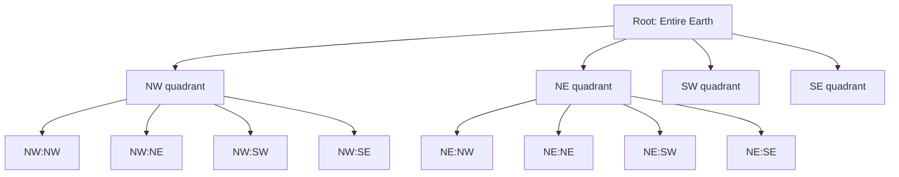
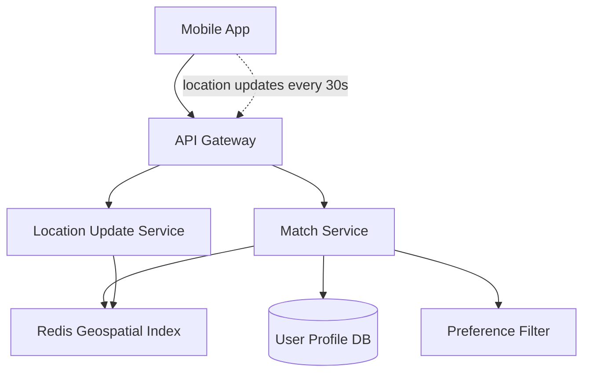
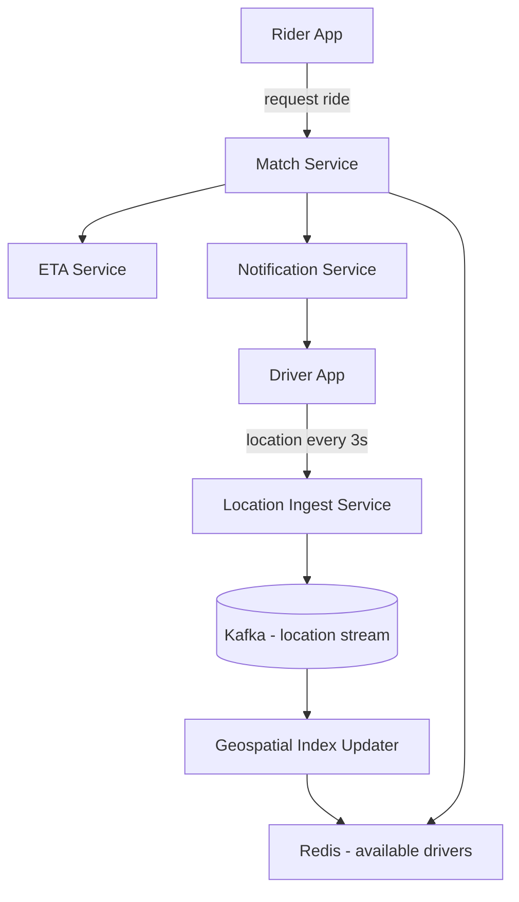

# Chapter 15. Case Study Geospatial Systems

> [!abstract] Chapter Goal
> Applications like Tinder, Uber, Yelp, and Google Maps all share a core problem: **find things near a location**. Standard database indexes are optimized for 1D equality or range queries; geographic coordinates are 2D, and "near" is a circular region. This chapter covers the three canonical solutions — Geohashes, QuadTrees, and Hilbert Curves — and walks through the architecture of a Tinder-like or Uber-like system that scales to millions of users.

## 1. The Geospatial Query Problem

### 1.1. The Two Query Types

Geospatial applications need to answer two types of questions:

1. **Range query**: "Find all drivers within 5 km of (lat 40.7, lng -74.0)." Returns all points inside a circle.
2. **K-nearest-neighbors (KNN) query**: "Find the 10 nearest drivers to (lat 40.7, lng -74.0)." Returns the closest N points regardless of distance.

These look similar but require different algorithms. Range queries benefit from spatial indexing (which we'll cover). KNN queries benefit from tree traversal with pruning.

### 1.2. Why B-Trees Don't Work

A standard B-tree index on `(lat, lng)` lets you efficiently query `WHERE lat = 40.7 AND lng = -74.0`. But it cannot efficiently answer "all points within 5 km of (40.7, -74.0)" because:
- The 5 km circle includes points with various `lat` and `lng` values.
- A B-tree on `lat` can find all rows with `lat BETWEEN 40.65 AND 40.75`, but then it must filter by `lng` separately, missing points that match the lng range but not the lat range (or vice versa).

You need a **2D spatial index** that considers both dimensions simultaneously.

### 1.3. The Three Solutions

| Approach | Idea | Used By |
|----------|------|---------|
| **Geohash** | Encode (lat, lng) as a 1D string; use string prefix matching | Redis, Elasticsearch, MongoDB |
| **QuadTree** | Recursively subdivide 2D space into 4 quadrants | Google Maps, some game engines |
| **Hilbert Curve** | Map 2D to 1D while preserving locality; index the 1D value | PostGIS (via `GIST`), BigQuery GIS |

All three are spatial indexing techniques that reduce the 2D problem to something a 1D index (B-tree, hash) can handle.

## 2. Geohashes

### 2.1. The Encoding

A Geohash encodes a (lat, lng) pair as a Base32 string. The encoding recursively bisects the world:

1. Start with the entire globe: lat range [-90, 90], lng range [-180, 180].
2. Bisect the lng range at 0. If the point is east (lng > 0), the bit is 1; else 0.
3. Bisect the lat range at 0. If north, bit is 1; else 0.
4. Repeat, alternating lng and lat, each time narrowing the range.
5. Group bits into 5-bit chunks and encode as Base32 characters (0-9, b-z, excluding a, i, l, o).

Example: New York City (40.7128, -74.0060) → Geohash `dr5regw...`

Each character of the Geohash represents 5 bits of precision. The more characters, the smaller the cell:
- 1 char: 5,000 km × 5,000 km cell.
- 5 chars: 5 km × 5 km cell.
- 7 chars: 150 m × 150 m cell.
- 9 chars: 5 m × 5 m cell.

### 2.2. Prefix Matching for Range Queries

Geohash cells are **hierarchical**: the Geohash `dr5re` is a cell that contains `dr5reg`, `dr5reh`, `dr5rer`, etc.

To find all points within a region:
1. Compute the Geohash precision that matches your search radius (5 km → 5 chars).
2. Compute the Geohash of the search center.
3. Find all points whose Geohash **starts with** the same prefix.
4. (For accuracy) also check the 8 neighboring cells, because the search center might be near a cell boundary.

```sql
-- Find all points whose Geohash starts with the cell containing (40.7, -74.0) at 5-char precision
SELECT * FROM points
WHERE geohash LIKE 'dr5re%'
   OR geohash LIKE 'dr5rg%'
   OR geohash LIKE 'dr5rh%'
   OR geohash LIKE 'dr5rk%'
   OR geohash LIKE 'dr5rm%'
   OR geohash LIKE 'dr5rn%'
   OR geohash LIKE 'dr5rq%'
   OR geohash LIKE 'dr5rw%'
   OR geohash LIKE 'dr5rx%';
```

The B-tree index on the `geohash` column makes these prefix queries very fast.

### 2.3. The Edge Case: Cell Boundary Problems

Geohash cells are rectangular. Two points that are physically close (e.g., 50 meters apart) can land in different cells if they're on opposite sides of a cell boundary.

```
+---------+---------+
|         |         |
|   dr5re | dr5rg   |
|    ●    |         |   <- two points, 50m apart, different cells
+---------+---------+
```

**Solution**: always query the 8 neighboring cells in addition to the center cell. The Geohash library provides a `neighbors()` function for this.

```python
import pygeohash as gh

center = gh.encode(40.7128, -74.0060, precision=5)
neighbors = gh.neighbors(center)
# Returns: ['dr5rd', 'dr5re', 'dr5rf', 'dr5r1', 'dr5r2', 'dr5r3', 'dr5r8', 'dr5r9']

# Query: all points in center + neighbors
all_cells = [center] + neighbors
query = "SELECT * FROM points WHERE " + " OR ".join(
    f"geohash LIKE '{cell}%'" for cell in all_cells
)
```

After getting candidates from the cells, filter by exact distance (Haversine formula) to remove points that are in the cell but outside the radius.

### 2.4. The Haversine Formula

To compute the actual distance between two (lat, lng) points (accounting for Earth's curvature):

```python
import math

def haversine(lat1, lng1, lat2, lng2):
    R = 6371  # Earth's radius in km
    lat1, lng1, lat2, lng2 = map(math.radians, [lat1, lng1, lat2, lng2])
    dlat = lat2 - lat1
    dlng = lng2 - lng1
    a = math.sin(dlat/2)**2 + math.cos(lat1) * math.cos(lat2) * math.sin(dlng/2)**2
    return 2 * R * math.asin(math.sqrt(a))
```

Use this to filter candidates after the Geohash prefix scan.

### 2.5. Pros and Cons of Geohashes

**Pros**:
- Easy to implement (libraries in every language).
- Uses standard B-tree indexes — no special spatial index needed.
- Variable precision (use longer strings for finer queries).
- Compact: a 9-character Geohash is 9 bytes.

**Cons**:
- **Cell boundary issue**: requires querying 9 cells (center + 8 neighbors).
- **Non-uniform cell sizes**: cells near the equator are roughly square; cells near the poles are very thin (because longitude lines converge).
- **Anomaly at the poles**: the Geohash `0000000000` covers the south pole; cells behave strangely there.

For most applications (Tinder, Uber, Yelp), Geohashes are the simplest and most practical solution.

## 3. QuadTrees

### 3.1. The Structure

A QuadTree recursively subdivides 2D space into 4 quadrants: NW, NE, SW, SE.



Each node has either:
- **0 children** (leaf node): holds the points in its region.
- **4 children**: the four sub-quadrants.

### 3.2. Dynamic Splitting

A QuadTree starts as a single root node covering the whole world. When a node accumulates more than a **threshold** of points (e.g., 100), it splits into 4 children, distributing its points among them.

```
Root [capacity: 100]
  → After 101st point inserted:
     NW [25 points]
     NE [30 points]
     SW [25 points]
     SE [21 points]
  → If NE grows to 101 points:
     NE splits into NE_NW, NE_NE, NE_SW, NE_SE
```

This means densely populated areas (cities) have deep trees with small cells, while sparsely populated areas (oceans) have shallow trees with large cells. **The tree adapts to the data distribution.**

### 3.3. Querying

To find all points within 5 km of (40.7, -74.0):
1. Start at the root.
2. Recursively visit any child whose region intersects the search circle.
3. At leaf nodes, check each point's actual distance.

```
search(node, circle):
    if not intersects(node.region, circle):
        return []
    if node is leaf:
        return [p for p in node.points if distance(p, circle.center) <= circle.radius]
    else:
        return search(node.NW, circle) + search(node.NE, circle)
             + search(node.SW, circle) + search(node.SE, circle)
```

The tree prunes entire subtrees that don't intersect the search region. For 1 million points, you might visit only a few hundred points instead of all 1 million.

### 3.4. In-Memory vs Persistent Quadtrees

- **In-memory QuadTrees**: very fast, but must be rebuilt on restart. Suitable for ride-sharing (drivers come and go; tree is rebuilt frequently).
- **Persistent Quadtrees** (stored in a database): more complex, but survives restarts. PostGIS uses an R-tree (similar concept) for its spatial index.

### 3.5. Updating the Tree

When a point moves (e.g., a driver drives away):
1. Remove the point from its current leaf.
2. If the leaf is now below a "merge threshold" (e.g., 50 % of capacity), merge with siblings.
3. Insert the point at the new location.
4. If the new leaf exceeds capacity, split.

This is expensive — O(log N) for each update. For ride-sharing with millions of drivers updating every 5 seconds, this is a lot of work. Solutions:
- **Geohash buckets** are simpler: just delete the old row, insert the new row. The B-tree handles it.
- **QuadTrees** are better for static data (stores, restaurants) where updates are rare.

### 3.6. QuadTree Variants

- **Region QuadTree**: subdivides space regardless of points (used in image compression).
- **Point QuadTree**: subdivides only when a point is added (used in 2D point queries).
- **PR QuadTree** (Point-Region): combines both — subdivides on threshold, holds points in leaves.

For geospatial apps, the PR QuadTree is the standard.

## 4. Hilbert Curves

### 4.1. Space-Filling Curves

A **space-filling curve** is a continuous function from a 1D line to a 2D area. It "fills" the entire 2D space while remaining a single line.

The Hilbert Curve is the most famous example, with the key property of **locality preservation**: points that are close on the 1D line are also close in the 2D space (and vice versa, mostly).

```mermaid
graph LR
    subgraph 2D ["2D Space"]
        P1[point at (0.2, 0.3)]
        P2[point at (0.25, 0.35)]
    end
    subgraph 1D ["1D Hilbert Values"]
        H1[h = 12345]
        H2[h = 12347]
    end
    P1 -.->|Hilbert encoding| H1
    P2 -.->|Hilbert encoding| H2
```

### 4.2. Why Locality Preservation Matters

If two points are physically close, their Hilbert values are close. This means:
- A B-tree index on the Hilbert value can find "nearby" points via range queries.
- The points returned by a range scan on the Hilbert value are likely to be physically close.

### 4.3. Hilbert vs Geohash

Both map 2D to 1D. The difference:

- **Geohash**: alternates between lat and lng bits. Cells are rectangular but can be very elongated at high latitudes.
- **Hilbert**: uses a more complex recursive pattern that produces cells with better locality. Cells are more uniform in shape.

Studies show Hilbert curves preserve locality better than Geohash (Z-order curve). For most applications, the difference is small, but for large datasets or high-precision queries, Hilbert wins.

### 4.4. Using Hilbert with a Database

PostGIS supports Hilbert curves via its `ST_HilbertCurve` function (in newer versions). BigQuery GIS uses them internally for spatial joins.

To use Hilbert values in a standard database:
1. Compute the Hilbert value `h` for each point.
2. Store `h` as a column with a B-tree index.
3. For range queries, compute the range of Hilbert values that cover your search region and query `WHERE h BETWEEN h_min AND h_max`.

The tricky part: a 2D region doesn't map to a single contiguous 1D range. You need to compute the set of 1D ranges that cover your 2D region. Libraries exist for this.

## 5. Case Study: Designing Tinder

Tinder's core feature: "Show me potential matches within X miles of my location."

### 5.1. Requirements

- 100 million users.
- 10 million daily active.
- Each user has a location (lat, lng).
- Each user has preferences (gender, age range, distance).
- Show 10 potential matches per "swipe session".
- Latency: < 500 ms per swipe session.
- Updates: user location changes when they move.

### 5.2. High-Level Architecture



### 5.3. Using Redis Geospatial (Geohash Under the Hood)

Redis has a built-in `GEO` data type that uses Geohashes internally. Perfect for this use case.

```bash
# Add a user to the geospatial index
GEOADD user_locations 40.7128 -74.0060 "user:123"

# Find users within 5 km of (40.7128, -74.0060)
GEORADIUS user_locations 40.7128 -74.0060 5 km WITHCOORD WITHDIST
```

Redis handles the Geohash encoding, neighbor cells, and distance filtering automatically. Performance: 100k+ queries per second on a single Redis instance.

### 5.4. The Match Algorithm

```python
def find_matches(user_id, max_distance=5, limit=10):
    user = db.get_user(user_id)
    
    # 1. Find nearby users via Redis geospatial
    nearby = redis.georadius(
        'user_locations',
        user.lng, user.lat,
        max_distance, 'km',
        withcoord=True, withdist=True, count=100
    )
    
    # 2. Filter by preferences (gender, age, etc.)
    candidates = [n for n in nearby if matches_preferences(user, n)]
    
    # 3. Filter out already-swiped users
    swiped = redis.smembers(f"swiped:{user_id}")
    candidates = [c for c in candidates if c.user_id not in swiped]
    
    # 4. Sort by distance, take top N
    candidates.sort(key=lambda c: c.distance)
    return candidates[:limit]
```

### 5.5. Location Updates

When a user moves, their location must be updated in the index:
```python
def update_location(user_id, lat, lng):
    # Remove old, add new (or use GEOADD which overwrites)
    redis.geoadd('user_locations', lng, lat, f"user:{user_id}")
```

Update frequency: every 30 seconds when the app is open. With 10M DAU, that's ~333k updates/sec. Redis handles this easily.

### 5.6. Caching for Hot Users

Some users (highly attractive, in dense cities) get many match queries. Cache their recent match lists in Redis with a 5-minute TTL. Most queries hit the cache.

### 5.7. Scaling

- **Vertical**: a single Redis instance with 64 GB RAM holds ~1 billion geospatial entries.
- **Horizontal**: shard Redis by Geohash prefix. Users in NYC go to Redis-East; users in LA go to Redis-West. Each shard handles its own region.

For 100M users, a 3-node Redis Cluster handles it comfortably.

## 6. Case Study: Designing Uber

Uber's problem is harder: drivers are continuously moving, and we need to match riders with the closest available driver in real time.

### 6.1. Differences from Tinder

- Drivers update location every 3 seconds (vs Tinder's 30 seconds).
- Need to track driver state (available, in-ride, offline).
- Need real-time ETA calculation (routing, traffic).
- Matchmaking is bidirectional (driver accepts/declines).

### 6.2. The Architecture



### 6.3. Driver State Machine

```
OFFLINE → ONLINE → AVAILABLE → ASSIGNED → IN_RIDE → AVAILABLE
                                                       ↓
                                                    OFFLINE
```

Only `AVAILABLE` drivers are in the Redis geospatial index. When a driver accepts a ride, they're removed from the index (so other riders don't try to match them).

### 6.4. The Match Flow

1. Rider requests a ride at (lat, lng).
2. Match service queries Redis for available drivers within 5 km.
3. Filter by driver capacity (UberX, UberXL, etc.).
4. Compute ETA to rider for each candidate (via ETA service).
5. Send match request to the closest driver.
6. Driver has 15 seconds to accept.
7. If declined or timeout, try the next-closest driver.

### 6.5. ETA Calculation

ETA is not just distance — it's driving time, accounting for roads, traffic, and route. Requires a routing engine (OSRM, Valhalla, or a commercial provider like Mapbox, Google Maps).

For efficiency:
- Pre-compute ETAs between major cell centers (every 5 km).
- Use the pre-computed ETA + a fine-tuning for the last 5 km.

### 6.6. Handling the Hot Driver Problem

A driver in a busy area gets many match requests. To avoid spamming them:
- **Match one driver at a time**. Wait for response before trying the next.
- **Soft-lock the driver** for 15 seconds while waiting for response. Other riders see the driver as "busy".

### 6.7. Scaling

- 10M drivers, 50M rides/day.
- 3-second location updates = ~3M updates/sec.
- Kafka handles this with 100+ partitions.
- Redis Cluster with 30+ nodes for the geospatial index.
- ETA service is the bottleneck (CPU-intensive routing). Scale horizontally.

## 7. Comparison of Approaches

| Aspect | Geohash | QuadTree | Hilbert |
|--------|---------|----------|---------|
| Implementation complexity | Low | Medium | Medium |
| Index type | B-tree on string | Custom tree | B-tree on integer |
| Update cost | O(log N) | O(log N) but with rebalancing | O(log N) |
| Boundary issues | Yes (need 9-cell query) | No (recursive descent) | No |
| Adaptive to data density | No | Yes | No |
| Suitable for moving points | Yes | No (rebuild cost) | Yes |
| Suitable for static points | Yes | Yes | Yes |
| Built-in DB support | Redis, PostGIS, MongoDB | Custom | PostGIS, BigQuery |

**Recommendation**:
- For moving points (Tinder, Uber, food delivery): **Geohash with Redis**.
- For static points (stores, restaurants, landmarks): **QuadTree** or **PostGIS** (uses R-tree).
- For massive-scale analytics (find patterns in billions of GPS pings): **Hilbert with BigQuery**.

## 8. Tips, Tricks, and Common Pitfalls

> [!tip] Use Redis GEO for Simple Use Cases
> Redis's `GEOADD` / `GEORADIUS` commands handle Geohash encoding, neighbor cells, and distance filtering for you. Don't reinvent the wheel.

> [!warning] Don't Forget the Antimeridian
> Points near ±180° longitude (the dateline) need special handling. A Geohash query near the antimeridian must check cells on both sides. Redis and PostGIS handle this; naive implementations don't.

> [!tip] Use S2 Geometry for Production Scale
> Google's S2 library (used in Google Maps, MongoDB) is a more sophisticated version of Hilbert curves with built-in support for spherical geometry, antimeridian handling, and cell hierarchies. Available in C++, Go, Java, Python.

> [!warning] Don't Update QuadTrees Too Often
> QuadTree updates are expensive (split/merge). For moving points, use Geohash (just delete + reinsert). Reserve Quadtrees for static data.

> [!tip] Cache Match Results
> If user A's matches are computed at time T, and user A is still at the same location at time T+5min, the matches are still valid. Cache aggressively with location-based cache keys.

> [!warning] Watch Out for the "Hot City" Problem
> In a city like NYC, millions of users are in a small geographic area. Your 5 km search returns 100,000 candidates, and the preference filter becomes the bottleneck. Add secondary indexes on preferences (gender, age) and pre-filter before geospatial search.

> [!tip] Pre-Filter with Cheap Predicates
> Order filter steps from cheapest to most expensive:
> 1. Geospatial (B-tree index scan).
> 2. Already-swiped (Bloom filter or Redis set).
> 3. Gender preference (indexed column).
> 4. Age preference (indexed column).
> 5. Active in last 24 hours (cache lookup).
> Apply them in this order so the expensive filters see fewer candidates.

## 9. Chapter Summary

- Standard B-trees cannot efficiently index 2D points; spatial indexing is required.
- **Geohash** encodes (lat, lng) as a 1D string; use B-tree prefix matching. Requires 9-cell queries to handle cell boundaries.
- **QuadTree** recursively subdivides 2D space into 4 quadrants; adapts to data density. Best for static data.
- **Hilbert Curve** maps 2D to 1D while preserving locality. Used by PostGIS and BigQuery.
- For Tinder-style apps: Redis GEO + preference filters + cache.
- For Uber-style apps: Kafka for location stream + Redis for available driver index + ETA service + soft-lock for in-flight matches.
- Use S2 for production-grade spherical geometry.
- Order filter predicates from cheapest to most expensive.

The next chapter ([[Chapter 16. Case Study News Feed Systems]]) covers designing Instagram/TikTok-style news feeds: push vs pull vs hybrid fan-out, ranking, edge cases for celebrity accounts, and feed caching strategies.
