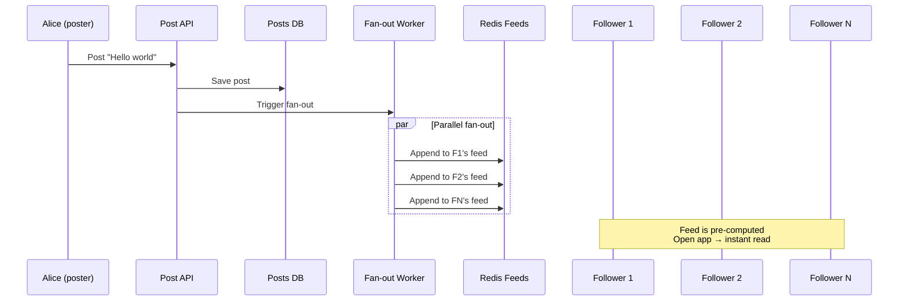
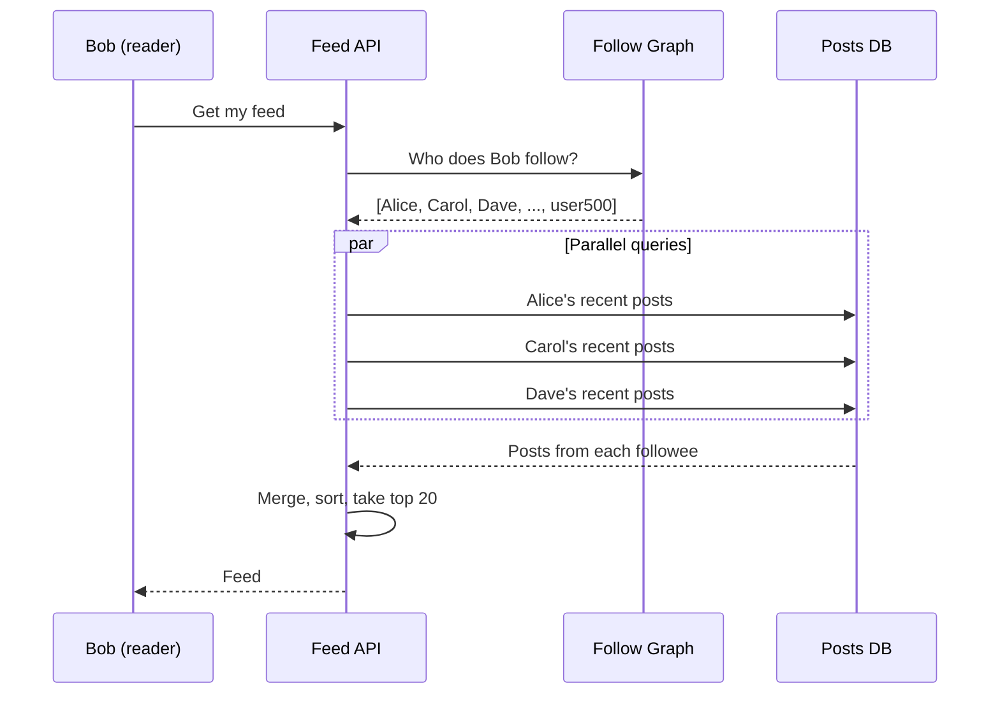
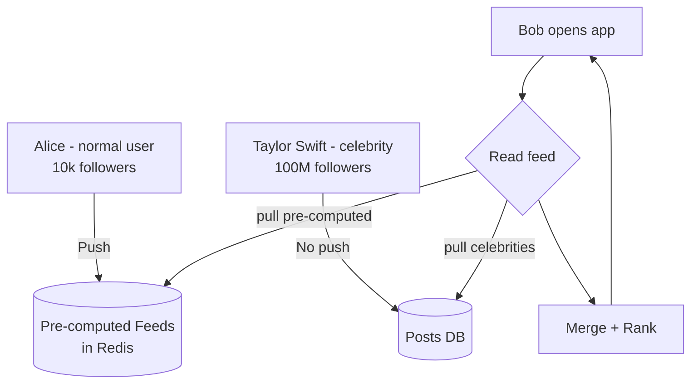
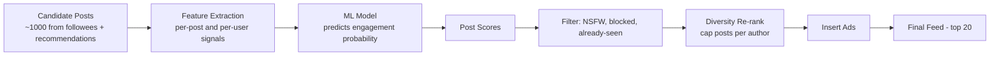
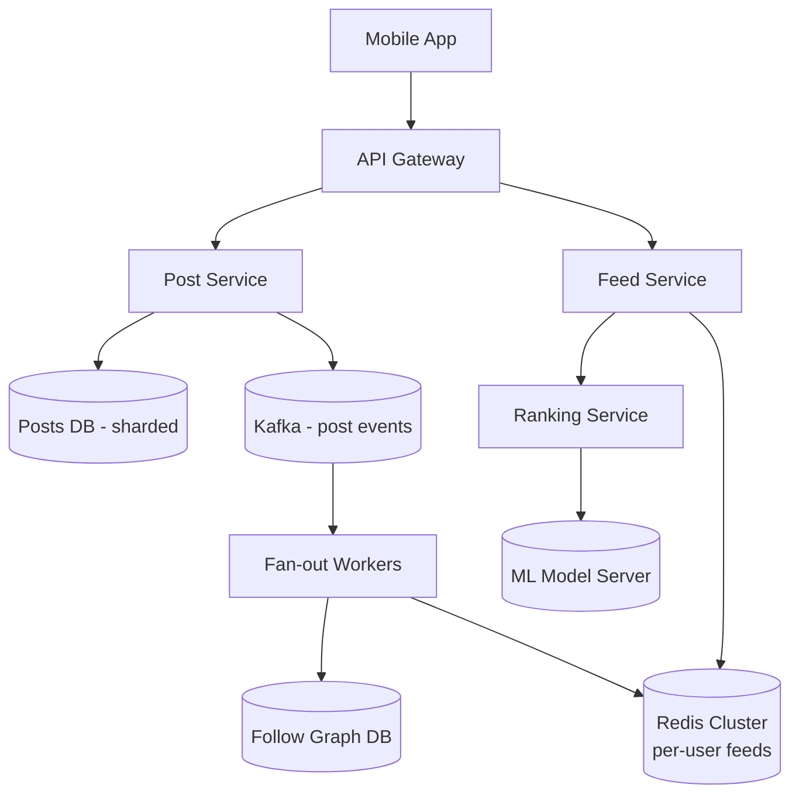
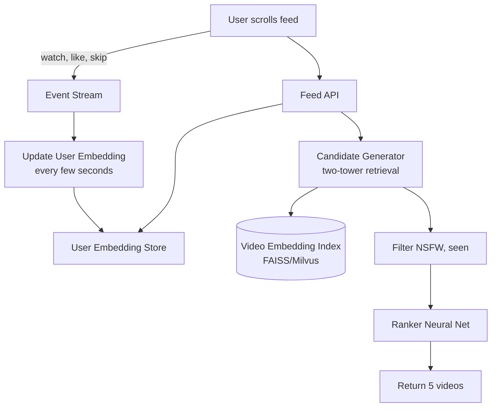

# Chapter 16. Case Study News Feed Systems

> [!abstract] Chapter Goal
> Instagram, TikTok, Twitter/X, and Facebook all share a core problem: **when a user opens the app, generate a personalized feed of recent posts from people they follow (or that an algorithm thinks they'll like)**. With 1 billion users and billions of posts, this is one of the hardest read-heavy problems in system design. This chapter covers the Push (fan-out on write), Pull (fan-out on read), and Hybrid fan-out models, the celebrity problem, ranking algorithms, and feed caching strategies.

## 1. The News Feed Problem

### 1.1. Functional Requirements

- A user opens the app and sees a **personalized feed** of recent posts.
- The feed contains posts from people they follow (chronological) or posts an algorithm ranks highly (recommended).
- The feed should load in **< 200 ms** for the median user.
- New posts should appear in followers' feeds within **seconds to minutes** of posting.
- The feed supports pagination (infinite scroll).

### 1.2. Non-Functional Requirements

- **High read-to-write ratio**: 100:1 to 1000:1. Users scroll feeds dozens of times per day; they post rarely.
- **Eventual consistency is OK**: a post appearing in a follower's feed 5 seconds after posting is acceptable.
- **Personalization**: different users see different feeds, even if they follow the same people.
- **Massive scale**: billions of users, trillions of posts.

### 1.3. The Core Question

When Alice posts, **when** do we compute the feeds of her 1 million followers?

Two extreme answers:
- **Immediately (Push / Fan-out on write)**: at post time, write Alice's post ID to all 1 million followers' feed lists.
- **Lazily (Pull / Fan-out on read)**: when a follower opens their feed, look up Alice's recent posts and combine with others.

Each has trade-offs that we'll explore.

## 2. Push Model (Fan-out on Write)

### 2.1. The Mechanism

When Alice posts:
1. The post is saved to the Posts database.
2. A background job looks up all of Alice's followers (1 million of them).
3. For each follower, append Alice's post ID to their feed (a sorted set or list in Redis).
4. When a follower opens their app, their feed is already pre-computed — just read the list.



### 2.2. Pros

- **Reads are O(1)**: just read the pre-computed list. Sub-millisecond.
- **Simple read path**: no joins, no aggregation.
- **Scales naturally with read load**: more readers = more cache reads, which Redis handles easily.

### 2.3. Cons

- **Write amplification**: one post by Alice = 1 million writes to follower feeds. If Alice has 100 million followers (celebrity), that's 100 million writes per post.
- **Wasted work**: if a follower hasn't opened the app in a month, their feed was updated thousands of times for nothing.
- **Storage cost**: each user's feed list grows over time. With 1000 posts per user feed and 1 billion users, that's 1 trillion entries.
- **Latency at post time**: the poster waits for fan-out to complete (or it's done async, but then there's a window of inconsistency).

### 2.4. The Celebrity Problem (Justin Bieber Problem)

A celebrity with 100 million followers posts once → 100 million feed writes. If 10 celebrities post in the same minute, that's 1 billion writes — overwhelming the fan-out workers.

Worse, most of those 100 million followers won't open the app within the post's relevance window (a few hours). The work is largely wasted.

## 3. Pull Model (Fan-out on Read)

### 3.1. The Mechanism

When Bob opens his app:
1. Look up the 500 people Bob follows.
2. Query the Posts database for each followee's most recent posts.
3. Merge, sort by time or rank, return the top 20.



### 3.2. Pros

- **No write amplification**: posting is just one DB write.
- **No wasted work**: only compute feeds for users who actually open the app.
- **Storage efficient**: no pre-computed feed lists.
- **Real-time**: feeds always reflect the latest posts (no lag from async fan-out).

### 3.3. Cons

- **Read amplification**: each feed load requires querying N followees. If Bob follows 500 people, that's 500 DB queries (or one big IN query).
- **High read latency**: querying 500 followees' posts and merging takes time.
- **Hard to rank**: pulling raw posts and ranking in the read path is expensive.
- **Hot post problem**: if a celebrity posts, every one of their 100M followers' feed queries hits the same post. The post becomes a hot key.

### 3.4. Optimizations

- **Cache recent posts per user**: keep each user's last 100 posts in Redis. Feed loads read from cache, not DB.
- **Limit followees queried**: only query the most recently active followees (e.g., posted in the last 24 hours).
- **Pre-aggregate per followee**: maintain a "recent posts" list per user, updated on post. Feed load merges 500 small lists instead of querying 500 times.

## 4. Hybrid Model (The Real-World Default)

Production systems use a hybrid: **Push for normal users, Pull for celebrities**.

### 4.1. The Hybrid Algorithm

```
When Alice posts:
  if Alice has < 100k followers:
    # Normal user: push to all followers' feeds
    fan_out_push(alice_post, alice.followers)
  else:
    # Celebrity: don't push; followers will pull at read time
    mark alice_post as "celebrity_post"  # flag for pull model

When Bob opens app:
  feed = []
  # 1. Read pre-computed feed (from push model)
  feed += read_cached_feed(bob)
  # 2. For each celebrity Bob follows, pull their recent posts
  for celebrity in bob.celebrity_follows:
    feed += pull_recent_posts(celebrity, since=last_read)
  # 3. Sort, rank, return
  return rank_and_sort(feed)
```



### 4.2. Why This Works

- **Normal users (99.9 % of users)**: their feeds are pre-computed by push. Cheap, fast reads.
- **Celebrities (0.1 %)**: their posts are pulled at read time. No write amplification.
- **The threshold** (e.g., 100k followers) is tunable. Below it, push is cheap. Above it, push is too expensive.

### 4.3. The Trade-off

The hybrid adds complexity:
- Need to maintain a "celebrity list" (or compute it dynamically from follower counts).
- Need both push and pull code paths.
- Need to handle the case where a user follows many celebrities (still expensive at read time).

But this is the price of operating at scale. Twitter, Instagram, and TikTok all use variants of this hybrid.

## 5. Ranking Algorithms

So far we've discussed **chronological** feeds (posts ordered by time). Modern feeds are **ranked** by an algorithm that predicts what the user wants to see.

### 5.1. Why Rank?

- **Chronological is broken when you follow too many people**: if Bob follows 5000 active accounts, his feed is a firehose. He'll miss the posts he cares about.
- **Recommendations**: TikTok-style "For You" pages show posts from people you don't follow, based on predicted interest.
- **Engagement optimization**: ranked feeds maximize time-in-app, which maximizes ad revenue.

### 5.2. Ranking Signals

A typical ranking algorithm combines:

| Signal | Source | Weight |
|--------|--------|--------|
| **Recency** | Post timestamp | High (decay over hours) |
| **Engagement** | Likes, comments, shares | High |
| **Affinity** | How often you interact with the author | High |
| **Author popularity** | Author's follower count, verified status | Medium |
| **Content type** | Photo, video, link (user preference) | Medium |
| **Diversity** | Don't show 10 posts from the same author | Medium |
| **Ad priority** | Paid placement | High (revenue) |

### 5.3. The Ranking Pipeline



1. **Candidate generation**: gather ~1000 candidate posts (from followees + algorithmic recommendations).
2. **Feature extraction**: compute per-post features (recency, engagement count, media type) and per-user features (affinity scores, past engagement).
3. **Model scoring**: a machine learning model (gradient-boosted trees or a neural network) predicts the probability the user will engage (like, comment, share, watch to end).
4. **Filtering**: remove posts the user has already seen, NSFW content, blocked users.
5. **Diversity re-rank**: cap the number of posts from any single author (e.g., max 3).
6. **Ad insertion**: insert sponsored posts at predetermined positions.
7. **Return**: top 20 posts to the user.

### 5.4. Online vs Offline Scoring

- **Offline scoring**: rank posts nightly; store ranked feeds in Redis. Fast reads but stale rankings.
- **Online scoring**: rank posts at request time. Fresh but expensive (model inference per request).
- **Hybrid**: pre-compute a coarse ranking offline; refine at request time with real-time features (e.g., the user just liked a related post).

Modern systems do **online scoring** with cached features. The model is small enough (or hardware fast enough) that inference takes < 50 ms.

## 6. Feed Caching Strategies

The feed itself is the hot path — it must be cached aggressively.

### 6.1. Per-User Feed Cache

Store each user's pre-computed feed in Redis as a sorted set:
```
Key: feed:user:123
Value: sorted set of (post_id, timestamp)
```

When a new post is pushed to a user's feed, append to the sorted set with the post's timestamp as the score. Trim to the most recent 1000 entries (don't let feeds grow unboundedly).

### 6.2. Pagination

For infinite scroll, paginate by timestamp:
```
GET /feed?before=<oldest_post_timestamp>&limit=20
```

The cache query becomes `ZRANGE feed:user:123 -20 -1` (last 20 elements) or `ZRANGEBYSCORE feed:user:123 -inf <before> LIMIT 0 20` (page before a timestamp).

### 6.3. Cache Miss Strategy

On a cache miss (user hasn't opened the app in weeks):
1. Fall back to the pull model: query followees' recent posts.
2. Compute the feed on the fly.
3. Cache the result for next time.

### 6.4. Cache Invalidation

- **User unfollows someone**: remove that person's posts from the user's feed cache. Or: just let them naturally age out (simpler, slightly stale).
- **User deletes a post**: remove from all caches that contain it. This is expensive (find all caches with this post). Often, deleted posts are filtered at read time using a "deleted posts" set.
- **User blocks someone**: same as unfollow, plus filter at read time.

### 6.5. The Cold Start Problem

When a new user signs up and follows 50 people, their feed is empty. Options:
- **Compute on the fly** for the first session, then cache.
- **Show "explore" content** (popular posts from people they don't follow) until their feed is built.
- **Pre-warm** the feed by running fan-out for the user's new followees' recent posts.

## 7. Worked Example: Designing Instagram

### 7.1. Requirements

- 1 billion users.
- 500 million daily active.
- Each user follows 100–1000 people (avg 200).
- Each user posts 1 photo per week.
- Feed: 20 posts per page, infinite scroll.
- Latency: < 200 ms p99 for feed load.

### 7.2. Capacity Estimation

- Posts per day: 1B × (1/7) ≈ 140M posts/day.
- Average post ID = 16 bytes (UUID).
- Average feed size = 200 posts × 16 bytes = 3.2 KB per user.
- Total feed cache: 1B × 3.2 KB = 3.2 TB (Redis).
- Daily feed reads: 500M × 10 page loads = 5B reads/day = 58k QPS average, 200k QPS peak.
- Daily fan-out: 140M posts × 200 followers avg = 28B feed writes/day = 320k writes/sec average, 1M writes/sec peak.

### 7.3. Architecture



### 7.4. Fan-out Worker Logic

```python
def fan_out_post(post):
    author_id = post.author_id
    followers = graph.get_followers(author_id)
    
    if len(followers) > CELEBRITY_THRESHOLD:  # e.g., 100k
        # Don't fan out; mark for pull
        posts_db.mark_as_celebrity_post(post.id)
        return
    
    # Push to each follower's feed
    for follower_id in followers:
        redis.zadd(f"feed:user:{follower_id}", {post.id: post.timestamp})
        # Trim to last 1000
        redis.zremrangebyrank(f"feed:user:{follower_id}", 0, -1001)
```

### 7.5. Feed Read Logic

```python
def get_feed(user_id, before=None, limit=20):
    # 1. Read pre-computed feed from Redis
    if before:
        post_ids = redis.zrangebyscore(f"feed:user:{user_id}", "-inf", before, start=0, num=limit)
    else:
        post_ids = redis.zrevrange(f"feed:user:{user_id}", 0, limit-1)
    
    # 2. Pull celebrity posts
    celebrity_follows = graph.get_celebrity_follows(user_id)
    celebrity_posts = []
    for celeb_id in celebrity_follows:
        recent = posts_db.get_recent_posts(celeb_id, since=before or now, limit=5)
        celebrity_posts.extend(recent)
    
    # 3. Merge, rank, return
    candidates = [posts_db.get(pid) for pid in post_ids] + celebrity_posts
    ranked = rank(candidates, user_id)
    return ranked[:limit]
```

### 7.6. Scaling

- **Redis Cluster**: 3.2 TB of feed data → 50 nodes with 64 GB each. Sharding by user ID.
- **Kafka**: 100 partitions for post events. Fan-out workers consume in parallel.
- **Fan-out workers**: 100 instances, each handling 1/100 of followers. Autoscale on lag.
- **Posts DB**: sharded by post_id. 140M posts/day × 365 days × 5 years × 1 KB = 250 TB. 50 shards with 5 TB each.

## 8. Worked Example: TikTok's For You Page

TikTok's feed is different from Instagram's: it's **not** primarily from people you follow. It's algorithmic recommendations.

### 8.1. Differences

- **No follow graph reliance**: candidates come from the entire post pool, not just followees.
- **Heavy on video**: posts are videos, not photos. Watch time is the key signal.
- **Real-time personalization**: the algorithm learns from each video you watch, like, skip, or rewatch.

### 8.2. Candidate Generation

TikTok doesn't query your followees' posts (you might follow 0 people). Instead:
1. **Candidate pool**: a few thousand recent posts that match your broad profile (language, region, age).
2. **Two-tower model**: an embedding model retrieves posts whose embeddings are close to your user embedding.
3. **Filtered**: remove NSFW, banned, already-seen.
4. **Ranked**: a deeper neural network scores each candidate based on predicted watch time, like probability, comment probability.

### 8.3. The Real-Time Feedback Loop

Every action you take (watch 50 %, swipe away, like, comment) is sent to TikTok's servers and used to update your user embedding in near-real-time. The next video you see reflects those updates within seconds.

This is why TikTok feels addictive — the algorithm learns you faster than any other platform.

### 8.4. Architecture



## 9. Edge Cases and Pitfalls

### 9.1. The "Stale Feed" Problem

User opens the app, sees the same feed they saw an hour ago. Cause: cache hit on the same feed list; no new posts were pushed because their followees haven't posted.

Fix: always include the timestamp of the most recent post in the feed. The client can request "feed updated since X" — if nothing's new, return 304 Not Modified.

### 9.2. The "Out-of-Order" Problem

With the hybrid model, celebrity posts are pulled at read time while normal posts are pre-pushed. The celebrity post might be newer than the top pre-pushed post but appear lower in the feed because ranking sorts by score, not time.

Fix: ensure ranking considers recency. Or: present celebrity posts in a separate "new from people you follow" section.

### 9.3. The "Deleted Post" Problem

A user deletes a post. Their feed list still has it. Followers see "post unavailable" errors.

Fix: maintain a "deleted posts" Bloom filter. At read time, check the filter and exclude deleted posts. The Bloom filter is fast and small.

### 9.4. The "Hot Post" Problem

A viral post gets pushed to millions of feeds. When those users open the app, they all request the post's content (caption, image) simultaneously. The post becomes a hot key.

Fix: cache hot posts in multiple Redis shards (replicate, don't shard). Use a content-addressed CDN for images. Pre-warm the cache when a post crosses a virality threshold.

### 9.5. The "Bot Swarm" Problem

A coordinated bot network follows a new account simultaneously, hoping to push that account's posts to many feeds. Detect by monitoring follower growth velocity; rate-limit follow operations.

## 10. Tips, Tricks, and Common Pitfalls

> [!tip] Use the Hybrid Model for Real Systems
> Pure push fails for celebrities. Pure pull is too slow at scale. The hybrid (push for normal, pull for celebrities) is what every major platform uses.

> [{warning} Don't Forget to Trim Feeds
> An untrimmed feed list grows forever. Trim to the last 1000 entries on every write. Otherwise Redis memory explodes.

> [!tip] Use Bloom Filters for "Already Seen"
> Don't query the database to check if a user has seen a post. Maintain a Bloom filter per user (a few KB) and check it in microseconds.

> [!warning] Don't Block on Fan-out
> Fan-out should be asynchronous. The poster should get a "posted!" response immediately; fan-out happens in the background. Otherwise, a celebrity's post takes minutes to "complete".

> [!tip] Cache the Ranking Model Output
> If ranking is expensive, cache the top 100 ranked posts per user for 5 minutes. Most users see cached rankings; only power users trigger re-ranking.

> [!warning] Don't Show Posts from Blocked Users
> A user blocks someone. The blocked user's posts are still in the user's pre-computed feed. Filter at read time using a "blocked users" set per user.

> [!tip] Use Approximate Algorithms for Hot Path
> HyperLogLog for follower counts (approximate, O(1) memory). Count-Min Sketch for post view counts (approximate, sublinear memory). Don't pay for exactness in the feed read path.

> [!tip] Pre-Warm Feeds for Returning Users
> If a user opens the app at 9am every day, pre-warm their feed at 8:55am. The feed is ready before they ask.

## 11. Chapter Summary

- News feed is a read-heavy problem (100:1 to 1000:1 read:write).
- **Push (fan-out on write)**: fast reads, slow writes, write amplification for celebrities.
- **Pull (fan-out on read)**: fast writes, slow reads, no wasted work.
- **Hybrid**: push for normal users (< 100k followers), pull for celebrities. The real-world default.
- Ranking combines recency, engagement, affinity, and diversity signals. ML models predict engagement probability.
- Feed caching: per-user sorted sets in Redis, paginated by timestamp, trimmed to last 1000.
- Instagram: hybrid model with fan-out workers consuming from Kafka.
- TikTok: algorithmic recommendations via two-tower retrieval + neural ranking, with real-time user embedding updates.
- Edge cases: stale feeds, out-of-order posts, deleted posts, hot posts, bot swarms.

The next chapter ([[Chapter 17. Case Study Real-Time Chat]]) covers designing WhatsApp-style chat: WebSocket gateways, presence systems, message delivery guarantees, and push notifications for offline users.
