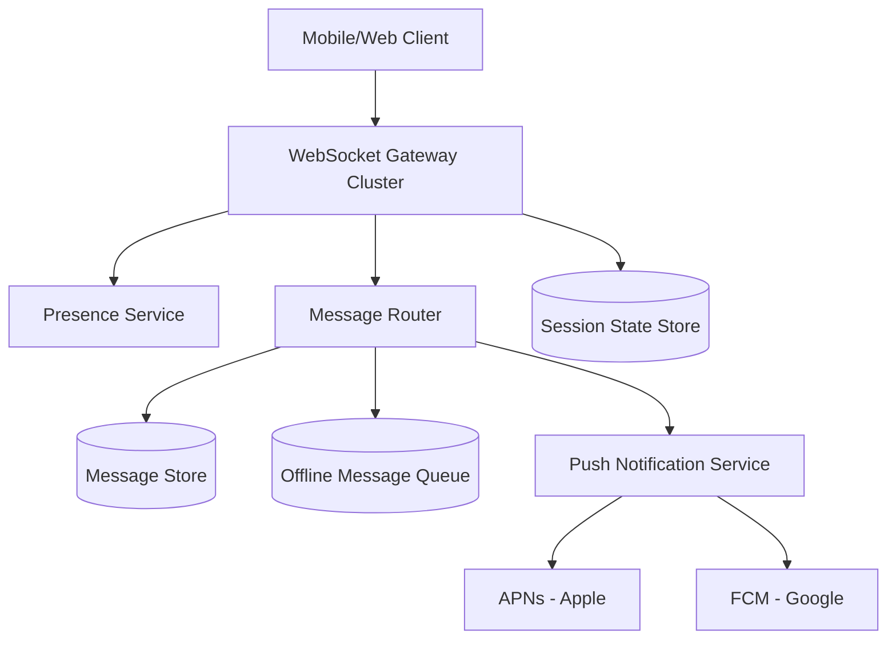
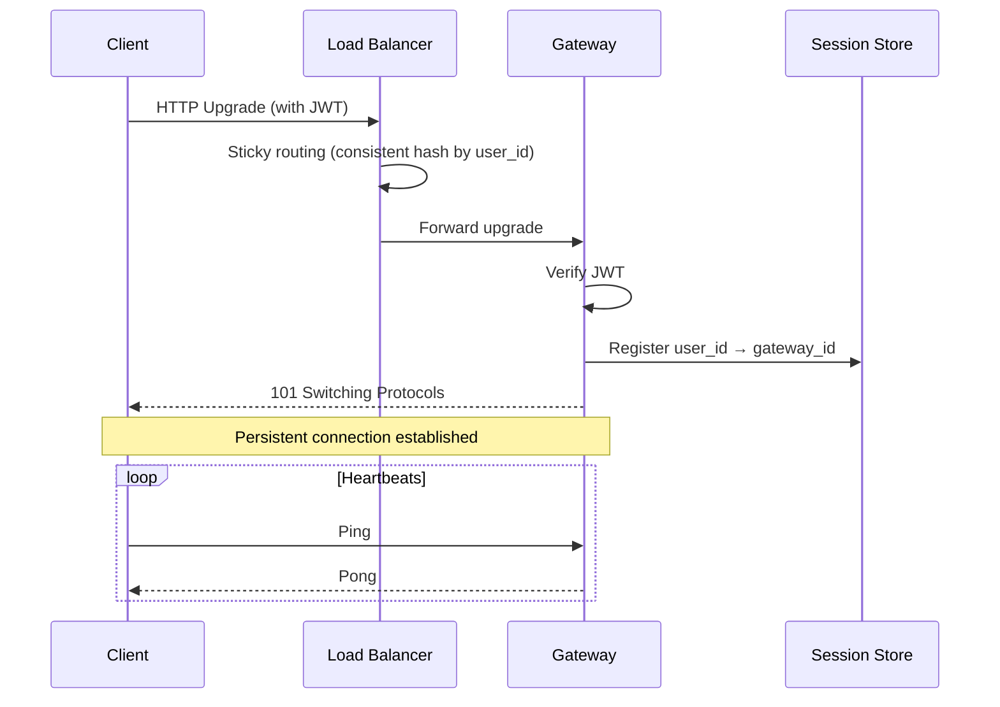
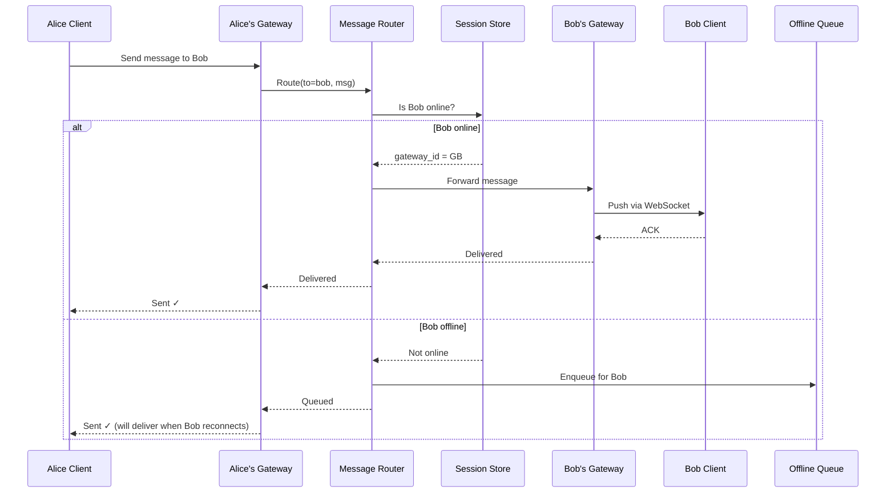
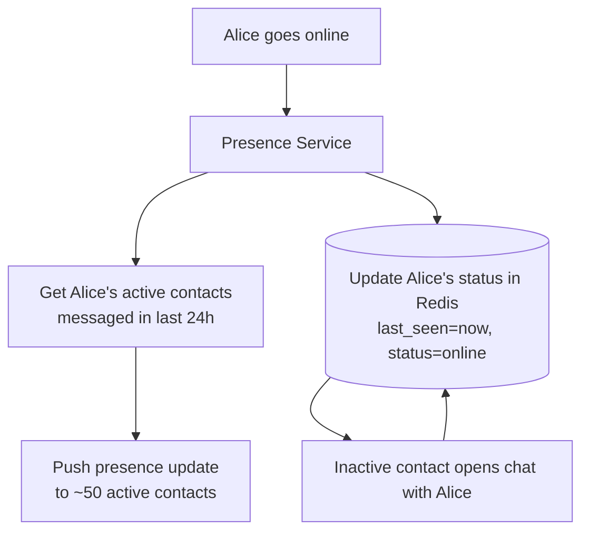
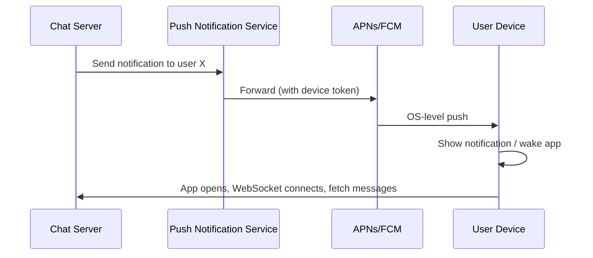
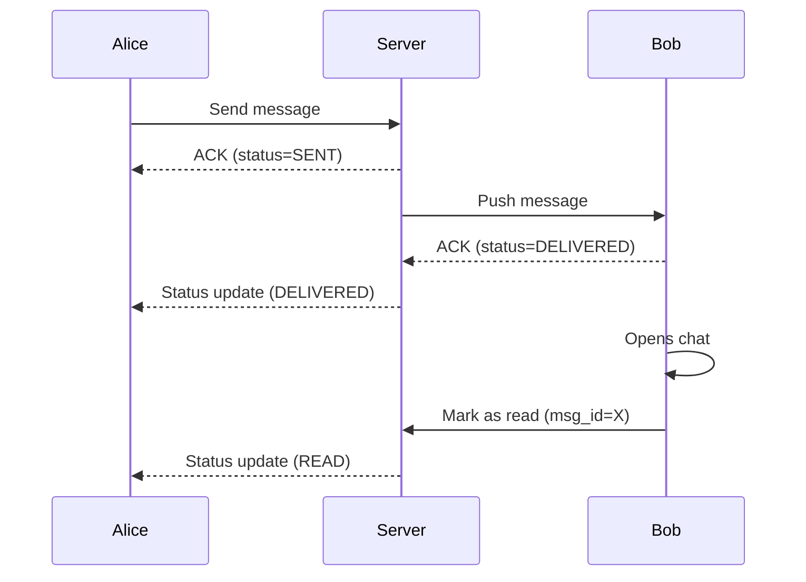
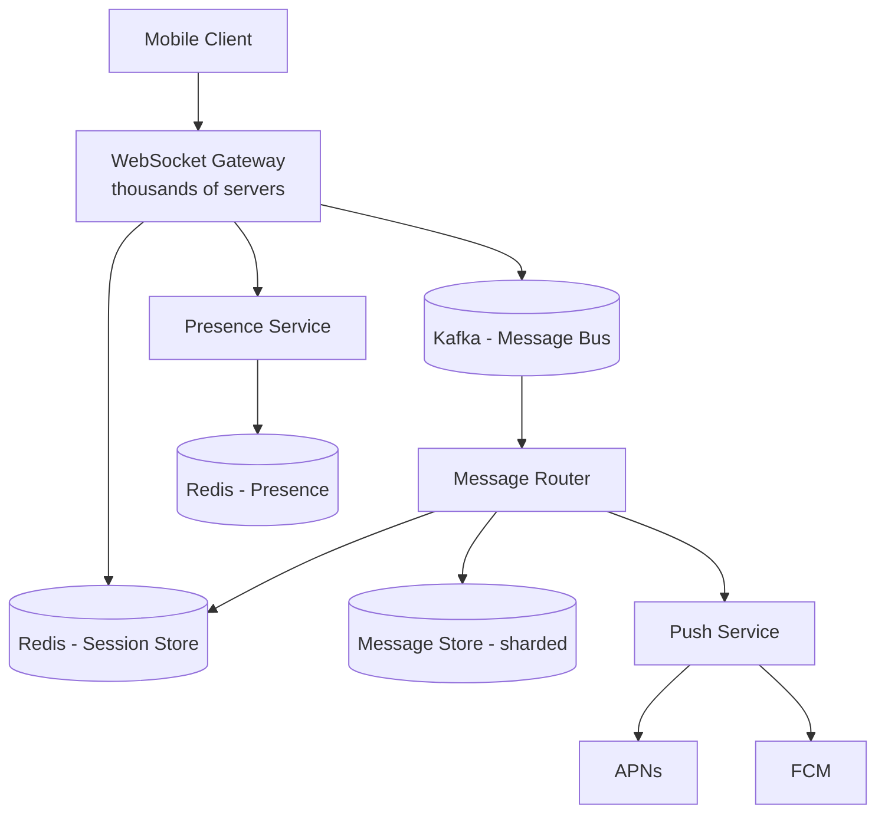

# Chapter 17. Case Study Real-Time Chat

> [!abstract] Chapter Goal
> WhatsApp, Discord, Slack, and Telegram all solve the same problem: **deliver messages between users in real time, at the scale of millions of concurrent connections per server and billions of conversations**. This chapter walks through the architecture: stateless WebSocket gateways, presence systems, message storage and delivery guarantees, offline message queuing, read receipts, and push notification integration with APNs and FCM.

## 1. The Chat Problem

### 1.1. Functional Requirements

- Users can send text/media messages to other users (1:1 and group chats).
- Messages should be delivered in **< 1 second** for online recipients.
- Offline recipients should receive messages when they reconnect.
- Users see presence (online/offline/last seen) for their contacts.
- Read receipts (single check = sent, double = delivered, blue = read).
- Message history is retained and searchable.
- Group chats support up to N members (WhatsApp: 1024; Slack: tens of thousands in a channel).

### 1.2. Non-Functional Requirements

- **Persistent connections**: each online user holds a long-lived WebSocket.
- **Massive concurrency**: 1 billion users, 30 % online at peak = 300M concurrent connections.
- **Low latency**: < 1 second end-to-end delivery.
- **Eventual consistency** for presence (it's OK if "last seen" lags by seconds).
- **Durability**: messages must not be lost, even if the server crashes mid-delivery.

### 1.3. Key Challenges

1. **Connection management**: holding 300M TCP sockets requires careful kernel tuning, memory, and load balancing.
2. **Message routing**: when Alice sends to Bob, the system must find which gateway holds Bob's connection and route the message there.
3. **Presence fan-out**: when Alice goes online, all her contacts should see her status update — but the contact list can be hundreds of people.
4. **Delivery guarantees**: messages must be delivered exactly once, even with retries and reconnections.
5. **Offline message storage**: if Bob is offline, messages queue until he reconnects.

## 2. High-Level Architecture



Components:
- **WebSocket Gateway Cluster**: holds the persistent connections. Stateless (the state is in the session store).
- **Session State Store**: maps user_id → gateway_id (which gateway holds this user's connection).
- **Presence Service**: tracks who's online; notifies contacts of status changes.
- **Message Router**: receives messages, looks up the recipient's gateway, forwards.
- **Message Store**: persistent storage for message history.
- **Offline Message Queue**: holds messages for offline recipients.
- **Push Notification Service**: sends APNs/FCM notifications for offline users.

## 3. WebSocket Gateway Cluster

### 3.1. The Role

The gateway is the **edge server** that holds the TCP connection to each client. Its jobs:
- Accept and upgrade HTTP to WebSocket.
- Authenticate the user (JWT or session token).
- Maintain the connection (heartbeats, ping/pong).
- Receive messages from the client and forward to the router.
- Receive messages from the router and push to the client.
- Detect disconnections and clean up state.



### 3.2. Connection Capacity

A single gateway server can hold **50,000–500,000 concurrent connections**, limited by:
- **Memory**: each connection's buffer + state ≈ 30 KB. 1M connections = 30 GB.
- **File descriptors**: each socket is a file descriptor. Default Linux limit is 1024; must raise to 1M+ via `ulimit -n` and `fs.file-max`.
- **CPU**: heartbeats and message processing. Each connection sends a ping every 30 seconds; 1M connections = 33k pings/sec, manageable.
- **Ephemeral ports**: not a concern for the server side (it uses one listen socket), but a concern for outbound connections.

With 300M concurrent users, you need 600–6000 gateway servers. Real-world WhatsApp uses thousands of servers.

### 3.3. Stateless Gateways

The gateway itself is **stateless** — it doesn't remember which users are connected to which gateways. Instead, every gateway registers its connected users in the **Session Store** (Redis):

```
Key: session:user:{user_id}
Value: {gateway_id: "gateway-42", connected_at: 1234567890, device_id: "iphone-abc"}
TTL: 60 seconds (refreshed by heartbeats)
```

When a user disconnects, the gateway deletes the key. When a user reconnects to a different gateway (e.g., after a network drop), the new gateway overwrites the key.

### 3.4. Heartbeats and Dead Connection Detection

Mobile networks are unreliable. A phone might lose signal without sending a TCP FIN, leaving the server thinking the connection is alive. Defenses:

- **Application-level heartbeats**: the client sends a ping every 30 seconds. The server responds with a pong. If the server doesn't receive a ping for 90 seconds, it considers the connection dead.
- **TCP keepalive**: a kernel-level mechanism, less effective because the default interval is 2 hours (must be tuned down to minutes).
- **Bidirectional ping**: both sides ping each other, in case the connection is half-open (one direction broken).

### 3.5. Load Balancing WebSockets

WebSockets are long-lived, which complicates load balancing:
- **Round-robin** works but doesn't account for connection count per gateway.
- **Least connections** is better — sends new connections to the gateway with the fewest active connections.
- **Sticky sessions** aren't needed if the gateway is truly stateless (the Session Store tracks the mapping).
- **DNS-based routing** can distribute clients geographically (Asian users → Asian gateways).

Cloud LBs that support WebSocket: AWS ALB, Google Cloud HTTPS LB, HAProxy, Nginx, Envoy.

### 3.6. Reconnection Logic

When a client disconnects (network drop, app backgrounded, server restart):
1. Client waits a short backoff (1–2 seconds).
2. Client reconnects to any gateway.
3. Gateway registers in the Session Store (overwriting the old entry).
4. Client requests any messages missed during the disconnection (using a "last message ID" cursor).

The server must buffer messages for disconnected users for at least a few minutes to handle brief disconnects gracefully.

## 4. Message Routing

### 4.1. The Routing Problem

When Alice sends a message to Bob:
1. Alice's gateway receives the message.
2. The router must determine: is Bob online? If so, which gateway holds his connection?
3. If Bob is online, forward the message to his gateway, which pushes it to Bob.
4. If Bob is offline, store the message in the offline queue.



### 4.2. The Session Store Lookup

The Session Store is the critical routing component. Requirements:
- **Sub-millisecond reads**: every message requires a lookup.
- **Eventual consistency on writes**: when a user connects, the write propagates within seconds.
- **TTL**: stale entries (disconnected users) must expire automatically.

Redis is the standard choice. The data model:
```
session:user:{user_id} → {gateway_id, device_id, connected_at}
```

For multi-device support (Bob has both phone and laptop online):
```
session:user:{user_id} → SET of {gateway_id, device_id} entries
```

### 4.3. Group Chat Routing

For a group chat with 100 members:
1. Alice sends a message to the group.
2. The router looks up the session of each of the 100 members.
3. For online members, forward to their gateways.
4. For offline members, enqueue.

This is 100 Session Store lookups per message. With 1000-member groups (Slack channels, Discord servers), it's 1000 lookups. Optimize with:
- **Bulk lookups**: `MGET` in Redis to fetch all 1000 sessions in one call.
- **Caching**: the router caches group membership and online status for a few seconds.
- **Fan-out workers**: the router publishes to a Kafka topic; workers consume and route to each member.

### 4.4. The "Online but Not Really" Problem

Mobile apps background frequently (user switches apps, screen locks). The WebSocket stays open from the server's perspective, but the phone isn't actually receiving messages. When the app foregrounds, it might be 10 minutes behind.

Solutions:
- **App lifecycle events**: the client sends "going to background" / "coming to foreground" messages. The server treats backgrounded clients as "soft offline" — messages are queued but not pushed.
- **Push notifications**: when a message is queued for a soft-offline user, send a push notification via APNs/FCM. The user opens the app, the connection becomes active, messages are delivered.
- **Aggressive timeouts**: if a client doesn't ping for 30 seconds (instead of 90), assume it's backgrounded.

## 5. Message Storage and Delivery Guarantees

### 5.1. At-Least-Once Delivery

Most chat systems provide **at-least-once** delivery: every message is delivered at least once, but duplicates are possible. Clients must deduplicate using message IDs.

```python
def on_message_received(msg):
    if msg.id in seen_message_ids:
        return  # duplicate, ignore
    seen_message_ids.add(msg.id)
    display(msg)
    send_ack(msg.id)
```

### 5.2. Exactly-Once Delivery (Harder)

True exactly-once delivery across network failures is impossible without complex protocols. In practice, "exactly-once" systems use:
- **Idempotency keys**: each message has a unique ID; the receiver deduplicates.
- **Transactional outbox**: the sender writes the message to a database and a "to-be-sent" queue in the same transaction. A worker sends from the queue, retrying until ACK.

This is "exactly-once effect" — the user sees the message once, even if it was transmitted multiple times.

### 5.3. Message Ordering

Messages within a single conversation must be delivered in order. This is challenging when:
- Messages take different network paths.
- A retry sends a duplicate that arrives before the original.

Solutions:
- **Sequence numbers per conversation**: each message has a monotonically increasing sequence number. The receiver buffers out-of-order messages and displays them in order.
- **Single-writer per conversation**: only one gateway handles writes to a conversation at a time. Other gateways forward through it. (Complex but ensures ordering.)

For group chats, sequence numbers are per-conversation, assigned by the message router:
```python
def route_message(conversation_id, msg):
    seq = redis.incr(f"seq:{conversation_id}")
    msg.seq = seq
    # ... route to all members
```

### 5.4. Message Storage Schema

```sql
CREATE TABLE messages (
    id UUID PRIMARY KEY,
    conversation_id UUID NOT NULL,
    sender_id UUID NOT NULL,
    seq INTEGER NOT NULL,
    body TEXT,
    media_url TEXT,
    created_at TIMESTAMP NOT NULL,
    deleted_at TIMESTAMP
);
CREATE INDEX ON messages (conversation_id, seq);
CREATE INDEX ON messages (sender_id, created_at);
```

For 1:1 chats, `conversation_id` is a deterministic hash of the two user IDs (so the same pair always maps to the same conversation). For group chats, it's a UUID assigned at creation.

### 5.5. Sharding Messages

A single database cannot hold billions of conversations' messages. Shard by `conversation_id`:
- Hash the conversation_id to a shard (0 to N-1).
- Each shard is a separate database instance.
- A routing layer knows which shard holds which conversation.

For very large group chats (Slack channels with 50,000 members), the conversation is hot — many simultaneous writes. Solutions:
- **Single-writer**: serialize writes through a single coordinator per conversation.
- **Partition by time**: messages from different hours go to different shards.

### 5.6. Message Retention

Different platforms have different retention:
- **WhatsApp**: forever (until user deletes).
- **Snapchat**: ephemeral (deleted after viewing).
- **Slack**: configurable per workspace.
- **Telegram secret chats**: end-to-end encrypted, not stored server-side.

For "forever" retention, storage grows unboundedly. Strategies:
- **Tiered storage**: recent messages in hot storage (PostgreSQL), old messages in cold storage (S3 with Parquet).
- **Compression**: old messages compressed in batches.
- **Per-user quotas**: limit how far back a free user can scroll.

## 6. Presence System

### 6.1. The Presence Problem

When Alice goes online, all her contacts should see her "online" status. When she goes offline, they should see "last seen at X". This requires:
1. Detecting Alice's status changes.
2. Notifying all her contacts.

### 6.2. Push vs Pull Presence

**Push model**: when Alice's status changes, the server pushes the update to all her contacts.
- Pros: contacts see updates immediately.
- Cons: if Alice has 1000 contacts and toggles status 10 times per day, that's 10,000 push messages per day for Alice alone. At scale, this is enormous fan-out.

**Pull model**: contacts query Alice's status when they open the chat with her.
- Pros: minimal traffic.
- Cons: contacts see stale status until they query.

**Hybrid**: push to "active" contacts (those who recently messaged Alice), pull for others.



### 6.3. Presence Storage

```
Key: presence:{user_id}
Value: {status: "online", last_seen: 1234567890, device: "iphone"}
TTL: 90 seconds (refreshed by heartbeats; expires if client goes offline)
```

When the TTL expires (no heartbeat for 90s), the key disappears. The presence service polls for expirations (or uses Redis keyspace notifications) to trigger "user went offline" events.

### 6.4. Last Seen for Offline Users

For offline users, store the last-seen timestamp persistently:
```
Key: last_seen:{user_id}
Value: timestamp
```

This doesn't expire; it's overwritten each time the user disconnects. Contacts querying an offline user's status get this timestamp.

### 6.5. Privacy Controls

Some users hide their last-seen (WhatsApp setting). The presence service checks the user's privacy preferences before returning last_seen to a contact:
```python
def get_presence(user_id, requester_id):
    user = get_user(user_id)
    if user.privacy.last_seen == "nobody":
        return {"status": "offline"}  # no last_seen
    if user.privacy.last_seen == "contacts" and requester_id not in user.contacts:
        return {"status": "offline"}
    return {"status": "offline", "last_seen": user.last_seen}
```

## 7. Push Notifications for Offline Users

### 7.1. The Trigger

When a message is routed to an offline user, the system must notify them. The two paths:

1. **Soft offline** (app backgrounded recently): send a push notification. The user opens the app, the WebSocket reconnects, the message is delivered.
2. **Hard offline** (app not running): send a push notification. The OS wakes the app, which connects and fetches the message.

### 7.2. APNs and FCM

- **APNs (Apple Push Notification Service)**: for iOS. Apple maintains a persistent connection to each device. Your server sends to APNs; APNs pushes to the device.
- **FCM (Firebase Cloud Messaging)**: for Android (and iOS as an alternative). Same model.
- **Web Push**: for browsers. Uses the Web Push API with VAPID keys.



### 7.3. Device Tokens

Each device has a unique token (issued by APNs/FCM at app install). The chat server stores:
```
device_tokens:{user_id} → SET of {device_token, platform, app_version}
```

When sending a push, the server looks up all the user's device tokens and sends to each.

Tokens can expire (user uninstalls the app, OS update). The server must handle "invalid token" responses and remove stale tokens.

### 7.4. Push Payload

The push payload can include:
- **Alert text**: "Alice: Hello!" (displayed in the notification).
- **Badge count**: unread message count.
- **Sound**: which sound to play.
- **Custom data**: conversation_id, message_id (so the app can deep-link).

For end-to-end encrypted chats (WhatsApp, Signal), the push payload contains only an envelope ("New message from Alice") — the actual content is encrypted and fetched when the app opens.

### 7.5. Push Notification Queue

Don't send pushes synchronously in the message-routing path. Queue them:
1. Message router enqueues a push task.
2. A push worker picks it up, calls APNs/FCM.
3. APNs/FCM might be slow or rate-limit; the worker retries with backoff.

This decouples message routing from push delivery. If APNs is down, messages still deliver to online users; pushes just queue up.

## 8. Read Receipts

### 8.1. The State Machine

```
SENT → DELIVERED → READ
```

- **SENT** (single check): the server has received the message from Alice.
- **DELIVERED** (double check): the message has been pushed to Bob's device.
- **READ** (blue check): Bob has opened the chat containing the message.

### 8.2. Implementation



The server maintains per-message status:
```sql
CREATE TABLE message_status (
    message_id UUID,
    user_id UUID,
    status TEXT,  -- delivered, read
    updated_at TIMESTAMP,
    PRIMARY KEY (message_id, user_id)
);
```

When Bob's device ACKs a message, status = DELIVERED. When Bob opens the chat, the app sends a "mark as read" request, status = READ. The server notifies Alice of each transition.

### 8.3. Group Chat Receipts

In a group chat, "delivered" means delivered to ALL members. "Read" means read by ALL. Many apps instead show "read by N of M" (WhatsApp) or per-member read receipts (Slack reactions).

## 9. End-to-End Encryption (Briefly)

WhatsApp, Signal, and iMessage use **end-to-end encryption (E2EE)**: messages are encrypted on Alice's device and only decrypted on Bob's device. The server cannot read the content.

### 9.1. The Signal Protocol

The standard E2EE protocol (used by WhatsApp, Signal):
- **Identity keys**: each user has a long-term keypair.
- **Session keys**: derived via X3DH (Extended Triple Diffie-Hellman) when Alice and Bob first communicate.
- **Forward secrecy**: each message uses a new key derived from the previous (ratchet). If a key is compromised, only one message is exposed.
- **Prekeys**: users upload batches of prekeys to the server so new conversations can start without both users being online.

The server stores encrypted messages but cannot decrypt them. Push notifications contain only metadata ("New message from Alice"), not content.

### 9.2. Implications for Architecture

- The server cannot do server-side search (it can't read messages).
- The server cannot do server-side ranking or spam filtering on content.
- Backup/restore is more complex (must encrypt the backup with a key the server doesn't know).
- New device support requires careful key management (the new device gets new keys; old messages may not be accessible).

## 10. Worked Example: Designing WhatsApp

### 10.1. Scale

- 2 billion users.
- 100 billion messages per day.
- 1 million+ concurrent group chats.

### 10.2. Architecture



### 10.3. Capacity

- Concurrent connections: 600M (30 % of 2B).
- Gateways: 600M / 100k per gateway = 6000 gateway servers.
- Messages per second: 100B / 86400 ≈ 1.16M msgs/sec.
- Storage: 100B msgs/day × 200 bytes × 365 days × 5 years = 36.5 PB. With replication: 100+ PB.

### 10.4. Erlang

WhatsApp famously uses **Erlang** for its backend. Erlang's actor model (each connection is a lightweight process) makes it ideal for concurrent connection handling. Erlang processes are extremely lightweight (~300 bytes each), so a single server can hold millions of them.

Most modern chat systems use Go, Rust, or Java (Netty) instead, but Erlang remains a strong choice.

## 11. Tips, Tricks, and Common Pitfalls

> [!tip] Use Stateless Gateways
> Gateways should hold no state. The Session Store (Redis) is the source of truth. This lets you add/remove gateways freely and survive gateway failures.

> [!warning] Don't Forget to Tune Kernel Parameters
> Default Linux settings cannot hold 1M connections. Tune: `fs.file-max`, `net.core.somaxconn`, `net.ipv4.tcp_max_syn_backlog`, `net.ipv4.ip_local_port_range`, `ulimit -n`. Test with `wrk` or `tcpkali` before going to production.

> [!tip] Use Consistent Hashing for Gateway Routing
> When a user reconnects, route them to the same gateway if possible (consistent hash by user_id). This preserves any in-memory state and reduces Session Store churn.

> [!warning] Don't Synchronously Call APNs/FCM
> Push delivery is slow (100s of ms) and can fail. Always queue pushes asynchronously. Never block message routing on push.

> [!tip] Use Sequence Numbers per Conversation
> Don't rely on timestamps for ordering (clock skew). Use a monotonically increasing sequence number per conversation, assigned by the server.

> [!warning] Beware the "Hot Conversation" Problem
> A group chat with 10,000 active members gets thousands of messages per minute. All members' gateways must receive each message. Fan-out workers must scale; the conversation's shard may be hot. Consider dedicated infrastructure for very large groups.

> [!tip] Compress Messages on the Wire
> Use Protocol Buffers or MessagePack instead of JSON. Smaller payloads = less bandwidth = faster delivery. For media, use a CDN and send only the URL in the chat message.

> [!warning] Don't Lose Messages on Gateway Failure
> If a gateway dies with 100k connections, in-flight messages to those users must be re-routable. The router should retry to the new gateway once the user reconnects. Use the offline queue as a safety net.

> [!tip] Implement "Soft Offline" for Backgrounded Apps
> When a mobile app backgrounds, the connection might stay open but the app isn't receiving. Treat backgrounded apps as soft-offline: queue messages, send a push, deliver on foreground.

## 12. Chapter Summary

- Chat systems are connection-heavy: 1B users, 30 % online = 300M concurrent WebSockets.
- Architecture: stateless WebSocket gateways, Redis Session Store, message router, message store, offline queue, push service.
- Each gateway holds 50k–500k connections; need 600–6000 gateways for 300M concurrent users.
- Message routing: look up recipient's gateway in the Session Store, forward. If offline, enqueue.
- Delivery guarantees: at-least-once with client-side deduplication. "Exactly-once effect" via idempotency keys.
- Ordering: per-conversation sequence numbers assigned by the server.
- Presence: push to active contacts, pull for inactive. Store online/offline + last_seen in Redis with TTL.
- Push notifications: queue async, call APNs/FCM, handle device token expiry.
- Read receipts: SENT → DELIVERED → READ state machine, per-recipient.
- E2EE (Signal protocol): server cannot read messages; affects search, ranking, backup.
- WhatsApp uses Erlang for its actor model; modern alternatives use Go, Rust, or Netty.

The final chapter ([[Chapter 18. Case Study Video Processing at Scale]]) covers Netflix/YouTube-style systems: ingestion, parallel transcoding, adaptive bitrate streaming (HLS/DASH), and CDN delivery.
