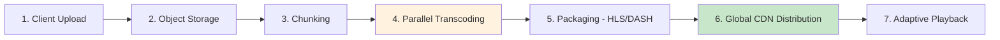
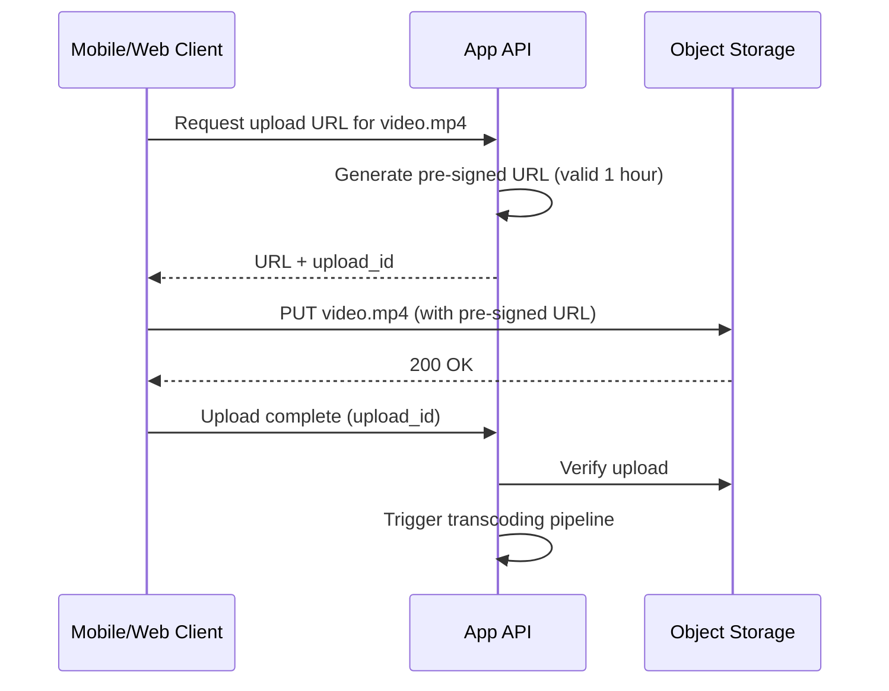
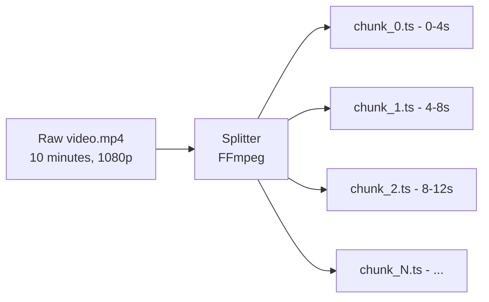
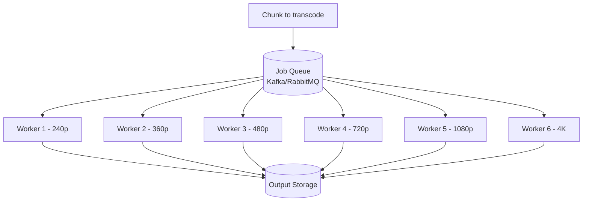
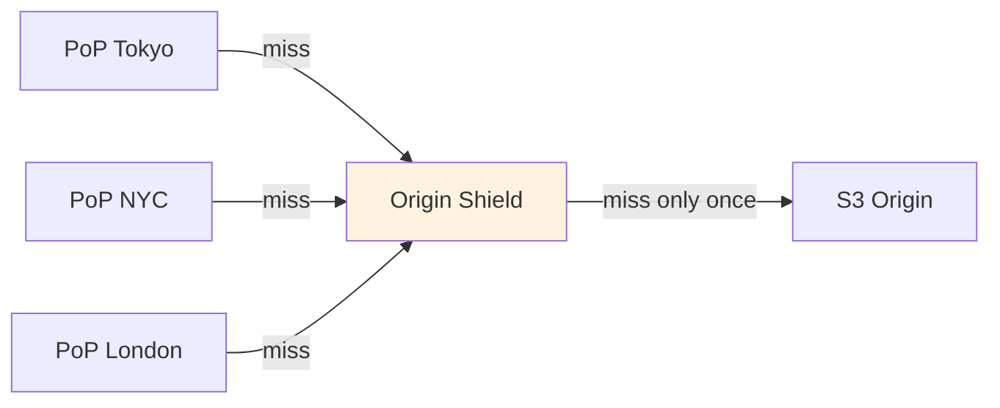
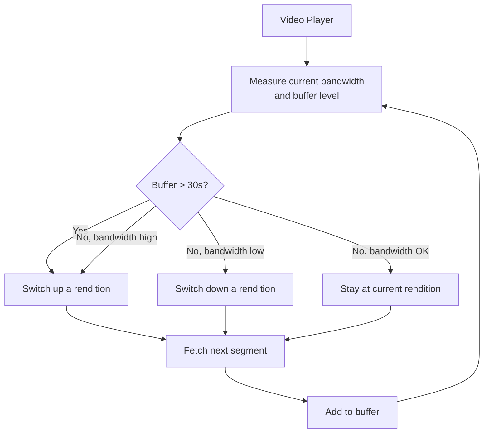
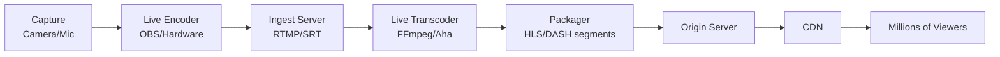
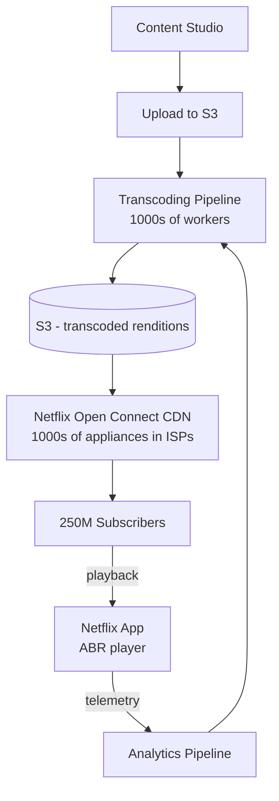

# Chapter 18. Case Study Video Processing at Scale

> [!abstract] Chapter Goal
> Netflix, YouTube, and TikTok all share an enormously complex pipeline: **ingest a raw upload, transcode it into multiple resolutions and bitrates, package it for adaptive streaming, distribute it globally via CDN, and play it smoothly on any device over any network**. Video is the most bandwidth-intensive content on the internet — Netflix alone accounts for ~25 % of global downstream traffic. This chapter walks through the entire pipeline, from upload to playback, with concrete numbers for capacity planning.

## 1. The Video Pipeline Overview



The seven stages:
1. **Upload**: the client uploads the raw video file.
2. **Storage**: the raw file is stored durably in object storage (S3, GCS).
3. **Chunking**: the video is split into small segments (2–10 seconds) for parallel processing and adaptive streaming.
4. **Transcoding**: each segment is encoded into multiple resolutions and bitrates.
5. **Packaging**: transcoded segments are organized into manifest files (HLS or DASH).
6. **CDN distribution**: segments are pushed/pulled to global CDN edge nodes.
7. **Playback**: the player downloads the manifest, then dynamically switches between bitrates based on network conditions.

We'll cover each in depth.

## 2. Stage 1: Upload

### 2.1. The Upload Problem

Video files are large (100 MB to 100 GB). Uploading them via your application server:
- Wastes app server bandwidth and CPU.
- Ties up a request for minutes to hours.
- Fails on flaky mobile networks.

### 2.2. Direct-to-Storage Upload (Pre-signed URLs)

The standard pattern: the client uploads directly to object storage (S3, GCS) using a **pre-signed URL** issued by the application server.



The pre-signed URL is a temporary, signed URL that grants the bearer write access to a specific S3 path for a limited time. The client uploads directly; your app server is bypassed.

### 2.3. Resumable Uploads

For large files on flaky networks, support **resumable uploads**:
- The client uploads in chunks (e.g., 5 MB each).
- Each chunk is a separate HTTP request.
- If a chunk fails, only that chunk is retried.
- The client can pause and resume.

S3 supports this via multipart upload. The client initiates a multipart upload, gets an upload ID, uploads parts, then completes the upload. If any part fails, retry just that part.

### 2.4. Upload Validation

Before accepting the upload:
- **File type validation**: check the magic bytes, not just the extension.
- **Virus scanning**: scan for malware (especially for user-generated content).
- **Duration check**: reject 0-second or absurdly long videos.
- **Resolution check**: reject videos below minimum quality.
- **Copyright fingerprinting**: compute a fingerprint (YouTube's Content ID) to detect copyrighted material.

## 3. Stage 2: Storage

### 3.1. The Raw File

The original uploaded file is stored in object storage (S3) with high durability (11 nines). This is the **master** — if anything goes wrong in transcoding, you can re-process from the master.

Storage cost (S3 Standard): $0.023/GB/month. For a 1 GB master retained for 5 years: $1.38. Trivial per video. With 1 billion videos: $1.38B. Not trivial.

### 3.2. Tiered Storage

After 30 days, move masters to cheaper storage:
- **S3 Standard** (first 30 days): $0.023/GB/month. Fast access.
- **S3 Infrequent Access** (30–90 days): $0.0125/GB/month. Slower access, cheaper.
- **S3 Glacier** (90 days – forever): $0.004/GB/month. Archived, retrieval takes minutes to hours.

Most videos are watched in the first 30 days; long-tail content can be archived.

### 3.3. Transcoded Output Storage

The transcoded segments (multiple resolutions) are also stored in S3, but as a **CDN origin**. The CDN pulls from this bucket on cache miss.

For a 1 GB master, transcoded output might be 3 GB (multiple resolutions). With 1 billion videos: 3 PB of transcoded output. Storage cost: ~$70k/month. Manageable.

## 4. Stage 3: Chunking

### 4.1. Why Chunk?

Two reasons to split the video into 2–10 second segments:

1. **Parallel transcoding**: each chunk can be transcoded by a different worker, drastically reducing end-to-end latency.
2. **Adaptive bitrate streaming**: the player switches between bitrates segment-by-segment. Each segment is a separate file.

### 4.2. The Chunking Process



The splitter (typically FFmpeg) reads the raw video and cuts it at **keyframes** (I-frames). Cutting at non-keyframe boundaries would corrupt the segments because P and B frames depend on a reference frame.

Chunk size is a trade-off:
- **Smaller chunks (2s)**: finer-grained bitrate switching; more parallelism. But more files, more manifest overhead.
- **Larger chunks (10s)**: less overhead; coarser switching. Longer end-to-end latency for transcoding.

Typical: 4–6 seconds per chunk.

## 5. Stage 4: Transcoding

### 5.1. What Transcoding Does

Transcoding converts the video into multiple **renditions** (resolution + bitrate combinations):

| Rendition | Resolution | Bitrate | Target Device |
|-----------|------------|---------|---------------|
| 240p | 426×240 | 400 Kbps | Slow mobile |
| 360p | 640×360 | 800 Kbps | Mobile 3G |
| 480p | 854×480 | 1.5 Mbps | Mobile 4G |
| 720p | 1280×720 | 3 Mbps | Tablet / slow WiFi |
| 1080p | 1920×1080 | 5 Mbps | TV / fast WiFi |
| 1440p | 2560×1440 | 9 Mbps | High-end monitor |
| 2160p (4K) | 3840×2160 | 16 Mbps | 4K TV / fiber |

The player picks the highest rendition the network can sustain, switching dynamically.

### 5.2. Codecs

- **H.264 (AVC)**: the most widely supported codec. Every device, every browser. The default for compatibility.
- **H.265 (HEVC)**: ~50 % smaller files than H.264 at the same quality. But: licensing issues, not supported on all browsers (Safari yes, Chrome no).
- **VP9**: Google's royalty-free codec. ~50 % smaller than H.264. Supported in Chrome, Firefox, Android. Not Safari.
- **AV1**: the newest royalty-free codec. ~30 % smaller than VP9. Slow to encode. Supported in modern browsers.

Production strategy: encode in multiple codecs (H.264 for compatibility, AV1 for efficiency) and let the player choose.

### 5.3. The Transcoding Pipeline



Each chunk is transcoded into N renditions. With 6 renditions and 150 chunks (for a 10-minute video at 4s each), that's 900 transcoding jobs. Distributed across 100 workers, each job takes ~10 seconds; total wall-clock time: ~90 seconds.

### 5.4. Transcoding Cost

CPU-bound. Encoding 1 minute of 1080p H.264 video takes roughly 1 CPU-minute on commodity hardware (depends on encoder settings).

For a 10-minute video at 6 renditions:
- 6 renditions × 10 minutes = 60 minutes of output video.
- Encoding time: ~60 CPU-minutes.

For 1 billion uploads per year averaging 5 minutes each:
- 6 renditions × 5 min × 1B = 30 billion CPU-minutes = 500 million CPU-hours.
- A 32-core server provides 768 CPU-hours/day = 280k CPU-hours/year.
- Need ~1800 servers just for transcoding.

This is why video platforms have enormous transcoding farms.

### 5.5. GPU Acceleration

GPUs dramatically speed up encoding:
- **NVENC** (NVIDIA): hardware H.264/H.265 encoder. ~5–10× faster than CPU.
- **Intel QuickSync**: integrated GPU encoding.
- **AMD VCE**: similar to NVENC.

With NVENC, a 10-minute video can be encoded in ~1 minute. But GPUs are expensive ($2k–$10k per card) and NVENC has a concurrent stream limit (typically 3–8 streams per card on consumer GPUs, unlimited on Quadro/datacenter cards).

For platform economics, a mix of CPU (for compatibility renditions) and GPU (for the most popular renditions) is often optimal.

### 5.6. Distributed Transcoding

A single machine cannot transcode a 2-hour 4K video in real time. Splitting the work across many machines is essential:

1. **Chunk the input** (Stage 3).
2. **Distribute chunks** to workers via a queue.
3. **Workers transcode** their assigned chunks in parallel.
4. **Stitch outputs** back together (or keep them as separate segments for HLS/DASH).

This is the classic MapReduce pattern applied to video. Netflix, YouTube, and TikTok all use variants of this.

## 6. Stage 5: Packaging (HLS and DASH)

### 6.1. Why a Manifest?

The player needs to know:
- What renditions are available.
- What URL each segment is at.
- How to switch between renditions.

This metadata is in a **manifest file**.

### 6.2. HLS (HTTP Live Streaming)

Apple's protocol. The manifest is a **M3U8 playlist** (a text file):

```m3u8
#EXTM3U
#EXT-X-STREAM-INF:BANDWIDTH=400000,RESOLUTION=426x240
240p.m3u8
#EXT-X-STREAM-INF:BANDWIDTH=800000,RESOLUTION=640x360
360p.m3u8
#EXT-X-STREAM-INF:BANDWIDTH=1500000,RESOLUTION=854x480
480p.m3u8
#EXT-X-STREAM-INF:BANDWIDTH=3000000,RESOLUTION=1280x720
720p.m3u8
#EXT-X-STREAM-INF:BANDWIDTH=5000000,RESOLUTION=1920x1080
1080p.m3u8
```

This is the **master manifest** — it lists all renditions. Each rendition has its own **media manifest** listing its segments:

```m3u8
#EXTM3U
#EXT-X-TARGETDURATION:4
#EXT-X-MEDIA-SEQUENCE:0
#EXTINF:4.000,
segment_0.ts
#EXTINF:4.000,
segment_1.ts
#EXTINF:4.000,
segment_2.ts
...
#EXT-X-ENDLIST
```

### 6.3. DASH (Dynamic Adaptive Streaming over HTTP)

The international alternative to HLS. Uses XML manifests (MPD files) instead of M3U8. Similar concept, slightly different format.

```xml
<MPD>
  <Period>
    <AdaptationSet mimeType="video/mp4">
      <Representation bandwidth="400000" width="426" height="240">
        <SegmentTemplate media="240p/segment_$Number$.m4s" />
      </Representation>
      <Representation bandwidth="800000" width="640" height="360">
        <SegmentTemplate media="360p/segment_$Number$.m4s" />
      </Representation>
    </AdaptationSet>
  </Period>
</MPD>
```

### 6.4. HLS vs DASH

| Aspect | HLS | DASH |
|--------|-----|------|
| Creator | Apple | MPEG standard |
| Manifest format | M3U8 (text) | MPD (XML) |
| Segment format | .ts (MPEG-TS) or .m4s (fMP4) | .m4s (fMP4) |
| Browser support | Safari native; others via hls.js | Chrome, Firefox, Edge native |
| Mobile support | iOS native | Android native |
| Ad insertion | HLS Interstitials | DASH Client-Side Ad Insertion |
| Latency (VOD) | Same | Same |
| Latency (live) | 10–30s (Low-Latency HLS: 2–8s) | 2–10s (LL-DASH: <1s) |

Production strategy: package in **both** HLS and DASH. The player picks based on the device.

### 6.5. Content Protection (DRM)

Both HLS and DASH support DRM:
- **Widevine** (Google): Android, Chrome.
- **FairPlay** (Apple): iOS, Safari.
- **PlayReady** (Microsoft): Edge, Windows.

The manifest references encrypted segments; the player fetches a decryption key from a license server. Multiple DRMs can be packaged simultaneously (Multi-DRM).

## 7. Stage 6: CDN Distribution

### 7.1. Why a CDN for Video

A single origin server cannot serve 1 million concurrent viewers of a popular video. The bandwidth would be:
- 5 Mbps × 1M = 5 Tbps.

No single data center has 5 Tbps of upstream. The CDN distributes this across hundreds of edge PoPs, each serving local viewers.

### 7.2. Push vs Pull CDN for Video

For video on demand (VOD):
- **Pull CDN**: edge nodes fetch segments from the origin on first request. Cache for a long TTL (segments are immutable).
- **Push CDN**: pre-populate edge nodes with new releases (Netflix does this for new originals).

For live streaming:
- **Pull CDN** with very short TTL.
- The edge pulls segments as they're produced.

### 7.3. Origin Shielding

With 300 PoPs all caching the same popular video, the first cache miss from each PoP would generate 300 origin requests. **Origin shielding** adds a second-tier cache between PoPs and the origin:



Only the first PoP's miss reaches the origin; subsequent PoPs get the shield's cached copy.

### 7.4. Cache Keys for Video

Each segment has a unique URL like `/video/abc-123/1080p/segment_42.ts`. This URL is the cache key. Because segments are immutable, they can be cached for years (`Cache-Control: max-age=31536000`).

The manifest is also cached but with a shorter TTL (1 hour) so updates (e.g., new renditions added later) propagate.

### 7.5. Multi-CDN for Video

Major video platforms use multiple CDNs:
- **Cost negotiation**: leverage between providers.
- **Reliability**: failover if one CDN has an outage.
- **Regional performance**: Cloudflare is fast in some regions, Akamai in others.

A smart DNS resolver (or client-side logic) picks the best CDN per request based on:
- Geographic proximity.
- Recent performance (measured by the client).
- Cost (prefer cheaper CDN when performance is similar).

## 8. Stage 7: Adaptive Playback

### 8.1. The Adaptive Bitrate (ABR) Algorithm

The player downloads the manifest, then fetches segments one at a time. The decision: **which rendition to fetch next?**



The algorithm balances two competing goals:
- **Quality**: use the highest bitrate the network can sustain.
- **Smoothness**: avoid rebuffering (running out of buffered video).

Common ABR algorithms:
- **Throughput-based**: estimate bandwidth from recent downloads, pick the highest sustainable rendition.
- **Buffer-based**: pick rendition based on buffer level (high buffer = upgrade, low buffer = downgrade).
- **Hybrid (e.g., BOLA)**: model-based control combining both.

### 8.2. Buffer Management

The player maintains a buffer of pre-fetched video. Typical targets:
- **Start buffer**: 5–10 seconds before playback starts (so the user doesn't see buffering).
- **Steady-state buffer**: 30–60 seconds.
- **Panic mode**: if buffer < 5 seconds, downgrade rendition aggressively.

### 8.3. Startup Time Optimization

The time from "user clicks play" to "video starts" is critical. Studies show users abandon after 2 seconds of waiting. Optimizations:
- **Start with a low rendition**: 240p or 360p starts fast; switch up after buffering.
- **Pre-fetch manifests**: when the user hovers over a video, pre-fetch the manifest.
- **Pre-fetch first segments**: pre-fetch the first segment of a low rendition.
- **Use HTTP/2 multiplexing**: download manifest and first segments in parallel.

### 8.4. Analytics

The player reports back:
- Each rendition change (when, why).
- Buffer events (when did the video stall?).
- Throughput measurements.
- Player errors.

This data feeds back into the encoding pipeline (which renditions are most watched?) and the CDN (which PoPs are slow?).

## 9. Live Streaming

Live streaming (Twitch, YouTube Live, Instagram Live) is harder than VOD:
- **Latency matters**: viewers want to be 2–10 seconds behind live, not minutes.
- **No time for batch transcoding**: segments must be transcoded immediately as they're captured.
- **Single source**: the live encoder is a SPOF; need redundancy.

### 9.1. The Live Pipeline



The encoder (on the streamer's device) sends the live feed via RTMP or SRT to an ingest server. The ingest server forwards to transcoders, which produce multiple renditions in real time. The packager outputs HLS/DASH segments continuously.

### 9.2. Low-Latency HLS (LL-HLS) and Low-Latency DASH (LL-DASH)

Standard HLS adds 10–30 seconds of latency (because each segment must be complete before being served, plus the player buffers several segments).

Low-latency variants:
- **LL-HLS**: uses partial segments (0.2–1 second) and a "blocking playlist reload" mechanism. Achieves 2–8 seconds.
- **LL-DASH**: uses chunked transfer encoding. Achieves 2–5 seconds.

For sub-second latency (gaming, auctions), use **WebRTC** — a different protocol entirely, designed for real-time communication.

### 9.3. Live vs VOD Capacity

Live transcoding is **more expensive per minute of video** because:
- No time for parallel chunk processing; each segment is transcoded in real time.
- Need redundant encoders (the live source cannot be re-encoded if missed).
- Lower hardware utilization (encoder must keep up, not exceed).

But live is cheaper per minute delivered because:
- Each stream has many concurrent viewers (CDN cache hit ratio is near 100 %).
- No storage cost (segments are ephemeral).

## 10. Worked Example: Designing Netflix

### 10.1. Scale

- 250 million subscribers.
- 1 billion hours watched per day.
- ~25 % of global downstream internet traffic.
- Catalog: 17,000+ titles, each with multiple episodes.

### 10.2. Architecture



### 10.3. Netflix's Unique CDN: Open Connect

Netflix doesn't use a commercial CDN. They built their own: **Open Connect**.
- Netflix places **OCAs (Open Connect Appliances)** inside ISP data centers.
- Each OCA is a server with massive storage (100+ TB) holding popular content.
- When a user watches, they stream from the nearby OCA — often within their own ISP's network.

This is cheaper than paying Akamai/Cloudflare for petabytes of traffic, and gives Netflix control over what's cached where.

### 10.4. Encoding Strategy

Netflix uses **per-title encoding**: instead of fixed bitrates per resolution, they analyze each title and choose optimal bitrates based on complexity.
- An action movie with fast motion needs more bits than a talk show.
- A static scene compresses well; a busy scene doesn't.

Result: ~20 % bandwidth savings with the same perceived quality.

### 10.5. Capacity

- 1 billion hours/day × 5 Mbps average = 2.25 PB/day of egress = 26 Gbps sustained.
- Peak (evening in each time zone) is much higher: hundreds of Gbps.
- 17,000 titles × 6 renditions × 2 hours average × 1 GB/hour = 200 TB of transcoded output. With replication: 1 PB.

## 11. Worked Example: Designing YouTube

### 11.1. Differences from Netflix

- **User-generated content** (UGC): anyone can upload. Quality varies wildly.
- **Long tail**: most videos have <100 views; a few have billions.
- **Recommendation-driven**: the For You algorithm decides what to play next.
- **Massive upload rate**: 500 hours uploaded per minute.

### 11.2. Upload Rate

500 hours/minute × 60 minutes/hour × 24 hours/day = 720,000 hours/day.

If transcoding takes 1 CPU-minute per minute of video (6 renditions):
- 720,000 hours × 6 = 4.32 million CPU-hours/day.
- 4.32 million / 24 = 180,000 CPU-cores continuously.
- With 32-core servers: ~5,600 servers just for transcoding.

YouTube uses a mix of CPU and GPU encoding, plus aggressive deduplication (many uploads are duplicates or near-duplicates that can be detected early).

### 11.3. Long-Tail Storage

Most YouTube videos are watched by few people. Storing all renditions for all videos is wasteful. Strategies:
- **Lazy transcoding**: only transcode the lowest rendition upfront. Higher renditions are transcoded on first request.
- **Just-in-time transcoding**: if a video suddenly goes viral, transcode higher renditions on demand.
- **Archive cold videos**: move rarely-watched videos to Glacier. Re-hydrate when they're watched.

### 11.4. Recommendation Integration

YouTube's player doesn't just play one video — it auto-plays the next. The recommendation system predicts what to play next based on:
- The current video.
- User watch history.
- Session context (time of day, device).

To minimize startup time for the next video, the player **pre-fetches** the first segments of the top 3 recommended videos. When the current video ends, the next is already buffered.

## 12. Tips, Tricks, and Common Pitfalls

> [!tip] Use Pre-signed URLs for Uploads
> Never proxy video uploads through your app server. Use S3 pre-signed URLs for direct upload. Your app server is not designed for multi-gigabyte file transfers.

> [{warning} Don't Transcode Synchronously
> Transcoding is slow. Make it asynchronous: upload triggers a job in a queue; workers process it. The user gets "processing, will be ready in X minutes" notifications.

> [{tip] Encode at Keyframe Boundaries
> Segments must start at keyframes (I-frames). Otherwise the decoder can't reconstruct the video. Use FFmpeg's `-g` flag to set the keyframe interval equal to the segment duration.

> [{warning} Don't Forget Audio
> Video gets most of the attention, but audio is also transcoded (multiple bitrates). Audio segments are packaged alongside video segments in the manifest.

> [{tip] Use Per-Title Encoding
> Fixed bitrates waste bandwidth on simple content and starve complex content. Analyze each video and choose optimal bitrates. Netflix's per-title encoding saves 20 %.

> [{warning} Don't Underestimate Storage Costs
> A viral video with 10 renditions can consume 10× the original file size in storage. Multiply by millions of videos. Tier storage aggressively.

> [{tip] Use Open-Source Tooling
> FFmpeg for transcoding. Bento4 for packaging. Shaka Packager from Google. VideoLAN (VLC) libraries. These are battle-tested and free.

> [{tip] Implement ABR Telemetry
> The player should report rendition changes, buffer events, and throughput. This data is essential for tuning the encoding ladder (which renditions to offer), CDN selection, and player ABR algorithms.

> [{warning] Don't Trust the Client for DRM
> DRM is fundamentally breakable — the user has the decrypted video in memory. But robust DRM (Widevine L1, FairPlay) uses hardware-backed keys, making piracy hard enough to deter most casual pirates.

> [{tip] Use Multi-CDN for Live Streaming
> Live streaming has no second chance — if the CDN fails, viewers see a black screen. Multi-CDN with active failover is essential.

## 13. Chapter Summary

- The video pipeline: upload → storage → chunking → transcoding → packaging → CDN → playback.
- Use pre-signed URLs for direct-to-S3 uploads. Support resumable uploads for large files.
- Chunk the video into 2–10 second segments for parallel transcoding and adaptive streaming.
- Transcode into multiple renditions (240p to 4K). Use H.264 for compatibility, AV1/VP9 for efficiency.
- Distribute transcoding across workers via a queue; GPU acceleration (NVENC) gives 5–10× speedup.
- Package as HLS (M3U8 manifest) and/or DASH (XML MPD). Multi-DRM for content protection.
- Distribute via CDN with origin shielding. Netflix's Open Connect places appliances inside ISPs.
- ABR player: dynamically switches renditions based on bandwidth and buffer. Start low, switch up.
- Live streaming: real-time transcoding, LL-HLS/LL-DASH for low latency, WebRTC for sub-second.
- Netflix: per-title encoding, Open Connect CDN, 250M subscribers, 1B hours/day.
- YouTube: 500 hours uploaded per minute, long-tail storage strategies, recommendation-driven autoplay.

---

**This concludes Chapter 18 and the System Design Vault.** The vault now contains 18 chapters covering the foundational networking, load balancing, caching, API protocols, resiliency, HA, distributed coordination, identity, multi-tenancy, data architectures, capacity planning, and four major case studies — all complementing (not duplicating) your existing cloud/Django/Spark/Consul notes.

Return to the [[README]] for the full chapter index.
