# Chapter 2. Networking Fundamentals

> [!abstract] Chapter Goal
> Every distributed system lives on top of the internet's networking stack. Before any of your application code runs, a request must travel through DNS resolution, TCP or UDP transport, HTTP framing, and (almost always) a reverse proxy. This chapter walks through each layer in detail, ending with the browser's same-origin security model that constrains how your API can be called from web clients. Skipping these fundamentals is the most common cause of "it works on my machine but breaks in production" failures.

## 1. The Client-Server Communication Model

### 1.1. The Request-Response Lifecycle

When a user types `https://api.example.com/users/42` into a browser or a mobile app issues that call, a long chain of events happens before your Django view function ever sees the request. Understanding each link in that chain lets you reason about latency budgets, security boundaries, and failure modes.

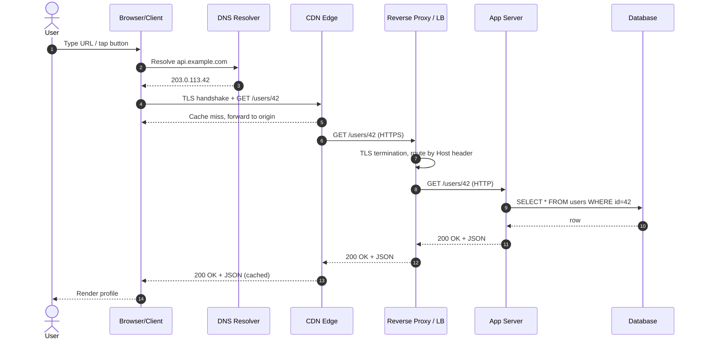

Each arrow is a place where the request can fail, be cached, be retried, be intercepted, or be delayed. A senior engineer designs for every hop, not just the application logic.

#### 1.1.1. Client Initiation Mechanics

- The **user-agent** (browser, mobile app, IoT firmware) constructs an HTTP request from a URL.
- It parses the URL into scheme (`https`), host (`api.example.com`), port (443 default for HTTPS), path (`/users/42`), and query string.
- If the host is a domain name (not an IP), the client first performs a **DNS lookup** to get an IP address.
- The client then opens a TCP connection (with TLS for HTTPS) to that IP and port.
- Finally, it serializes the HTTP request bytes onto the wire.

#### 1.1.2. Network Socket Establishment

A **socket** is the programming abstraction over a TCP or UDP connection. The sequence is:

1. The OS kernel creates a socket file descriptor (`socket()` syscall).
2. For TCP, the kernel initiates the 3-way handshake (`connect()`).
3. Once established, the application reads and writes bytes through the socket via `send()` and `recv()`.
4. When the application closes the socket, the kernel runs the 4-way teardown.

#### 1.1.3. Application-Layer Request Parsing

When the bytes arrive at the server:

1. The reverse proxy (Nginx, Envoy, HAProxy) reads the HTTP request line and headers.
2. It applies routing rules (path-based, host-based) to decide which backend to forward to.
3. It may modify headers (add `X-Forwarded-For`, strip `X-Internal-*`).
4. It opens a connection to the application server (or reuses one from a keep-alive pool) and forwards the request.
5. The application server (uWSGI, Gunicorn, uvicorn) parses the request again, dispatches to the right view, runs middleware, executes the view function, serializes the response, and returns.

### 1.2. Network Socket Primitives

#### 1.2.1. Standard Sockets vs. Raw Sockets

- **Standard sockets** (TCP/UDP) are exposed by every operating system and are sufficient for 99 % of applications.
- **Raw sockets** (`SOCK_RAW`) bypass the transport layer and let the application craft custom IP packets. Used by tools like `ping`, `tcpdump`, and packet crafting utilities. Most cloud environments block raw sockets for security.

#### 1.2.2. IP Address and Port Bindings

A TCP connection is uniquely identified by a 4-tuple:

```
{source IP, source port, destination IP, destination port}
```

This 4-tuple is why a single server can hold ~65,000 concurrent connections to the same remote port (e.g. all going to a single PostgreSQL instance on port 5432) — each connection uses a different *source* port.

> [!tip] Ephemeral Port Exhaustion
> If a client opens too many outbound connections to the same destination IP:port, it runs out of source ports. This is **ephemeral port exhaustion**. The fix is to keep connections alive (HTTP keep-alive, connection pooling) rather than opening new ones for every request.

#### 1.2.3. Socket State Transitions

TCP sockets move through a state machine:

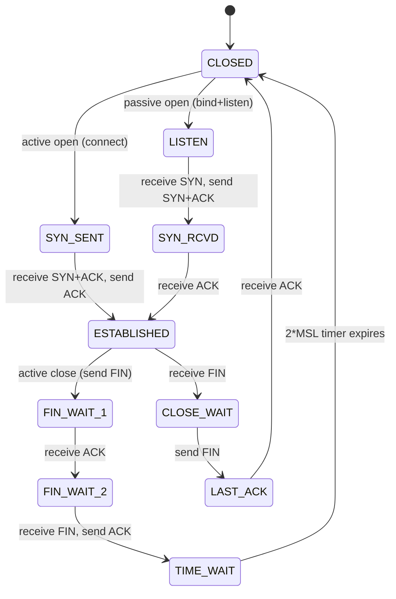

The `TIME_WAIT` state is critical: it lasts 2×MSL (Maximum Segment Lifetime, typically 60–120 seconds total) to ensure delayed packets from the closed connection do not get misinterpreted as belonging to a *new* connection on the same 4-tuple. This is also why servers under heavy churn can accumulate thousands of `TIME_WAIT` sockets.

### 1.3. Web Clients and Heterogeneous Consumers

Modern APIs serve three very different client populations, each with different constraints:

| Client | Network Stack | Typical Latency Budget | Special Concerns |
|--------|---------------|------------------------|------------------|
| **SPA** (React, Vue) | Browser fetch API | < 300 ms p99 | CORS, cookies, prefetching |
| **SSR app** (Next.js, Nuxt) | Node.js HTTP | < 100 ms p99 to API | Server-to-server auth, no cookies |
| **Native mobile** (iOS/Android) | URLSession / OkHttp | < 1 s p99 on 4G | Flaky networks, offline mode, retries |
| **IoT** (ESP32, smart meters) | Custom TCP / CoAP | < 5 s p99 | Battery life, intermittent connectivity, small MTU |

> [!warning] Don't Assume a Fast Network
> A user on a Tokyo bullet train switches cell towers every 8 seconds. Their TCP connections drop constantly. Your API must be idempotent and your client must retry transparently. See [[Chapter 7. Resiliency and Fault Tolerance Patterns]] for the retry + idempotency patterns that make this work.

## 2. IP Addressing and Subnetting

### 2.1. IP Protocol Versions

#### 2.1.1. IPv4 — Address Space, CIDR, Subnet Masks

IPv4 uses 32-bit addresses written as four octets (`203.0.113.42`). This gives roughly **4.3 billion** unique addresses — exhausted in February 2011 at IANA's central pool. To cope, the internet moved to:

- **CIDR (Classless Inter-Domain Routing)** notation: `203.0.113.0/24` means the first 24 bits are the network prefix; the remaining 8 bits identify hosts in that subnet. A `/24` has 256 addresses (254 usable).
- **NAT (Network Address Translation)**: every home router translates many private IPs to one public IP.
- **IPv6 migration**: slowly happening, but still < 50 % of internet traffic in 2024.

Common CIDR block sizes:

| CIDR | Hosts (usable) | Use Case |
|------|----------------|----------|
| `/32` | 1 | Single host route (load balancer VIP) |
| `/28` | 14 | Small subnet, a few instances |
| `/24` | 254 | Standard office or VPC subnet |
| `/20` | 4,094 | Mid-size cloud subnet |
| `/16` | 65,534 | Large VPC |

#### 2.1.2. IPv6 — Structure, SLAAC, Migration

IPv6 uses 128-bit addresses written as eight groups of hex digits (`2001:db8::1`). The address space is `2^128 ≈ 3.4 × 10^38` — effectively infinite for any practical purpose.

- **SLAAC (StateLess Address AutoConfiguration)**: a host derives its own IPv6 address from the router's advertised prefix plus its MAC address (or a random token for privacy). No DHCP server required.
- **Migration strategies**:
  - **Dual-stack**: hosts run IPv4 and IPv6 simultaneously. Most public sites use this.
  - **Tunneling (6to4, Teredo)**: encapsulate IPv6 packets inside IPv4 to cross legacy networks.
  - **NAT64 / DNS64**: allow IPv6-only clients to reach IPv4-only servers by synthesizing IPv6 addresses and translating at the gateway.

### 2.2. Private vs. Public Address Spaces

#### 2.2.1. RFC 1918 Private Address Ranges

Three blocks are reserved for private use and are **never routed on the public internet**:

| Block | CIDR | Size |
|-------|------|------|
| 10.0.0.0 – 10.255.255.255 | `10.0.0.0/8` | 16.7 M addresses |
| 172.16.0.0 – 172.31.255.255 | `172.16.0.0/12` | 1.0 M addresses |
| 192.168.0.0 – 192.168.255.255 | `192.168.0.0/16` | 65,536 addresses |

Every laptop, home router, and EC2 instance uses these for internal interfaces. Cloud VPCs carve subnets out of these ranges.

#### 2.2.2. NAT and PAT Mechanics

- **NAT (1-to-1)**: one private IP maps to one public IP. Used for inbound traffic to a specific host.
- **PAT (Many-to-1, also called NAT overload)**: many private IPs share one public IP, distinguished by **source port**. This is what your home router does. The mapping table is the **NAT session table**.

> [!tip] Why Clouds Love NAT Gateways
> An AWS NAT Gateway lets thousands of private EC2 instances reach the internet through one Elastic IP. Without it, each instance would need its own public IP (expensive and limited). The downside: a NAT Gateway is a throughput bottleneck and costs $0.045/GB processed.

### 2.3. Subnet Planning and Network Partitioning

#### 2.3.1. VPC Subnet Design Rules

A Virtual Private Cloud (VPC) is your own logically isolated section of a cloud provider's network. Inside a VPC you create subnets, each of which:

- Lives in **one Availability Zone** (AZ).
- Has a CIDR block carved from the VPC's CIDR.
- Has a route table controlling where packets go.
- Has a Network ACL (stateless firewall) and Security Groups (stateful firewall).

Typical VPC design for production:

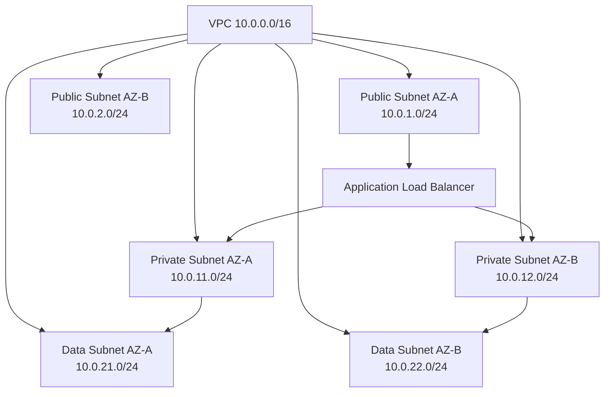

The three-tier model (public/private/data) lets you control blast radius: only the public subnet has internet-facing IPs; databases have no public route at all.

#### 2.3.2. Calculating Host Capacities

For a `/28` subnet:
- 16 total addresses.
- Subtract 2 (network address and broadcast address).
- Subtract 1 for the router.
- Subtract 5 reserved by AWS (VPC router, DNS, future use).
- **Usable: 11 addresses**.

> [!warning] Always Leave Headroom
> A common mistake is to size subnets exactly to current need. A `/28` filled with 11 EC2 instances cannot grow. Always use `/24` or larger for app subnets — IP space is free, redesign is not.

## 3. Domain Name System (DNS) Hierarchical Architecture

### 3.1. Why DNS Exists

Humans remember names (`api.example.com`); computers route packets to IPs (`203.0.113.42`). DNS is the distributed database that translates names to IPs. It is also the **first load balancer** every request hits: by returning different IPs to different clients, DNS can route users to the geographically closest data center, fail over from a dead region, or distribute load across providers.

### 3.2. DNS Server Hierarchy

DNS is a **delegated, hierarchical namespace**. Each level of the hierarchy is operated by different organizations.

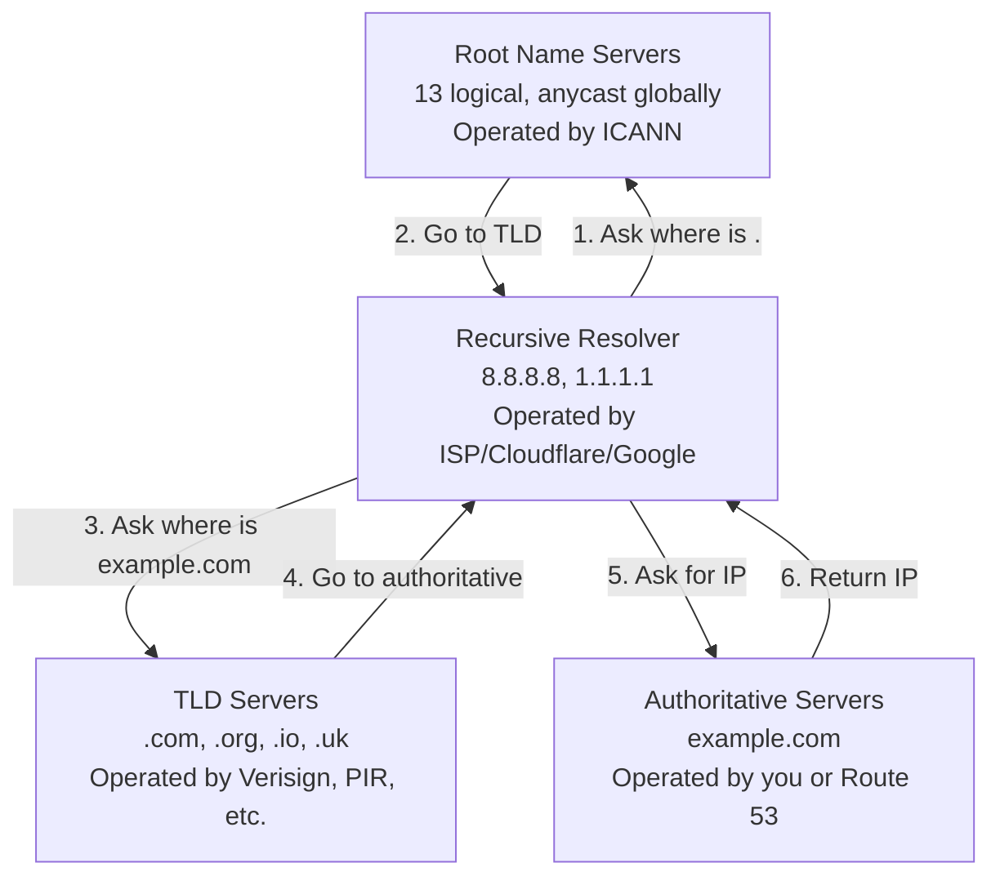

#### 3.2.1. Root Name Servers

There are **13 logical root server addresses** (a.root-servers.net through m.root-servers.net), but each is implemented by hundreds of physical machines using **anycast** — the same IP is advertised from many locations, and the network routes the client to the nearest one. They are operated by 12 different organizations including ICANN, Verisign, and NASA.

#### 3.2.2. Top-Level Domain (TLD) Servers

TLD servers handle the next level: `.com`, `.org`, `.net` (gTLDs — generic) or `.uk`, `.fr`, `.jp` (ccTLDs — country-code). They are operated by registries like Verisign (`.com`), PIR (`.org`), and country-specific authorities.

#### 3.2.3. Authoritative Name Servers

These hold the actual DNS records for your domain. When you register `example.com`, you tell the registrar which authoritative servers to delegate to (often your cloud provider's DNS service: AWS Route 53, Cloudflare, Google Cloud DNS).

- **Primary (master)**: holds the writable zone file.
- **Secondary (slave)**: pulls copies via **AXFR zone transfers** and serves read-only queries for redundancy.

#### 3.2.4. Recursive Resolvers

The resolver is the workhorse. When your laptop needs `api.example.com`:

1. It checks its local cache (browser cache → OS cache → `hosts` file).
2. If miss, it queries the configured recursive resolver (often the ISP's resolver, or `8.8.8.8` / `1.1.1.1`).
3. The resolver performs the full iterative lookup chain (root → TLD → authoritative) on your behalf and caches the result.

### 3.3. Detailed DNS Resolution Flow

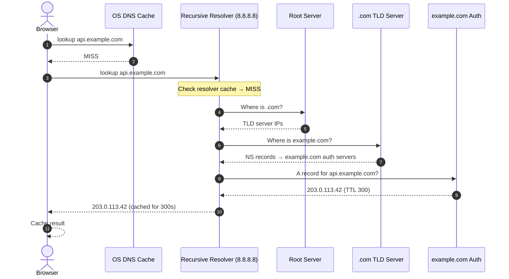

There are two query types in this chain:

- **Recursive query** (client → resolver): the resolver promises to return either the answer or an error. The client doesn't care how the resolver gets it.
- **Iterative query** (resolver → root/TLD/auth): each server either answers or points the resolver to the next server in the chain. The resolver does the legwork.

### 3.4. Essential DNS Record Types

| Record | Purpose | Example |
|--------|---------|---------|
| **A** | Hostname → IPv4 address | `api.example.com. A 203.0.113.42` |
| **AAAA** | Hostname → IPv6 address | `api.example.com. AAAA 2606:4700::6810:84e5` |
| **CNAME** | Alias from one name to another | `www.example.com. CNAME example.com.` |
| **MX** | Mail exchange (with priority) | `example.com. MX 10 mail1.example.com.` |
| **TXT** | Arbitrary text (SPF, DKIM, verification) | `example.com. TXT "v=spf1 include:_spf.google.com ~all"` |
| **NS** | Delegates a subdomain to other name servers | `sub.example.com. NS ns1.otherdns.com.` |
| **SRV** | Service locator (port + protocol + weight) | `_sip._tcp.example.com. SRV 10 60 5060 sip.example.com.` |
| **PTR** | Reverse lookup (IP → name) | `42.113.0.203.in-addr.arpa. PTR api.example.com.` |
| **SOA** | Start of Authority (zone metadata) | serial, refresh, retry, expire, minimum TTL |
| **CAA** | Which CAs are allowed to issue certs | `example.com. CAA 0 issue "letsencrypt.org"` |

> [!warning] CNAME Apex Restriction
> A CNAME cannot coexist with any other record at the same name. This is why you cannot put a CNAME at the **zone apex** (`example.com`) — the apex must have SOA and NS records. Cloud providers offer "ALIAS" or "ANAME" records as a workaround (Route 53 Alias, Cloudflare CNAME flattening).

### 3.5. TXT Records for Email Security

Modern email delivery requires three TXT-based records or your messages will be rejected by Gmail, Outlook, etc:

1. **SPF (Sender Policy Framework)**: lists which IPs are allowed to send mail from this domain.
   ```
   example.com.  TXT  "v=spf1 include:_spf.google.com include:mailgun.org ~all"
   ```
   `~all` = soft fail (mark as spam). `-all` = hard fail (reject).

2. **DKIM (DomainKeys Identified Mail)**: a public key stored as a TXT record; receivers verify the signature on incoming mail.
   ```
   selector1._domainkey.example.com.  TXT  "v=DKIM1; k=rsa; p=MIGfMA0GCSqGSIb3..."
   ```

3. **DMARC**: tells receivers what to do when SPF or DKIM fail.
   ```
   _dmarc.example.com.  TXT  "v=DMARC1; p=reject; rua=mailto:dmarc@example.com"
   ```

### 3.6. TTL (Time to Live) and DNS Caching

Every DNS record carries a TTL — the number of seconds a resolver may cache it before re-querying. TTL is the **dial you turn to trade off performance vs. agility**:

| TTL | Pros | Cons |
|-----|------|------|
| 60 s | Fast failover, fast migration | More queries to authoritative, slightly slower first-hit |
| 300 s (5 min) | Good default | Most migrations take 5+ minutes |
| 3600 s (1 hr) | Fewer queries, faster for users | Failover takes up to 1 hour to fully propagate |
| 86400 s (1 day) | Minimum load on auth servers | Migrations are painful |

> [!tip] Pre-Migration TTL Drop
> If you plan to migrate `api.example.com` to a new IP, **lower the TTL to 60 s at least 24 hours before** the migration. This ensures that by the time you flip the IP, all resolvers are already re-querying every 60 seconds. After migration, raise the TTL back to 3600 s.

#### 3.6.1. Negative Caching

When a resolver asks for `nonexistent.example.com` and gets back `NXDOMAIN`, it caches that negative answer too. The negative TTL is governed by the **SOA record's minimum field** (typically 300–3600 s). Negative caching matters: without it, every request to a typo domain would hit your authoritative servers.

> [!danger] Forgotten Negative Cache
> A classic ops mistake: someone misconfigures a DNS record, fix takes effect in 5 minutes, but users still see errors for an hour because resolvers cached the `NXDOMAIN` for an hour. Always check the SOA minimum TTL when debugging DNS issues.

## 4. Network Proxies

### 4.1. Forward Proxies

A forward proxy sits **in front of the client**. The client is explicitly configured (or transparently intercepted) to send all its traffic to the proxy, which then forwards it to the destination.

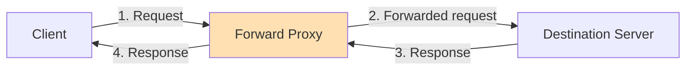

**Use cases**:
- **Egress filtering**: a corporate network allows HTTP only through a forward proxy that scans for data exfiltration.
- **Compliance auditing**: log every outbound request for legal/audit reasons.
- **Anonymity**: a VPN is essentially a forward proxy with encryption.
- **Regional bypass**: a user in country A uses a proxy in country B to access geo-restricted content.
- **Caching at client edge**: a school's forward proxy caches popular downloads to save bandwidth.

### 4.2. Reverse Proxies

A reverse proxy sits **in front of the servers**. Clients do not know about it; they think they are talking to the server directly. The reverse proxy receives the request, decides which backend to forward to, and returns the response.

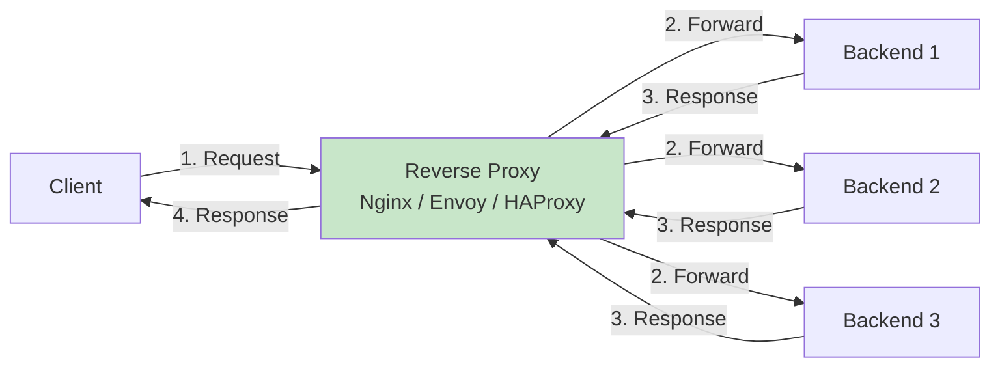

**Use cases**:
- **SSL/TLS termination**: decrypt HTTPS at the proxy, forward plain HTTP internally. Saves CPU on backends.
- **Load balancing**: distribute requests across many backend instances.
- **Server IP cloaking**: backends have no public IPs; only the proxy does. This is a strong security boundary.
- **Response caching**: cache the response to `GET /static/logo.png` and serve it from the proxy without touching backends.
- **Compression**: gzip or brotli-encode responses at the proxy.
- **Rate limiting**: enforce per-IP or per-tenant request limits at the edge.
- **Path-based routing**: `/api/v1/*` goes to the API service, `/admin/*` goes to the admin UI service.

Common reverse proxy engines:

| Engine | Strengths | Typical Use |
|--------|-----------|-------------|
| **Nginx** | Mature, very fast, easy config | Default for most web apps |
| **HAProxy** | Best-in-class L4/L7 LB, deep stats | High-throughput TCP/HTTP LB |
| **Envoy** | Modern, dynamic config via xDS, gRPC-native | Service mesh (Istio), microservices |
| **Traefik** | Auto-config from Docker/K8s labels | Containerized deployments |
| **Caddy** | Automatic HTTPS via Let's Encrypt | Hobby projects, simple deployments |

### 4.3. Forward vs. Reverse Proxy: Key Differences

| Aspect | Forward Proxy | Reverse Proxy |
|--------|---------------|---------------|
| Position | In front of client | In front of server |
| Who knows about it? | Client (explicit config) | Server (deployment detail); client is unaware |
| Purpose | Hide client, filter egress | Hide server, balance load, terminate TLS |
| Typical example | Corporate web filter, VPN | Nginx in front of Django, AWS ALB |

> [!tip] Mental Model
> A forward proxy **lies about who the client is** (server sees the proxy's IP). A reverse proxy **lies about who the server is** (client sees the proxy's IP). Both hide something from the other side.

### 4.4. Proxy vs. Broker

This distinction trips up many engineers. A **network proxy** forwards raw bytes (TCP/UDP packets or HTTP requests) **synchronously**. A **message broker** accepts application-level messages, **stores them durably**, and delivers them **asynchronously** to consumers.

| Aspect | Proxy | Broker |
|--------|-------|--------|
| Layer | L4 / L7 network | Application (message queue) |
| Storage | None (stateless forwarder) | Durable (writes to disk) |
| Delivery | Synchronous request/response | Asynchronous publish/consume |
| Failure model | If downstream is down, request fails | If consumer is down, message waits in queue |
| Examples | Nginx, Envoy, HAProxy | RabbitMQ, Kafka, SQS |

A proxy is for **synchronous fan-in / fan-out of bytes**. A broker is for **asynchronous decoupling of producers from consumers**. We cover brokers in depth in [[Chapter 7. Message Queues Pub-Sub and Event-Driven Architectures]].

## 5. Transport and Application Protocols

### 5.1. TCP (Transmission Control Protocol) Internals

TCP is **connection-oriented, reliable, ordered, byte-stream** protocol. It is the transport for HTTP, HTTPS, SSH, SMTP, database connections, and almost every "serious" internet protocol.

#### 5.1.1. The 3-Way Handshake

Before any application data flows, TCP establishes the connection:

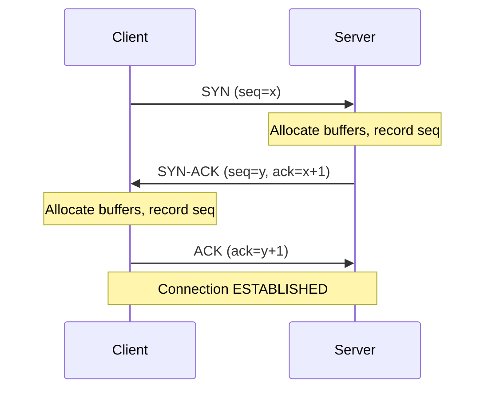

- `SYN` (synchronize): client picks a random initial sequence number `x`.
- `SYN-ACK`: server picks its own `y` and acknowledges `x+1`.
- `ACK`: client acknowledges `y+1`.

This exchange costs **1 round trip** before the first byte of application data can be sent. On a cross-continent link (150 ms RTT), that's 150 ms of latency added to every new connection. This is why **keep-alive** and **connection pooling** matter so much.

#### 5.1.2. The 4-Way Teardown

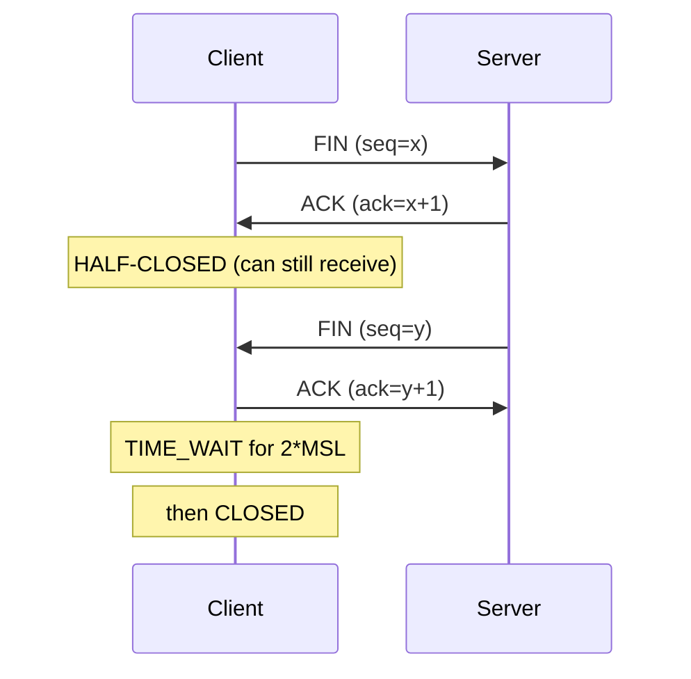

Either side can initiate close. After the final ACK, the closer enters `TIME_WAIT` for **2 × MSL** (typically 60–120 seconds) to absorb any stray packets from the dead connection. Servers with high connection churn can accumulate tens of thousands of `TIME_WAIT` sockets — usually harmless (they use a tiny amount of memory) but visually alarming in `netstat`.

#### 5.1.3. Sliding Window Protocol (Flow Control)

TCP uses a **sliding window** so the sender can transmit multiple packets before waiting for an ACK, dramatically improving throughput over high-latency links.

- The **receiver window (rwnd)** is advertised in every ACK: "I can buffer N more bytes."
- The sender never has more than `rwnd` bytes in flight.
- If the receiver's app is slow to read, the buffer fills, rwnd shrinks, and the sender slows down. This is **flow control** — preventing the sender from overwhelming the receiver.

#### 5.1.4. Congestion Control

Beyond flow control (protecting the receiver), TCP also runs a **congestion control** algorithm to protect the network:

1. **Slow start**: start with `cwnd = 10` packets. Double `cwnd` every RTT until you hit a threshold.
2. **Congestion avoidance**: above the threshold, grow `cwnd` linearly (add 1 MSS per RTT).
3. **Fast retransmit**: if 3 duplicate ACKs arrive, assume a packet was lost; retransmit without waiting for a timeout.
4. **Fast recovery**: after fast retransmit, halve `cwnd` and continue (don't go all the way back to slow start).

Modern variants include **CUBIC** (default on Linux), **BBR** (developed by Google, used at scale), and **Vegas**. BBR is notable because it models the network's actual bottleneck bandwidth and RTT instead of relying on packet loss as a congestion signal.

#### 5.1.5. Head-of-Line (HOL) Blocking at the Transport Layer

TCP guarantees **in-order delivery**. If packet #3 is lost, packets #4, #5, #6 sit in the receiver's buffer waiting for #3 to be retransmitted. The application cannot see them. This is **TCP Head-of-Line blocking** — a fundamental problem that HTTP/2 inherits (because it runs on TCP) and that HTTP/3 fixes by switching to UDP-based QUIC.

### 5.2. UDP (User Datagram Protocol) Internals

UDP is **connectionless, unreliable, unordered, datagram-oriented**. Its header is just 8 bytes (source port, destination port, length, checksum). It is the "fire and forget" protocol.

**Use cases**:
- **DNS queries** — small, single-packet, low latency matters more than reliability (you can retry).
- **VoIP, video calls** — a lost audio packet is better dropped than delayed; retransmitting it would just confuse the listener.
- **Live streaming** — same logic; a glitchy frame is fine, a 5-second pause is not.
- **Multiplayer gaming** — position updates sent every 50 ms; old updates are irrelevant if a newer one has arrived.
- **NTP (Network Time Protocol)** — single-packet time queries.
- **IoT telemetry** — small sensors sending periodic readings; reliability handled at the app layer if needed.
- **QUIC** — the foundation of HTTP/3 (see below).

> [!tip] When to Choose UDP
> Pick UDP when (a) each message is small and self-contained, (b) a lost message is acceptable, (c) latency matters more than completeness, or (d) you need to multicast to many receivers. Everything else should use TCP.

### 5.3. The Evolution of HTTP

#### 5.3.1. HTTP/1.1

The workhorse of the web since 1997. Key features:

- **Persistent connections (Keep-Alive)**: a single TCP connection can be reused for many requests, avoiding the 3-way handshake cost on every request.
- **Pipelining** (rarely used): send request 2 before response 1 arrives. But responses must still arrive **in order**, so a slow response 1 blocks response 2. This is **application-layer HOL blocking**.
- **Chunked transfer encoding**: server can stream a response of unknown length in chunks.
- **Headers are plain text**, repeated on every request (cookies, user-agent, accept-*).

In practice, browsers work around HTTP/1.1's limitations by opening **6 parallel connections per origin**. This is why CDNs serve assets from multiple hostnames (`cdn1.example.com`, `cdn2.example.com`) — to bypass the per-origin connection limit.

#### 5.3.2. HTTP/2

Published in 2015. Major changes:

- **Binary framing layer**: requests and responses are split into binary **frames** (HEADERS, DATA, RST_STREAM, etc.) instead of plain text. Harder to read in Wireshark, but much faster to parse.
- **Multiplexing**: many requests/responses share a **single TCP connection** as parallel **streams**. Each frame is tagged with a stream ID. No more 6-connection-per-origin hack.
- **HPACK header compression**: headers are compressed using Huffman coding plus a shared dynamic table. Repeated headers (cookies!) shrink to a few bytes.
- **Server push**: server can proactively send assets it knows the client will need (e.g., CSS along with the HTML). Largely abandoned because it's hard to use correctly and browsers can't know what to cache.

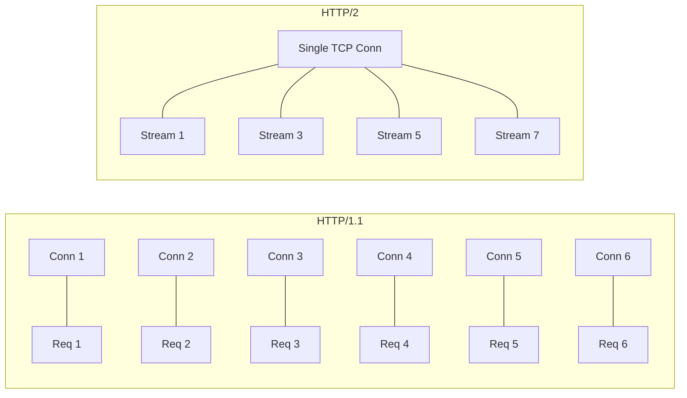

HTTP/2 still has one big problem: it runs on TCP, so a lost packet blocks **all streams** on that connection (TCP HOL blocking). This is what motivates HTTP/3.

#### 5.3.3. HTTP/3 and QUIC

Published in 2022. The big change: **HTTP/3 does not run on TCP**. It runs on **QUIC**, which is built on UDP.

QUIC implements, inside UDP, the reliability and congestion control of TCP — but per-stream, not per-connection. So if stream 5 loses a packet, only stream 5 stalls; streams 3 and 7 keep flowing.

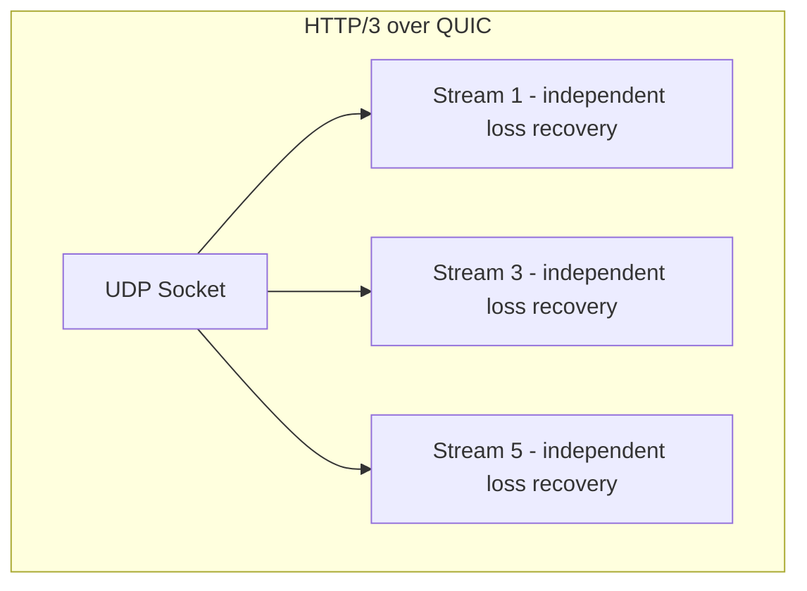

Additional QUIC innovations:

- **1-RTT connection setup**: QUIC combines the TCP handshake and TLS 1.3 handshake into a single round trip. With **0-RTT resumption**, returning clients can send data on the very first packet (saves a full RTT for repeat visitors).
- **Connection migration**: a QUIC connection is identified by a **Connection ID**, not by the 4-tuple. If your phone switches from Wi-Fi to cellular, the IP changes but the connection survives. With TCP, the connection would die.
- **Pluggable congestion control**: easier to deploy BBR and other algorithms.

> [!tip] Why HTTP/3 Adoption Is Still Patchy
> Many corporate firewalls and middleboxes only allow TCP 443 and block or throttle UDP. So QUIC (UDP/443) is sometimes slower on those networks than HTTP/2 over TCP. Most CDNs now offer both and fall back to HTTP/2 automatically.

## 6. Web Browser Security and Cross-Origin Primitives

### 6.1. The Same-Origin Policy (SOP)

The Same-Origin Policy is the **most important security mechanism in the browser**. Without it, any website you visit could read your bank statements from another tab.

**Definition**: an **origin** is the tuple `{scheme, host, port}`. Two URLs are **same-origin** iff all three components match.

| URL A | URL B | Same Origin? | Why |
|-------|-------|--------------|-----|
| `https://a.com/x` | `https://a.com/y` | ✅ | Same scheme, host, port (443 implicit) |
| `https://a.com/x` | `http://a.com/x` | ❌ | Different scheme |
| `https://a.com:443` | `https://a.com:8443` | ❌ | Different port |
| `https://a.com` | `https://b.com` | ❌ | Different host |
| `https://app.a.com` | `https://api.a.com` | ❌ | Different host (subdomain matters!) |

SOP enforces:
- **DOM access**: a script from `a.com` cannot read the DOM of an iframe loaded from `b.com`.
- **Cookie isolation**: cookies are scoped by domain (and can be tightened with `SameSite`).
- **AJAX responses**: a script from `a.com` can *send* a request to `b.com`, but it cannot *read* the response unless `b.com` explicitly allows it via CORS.

> [!warning] SOP Is About Reads, Not Writes
> You CAN send a POST request from `a.com` to `b.com` (this is how CSRF works). SOP only prevents the script from reading the response. CSRF tokens exist precisely because SOP doesn't block the request itself.

### 6.2. Cross-Origin Resource Sharing (CORS)

CORS is the **opt-in mechanism** that lets a server relax SOP for specific origins. It is a set of HTTP headers the server returns to tell the browser which origins are allowed to read its responses.

#### 6.2.1. The CORS Handshake

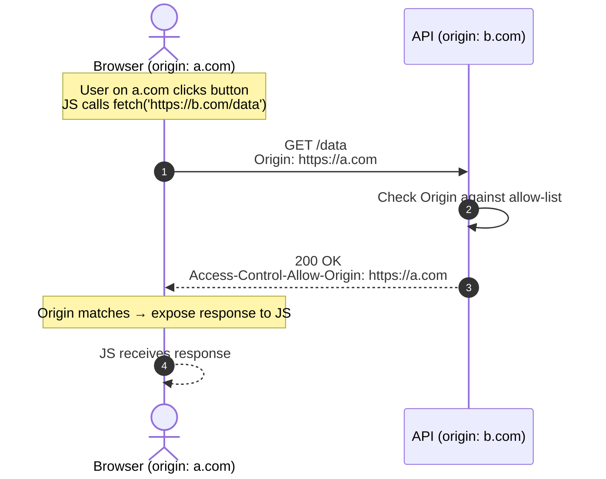

Key headers:

| Header | Direction | Purpose |
|--------|-----------|---------|
| `Origin` | Request | Sent by browser on cross-origin requests |
| `Access-Control-Allow-Origin` | Response | Which origin(s) may read the response |
| `Access-Control-Allow-Methods` | Response | Allowed HTTP methods |
| `Access-Control-Allow-Headers` | Response | Allowed request headers |
| `Access-Control-Allow-Credentials` | Response | `true` if cookies may be sent |
| `Access-Control-Max-Age` | Response | How long to cache the preflight response |
| `Access-Control-Expose-Headers` | Response | Which response headers JS may read |

### 6.3. Simple vs. Preflight (OPTIONS) Requests

The browser splits cross-origin requests into two categories:

#### 6.3.1. Simple Requests

A request is "simple" if **all** of these are true:
- Method is `GET`, `HEAD`, or `POST`.
- Only "CORS-safelisted" headers: `Accept`, `Accept-Language`, `Content-Language`, `Content-Type` (with restrictions).
- `Content-Type` (if any) is `application/x-www-form-urlencoded`, `multipart/form-data`, or `text/plain`.
- No `ReadableStream` object is used.

For simple requests, the browser fires the request directly, attaches the `Origin` header, and checks the response's `Access-Control-Allow-Origin`. If it matches, the JS gets the response. If not, the browser blocks it.

#### 6.3.2. Preflighted Requests

Anything that is NOT a simple request — `PUT`, `DELETE`, custom headers (`X-API-Key`), `application/json` body — triggers a **preflight**:

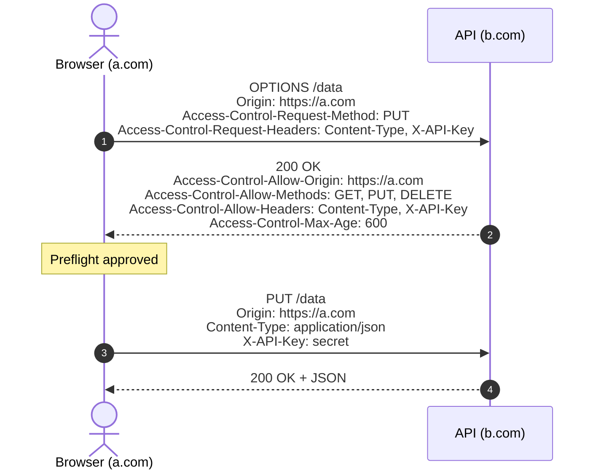

The preflight is a separate `OPTIONS` request that asks the server: "I want to send a PUT with these headers — is that OK?" The server responds with what it allows. Only if the actual request matches the allowed set does the browser send it.

#### 6.3.3. Optimizing Preflight Overhead

Every preflight adds an extra round trip. To reduce this:

1. **Set `Access-Control-Max-Age` to a high value** (e.g., 600 seconds, sometimes up to 86400). The browser caches the preflight result and skips the OPTIONS request until the cache expires.
2. **Avoid custom headers when possible**. Every `X-Foo` header forces a preflight. Use query params or standard headers instead when feasible.
3. **Stick to simple content types** for GET-only endpoints. `application/json` triggers preflight; `text/plain` does not (but you lose structured parsing).

### 6.4. Credentials and Cookie Sharing

By default, cross-origin `fetch()` does **not** send cookies. To include them:

```javascript
fetch('https://b.com/data', { credentials: 'include' })
```

The server must respond with:

```
Access-Control-Allow-Origin: https://a.com   (cannot be *!)
Access-Control-Allow-Credentials: true
```

> [!danger] Common CORS Mistake
> When `Access-Control-Allow-Credentials: true`, the `Access-Control-Allow-Origin` header **cannot be `*`**. It must echo the specific origin. Many servers try to use `*` and then wonder why authenticated CORS fails. The browser rejects it.

> [!tip] CSRF vs. CORS — Don't Confuse Them
> CORS is about **letting the browser read responses**. CSRF is about **preventing the browser from sending unwanted requests**. They are complementary, not substitutes. You need both: CORS to allow legitimate cross-origin API calls, and CSRF tokens (or `SameSite=Strict` cookies) to prevent forged requests.

### 6.5. Common CORS Pitfalls

1. **Caching preflight failures**: if a preflight returns 403, the browser may cache that for the `Max-Age` duration. Make sure to return 200 on `OPTIONS` even if you reject the actual request later.
2. **Forgetting `OPTIONS` in routing**: many frameworks route `OPTIONS` to your view function, which doesn't know what to do with it. Use Django CORS Headers middleware or similar to handle `OPTIONS` at the middleware level.
3. **Reverse proxy stripping CORS headers**: if Nginx adds CORS headers but you also add them in Django, you get duplicate headers and the browser rejects the response. Pick one place to add them.
4. **HTTPS → HTTP CORS**: mixed-content blocking kicks in. HTTPS pages cannot make requests to HTTP APIs at all (not even with CORS).

## 7. Tips, Tricks, and Common Pitfalls

> [!tip] Cache DNS Aggressively on the Client
> A typical web app makes 50+ DNS lookups on first load. Use `dns-prefetch` and `preconnect` resource hints to parallelize them:
> ```html
> <link rel="dns-prefetch" href="//cdn.example.com">
> <link rel="preconnect" href="//api.example.com" crossorigin>
> ```

> [!tip] Always Add `X-Forwarded-For` Awareness
> When your app sits behind a reverse proxy, `request.META['REMOTE_ADDR']` will be the proxy's IP, not the client's. Configure Django's `SECURE_PROXY_SSL_HEADER` and use `X-Forwarded-For` to read the real client IP. Otherwise your rate limiter will rate-limit the proxy.

> [!warning] Don't Trust the Origin Header Alone
> The `Origin` header is set by the browser and is generally trustworthy for CORS enforcement. But if you're using it for **security decisions** beyond CORS (e.g., "only allow logins from this origin"), validate it server-side against an allow-list. A non-browser client can set `Origin` to anything.

> [!tip] Use Connection Pooling Everywhere
> Database connections, HTTP clients (requests, httpx), and Redis clients all benefit from connection pooling. Opening a new TCP connection per request adds 50–150 ms on cloud networks and exhausts ephemeral ports. Always configure pool sizes that match your backend's capacity.

> [!tip] Drop to 1.1.1.1 or 8.8.8.8 When Debugging
> If a user reports "site doesn't load" and you suspect DNS, ask them to switch their DNS resolver to Cloudflare (`1.1.1.1`) or Google (`8.8.8.8`). If that fixes it, their ISP's resolver is the problem.

> [!warning] HTTP/2 Server Push Is Deprecated
> Chrome removed support for HTTP/2 server push in 2022. Don't rely on it. Use `<link rel="preload">` and `<link rel="prefetch">` instead.

## 8. Chapter Summary

- Every request flows through DNS → TCP/TLS → proxy → app → DB. Each hop can fail, cache, or add latency.
- IPv4 is exhausted; CIDR and NAT keep it alive; IPv6 is the future but migration is slow.
- DNS is hierarchical: root → TLD → authoritative. TTL controls the performance-vs-agility trade-off.
- Forward proxies hide clients; reverse proxies hide servers; brokers store messages asynchronously.
- TCP is reliable, ordered, and has HOL blocking; UDP is fire-and-forget; QUIC brings TCP-like reliability to UDP per-stream.
- HTTP/1.1 has 6-conn-per-origin; HTTP/2 multiplexes on one TCP conn (but still HOL-blocked); HTTP/3 fixes HOL by running on QUIC/UDP.
- Same-Origin Policy is the browser's bedrock; CORS is the opt-in escape hatch; preflight `OPTIONS` requests gate non-simple calls.

The next chapter ([[Chapter 3. Load Balancing and Traffic Routing]]) dives into how the reverse proxy layer distributes traffic, including the L4 vs L7 distinction and the algorithms that decide which backend handles each request.
