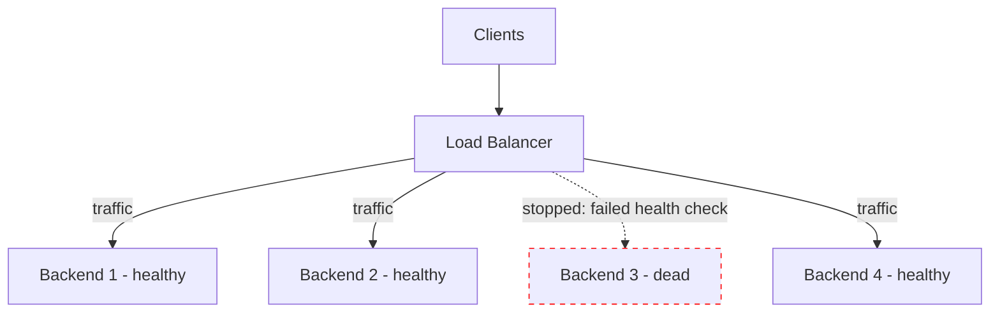
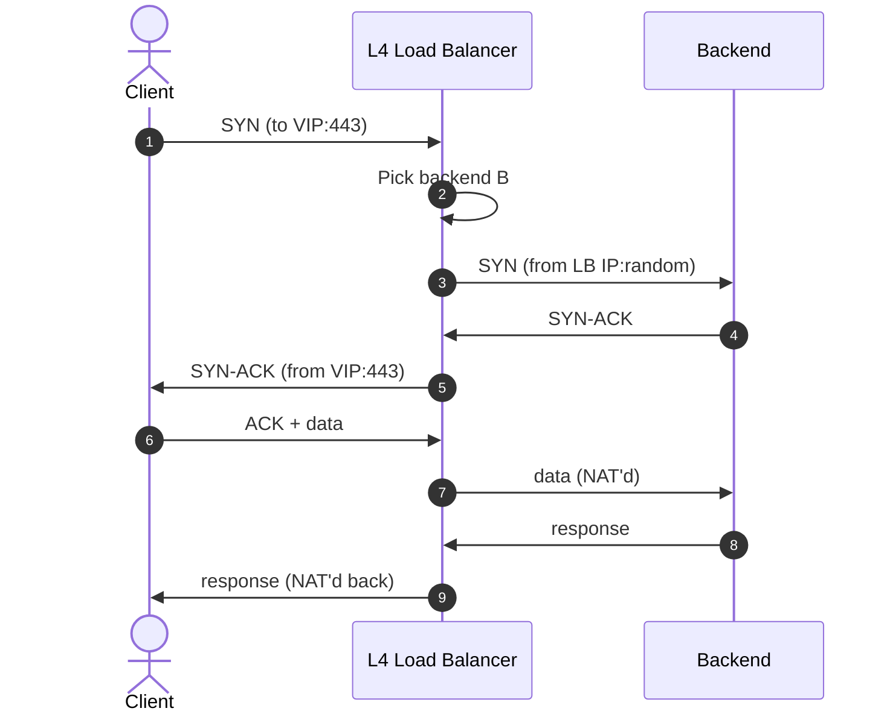
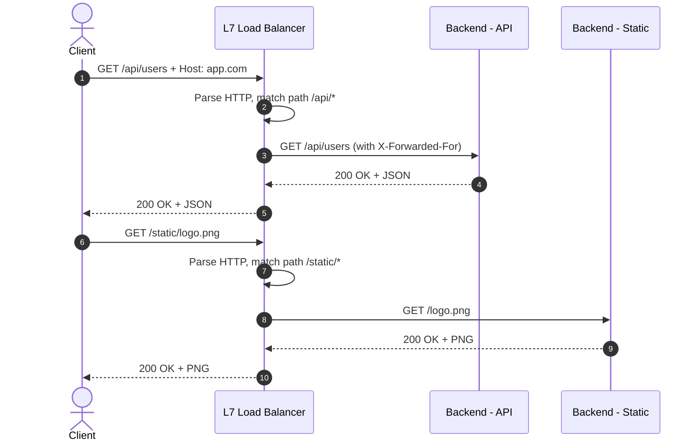
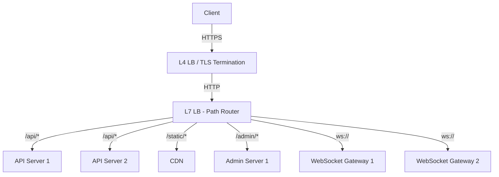
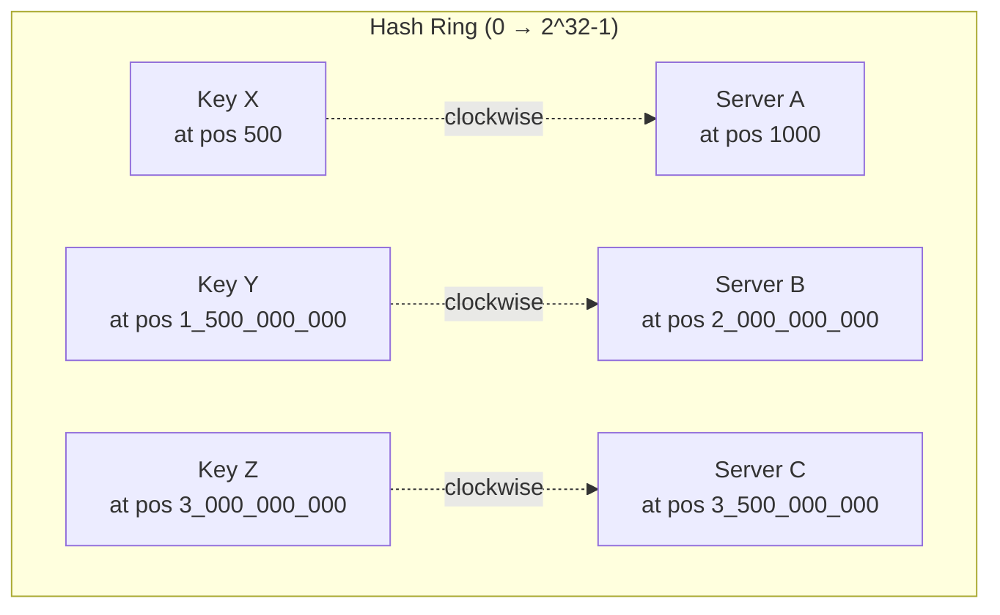
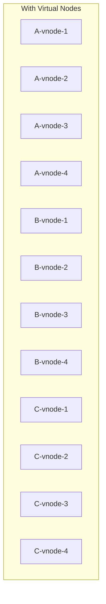
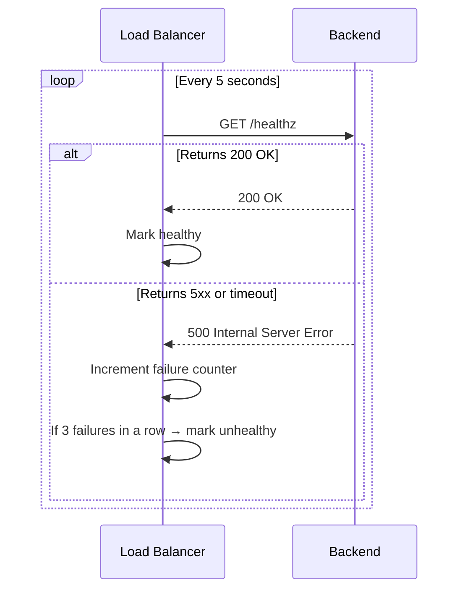
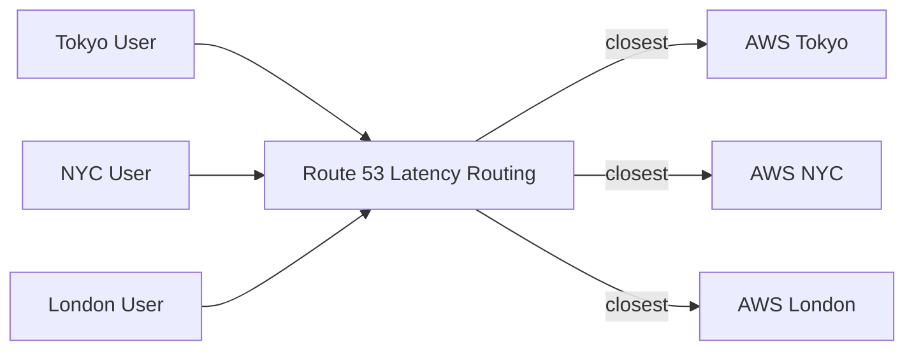
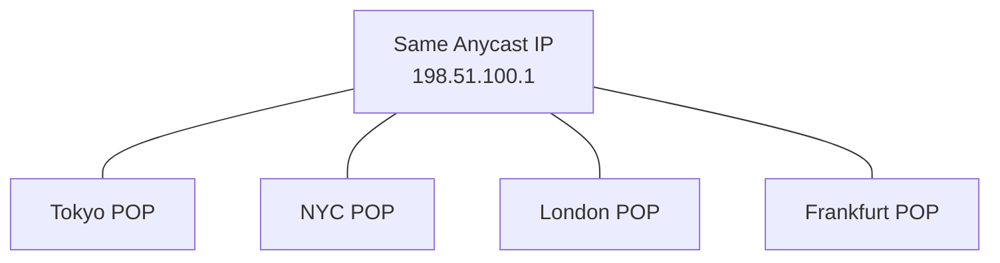
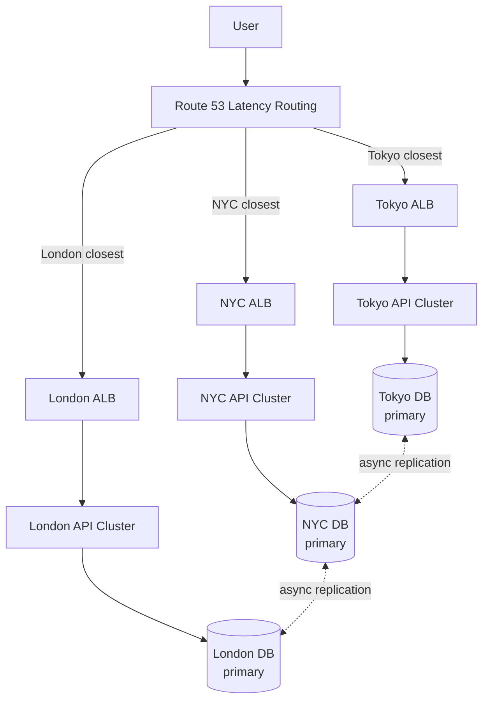

# Chapter 3. Load Balancing and Traffic Routing

> [!abstract] Chapter Goal
> Once a request leaves the client and survives DNS resolution, it arrives at your edge — usually a load balancer. The load balancer's job is to **distribute the request across multiple backend instances** so no single instance is overwhelmed, and to **route around failed instances** so users do not see errors when one box dies. This chapter explains the L4 vs L7 distinction, the scheduling algorithms, the health check mechanisms, and the DNS-level routing strategies that operate even before the LB sees the traffic.

## 1. What a Load Balancer Actually Does

A load balancer (LB) is a network appliance or software process that sits between clients and a pool of backend servers. Its core responsibilities are:

1. **Distribution** — spread incoming requests across N backends so no single backend is overloaded.
2. **Health checking** — continuously probe backends; stop sending traffic to ones that are failing.
3. **Session affinity** (optional) — send all requests from a given user to the same backend (useful for stateful services).
4. **TLS termination** — decrypt HTTPS once at the LB, talk plain HTTP to backends.
5. **Protocol translation** — accept HTTP/2 or HTTP/3 from clients, forward HTTP/1.1 to backends (or gRPC, etc.).
6. **Observability** — emit metrics on request counts, latencies, error rates, backend health.
7. **Routing intelligence** — send `/api/*` to one service, `/static/*` to another, `admin.example.com` to a third.



## 2. Layer 4 (L4) vs Layer 7 (L7) Load Balancing

This is the single most important distinction in load balancing. The numbers refer to the **OSI model** layer at which the balancer inspects traffic.

### 2.1. Layer 4 — Transport Layer

An L4 LB operates on **TCP/UDP packets**. It looks at the source IP, source port, destination IP, destination port, and decides which backend to forward to. It does **not** look inside the packet payload, so it does not see HTTP headers, cookies, paths, or methods.

**Mechanism (Network Address Translation, NAT)**:
1. Client opens a TCP connection to the LB's virtual IP (VIP).
2. The LB completes the 3-way handshake on the client side.
3. The LB picks a backend, opens a TCP connection to it (or reuses one), and relays bytes back and forth.
4. To the client, it looks like one connection to the LB. To the backend, it looks like a connection from the LB (the LB's source IP is in the packets, not the client's).



**Strengths**:
- **Very fast** — minimal packet inspection, can be done in hardware (ASIC) or in kernel-space (LVS, DPDK).
- **Protocol-agnostic** — works for TCP (HTTP, MySQL, Redis, gRPC), UDP (DNS, QUIC), and anything else.
- **No SSL overhead at the edge** — TLS is forwarded transparently (or terminated and re-encrypted).
- **Handles millions of connections per second** in hardware appliances.

**Weaknesses**:
- **No content awareness** — cannot route based on URL path, Host header, or cookie.
- **No header manipulation** — cannot add `X-Forwarded-For` (well, it can at L4 with L7 extras, but it's hacky).
- **Sticky sessions are coarse** — only by source IP hash.

**Common L4 LBs**: AWS Network Load Balancer (NLB), HAProxy in TCP mode, Linux Virtual Server (LVS), F5 BIG-IP hardware appliances, Google Cloud TCP Proxy.

### 2.2. Layer 7 — Application Layer

An L7 LB operates on **HTTP requests** (or other application-layer protocols). It parses the full HTTP request: method, path, headers, cookies, body. It can route based on any of these.



**Strengths**:
- **Content-based routing** — `Host`, path, header, cookie, query string.
- **TLS termination** — decrypt once, forward plain HTTP.
- **Sticky sessions via cookie** — set a `SERVERID` cookie; route subsequent requests to the same backend.
- **Header manipulation** — add `X-Forwarded-For`, `X-Forwarded-Proto`, strip internal headers.
- **Rate limiting and WAF** — inspect request patterns and drop abusive traffic.
- **Compression** — gzip responses at the edge.
- **Caching** — cache responses to identical GETs.

**Weaknesses**:
- **Slower than L4** — must fully parse HTTP, run in user space (typically).
- **Protocol-specific** — most L7 LBs handle HTTP/S well; gRPC, WebSocket, HTTP/3 support varies.
- **Higher CPU/memory** — buffers full requests and responses.

**Common L7 LBs**: AWS Application Load Balancer (ALB), Nginx, HAProxy in HTTP mode, Envoy, Traefik, Caddy, Google Cloud HTTPS LB, Cloudflare.

### 2.3. Hardware vs. Software Load Balancers

| Aspect | Hardware (F5 BIG-IP, Citrix NetScaler) | Software (Nginx, Envoy, HAProxy) |
|--------|----------------------------------------|----------------------------------|
| Throughput | 100s of Gbps via ASICs | 10s of Gbps on commodity x86 |
| Cost | $50k–$500k per appliance | Free or per-instance cloud pricing |
| Flexibility | Limited feature roadmap, vendor-locked | Highly configurable, programmable |
| Scaling | Vertical (buy a bigger box) | Horizontal (run more instances) |
| Operations | Specialized network team | Same as your app stack |
| Modern usage | Telcos, financial trading floors | Almost everyone else |

The industry has decisively moved to **software load balancers** running on commodity hardware or in the cloud. AWS's ALB/NLB and Google's Cloud Load Balancing are software-defined services backed by commodity hardware, exposing the best of both worlds.

### 2.4. The Hybrid Pattern: L4 + L7 Together

Most real production stacks use both layers:



- L4 handles raw TCP and TLS, often as a TCP-level health-checked pool.
- L7 (which itself runs behind L4) handles HTTP routing and path-based dispatch.

## 3. Load Balancing Algorithms

Once you've decided between L4 and L7, you must choose **how** the LB picks a backend for each request. There is no universally best algorithm; each makes different assumptions about your workload.

### 3.1. Static Algorithms

These do not consider real-time backend load. They are configured once and run forever.

#### 3.1.1. Round Robin

Distribute requests in circular order: B1 → B2 → B3 → B1 → B2 → B3 → ...

- **Pros**: trivial to implement; perfectly fair when all backends are identical.
- **Cons**: ignores actual backend load; a slow backend accumulates in-flight requests and chokes.
- **Use case**: homogeneous backends with similar CPU/RAM, request cost roughly constant.

#### 3.1.2. Weighted Round Robin

Same as round robin, but each backend has a **weight**. A backend with weight 5 gets 5x the traffic of a backend with weight 1.

- **Use case**: when backends have different capacities (e.g., one is an 8-core box, one is a 32-core box).
- **Cons**: still static — if the 32-core box is busy with a huge query, the LB keeps sending it traffic.

#### 3.1.3. IP Hash (Source Affinity)

Hash the client's source IP; send the request to whichever backend the hash maps to. Same client → same backend (until the backend pool changes).

- **Use case**: simple session stickiness without cookies (the backend doesn't need to set a cookie; the LB doesn't need to parse HTTP).
- **Cons**: uneven distribution if a few IPs generate most traffic (e.g., one corporate NAT proxy represents 10,000 users). When a backend dies, its hash mappings redistribute, breaking stickiness for those users.

### 3.2. Dynamic Algorithms

These look at real-time backend state.

#### 3.2.1. Least Connections

Send the request to the backend with the fewest active connections.

- **Pros**: handles backends of different speeds gracefully; a slow backend accumulates more in-flight connections, so the LB naturally routes around it.
- **Cons**: "active connections" is a poor proxy for "busy" — a backend doing one huge DB query has 1 connection but is fully utilized.
- **Use case**: long-lived connections (WebSockets, streaming), or when request cost varies wildly.

#### 3.2.2. Least Response Time

Send to the backend with the lowest average response time (often combined with least connections: pick the backend with the fewest connections among those with the fastest response time).

- **Pros**: directly optimizes for user-perceived latency.
- **Cons**: response time includes backend queue time, so it can lag actual load by seconds. Sudden spikes can over-send to a backend before its response time degrades.
- **Use case**: latency-sensitive APIs where cost per request is similar.

#### 3.2.3. Resource-Based (CPU / Memory Aware)

Some advanced LBs (and orchestrators like Kubernetes) query backend CPU/memory utilization and route accordingly. This requires an agent on the backend reporting metrics.

- **Use case**: heterogeneous workloads where CPU is the bottleneck.
- **Cons**: adds metric-collection overhead; rarely needed in practice.

### 3.3. Consistent Hashing

This deserves special attention because it is the algorithm that powers **almost every sharded distributed system** (Redis Cluster, Cassandra, DynamoDB, Memcached, CDN edge selection).

#### 3.3.1. The Modulo Hashing Problem

The naive approach to assigning a key to one of N servers:

```
server_index = hash(key) % N
```

This works perfectly — until N changes. If you add a 4th server to a 3-server cluster, **almost every key moves** because `hash(key) % 4` is different from `hash(key) % 3` for ~75 % of keys.

In a cache, this means **75 % of your cache misses on every scaling event** — a thundering herd of database queries that takes the system down.

#### 3.3.2. The Consistent Hashing Solution

Consistent hashing distributes keys with the property that **when the pool size changes, only K/N keys move** (where K is total keys, N is pool size). Adding or removing one server moves only ~1/N of keys.

The mechanism:

1. Imagine a circle (the "hash ring") with `2^32` positions (0 to 2^32−1).
2. Hash each server's identity (e.g., its IP) onto the ring. It lands at some position.
3. To assign a key, hash the key onto the ring, then walk **clockwise** until you hit a server's position. That server owns the key.



When a server is added or removed, only the keys between the old position and the new position migrate. Everything else stays put.

#### 3.3.3. Virtual Nodes (Vnodes)

A problem with the basic ring: if you only have 3 servers, each owns a 1/3 arc of the ring — but the arc lengths are random, so one server might own 50 % and another 10 %.

**Solution**: give each physical server many **virtual nodes** (vnodes). Each vnode is a separate hash of `server_id + vnode_number`. A typical config is 150–200 vnodes per server. This evens out the distribution statistically.



The result: each physical server owns roughly 1/3 of the ring, with deviation dropping to <5 % as vnode count rises.

#### 3.3.4. Bounded Loads

A second refinement: even with vnodes, a hot key can land on a vnode whose physical server gets hammered. **Bounded loads** (Google paper, 2016) caps each server's load at `(1 + ε) × average_load`. If a server is at capacity, the next key skips to the next server on the ring.

#### 3.3.5. Where Consistent Hashing Shows Up

- **Memcached / Redis Cluster**: keys mapped to shards via consistent hashing.
- **Cassandra / DynamoDB**: partition keys mapped to nodes via consistent hashing with vnodes.
- **CDN edge selection**: map content URL → edge node via consistent hashing.
- **L7 LBs**: many use consistent hashing for sticky session routing (so adding a backend only disrupts a fraction of sessions).

## 4. Health Checks

A load balancer that does not health-check its backends is worse than no LB at all — it will happily route traffic to a dead server forever.

### 4.1. Active Health Checks

The LB **probes** each backend on a schedule:



**Common probe types**:
- **TCP probe**: just open a TCP connection; if it succeeds, the box is "up". Cheap but weak — the process could be hung with a working TCP listener.
- **HTTP probe**: GET `/healthz` and check for 2xx. Better — confirms the app actually responds.
- **gRPC health check**: gRPC has a standard `grpc.health.v1.Health` service for this.
- **Custom script**: run a custom command on the backend (rare in cloud environments).

### 4.2. Passive Health Checks

The LB watches **real traffic**. If a backend returns 5 consecutive 5xx responses, the LB temporarily removes it from rotation. This is faster than active probing (no separate requests) but requires traffic to detect failures.

### 4.3. Health Check Parameters

Every LB lets you tune:

| Parameter | Typical Value | Effect |
|-----------|---------------|--------|
| `interval` | 5–10 s | How often to probe |
| `timeout` | 2–5 s | When to give up on a probe |
| `healthy_threshold` | 2–3 | Consecutive successes to mark healthy |
| `unhealthy_threshold` | 3–5 | Consecutive failures to mark unhealthy |
| `path` | `/healthz` | The URL to probe |

> [!tip] Design Your Health Endpoint Carefully
> A good `/healthz` endpoint checks **only** that the process is alive and can serve requests. It should NOT check database connectivity, downstream services, or disk space — those cause cascading false positives. Use a separate `/readyz` for "is this instance ready to receive traffic" (which CAN check downstream deps) and `/livez` for "is this process alive".

### 4.4. The "Dead Backend Cascade" Failure Mode

A classic LB failure mode:

1. Backend 1 dies.
2. LB detects this in 5–10 seconds and stops sending traffic.
3. **But** during those 5–10 seconds, all of Backend 1's in-flight requests time out from the client's perspective.
4. Clients retry, sending 2× load.
5. The retry load hits Backends 2 and 3, which are now overloaded.
6. They start timing out too, and the LB marks them unhealthy.
7. The whole pool collapses.

**Mitigations**:
- **Circuit breakers** on the client side (see [[Chapter 8. Resiliency and Fault Tolerance Patterns]]).
- **Jittered retries** to spread the retry storm.
- **Request shedding** on the backend — when load exceeds capacity, return 503 immediately rather than queuing.
- **Active-Active across regions** so a single-region outage does not amplify.

## 5. DNS-Level Load Balancing and Global Routing

Before traffic ever reaches your L4/L7 load balancer, **DNS** has already made a routing decision. Sophisticated DNS services (Route 53, Cloudflare, NS1) use DNS to do global load balancing.

### 5.1. Round-Robin DNS

The simplest form: return multiple A records for one hostname, in random order:

```
api.example.com.  A  203.0.113.10
api.example.com.  A  203.0.113.11
api.example.com.  A  203.0.113.12
```

Most clients pick the first one. Random ordering spreads load roughly evenly.

**Problems**:
- No health checking — if 203.0.113.10 dies, half the clients (who got it as first answer) keep failing for the TTL duration.
- No proximity awareness — a user in Tokyo and a user in Frankfurt get the same random IP.
- Sticky caching — DNS resolvers cache the answer; you cannot quickly re-route.

### 5.2. Latency-Based Routing

The DNS service measures latency from each user's resolver to each of your data centers, and returns the IP of the closest one.



> [!warning] "Latency" Is Resolver-to-DC, Not User-to-DC
> DNS sees the IP of the user's **resolver**, not the user themselves. If a Tokyo user uses Google's 8.8.8.8, the DNS service sees an anycast IP that's geographically ambiguous. This is why dedicated anycast DNS services (Cloudflare, Route 53) generally do better than ISP resolvers.

### 5.3. GeoDNS

Route based on the geographic location of the user's resolver IP. Useful for **data residency** (EU users must hit EU data centers) and **content localization** (return a Japanese-language site to Japanese users).

### 5.4. Weighted Routing

Return different IPs with different probabilities. Use cases:
- **Canary deployments**: send 1 % of traffic to the new version, 99 % to the old.
- **Cost optimization**: route to a cheaper provider for low-priority traffic.
- **Capacity management**: a smaller DC handles 10 %, a larger one handles 90 %.

### 5.5. Failover Routing

Primary/secondary setup. DNS monitors a health check on the primary. If it fails, DNS automatically switches to the secondary IP.

```
api.example.com.  A  203.0.113.10   (primary, with health check)
api.example.com.  A  203.0.113.11   (secondary, failover only)
```

### 5.6. Anycast Routing

The most powerful DNS-level routing: advertise the **same IP address from multiple geographic locations**. The internet's BGP routing automatically sends each user's packets to the topologically nearest location advertising that IP.



- Used by Cloudflare, AWS Global Accelerator, Google Cloud Premium Tier, root DNS servers.
- **Pros**: automatic geographic routing; instant failover (BGP re-converges in seconds when a POP dies).
- **Cons**: requires owning a public IP block and an AS number; not feasible for small companies.

### 5.7. Multi-Region Active-Active with DNS

The most robust pattern combines DNS routing with regional LBs:



Each region is independently active, taking its own writes. Data is asynchronously replicated. The trade-off is **eventual consistency** across regions, which is acceptable for most apps but unacceptable for others (payments, inventory).

## 6. Session Affinity (Sticky Sessions)

Sometimes you want all requests from one user to land on the **same backend**:

- The app stores session state in local memory (bad practice, but common).
- A long-lived WebSocket connection must keep hitting the same gateway.
- A cached computation is on one backend and you want to reuse it.

### 6.1. Cookie-Based Stickiness (L7)

The LB sets a cookie like `SERVERID=backend-3` on the first response. Subsequent requests carry the cookie, and the LB routes them to backend-3.

- **Pros**: precise, works through NAT/proxies, easy to expire.
- **Cons**: requires L7 (HTTP parsing); cookies add a few bytes to every request.

### 6.2. IP-Based Stickiness (L4 or L7)

Hash the client's source IP and route consistently.

- **Pros**: works at L4, no cookie needed.
- **Cons**: all users behind one corporate NAT look like one client — they all hit the same backend, causing imbalance.

### 6.3. The Danger of Stickiness

> [!warning] Sticky Sessions Are a Smell
> If you need sticky sessions, you usually have a **statefulness problem**. The right fix is to move session state out of the backend (into Redis, the database, or a JWT) so any backend can serve any request. Stickiness should be a last resort, used only when truly stateful protocols (WebSocket) demand it.

## 7. TLS Termination and Pass-Through

When the LB accepts HTTPS, it has two choices:

### 7.1. TLS Termination

The LB decrypts HTTPS, forwards plain HTTP to backends.


- **Pros**: backends don't waste CPU on TLS; easier cert management (cert only on LB); LB can inspect/modify HTTP.
- **Cons**: traffic between LB and backend is plaintext (mitigated by being on a private network).

### 7.2. TLS Pass-Through

The LB does not decrypt; it forwards the TCP stream to the backend, which does its own TLS.

- **Pros**: end-to-end encryption; LB never sees plaintext.
- **Cons**: cannot do L7 routing (can't see Host header); cert management on every backend; SNI-based routing only.

### 7.3. TLS Re-Encryption (Two-Way TLS)

The LB terminates TLS, then re-encrypts and sends HTTPS to the backend. The backend has its own cert (often a private CA).

- **Pros**: defense in depth — even if someone sniffs the internal network, they cannot read traffic.
- **Cons**: more CPU on LB and backend; cert management burden.
- **Use case**: regulated industries (HIPAA, PCI), zero-trust networks.

## 8. Tips, Tricks, and Common Pitfalls

> [!tip] Don't Put a Single LB in Front of Everything
> A single ALB is a SPOF. Cloud LBs (AWS ALB, Google LB) are themselves highly available, but if you run your own Nginx, **run at least 2 instances** behind a VIP managed by keepalived or VRRP. Otherwise the LB itself becomes the failure point.

> [!tip] Use Connection Draining (Deregistration Delay)
> When you take a backend out of rotation for a deploy, in-flight requests need time to finish. Configure "connection draining" / "deregistration delay" of 30–300 seconds so the LB stops sending NEW requests but lets existing ones complete. Otherwise users get 502s mid-request.

> [!warning] Beware the "TCP Reset Cascade"
> If a backend is overloaded and starts dropping connections, the LB may interpret this as "backend dead" and route all traffic to the others. They get overloaded, drop connections, get marked dead... Use **slow start** (gradually ramp traffic to a newly healthy backend) and **request shedding** (return 503 when overloaded) to prevent this.

> [!tip] Log the `X-Forwarded-*` Headers
> Behind a reverse proxy, your app sees the proxy's IP. To know the real client, read `X-Forwarded-For` (client IP chain), `X-Forwarded-Proto` (original scheme), `X-Forwarded-Host` (original Host header). In Django, set `USE_X_FORWARDED_HOST = True` and `SECURE_PROXY_SSL_HEADER = ('HTTP_X_FORWARDED_PROTO', 'https')`.

> [!tip] Test Health Checks Before Deploying
> Many production outages come from misconfigured health checks. Manually stop your app on one backend and watch the LB detect it within the configured interval. If it takes longer, your threshold is too lenient.

> [!warning] Don't Use IP Hash for Mobile Clients
> Mobile users switch cell towers frequently, which changes their source IP. IP-hash stickiness breaks every few minutes for them. Use cookie-based stickiness or, better, stateless design.

## 9. Chapter Summary

- L4 LBs forward TCP/UDP packets by IP+port (fast, dumb). L7 LBs parse HTTP and route by path/host/cookie (smart, slower).
- Real production stacks use both layers: L4 for raw throughput and TLS, L7 for content routing.
- Scheduling algorithms: round-robin (fair, blind), weighted (heterogeneous hardware), least-connections (long-lived), least-response-time (latency-aware), IP-hash (sticky), consistent-hashing (the backbone of sharding).
- Consistent hashing with virtual nodes minimizes key movement when the pool changes — this is what makes sharded systems operationally feasible.
- Health checks (active + passive) prevent the LB from routing to dead backends, but their parameters must be tuned to avoid both flapping and slow detection.
- DNS-level routing (latency-based, geo, weighted, failover, anycast) operates even earlier than the LB, distributing users across regions.
- Sticky sessions are usually a workaround for stateful backends; prefer moving state out.

The next chapter ([[Chapter 4. Content Delivery and Edge Computing]]) covers what happens at the edge: CDN caching, push vs pull models, cache invalidation, and the new world of edge compute functions.
