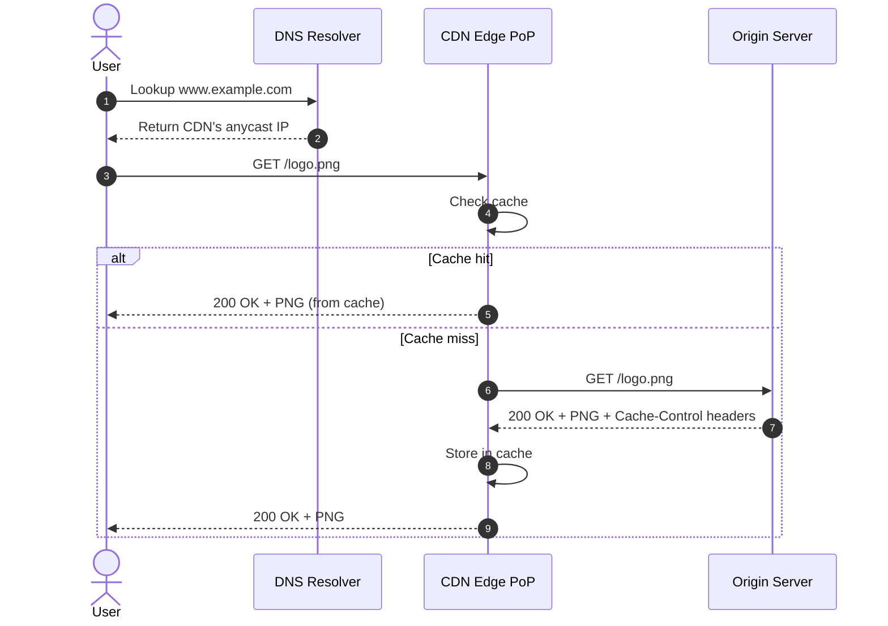
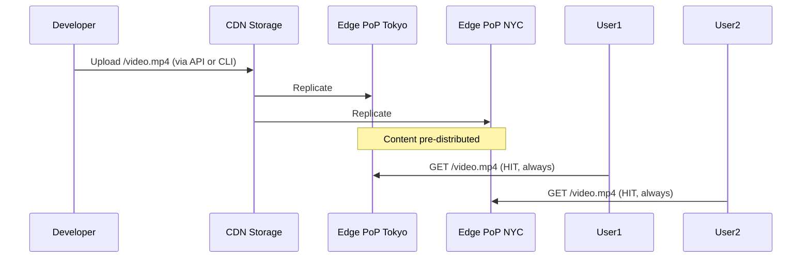
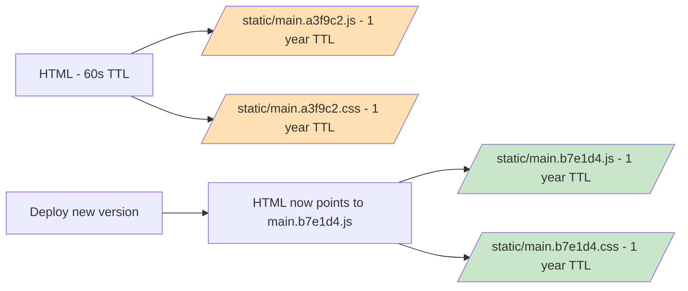
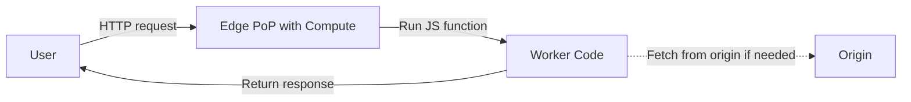
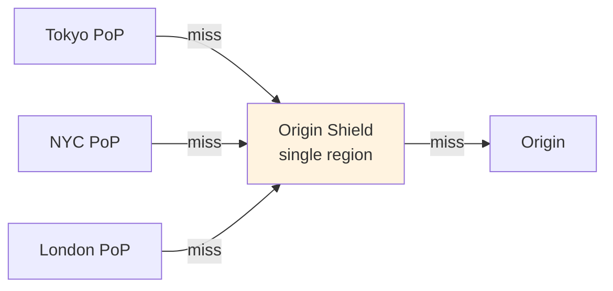
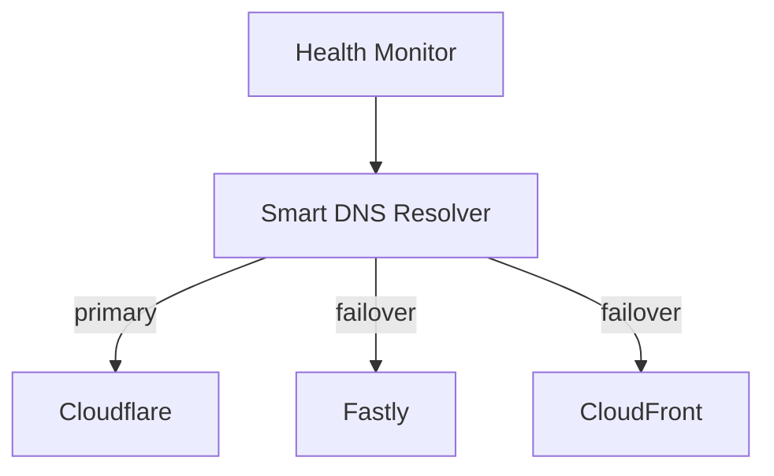

# Chapter 4. Content Delivery and Edge Computing

> [!abstract] Chapter Goal
> A Content Delivery Network (CDN) is the cheapest, fastest way to make a global application feel instant to users. By caching content at hundreds of edge locations worldwide, a CDN cuts latency from 200 ms (cross-continent) to 20 ms (local POP). This chapter explains how CDNs work, when to choose push vs pull models, how to invalidate stale content, and how edge compute is reshaping where application code runs.

## 1. Why CDNs Exist

The fundamental problem: **light moves slowly**. A round-trip from New York to Tokyo is ~150 ms at the speed of light in fiber. Add TCP handshake, TLS handshake, and a couple of round trips to fetch assets, and a Tokyo user loading a NYC-hosted site waits 1–2 seconds before seeing anything. That feels broken.

CDNs solve this by **moving the content to the user**. Instead of one origin server in NYC, you have 300+ Points of Presence (PoPs) worldwide, each caching copies of your static assets. The Tokyo user fetches `logo.png` from the Tokyo PoP — 20 ms.


### 1.1. The Economic Argument

CDNs are also dramatically cheaper than self-hosting:

- Serving 1 GB from your origin: ~$0.05–0.10 in egress bandwidth + origin CPU.
- Serving 1 GB from a CDN: ~$0.01–0.08 per GB, with the origin doing almost no work.

A 95 % cache hit ratio means your origin handles 5 % of the traffic — a 20× reduction in origin cost and capacity needs.

## 2. CDN Architecture

### 2.1. Points of Presence (PoPs)

A CDN is a globally distributed network of small data centers called **PoPs** or **edge nodes**. Each PoP has:

- A **cache layer** (typically Nginx, Varnish, or custom software) holding hot content.
- A **routing layer** that decides what to serve from cache vs. fetch from origin.
- **Anycast IP** so users are routed to the nearest PoP by BGP.

Major CDNs and their PoP counts (approximate, 2024):

| CDN | PoPs |
|-----|------|
| Cloudflare | 300+ |
| Akamai | 4,000+ (many smaller edge sites) |
| AWS CloudFront | 600+ (often co-located with AWS regions) |
| Google Cloud CDN | 200+ |
| Fastly | 80+ (fewer but very high-performance) |
| Azure Front Door | 200+ |

### 2.2. The Anatomy of a Cache Hit



### 2.3. Cache Keys

The cache key is the set of request attributes that identify "the same content". A typical cache key includes:

- The URL path (`/logo.png`).
- The query string (`?v=2` — though some CDNs strip query strings for static assets).
- The `Host` header (multi-tenant CDNs serve many sites from one IP).
- Sometimes: `Accept-Encoding` (so gzip and brotli versions are cached separately), `Vary` header values.

If you have a `?user_id=42` query parameter, **don't cache that response** — it's user-specific. Use cache key normalization to strip user-specific parameters before caching.

### 2.4. Cache Hit Ratio

The single most important CDN metric. **Cache Hit Ratio (CHR)** = hits / (hits + misses). Target ranges:

- **Static assets** (images, CSS, JS with fingerprinted names): 95–99 %.
- **API responses with public cacheability**: 50–80 %.
- **Personalized content**: 0 % (don't cache).

Ways to improve CHR:
1. **Fingerprint asset URLs** (`logo.a3f9c2.png` instead of `logo.png`) so they can be cached for years.
2. **Set long `Cache-Control: max-age` values** on static assets.
3. **Use `s-maxage`** to give CDNs a different (longer) TTL than browsers.
4. **Normalize cache keys** — strip tracking params, normalize case.
5. **Tune query-string caching** — most CDNs let you whitelist which params affect caching.

## 3. Push vs Pull CDN Models

CDNs differ in how content arrives at the edge. The choice has major operational implications.

### 3.1. Pull CDN (Origin-Pull, On-Demand)

The default model. The CDN starts with an empty cache. When the first user requests `/logo.png`, the PoP fetches it from the origin, caches it, and serves it. Subsequent requests hit the cache until TTL expires.

```mermaid
sequenceDiagram
    User1: First user
    User2: Second user
    participant CDN as CDN Edge
    participant Origin as Origin
    User1->>CDN: GET /image.jpg (cache MISS)
    CDN->>Origin: GET /image.jpg
    Origin-->>CDN: image + Cache-Control: max-age=3600
    CDN->>CDN: Store in cache (TTL 1h)
    CDN-->>User1: image
    User2->>CDN: GET /image.jpg (cache HIT)
    CDN-->>User2: image (from cache, no origin call)
```

**Pros**:
- Zero setup — drop a CNAME in DNS and you're live.
- Automatic — only popular content gets cached; long-tail content never touches the CDN.
- No storage cost at the edge.

**Cons**:
- **First request is slow** — every cache miss pays the origin-fetch cost. For a popular asset, only the very first user sees this; for cold content, every user sees it.
- **Origin spike on TTL expiry** — when 10,000 cached assets expire simultaneously, the next 10,000 requests all hit origin at once (the "thundering herd" or "cache stampede" problem).
- **Unpredictable origin load** — sudden virality can hit origin hard before CDN warms up.

**Best for**: websites with mostly static assets, where the long tail is large and you don't want to manage what gets cached.

### 3.2. Push CDN (Origin-Push, Pre-Distribution)

You proactively upload content to the CDN's storage. The CDN replicates it to all (or some) PoPs. Requests are always served from cache; the origin is never hit.



**Pros**:
- **Zero cold-start latency** — every request hits cache.
- **Predictable origin load** — origin does zero work for CDN-served content.
- **Good for large files** — video on demand, software updates, OS images.

**Cons**:
- **Manual management** — you decide what to push and when.
- **Storage cost** — you pay for CDN storage even for content no one requests.
- **Slower to update** — pushing a new version takes minutes to propagate.

**Best for**: video platforms (Netflix), software updates (Apple iOS updates), game downloads (Steam), large file repositories.

### 3.3. The Hybrid Reality

Most modern CDNs support both modes. A typical setup:

- **HTML and dynamic API**: pull CDN with short TTL (60 s).
- **CSS, JS, images**: pull CDN with fingerprinted names and 1-year TTL.
- **Videos, large files**: push CDN with regional replication.
- **Live video**: never cached — see [[Chapter 18. Case Study Video Processing at Scale]].

## 4. Cache Invalidation and Versioning

> [!quote] Phil Karlton
> "There are only two hard things in Computer Science: cache invalidation and naming things."

CDN caching is great until you deploy a fix and users still see the old version. There are three strategies.

### 4.1. TTL-Based Expiration

Set `Cache-Control: max-age=300` and the CDN serves stale content for 5 minutes, then re-fetches. Simple, but users see stale content for up to 5 minutes after a deploy.

### 4.2. Cache Purging via API

Every major CDN offers an API to invalidate specific URLs or path prefixes:

```
POST /v2/purge
{
  "urls": ["https://www.example.com/logo.png", "https://www.example.com/*"]
}
```

- **Pros**: immediate effect.
- **Cons**: takes 30–60 seconds to propagate to all PoPs; may have rate limits; some CDNs charge per purge.
- **Wildcard purges** (`/api/*`) can take longer and may invalidate millions of objects.

### 4.3. Cache Busting via Fingerprinting (The Right Way)

The cleanest solution: **never update a cached URL**. Instead, give every version of every asset a unique URL by hashing its content into the filename:

```
# Before deploy
<script src="/static/main.a3f9c2.js"></script>

# After deploy (code changed)
<script src="/static/main.b7e1d4.js"></script>
```

- The new file has a different name, so the CDN treats it as a new asset (cache miss → fetch from origin → cache forever).
- The old file stays cached forever — anyone still loading the old HTML gets the old JS, which still works.
- The HTML file itself is the only thing that needs short TTL (60 s) so users see the new `<script src>` quickly.



This is the **immutable assets** pattern. Tools like Webpack, Vite, and Next.js do it automatically.

### 4.4. Surrogate-Control and s-maxage

When you want browsers and CDNs to behave differently:

```
Cache-Control: public, max-age=60, s-maxage=300
Surrogate-Control: max-age=300
```

- `max-age=60`: browsers cache for 60 s.
- `s-maxage=300`: shared caches (CDNs) cache for 300 s.
- `Surrogate-Control`: some CDNs (Fastly, Cloudflare) honor this header specifically for the CDN, ignoring browser rules.

### 4.5. The Vary Header

If your server returns different responses for the same URL based on a header (e.g., gzip vs brotli), set:

```
Vary: Accept-Encoding
```

This tells the CDN to cache separate copies for each `Accept-Encoding` value. Forgetting `Vary` is a common bug — the CDN serves a brotli response to a client that doesn't support brotli.

## 5. Dynamic Content Acceleration (DCA)

Static assets are easy to cache. What about dynamic API responses that cannot be cached?

CDNs offer **Dynamic Content Acceleration** features:

### 5.1. TCP Connection Pooling

The CDN keeps warm TCP connections to your origin. When a user request arrives, the CDN reuses an existing connection instead of doing a fresh 3-way handshake. Saves 1 RTT (50–150 ms).

### 5.2. Route Optimization

The CDN continuously measures latency between its PoPs and your origin across multiple network paths. It picks the fastest route, which may not be the default BGP path. This can shave 20–50 ms off cross-continent routes.

### 5.3. SSL Pre-Handshake

The CDN maintains a warm TLS session with the origin, reusing session tickets to skip the TLS handshake on subsequent requests.

### 5.4. Compression at the Edge

The CDN gzips or brotli-compresses responses, saving origin CPU and reducing transit time.

## 6. Edge Computing

The latest evolution: instead of just caching content, run **application code at the edge**.

### 6.1. CDN Workers / Edge Functions



Products:
- **Cloudflare Workers**: V8-isolated JavaScript/ WASM at 300+ PoPs.
- **Fastly Compute@Edge**: WASM-based, similar model.
- **AWS Lambda@Edge / CloudFront Functions**: Lambda functions triggered at CDN edges.
- **Deno Deploy / Vercel Edge Functions**: similar, focused on Jamstack apps.

### 6.2. What Edge Compute Is Good For

- **Authentication at the edge** — validate JWTs before reaching origin.
- **A/B testing** — split traffic at the edge, no origin involvement.
- **Personalization** — inject user-specific content into a cached HTML shell.
- **Geolocation** — return country-specific responses without origin calls.
- **Bot detection / WAF** — block abusive traffic before it consumes origin capacity.
- **Image transformation** — resize, crop, re-encode on the fly.

### 6.3. What Edge Compute Is NOT Good For

- **Heavy computation** — edge functions are limited to ~50 ms CPU and 128 MB RAM.
- **Stateful logic** — edge is stateless; you cannot keep in-memory session data.
- **Database access** — edge functions cannot open TCP connections to your database directly (most edge runtimes only allow HTTP fetches). Use a HTTP API in front of the DB.

### 6.4. Edge Databases

A newer pattern: databases that replicate to the edge, so edge functions can read from a local copy:

- **Cloudflare D1**: SQLite at the edge.
- **Fauna**: globally distributed DB with a GraphQL/HTTP API.
- **Turso / libSQL**: SQLite-derived, edge-replicated.
- **PlanetScale**: MySQL with global edge reads.

The pattern: writes go to a primary region (strong consistency), reads come from the edge replica nearest the user (eventual consistency, <50 ms latency).

## 7. Origin Shielding

When you have 300 PoPs all caching the same content, a cache miss on the same asset from 300 PoPs can result in 300 simultaneous origin fetches — a stampede.

**Origin Shield** adds a **second-tier cache** between the PoPs and the origin:



Now only the **first** PoP to fetch a given asset triggers an origin request. All subsequent PoPs fetch from the shield cache. Most CDNs call this "shielding" or "tiered caching".

## 8. Multi-CDN Strategy

For mission-critical apps, **don't depend on a single CDN**. If Cloudflare has an outage (and they have, in 2019, 2020, 2023...), your site is down. A multi-CDN setup uses DNS to fail over between providers:



The DNS provider continuously health-checks each CDN's edge from multiple locations. If Cloudflare starts failing, DNS automatically returns Fastly's IP for new queries.

**Trade-offs**:
- Higher reliability.
- Complexity: each CDN has different cache key rules, header support, pricing.
- Cost: negotiation leverage, but you may not get the deepest discounts without exclusivity.

## 9. CDN Security Features

Modern CDNs are also **security platforms**:

### 9.1. DDoS Protection

CDNs absorb volumetric attacks (L3/L4 floods, L7 HTTP floods) by virtue of having more bandwidth than the attacker. Cloudflare and Akamai routinely absorb 1 Tbps+ attacks.

### 9.2. Web Application Firewall (WAF)

Inspect HTTP requests for SQL injection, XSS, and known attack signatures. Block at the edge before reaching origin.

### 9.3. Bot Management

Use JavaScript challenges, fingerprinting, and machine learning to distinguish bots from humans. Block scrapers, credential stuffers, and DDoS bots.

### 9.4. Rate Limiting at the Edge

Per-IP, per-path, per-API-key rate limits enforced at the edge. Saves origin capacity and reduces attack surface.

### 9.5. TLS 1.3 and HSTS

CDNs terminate TLS at the edge, support modern protocols (HTTP/3, TLS 1.3), and enforce HSTS (force HTTPS for all future requests).

## 10. Tips, Tricks, and Common Pitfalls

> [!tip] Always Fingerprint Static Assets
> If you serve `app.js` (no hash), every deploy requires a CDN purge, which takes 60 s and may charge money. If you serve `app.a3f9c2.js`, you never purge — you just upload the new file and update the HTML. This single change eliminates 90 % of "users see stale content" complaints.

> [!warning] Don't Cache User-Specific Responses Without Care
> A common bug: cache the response to `GET /api/profile` for 60 s "for performance". Now User A logs out, User B logs in on the same browser, and B sees A's profile. Always set `Cache-Control: private` or `no-store` for authenticated responses.

> [!tip] Use `stale-while-revalidate` for Graceful Degradation
> ```
> Cache-Control: max-age=60, stale-while-revalidate=600
> ```
> This tells the CDN: after 60 s, serve the stale content immediately AND re-fetch in the background. The user gets a fast response from cache while the CDN refreshes. Excellent for non-critical APIs.

> [!tip] Set `Surrogate-Control` for CDN-Specific TTLs
> Want browsers to revalidate every 60 s but the CDN to cache for 1 hour? Use both `max-age=60` and `s-maxage=3600`. The CDN honors the longer one; browsers honor the shorter.

> [!warning] Watch Out for CORS at the Edge
> If your CDN caches an API response with `Access-Control-Allow-Origin: https://a.com`, a request from `https://b.com` will get the cached response and the browser will block it. Either set `Vary: Origin` (so the CDN caches per-origin) or dynamically compute CORS at the edge.

> [!tip] Purge Proactively After Deploys
> After deploying a new version of an uncached HTML page, proactively purge the old one. Don't wait for TTL — users will see old content for the full TTL window, which feels broken.

> [!danger] Don't Forget the Cache Key for Mobile
> Mobile API clients often send different headers than web (`X-Mobile-Version: 2`). If your CDN caches based on URL only, mobile and web responses get mixed. Whitelist the headers that affect the response.

## 11. Chapter Summary

- A CDN moves content to geographically distributed PoPs, cutting latency from 150 ms to 20 ms.
- Pull CDNs fetch on demand (good for long-tail static content). Push CDNs pre-distribute (good for large predictable files).
- Cache key construction determines correctness — include `Vary` headers, exclude user-specific params.
- The "immutable assets" pattern (fingerprinted filenames) eliminates cache invalidation headaches for static assets.
- Dynamic Content Acceleration uses connection pooling, route optimization, and SSL pre-handshakes to speed up non-cacheable APIs.
- Edge compute runs JS/WASM at PoPs for auth, A/B testing, and personalization — but not for heavy compute or stateful logic.
- Origin shielding prevents stampedes when many PoPs miss the same asset simultaneously.
- Multi-CDN strategies use DNS failover for high availability.
- CDNs double as security platforms: DDoS absorption, WAF, bot management, rate limiting.

The next chapter ([[Chapter 5. Caching Patterns and Strategies]]) dives into application-level caching — the patterns for keeping data close to your code (Cache-Aside, Write-Through, Write-Behind, Write-Around) and the failure modes (stampede, penetration, avalanche) that every caching layer must defend against.
