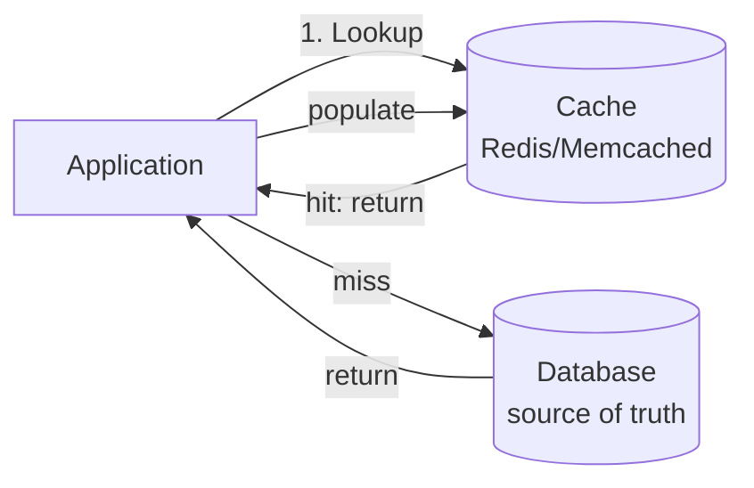
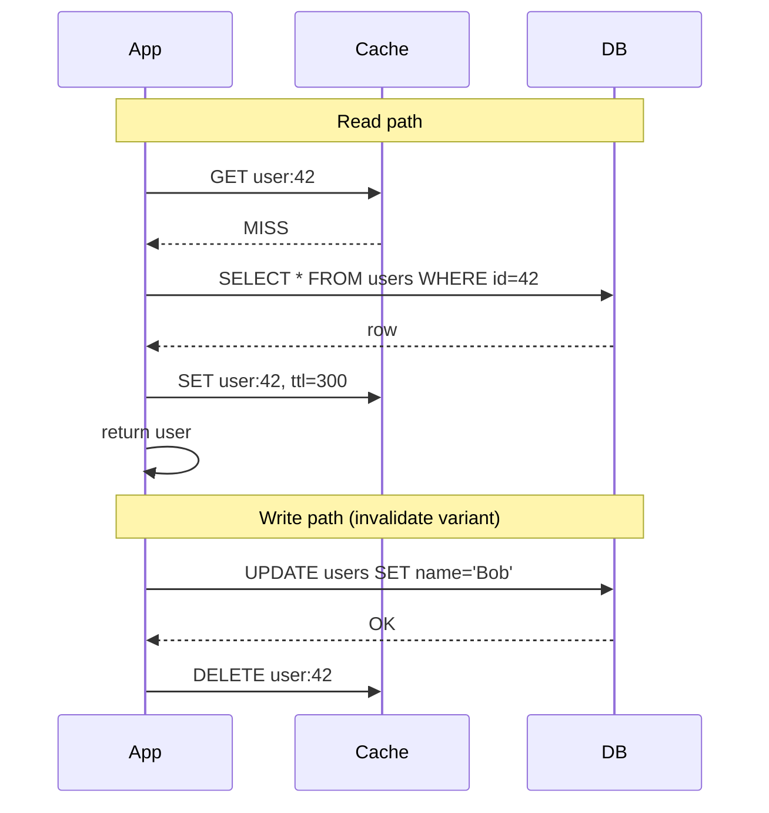
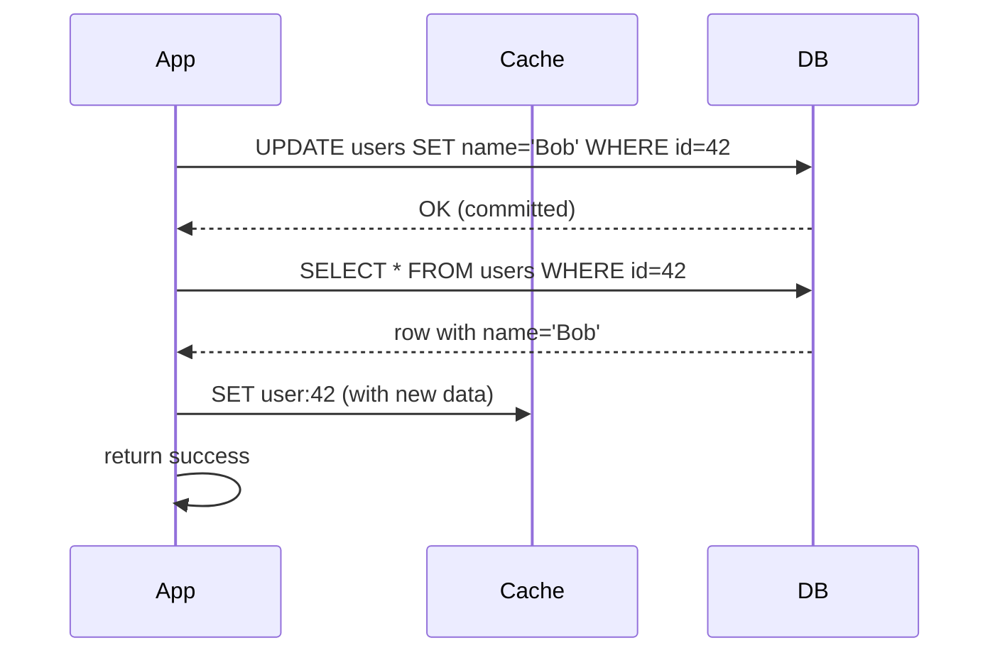
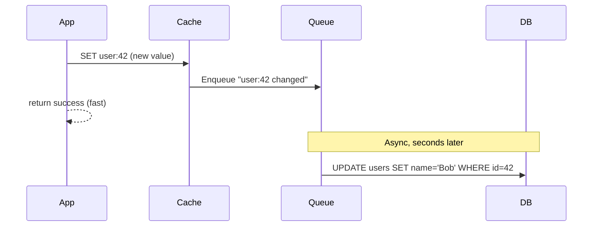
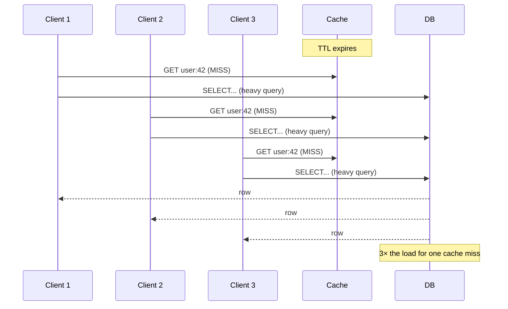
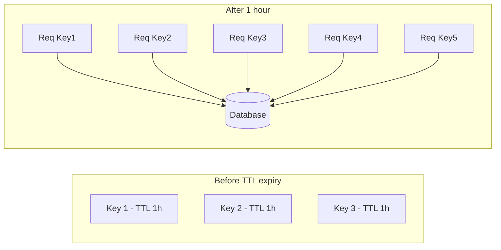

# Chapter 5. Caching Patterns and Strategies

> [!abstract] Chapter Goal
> Caching is the single highest-leverage performance technique in system design — main memory is 100,000× faster than disk and 1,000× faster than a network round trip. But caching is also where most production incidents originate: stale data, thundering herds, memory exhaustion, and consistency bugs. This chapter explains the four canonical cache write patterns, the eviction algorithms, and the three classic failure modes (stampede, penetration, avalanche) and how to defend against each.

## 1. Why Caching Matters

Recall the latency numbers from [[Chapter 1. Foundations of System Design]]:

| Operation | Time |
|-----------|------|
| Main memory reference | 100 ns |
| Read 4 KB randomly from SSD | 150 µs (1500× slower than RAM) |
| Round trip within datacenter | 500 µs (5000× slower than RAM) |
| Cross-continent round trip | 150 ms (1.5 M× slower than RAM) |

A database read is roughly 1–10 ms. A cache read is roughly 0.1–1 ms. The 10× difference is the entire reason caching exists.

But caching introduces **consistency challenges**: the cache and the source of truth can diverge. The patterns in this chapter are the standard ways to manage that divergence.

## 2. The Anatomy of a Cache Layer



A cache sits between the application and a slower backing store. The application checks the cache first; on hit, returns immediately. On miss, it queries the backing store, populates the cache, and returns.

Caches appear at many layers in a typical stack:

| Layer | Example | TTL |
|-------|---------|-----|
| Browser cache | HTTP `Cache-Control: max-age` | Minutes to years |
| CDN edge cache | Cloudflare, CloudFront | Minutes to hours |
| Reverse proxy cache | Nginx `proxy_cache` | Seconds to minutes |
| Application in-memory cache | LRU map in process | Milliseconds to seconds |
| Distributed cache | Redis, Memcached | Seconds to hours |
| Database buffer pool | PostgreSQL shared_buffers | Until evicted |
| OS page cache | Linux page cache | Until evicted |

Each layer has its own TTL, eviction policy, and invalidation semantics. A single user request might pass through 5 cache layers; getting all of them right is the art of caching.

## 3. The Four Write Patterns

The decision of **when and how to update the cache** when writes happen is the most important caching design choice. There are four canonical patterns.

### 3.1. Cache-Aside (Lazy Loading)

The application manages the cache explicitly.

**Read path**:
```python
def get_user(user_id):
    user = cache.get(f"user:{user_id}")
    if user is None:  # cache miss
        user = db.query("SELECT * FROM users WHERE id = %s", user_id)
        cache.set(f"user:{user_id}", user, ttl=300)
    return user
```

**Write path** (two common variants):
- Update the database, **invalidate** the cache (delete the key). Next read repopulates.
- Update the database, **update** the cache too.

```python
def update_user(user_id, name):
    db.execute("UPDATE users SET name = %s WHERE id = %s", name, user_id)
    cache.delete(f"user:{user_id}")  # invalidate, let next read repopulate
```



**Pros**:
- Simple, easy to reason about.
- Cache only contains data that's actually requested (no wasted memory on cold data).
- Tolerates cache failures gracefully — the DB is always the source of truth.

**Cons**:
- **Stale window on write**: between the DB update and the cache invalidation, a concurrent reader can read stale data from the cache. (Solution: invalidate *before* the DB write, accepting a brief read-after-write inconsistency the other way.)
- **Cache stampede on cold start** or after a mass invalidation (see §5.1).
- **Three round trips** on a cache miss: cache lookup, DB query, cache set.

> [!tip] Prefer Invalidation Over Update
> When in doubt, **invalidate** (delete) the cache key on write rather than updating it. Invalidation is idempotent and race-free; updating opens a window where the cache and DB can disagree if a concurrent read happens between the DB write and the cache update.

### 3.2. Write-Through

The application writes to the cache **and** the database synchronously, in that order. The cache is always consistent with the DB.

```python
def update_user(user_id, name):
    user = db.query("SELECT * FROM users WHERE id = %s", user_id)  # to construct full object
    user.name = name
    cache.set(f"user:{user_id}", user, ttl=300)
    db.execute("UPDATE users SET name = %s WHERE id = %s", name, user_id)
```

Better practice: write to cache **after** DB commit:

```python
def update_user(user_id, name):
    db.execute("UPDATE users SET name = %s WHERE id = %s", name, user_id)
    user = db.query("SELECT * FROM users WHERE id = %s", user_id)
    cache.set(f"user:{user_id}", user, ttl=300)
```



**Pros**:
- Cache is always consistent with DB (after the write completes).
- No stale reads ever.
- Simple to reason about: every write updates both layers.

**Cons**:
- **Write latency is higher** — you pay both the DB write and the cache write on every mutation.
- If the cache is down, the write fails (you need fallback logic).
- More cache writes than necessary — every write updates the cache even if no one will read it soon.

**Best for**: read-heavy data where consistency matters more than write latency (user profiles, configuration).

### 3.3. Write-Behind (Write-Back)

The application writes to the cache only, and a background worker asynchronously writes to the DB. The DB lags behind the cache by seconds to minutes.



**Pros**:
- **Extremely fast writes** — only a cache write is in the critical path.
- **Smooths DB load** — writes are batched and applied at the DB's comfortable rate.
- **Survives DB outages** — writes queue in the cache and apply when the DB recovers.

**Cons**:
- **Data loss risk** — if the cache dies before the worker flushes to DB, those writes are lost. (Mitigation: persistent cache like Redis with AOF, or a write-ahead log.)
- **Complex consistency** — the DB and cache can diverge for seconds; reads from the DB see stale data.
- **Hard to do transactions** — multi-key writes that should be atomic become eventually consistent.
- **Reconciliation complexity** — you need monitoring to ensure the queue is draining.

**Best for**: high-write, low-criticality data — view counts, like counts, telemetry, metrics. **Never** for financial transactions.

### 3.4. Write-Around

The application writes directly to the DB, bypassing the cache entirely. The cache is populated only on read misses (cache-aside read pattern).

```python
def update_user(user_id, name):
    db.execute("UPDATE users SET name = %s WHERE id = %s", name, user_id)
    # do NOT touch the cache
    # the next read will fetch from DB and populate the cache
```

**Pros**:
- **Write is fast** — only the DB.
- **No cache pollution** — write-only data (logs, telemetry) never enters the cache.

**Cons**:
- **Read after write is slow** — the next read is a cache miss.
- **Stale cache risk** — if the cache already held the old value, it stays stale until TTL expires or until explicit invalidation.

**Best for**: write-once, read-rarely data (logs, audit records, cold storage metadata). Combine with cache-aside reads: if a read misses, populate the cache; if a write happens, just let the cache TTL expire.

### 3.5. Comparison Matrix

| Pattern | Write Latency | Consistency | Complexity | Best For |
|---------|---------------|-------------|------------|----------|
| Cache-Aside | Medium (DB only) | Eventual (brief stale window) | Low | General purpose |
| Write-Through | High (DB + cache) | Strong | Low | Read-heavy, consistency-critical |
| Write-Behind | Very low (cache only) | Eventual (seconds) | High | High-write, loss-tolerant |
| Write-Around | Low (DB only) | Eventual | Low | Write-rarely-read data |

## 4. Cache Eviction Policies

When the cache is full, something must be removed to make room. The eviction policy decides what.

### 4.1. LRU (Least Recently Used)

Evict the key whose **most recent access is the oldest**. Track access time per key; on eviction, remove the oldest.

- **Implementation**: doubly-linked list + hash map. Each access moves the key to the head; eviction removes the tail. O(1) operations.
- **Strength**: exploits temporal locality — recently-used items tend to be used again.
- **Weakness**: a one-time scan of all keys (e.g., a batch job) flushes the cache and replaces hot data with cold.

### 4.2. LFU (Least Frequently Used)

Evict the key with the **lowest total access count**.

- **Implementation**: min-heap or frequency buckets + hash map.
- **Strength**: robust to scans — a key accessed once during a scan doesn't displace frequently-accessed keys.
- **Weakness**: **stale popularity** — a key that was hot yesterday but cold today stays in cache because its historical count is high. New hot keys take a long time to accumulate enough accesses.

### 4.3. FIFO (First In, First Out)

Evict the **oldest inserted key**, regardless of access. Like a queue.

- **Strength**: simplest to implement.
- **Weakness**: ignores access patterns entirely; can evict very hot data because it's old. Almost never used in production caches.

### 4.4. ARC (Adaptive Replacement Cache)

A hybrid of LRU and LFU that dynamically adjusts based on workload. Tracks both recency and frequency, and shifts between LRU and LFU behavior as the workload demands.

- **Strength**: better hit ratio than pure LRU or LFU on mixed workloads.
- **Weakness**: more complex to implement; rarely available in off-the-shelf caches.

### 4.5. W-TinyLFU

Used by Caffeine (Java) and other modern caches. Combines:
- A small **windowed LRU** (for new entries — admit them quickly if they're hot).
- A **TinyLFU** admission filter (frequency-based, but with a Count-Min Sketch to be memory-efficient).
- A main **SLRU** (segmented LRU) for the long-term cache.

Result: near-optimal hit ratio with minimal overhead. The current state of the art for in-process Java caches.

### 4.6. Practical Defaults

- **Redis**: no built-in eviction by default (you must configure `maxmemory` and `maxmemory-policy`). When configured, supports `allkeys-lru`, `allkeys-lfu`, `allkeys-random`, `volatile-lru`, `volatile-lfu`, `volatile-ttl`, `noeviction`.
- **Memcached**: LRU per slab class.
- **Caffeine**: W-TinyLFU by default.

> [!tip] Always Set a maxmemory
> An unbounded cache will eventually consume all available memory and crash the process. Always configure `maxmemory` and an eviction policy. For Redis, `allkeys-lfu` is a good default for most app caches.

## 5. Cache Failure Modes and Defenses

The three classic cache pathologies, each with a specific defense.

### 5.1. Cache Stampede (Thundering Herd)

**The problem**: a popular cache key expires. The next 1,000 requests all see a cache miss and all hit the database simultaneously to repopulate. The DB is overwhelmed; latency spikes; the cache eventually repopulates but the damage is done.



**Defenses**:

#### 5.1.1. Request Coalescing (Single-Flight)

Only one request goes to the DB; the rest wait for its result. Implementations:

- **In-process**: Go's `singleflight` package, Python's `cachetools.func.ttl_cache` with locking.
- **Distributed**: Redis with `SET NX` (acquire a lock, fetch, release), or a dedicated "lock" key.

```python
def get_user(user_id):
    val = cache.get(f"user:{user_id}")
    if val is not None:
        return val
    # Acquire lock
    lock_acquired = cache.set(f"lock:user:{user_id}", "1", nx=True, ex=10)
    if lock_acquired:
        try:
            val = db.query("SELECT * FROM users WHERE id = %s", user_id)
            cache.set(f"user:{user_id}", val, ttl=300)
            return val
        finally:
            cache.delete(f"lock:user:{user_id}")
    else:
        # Wait briefly and retry cache
        time.sleep(0.05)
        return get_user(user_id)
```

#### 5.1.2. Probabilistic Early Expiration (XFetch)

Instead of all clients seeing the same expiry time, each client randomly decides to refresh **slightly before** the TTL expires. The first one to do so refreshes; the rest keep using the cached value.

Algorithm (XFetch):
```python
def should_refresh(ttl_remaining, beta=1.0):
    # Random exponential backoff
    now = time.time()
    expiry = cached_at + ttl
    # Random value in [0, 1]
    r = random.random()
    # Refresh if current time exceeds expiry - beta * log(r) * ttl
    return now - expiry + beta * -math.log(r) * ttl > 0
```

Effect: refreshes are spread over time, never all at once. Used by Redis, Memcached (with patches), and many CDNs.

#### 5.1.3. Locking with Stale-While-Revalidate

Serve the stale value while one client refreshes:

```
Cache-Control: max-age=60, stale-while-revalidate=600
```

After 60 s, the cache is "stale but usable". The first request after that triggers a refresh; meanwhile, all other requests get the stale response immediately.

### 5.2. Cache Penetration

**The problem**: requests for **non-existent data**. The cache cannot cache "doesn't exist" (or rather, you didn't), so every request goes through to the DB. An attacker can weaponize this: send `GET /user/99999999999` repeatedly, and the DB is hammered on a query that always returns empty.

```mermaid
graph LR
    Attacker -->|GET user:nonexistent| Cache
    Cache -->|MISS| DB
    DB -->|empty result| Cache
    Cache -->|empty| Attacker
    Note over Cache: Did not cache the empty result
```

**Defenses**:

1. **Cache negative results**: cache `NULL` for non-existent keys with a short TTL (60 s). Then repeat queries for the same non-existent key hit the cache.
   ```python
   val = cache.get(f"user:{user_id}")
   if val == "NULL_SENTINEL":
       return None
   if val is None:
       val = db.query(...)
       if val is None:
           cache.set(f"user:{user_id}", "NULL_SENTINEL", ttl=60)
       else:
           cache.set(f"user:{user_id}", val, ttl=300)
   return val
   ```

2. **Bloom filter** in front of the cache. The Bloom filter knows "this key definitely does not exist" or "this key might exist". Reject queries for definitely-non-existent keys before they hit the cache or DB.

3. **Rate limiting** on suspicious patterns (e.g., one client querying many non-existent IDs).

### 5.3. Cache Avalanche

**The problem**: many cache keys expire **at the same time**. All those queries hit the DB at once, taking it down. Often caused by:
- A mass cache invalidation after a deploy.
- A cache server restart (entire cache wiped).
- All keys set with the same TTL (a common mistake — `cache.set(key, val, ttl=3600)` everywhere).



**Defenses**:

1. **Add jitter to TTLs**: instead of `ttl=3600`, use `ttl=3600 + random.randint(-300, 300)`. Expirations spread over 10 minutes instead of one second.

2. **Use multi-tier caching**: a small in-process cache (1 s TTL) in front of Redis. Even if Redis is wiped, the in-process cache absorbs the first wave.

3. **Pre-warm critical keys** after a restart: a startup script loads the top N keys into the cache before traffic is allowed.

4. **Circuit breakers on the DB**: if the DB is overloaded, fail fast instead of queuing more queries.

## 6. Cache Consistency Patterns

### 6.1. The Cache-DB Race Problem

Cache-aside has a subtle race:

```
T1: Writer reads DB (old value)
T2: Writer updates DB (new value)
T3: Writer invalidates cache
T4: Reader reads DB (new value)  <-- T1 was supposed to populate cache
T5: Reader sets cache to new value
T6: Writer (from T1) sets cache to OLD value  <-- STALE
```

This is the **cache-aside race condition**. Defenses:

- **Delay the delete**: invalidate the cache a few hundred milliseconds AFTER the DB write. This gives any concurrent reader (who read the old value before the write) time to populate the cache with the old value, which is then overwritten by the delayed delete.
- **Use a versioned cache key**: include a version number in the key. Writes bump the version; old writes cannot overwrite a newer version's key.
- **Accept the race**: in many systems, a brief stale window is acceptable. Don't over-engineer.

### 6.2. Strong Consistency via Transactional Cache

For data that must always be consistent, write the cache update **inside the database transaction**:

```sql
BEGIN;
UPDATE users SET name = 'Bob' WHERE id = 42;
INSERT INTO cache_updates (key, value) VALUES ('user:42', '...');
COMMIT;
```

A worker reads from `cache_updates` and applies to the cache. The cache update is at-least-once; if the worker crashes, the row stays. This is complex but used by systems like Facebook's TAO.

### 6.3. Eventual Consistency via CDC (Change Data Capture)

The DB's write-ahead log is parsed by a CDC tool (Debezium, Maxwell) which emits events to a stream (Kafka). A consumer reads the stream and updates the cache. Decoupled, scalable, but adds latency (seconds).

## 7. Distributed Cache Topologies

### 7.1. Client-Side Cache (Embedded)

The cache is a library inside the application process. No network hop.

- Examples: Caffeine (Java), `cachetools` (Python), `lru-cache` (Node.js).
- Pros: zero network latency (0.01 ms).
- Cons: not shared across instances; each instance has its own cache; memory cost = N × cache size.

### 7.2. Co-located Cache (Local + Distributed)

A two-tier setup: each app instance has a small in-process cache (1 s TTL) in front of a shared distributed cache (Redis). The local cache absorbs hot-key reads; the distributed cache handles consistency.

### 7.3. Distributed Cache (Remote)

A separate cluster of cache servers (Redis Cluster, Memcached) accessed over the network.

- Pros: shared across all app instances; large total cache size.
- Cons: 1 ms network RTT per cache access.

### 7.4. Replicated vs. Partitioned

- **Replicated**: every node holds the full cache. Reads are local (fast). Writes broadcast to all nodes (expensive). Good for read-heavy, small caches.
- **Partitioned (sharded)**: each node holds 1/N of the cache. Reads/writes go to the right shard. Scales to TBs of cache. Used by Redis Cluster, Memcached.

## 8. Tips, Tricks, and Common Pitfalls

> [!tip] Always Set a TTL
> A cache key without a TTL is a memory leak waiting to happen. Always set a TTL, even if it's a day. Without one, deleted entities stay in the cache forever.

> [!tip] Add Jitter to TTLs
> If you set `ttl=3600` on 10,000 keys at once, they all expire at once and cause an avalanche. Set `ttl=3600 + random.randint(-300, 300)` to spread expiration.

> [!warning] Don't Cache Big Objects in Redis
> Redis is single-threaded. Setting a 10 MB value blocks the whole Redis process for milliseconds. For large objects (images, video chunks), use a different store (S3, file system).

> [!tip] Use `MGET` and Pipelines
> If you need 10 keys from Redis, don't issue 10 separate `GET` calls (10 network RTTs). Use `MGET key1 key2 ... key10` (1 RTT). For mixed commands, use pipelining.

> [!warning] Don't Trust the Cache for Critical Data
> If a wrong cache value would cause harm (e.g., a permission check), treat cache hits as hints and re-validate critical fields against the DB. Caches can lie (due to bugs, races, or memory corruption).

> [!tip] Cache Warming for Cold Starts
> After a deploy or restart, your cache is empty. Pre-populate the top 1,000 keys with a "warming script" before the new version takes traffic. This avoids the cold-start stampede.

> [!tip] Monitor Hit Ratio Religiously
> Cache hit ratio is the single most important cache metric. Track it per cache, per endpoint. If hit ratio drops from 95 % to 80 %, you have a problem (cold keys, wrong TTL, or a bug in cache key construction).

> [!warning] Watch Out for the Cache Key Explosion
> If your cache key includes a user ID and a timestamp, you can easily end up with millions of unique keys per user. Use coarser keys (per-minute instead of per-second) to keep the key space bounded.

## 9. Chapter Summary

- The four write patterns — Cache-Aside, Write-Through, Write-Behind, Write-Around — trade off write latency, consistency, and complexity.
- Eviction policies: LRU (default), LFU (scan-resistant), W-TinyLFU (state of the art).
- Cache stampede = mass expiry causes a DB spike. Defenses: request coalescing, probabilistic early expiration, stale-while-revalidate.
- Cache penetration = queries for non-existent data bypass the cache. Defenses: cache negative results, Bloom filter.
- Cache avalanche = many keys expire simultaneously. Defenses: TTL jitter, multi-tier caching, pre-warming.
- Cache-aside has race conditions on writes; use delayed delete, versioned keys, or transactional updates for critical data.
- Distributed caches are partitioned (Redis Cluster) or replicated; pick based on read/write ratio and cache size.
- Always set TTL, monitor hit ratio, and warm critical keys after deploys.

The next chapter ([[Chapter 6. API Paradigms and Communication Protocols]]) moves from caching back to client-server communication: REST vs GraphQL vs gRPC, WebSockets vs SSE vs Long Polling, Webhooks, and binary serialization formats.
