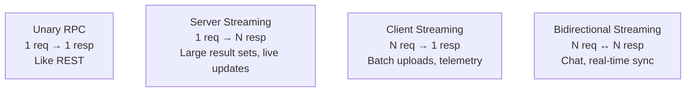
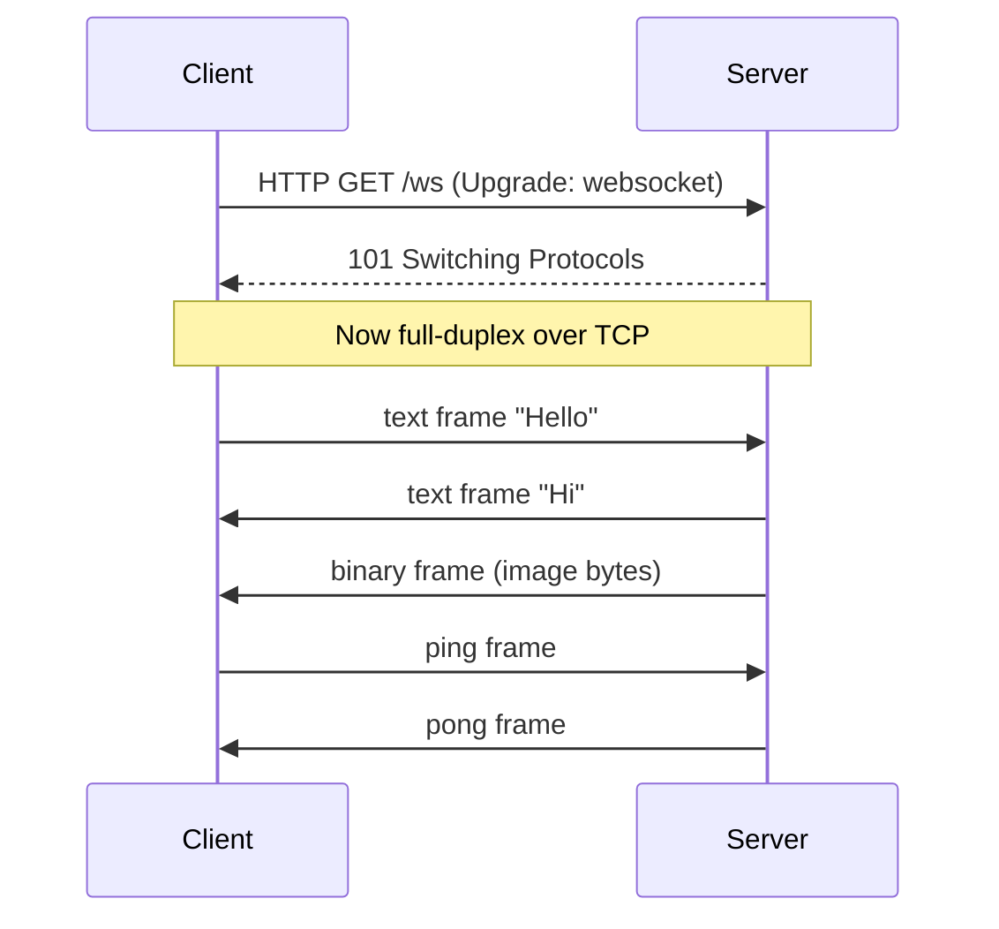
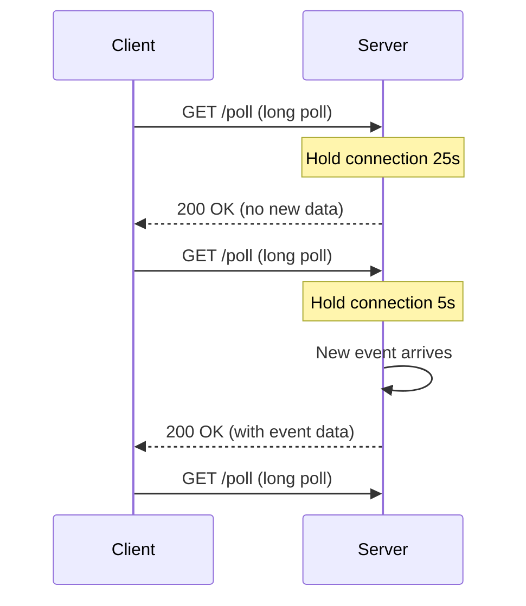
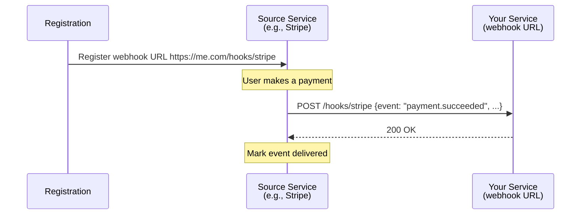
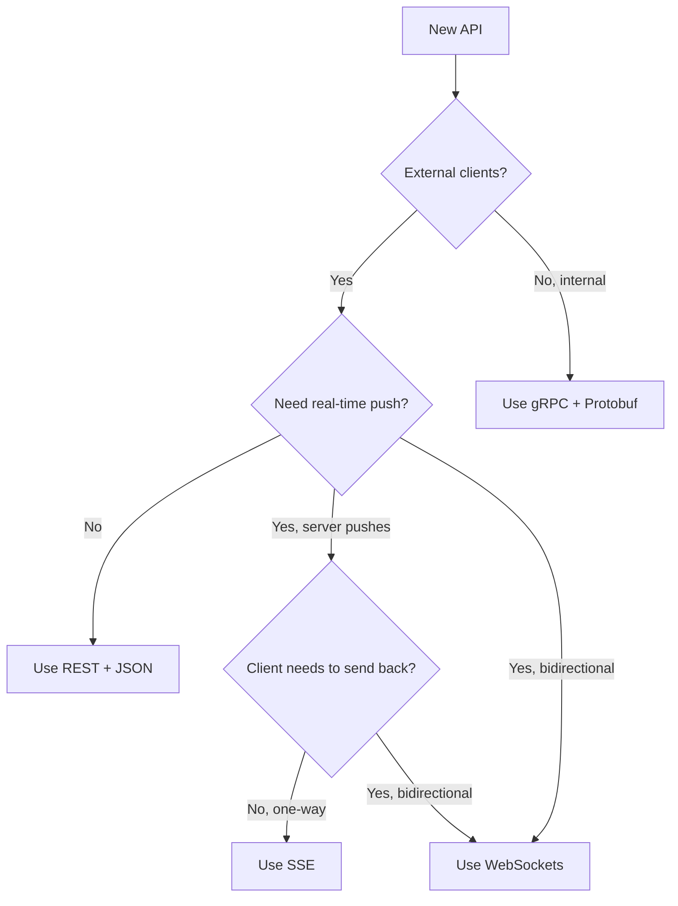

# Chapter 6. API Paradigms and Communication Protocols

> [!abstract] Chapter Goal
> REST and JSON dominate web APIs, but they are not the right tool for every job. gRPC offers strict contracts and bidirectional streaming for internal services. GraphQL lets clients request exactly what they need. WebSockets, SSE, and long polling each solve a different real-time push problem. Webhooks enable event-driven server-to-server communication. And under the hood, the choice of serialization format (JSON vs Protobuf vs Avro) determines your payload size, CPU cost, and schema evolution story. This chapter covers each in depth.

## 1. REST API Style (Quick Recap)

Your original vault covers Django REST Framework in depth, so we will not repeat the basics. We focus on the parts often missed.

### 1.1. REST Maturity Model (Richardson)

Leonard Richardson proposed a 4-level maturity model:

| Level | Description | Example |
|-------|-------------|---------|
| 0 | One endpoint, all operations via POST | SOAP-style RPC over HTTP |
| 1 | Multiple resources, but no HTTP verbs | `POST /createUser`, `POST /deleteUser` |
| 2 | Proper HTTP verbs + status codes | `POST /users`, `DELETE /users/42` |
| 3 | HATEOAS — responses contain links to next actions | `{"id":42,"links":{"self":"/users/42","friends":"/users/42/friends"}}` |

Most "REST" APIs in the wild are at level 2. Level 3 (HATEOAS) is rarely implemented because clients don't take advantage of it; the contract is still implicitly agreed upon out-of-band.

### 1.2. Status Code Discipline

A common bug: returning `200 OK` with an error body. Don't. Use the right status code:

| Code | Meaning | When to Use |
|------|---------|-------------|
| 200 | OK | Successful GET, PUT, DELETE |
| 201 | Created | Successful POST that created a resource |
| 202 | Accepted | Request accepted for async processing |
| 204 | No Content | Successful but no body (e.g., DELETE) |
| 301 | Moved Permanently | Resource has a new URL |
| 304 | Not Modified | Conditional GET; client's cached version is current |
| 400 | Bad Request | Malformed request (validation error) |
| 401 | Unauthorized | Not authenticated |
| 403 | Forbidden | Authenticated but not allowed |
| 404 | Not Found | Resource doesn't exist |
| 409 | Conflict | Version conflict, duplicate creation |
| 422 | Unprocessable Entity | Valid syntax but semantic error |
| 429 | Too Many Requests | Rate limited |
| 500 | Internal Server Error | Bug in your code |
| 502 | Bad Gateway | Upstream returned invalid response |
| 503 | Service Unavailable | Temporarily down (retry later) |
| 504 | Gateway Timeout | Upstream didn't respond |

### 1.3. Versioning Strategies

- **URI versioning**: `/api/v1/users`. Simple, explicit, easy to route. Most common.
- **Header versioning**: `Accept: application/vnd.example.v1+json`. Cleaner URLs, but harder to test in a browser.
- **Query parameter**: `/users?version=1`. Easy to forget; usually avoided.

URI versioning wins in practice because it's trivial to operate (you can run v1 and v2 in parallel, route at the LB).

### 1.4. REST Limitations

- **Over-fetching**: `GET /users/42` returns the full user object even if the client only needs the name.
- **Under-fetching**: getting a user and their friends requires two requests, or a custom `?include=friends` parameter.
- **No streaming**: REST is fundamentally request-response. Real-time updates need a different protocol.
- **No strict schema**: clients don't know the response shape until runtime.

These limitations are exactly what GraphQL and gRPC address.

## 2. GraphQL

GraphQL was developed at Facebook (2012, open-sourced 2015) to solve the over-fetching and under-fetching problems of REST, especially for mobile clients on slow networks.

### 2.1. Core Concepts

- **Schema**: a strongly-typed definition of all data the API can return. The contract.
- **Query**: a read operation. The client specifies exactly which fields it wants.
- **Mutation**: a write operation. Same field-selection semantics.
- **Subscription**: a long-lived stream (over WebSocket) for real-time updates.
- **Resolver**: a server-side function that fetches data for a specific field.

Example schema:
```graphql
type User {
  id: ID!
  name: String!
  email: String!
  friends: [User!]!
}

type Query {
  user(id: ID!): User
  users(limit: Int = 10): [User!]!
}

type Mutation {
  updateUser(id: ID!, name: String): User!
}
```

Example query:
```graphql
query {
  user(id: 42) {
    name
    friends {
      name
    }
  }
}
```

Response:
```json
{
  "data": {
    "user": {
      "name": "Alice",
      "friends": [
        {"name": "Bob"},
        {"name": "Charlie"}
      ]
    }
  }
}
```

The client got exactly the fields it asked for — no more, no less.

### 2.2. Solving Over-fetching and Under-fetching

In REST, getting a user and their friends and their friends' recent posts requires either:
- 3 sequential requests (`/users/42` → `/users/42/friends` → `/users/123/posts`), or
- A custom endpoint `/users/42?include=friends.posts` that the server must special-case.

In GraphQL, it's one query:
```graphql
query {
  user(id: 42) {
    name
    friends {
      name
      posts(limit: 5) {
        title
      }
    }
  }
}
```

The server resolves each field, potentially batching DB queries via DataLoader to avoid N+1.

### 2.3. The N+1 Problem and DataLoader

A naive GraphQL server resolving `user.friends.posts` issues:
- 1 query for the user.
- 1 query for the user's friends.
- N queries (one per friend) for their posts.

This is the classic N+1 problem. **DataLoader** solves it by batching: collect all `posts` requests within a single event-loop tick, then issue one `WHERE user_id IN (...)` query for all of them.

```python
async def batch_load_posts(friend_ids):
    rows = await db.fetch_all("SELECT * FROM posts WHERE user_id = ANY($1)", friend_ids)
    # Group by user_id
    by_user = defaultdict(list)
    for row in rows:
        by_user[row['user_id']].append(row)
    return [by_user[uid] for uid in friend_ids]

post_loader = DataLoader(batch_load_posts)
```

Without DataLoader, GraphQL is unusable for nested queries. With it, GraphQL can be more efficient than REST.

### 2.4. Query Complexity and Depth Limits

A malicious client can submit:
```graphql
query {
  user(id: 42) {
    friends { friends { friends { friends { friends { ... } } } } }
  }
}
```

This recursion can take down the server. Defenses:

- **Depth limiting**: reject queries deeper than N levels (e.g., 10).
- **Query complexity scoring**: assign a cost to each field (1 for scalar, 10 for list, etc.) and reject queries above a threshold.
- **Rate limiting by cost**: each client gets a "query budget" per minute; expensive queries cost more.
- **Persisted queries**: clients send a query hash, not the full query. The server only executes pre-registered queries. This also reduces payload size.

### 2.5. GraphQL Trade-offs

| Aspect | REST | GraphQL |
|--------|------|---------|
| Caching | Easy (HTTP caching, CDN) | Hard (POST body is not cacheable; need persisted queries + edge caches) |
| Versioning | URI versioning | Schema evolution with deprecations |
| Learning curve | Low | Medium-high |
| Tooling | Curl, browser | GraphiQL, Apollo Client |
| Error handling | HTTP status codes | Always 200 OK with `errors` array |
| File uploads | Easy (multipart) | Awkward (multipart spec exists but support varies) |
| Logging | Per-endpoint metrics | Single endpoint, harder to attribute |

GraphQL shines for **client-diverse applications** (web + mobile + smartwatch) where each client wants different fields. It's overkill for a single-client internal API.

## 3. gRPC (Google Remote Procedure Call)

gRPC is a high-performance RPC framework built on HTTP/2 and Protocol Buffers. It is the standard for internal microservice communication at Google, Netflix, Uber, and many others.

### 3.1. Why gRPC Instead of REST+JSON

- **Strict contract**: the `.proto` file defines types and methods. Clients in any language get type-safe stubs.
- **Smaller payloads**: Protobuf binary encoding is 3–10× smaller than JSON.
- **Faster serialization**: Protobuf parsing is 10–100× faster than JSON parsing.
- **HTTP/2 multiplexing**: many concurrent RPCs over one TCP connection.
- **Bidirectional streaming**: native support for server-, client-, and bidi-streaming.
- **Built-in retry, timeout, and metadata**: standardized across implementations.

### 3.2. Defining a Service

```protobuf
syntax = "proto3";

package users.v1;

service UserService {
  rpc GetUser(GetUserRequest) returns (User);
  rpc ListUsers(ListUsersRequest) returns (stream User);
  rpc CreateUsers(stream CreateUserRequest) returns (CreateUsersResponse);
  rpc Chat(stream ChatMessage) returns (stream ChatMessage);
}

message GetUserRequest {
  string id = 1;
}

message User {
  string id = 1;
  string name = 2;
  string email = 3;
  repeated string friend_ids = 4;
}
```

### 3.3. The Four RPC Modes



- **Unary**: like REST. One request, one response. Use for normal RPCs.
- **Server streaming**: client sends one request; server streams many responses. Use for large result sets or live updates (e.g., "stream all new orders").
- **Client streaming**: client streams many requests; server replies once. Use for batch uploads or telemetry aggregation.
- **Bidirectional streaming**: both sides stream independently. Use for chat, real-time sync, interactive sessions.

### 3.4. HTTP/2 Under the Hood

gRPC uses HTTP/2 features heavily:

- **Multiplexing**: many concurrent RPCs on one TCP connection (no head-of-line blocking between RPCs).
- **HPACK header compression**: metadata (auth tokens, tracing IDs) is compressed.
- **Binary framing**: Protobuf-encoded bodies are framed in DATA frames.
- **Trailers**: gRPC returns status codes and error details in HTTP trailers (after the body), enabling streaming responses to convey final status.

### 3.5. Schema Evolution

Protobuf has strict rules for backward-compatible evolution:

- **Adding a field**: safe (old clients ignore unknown fields).
- **Removing a field**: safe if you reserve the field number (`reserved 4;`) so it's never reused.
- **Changing a field type**: risky — must be compatible (e.g., `int32` → `int64` works; `string` → `bytes` may not).
- **Renaming a field**: safe (Protobuf uses field numbers, not names, on the wire).

> [!tip] Always Reserve Removed Field Numbers
> ```protobuf
> message User {
>   reserved 4, 5;
>   reserved "old_field_name";
>   string id = 1;
>   string name = 2;
> }
> ```
> Without `reserved`, a future developer might reuse field 4 for a different purpose, and old clients sending field 4 would silently corrupt the new field.

### 3.6. gRPC Trade-offs

| Aspect | gRPC | REST+JSON |
|--------|------|-----------|
| Browser support | Needs gRPC-Web proxy | Native |
| Human readability | Binary (need tools) | Yes |
| Schema | Strong (.proto) | Weak (OpenAPI optional) |
| Streaming | Native | Needs SSE / WebSocket |
| Performance | Excellent | Moderate |
| Tooling ecosystem | Mature | Huge |

gRPC is **the right default for internal service-to-service communication**. For external public APIs, REST+JSON remains the standard because of browser support and tooling.

### 3.7. gRPC-Web

For browser clients, gRPC-Web is a proxy-based solution: the browser sends a HTTP/1.1 request to an Envoy proxy, which translates to HTTP/2 gRPC for the backend. This loses some performance benefits but keeps the schema and code generation.

## 4. Real-Time Push Communication

REST and gRPC are request-response. For real-time push (chat, live scores, notifications, dashboards), three protocols dominate.

### 4.1. WebSockets

WebSockets provide a **full-duplex, persistent, bidirectional** connection over a single TCP socket. The protocol was standardized in RFC 6455 (2011).

#### 4.1.1. The Upgrade Handshake

A WebSocket connection starts as an HTTP request and is "upgraded":

```http
GET /ws HTTP/1.1
Host: api.example.com
Upgrade: websocket
Connection: Upgrade
Sec-WebSocket-Key: dGhlIHNhbXBsZSBub25jZQ==
Sec-WebSocket-Version: 13
```

Server response:
```http
HTTP/1.1 101 Switching Protocols
Upgrade: websocket
Connection: Upgrade
Sec-WebSocket-Accept: s3pPLMBiTxaQ9kYGzzhZRbK+xOo=
```

After the handshake, the TCP connection is no longer HTTP — it's a raw bidirectional byte stream framed as WebSocket data frames.



#### 4.1.2. Use Cases

- Chat applications (WhatsApp, Discord, Slack).
- Multiplayer games (real-time position updates).
- Collaborative editors (Google Docs, Figma).
- Live trading dashboards.
- Any app needing server-to-client push with low latency AND client-to-server messages.

#### 4.1.3. Operational Challenges

- **Load balancing**: WebSockets are long-lived. A standard L7 LB treats each as a long HTTP request; backends accumulate connections and never release them. Need sticky sessions or a dedicated WebSocket gateway.
- **Scaling**: a single backend can hold ~50,000 WebSocket connections (memory-bound). To support millions, you need a fleet of gateways plus a pub/sub layer to route messages between them. See [[Chapter 17. Case Study Real-Time Chat]].
- **Heartbeats**: intermediaries (proxies, load balancers, NAT) will close idle connections after 30–60 s. Implement ping/pong frames every 20–30 s to keep the connection alive.
- **Reconnection**: clients will disconnect (network drops, mobile backgrounding). Implement exponential backoff reconnection and message buffering on the server during the disconnect window.
- **No native browser API for binary backpressure**: a fast server can swamp a slow browser. Must implement application-level flow control.

### 4.2. Server-Sent Events (SSE)

SSE is a **unidirectional** (server → client) push protocol built on plain HTTP. Standardized in HTML5.

#### 4.2.1. How It Works

The client opens a normal HTTP request:
```http
GET /events HTTP/1.1
Accept: text/event-stream
```

The server keeps the connection open and sends a stream of `text/event-stream` formatted messages:
```
data: First message\n\n
data: Second message\n\n
event: userJoined\ndata: {"name":"Alice"}\n\n
id: 42\ndata: Message with ID\n\n
```

- Each message ends with `\n\n`.
- `event:` sets a custom event type.
- `id:` assigns a message ID; on reconnect, the browser sends `Last-Event-ID: 42` so the server can resume.

#### 4.2.2. Browser API

```javascript
const source = new EventSource('/events');
source.onmessage = (e) => console.log(e.data);
source.addEventListener('userJoined', (e) => console.log(JSON.parse(e.data)));
source.onerror = (e) => { /* auto-reconnects */ };
```

The browser **automatically reconnects** with `Last-Event-ID` if the connection drops. This is a major advantage over WebSockets, where you must implement reconnection yourself.

#### 4.2.3. Use Cases

- Live news feeds, stock tickers, sports scores.
- Notifications (server pushes new alerts).
- Progress bars for long-running operations.
- Any one-way push from server to browser.

#### 4.2.4. Trade-offs vs WebSockets

| Aspect | SSE | WebSocket |
|--------|-----|-----------|
| Direction | Server → client only | Bidirectional |
| Protocol | HTTP | Custom (over TCP) |
| Browser reconnection | Automatic | Manual |
| Throughput | Lower (text-based) | Higher (binary frames) |
| HTTP/2 multiplexing | Yes (multiple SSE per connection) | No |
| Proxy friendliness | Yes (it's HTTP) | Often needs special config |
| Max connections per browser | 6 (HTTP/1.1) | Unlimited |

> [!tip] Prefer SSE for One-Way Push
> If your server only pushes data to the client (no client-to-server messages), SSE is simpler and more reliable than WebSocket. Use WebSocket only when you need true bidirectional communication.

### 4.3. Long Polling

The fallback when WebSockets and SSE are unavailable (e.g., very old browsers or restrictive corporate proxies).

#### 4.3.1. How It Works

The client sends an HTTP request. The server **does not respond immediately** — it holds the connection open until either:
- New data is available, then responds.
- A timeout (e.g., 30 s) expires, then responds with empty data.

The client immediately re-issues the request.



#### 4.3.2. Problems

- **Header overhead**: every poll sends full HTTP headers (cookies, auth, user-agent). Wasteful.
- **Server resource usage**: each open poll consumes a thread or connection. 10,000 long-polling clients = 10,000 open connections.
- **Latency**: from event arrival to client notification, you pay one network RTT (because the client must re-poll after receiving the event).
- **Complexity**: handling disconnects, reconnections, and event ordering across polls is non-trivial.

Use long polling only as a last resort. SSE and WebSocket are almost always better.

## 5. Webhooks

Webhooks are **HTTP callbacks**: you register a URL with another service, and that service POSTs events to your URL when something happens.

### 5.1. The Model



Examples:
- Stripe sends `payment.succeeded` when a charge completes.
- GitHub sends `push` when code is pushed to a repo.
- Slack sends `message` when a new message is posted.
- Shopify sends `order.created` when a customer checks out.

### 5.2. Delivery Guarantees

Most webhook senders use **at-least-once delivery**. This means:
- Your service will receive each event at least once.
- If your service returns a non-2xx response, the sender retries.
- **You may receive duplicates** — your service must be idempotent.

### 5.3. Retry Policies

A typical webhook retry policy:

| Attempt | Delay |
|---------|-------|
| 1 | Immediate |
| 2 | 5 minutes |
| 3 | 30 minutes |
| 4 | 2 hours |
| 5 | 6 hours |
| 6 | 12 hours |
| 7 | 24 hours |

After the final attempt, the event is dropped (or moved to a dead-letter queue). Senders also implement **exponential backoff with jitter** to avoid hammering a slow receiver.

### 5.4. Signature Verification

Without signatures, an attacker could POST a fake "payment.succeeded" event to your webhook URL and get free products. Every webhook sender signs payloads:

```
Stripe-Signature: t=1614556800,v1=5257a869e7ecebeda32affa62cd7e55e124f...
```

The signature is `HMAC-SHA256(timestamp + "." + payload, secret)`. You verify:
1. Recompute the HMAC using your shared secret.
2. Compare with the signature header (constant-time comparison).
3. Reject if mismatched.
4. Optionally check that `t` is within a few minutes of "now" to prevent replay attacks.

```python
import hmac, hashlib, time

def verify_stripe_signature(payload, sig_header, secret, tolerance=300):
    elements = dict(e.split("=") for e in sig_header.split(","))
    t = int(elements["t"])
    v1 = elements["v1"]
    expected = hmac.new(
        secret.encode(),
        f"{t}.{payload}".encode(),
        hashlib.sha256
    ).hexdigest()
    if not hmac.compare_digest(expected, v1):
        raise ValueError("Invalid signature")
    if abs(time.time() - t) > tolerance:
        raise ValueError("Replay attack")
```

> [!danger] Always Verify Webhook Signatures
> Failing to verify signatures is one of the most expensive security bugs you can ship. Real-world example: a SaaS company forgot to verify Stripe signatures; attackers sent fake "subscription.active" events and got free service for years.

### 5.5. Responding Quickly

Your webhook handler should:
1. Verify the signature.
2. Store the event in a queue or database.
3. Return `200 OK` immediately.

Do **not** do heavy processing synchronously. Senders expect a response within 5–30 seconds; if you take longer, they retry, and you get duplicate events. Process the event asynchronously from a worker.

## 6. Data Serialization Formats

The choice of serialization format determines payload size, parsing speed, schema evolution, and human readability.

### 6.1. JSON

- **Encoding**: UTF-8 text.
- **Schema**: optional (JSON Schema exists but rarely used).
- **Size**: large (field names repeated, no compression).
- **Speed**: moderate.
- **Readability**: human-readable.
- **Best for**: public APIs, browser clients, debugging, configuration files.

### 6.2. XML

Largely replaced by JSON for new APIs. Still used in:
- SOAP web services.
- SAML (identity federation — see [[Chapter 11. Modern Identity and Federation]]).
- Office document formats (`.docx`, `.xlsx` are XML).
- SVG graphics.

### 6.3. Protocol Buffers (Protobuf)

- **Encoding**: binary, field-number-based.
- **Schema**: required (`.proto` file).
- **Size**: very small (3–10× smaller than JSON).
- **Speed**: very fast (10–100× faster than JSON).
- **Readability**: not human-readable (need `protoc --decode`).
- **Best for**: gRPC, internal service communication, storage (e.g., Google's internal storage).

#### 6.3.1. Encoding Trick

Protobuf doesn't write field names on the wire — only field numbers. A JSON `{"name":"Alice","age":30}` (24 bytes) becomes a Protobuf message that encodes `field 1 (string) = "Alice"` and `field 2 (varint) = 30` in about 11 bytes.

```
JSON:    {"name":"Alice","age":30}     = 24 bytes
Protobuf: 0a 05 41 6c 69 63 65 10 1e   = 9 bytes
```

#### 6.3.2. Schema Evolution

Protobuf is designed for evolution:
- Add new fields with new numbers — old clients ignore them.
- Remove fields by reserving their numbers.
- Change field types only if wire-compatible (e.g., `int32` → `int64`).

### 6.4. Apache Avro

- **Encoding**: binary.
- **Schema**: required (JSON-defined), but **embedded in the data file** (not sent with every message).
- **Size**: even smaller than Protobuf (no field numbers in the payload; field order is implicit).
- **Speed**: very fast.
- **Best for**: big data storage (Parquet, ORC are derived from Avro concepts), Kafka schemas.

#### 6.4.1. How Avro Differs from Protobuf

Avro's trick: the schema is stored **once** at the start of a data file, then each record is just the values in order, no field names or numbers. To read the file, you need the schema that wrote it.

This makes Avro excellent for batch storage (e.g., a Hadoop file with millions of records — schema stored once) but awkward for individual RPCs (you'd have to send the schema with each message, defeating the purpose). Avro + Schema Registry (Confluent) solves this for Kafka: the schema is registered once, and each message just includes a 4-byte schema ID.

### 6.5. Apache Thrift

Older than Protobuf and Avro. Developed at Facebook (2007). Supports multiple encodings (binary, compact, JSON) and multiple transports (TCP, HTTP). Less common in new projects but still used at Facebook and in some Apache projects (Cassandra's inter-node protocol is Thrift).

### 6.6. MessagePack

A binary JSON alternative. Same data model as JSON (objects, arrays, strings, numbers, booleans, null) but binary-encoded. ~30–50 % smaller than JSON, much faster to parse. No schema. Used by Redis (internally), Sensu, and many others.

### 6.7. Comparison Matrix

| Format | Schema | Size | Speed | Human-Readable | Best For |
|--------|--------|------|-------|----------------|----------|
| JSON | Optional | Large | Moderate | Yes | Public APIs |
| XML | Optional (XSD) | Very Large | Slow | Yes | SOAP, SAML |
| Protobuf | Required (.proto) | Small | Fast | No | gRPC |
| Avro | Required (JSON) | Smallest | Fast | No | Big data, Kafka |
| Thrift | Required | Small | Fast | No | Legacy |
| MessagePack | None | Medium | Fast | No | Drop-in JSON replacement |

## 7. Choosing the Right Protocol



Rules of thumb:
- **External public API**: REST+JSON. Maximum compatibility.
- **Internal microservice**: gRPC+Protobuf. Maximum performance, strong contracts.
- **Mobile API with diverse clients**: GraphQL. Avoid over-fetching on slow networks.
- **Server-to-browser one-way push**: SSE. Simplest, automatic reconnection.
- **Server-to-browser bidirectional**: WebSocket. No alternative.
- **Server-to-server events**: Webhooks. Standard, well-understood.
- **Big data storage**: Avro + Parquet. Smallest, schema-evolution-friendly.

## 8. Tips, Tricks, and Common Pitfalls

> [!tip] Always Set Timeouts on Every Client
> A missing timeout on a gRPC call, HTTP request, or WebSocket read can hang your service forever if the remote is slow. Default to 5–10 s for normal calls; 30–60 s for known-slow operations.

> [!tip] Use Batching on Internal RPCs
> Calling `GetUser` 100 times in a loop is 100× slower than calling `GetUsers([id1, id2, ...])` once. Design internal APIs to accept batches.

> [!warning] Don't Use JSON for Internal High-Throughput Services
> JSON parsing at 100k QPS consumes enormous CPU. Switch to Protobuf or Avro and you'll often cut CPU by 5–10×.

> [!tip] Use Connection Pooling for gRPC
> gRPC multiplexes many calls over one TCP connection. Don't create a new channel per call — reuse a single channel per target host.

> [!warning] Don't Send Tokens in URL Query Parameters
> URLs get logged (access logs, analytics, browser history). Put auth tokens in `Authorization` headers or cookies. This applies to WebSocket too — pass tokens in sub-protocols or initial messages, not in the URL.

> [!tip] Use Idempotency Keys for Mutations
> Network failures cause clients to retry. If a retry creates a duplicate resource, you have a bug. Generate a UUID idempotency key client-side, send it in a header, and dedupe server-side. See [[Chapter 8. Resiliency and Fault Tolerance Patterns]].

> [!warning] GraphQL Is Not Free
> GraphQL moves complexity from the client to the server. A single GraphQL endpoint can be harder to cache, harder to monitor (no per-endpoint metrics), and easier to attack (arbitrary query depth). Use it when the flexibility benefit is real, not just because it's trendy.

## 9. Chapter Summary

- REST is the default for public APIs; version via URI; use correct status codes.
- GraphQL solves over-fetching/under-fetching with a strict schema and client-specified field selection; requires DataLoader to avoid N+1; needs query depth/complexity limits.
- gRPC is the standard for internal services: HTTP/2, Protobuf, four RPC modes (unary, server-stream, client-stream, bidi). Use Protobuf schema evolution rules (reserve removed fields).
- WebSockets: bidirectional, persistent, needs manual reconnection. Use for chat, real-time sync.
- SSE: server-to-client only, automatic browser reconnection, simple. Use for one-way push.
- Long polling: last resort, wasteful.
- Webhooks: server-to-server HTTP callbacks; at-least-once delivery; always verify signatures; respond 200 OK before processing.
- Serialization: JSON for public APIs; Protobuf for gRPC; Avro for big data/Kafka; MessagePack as a JSON replacement.

The next chapter ([[Chapter 7. Message Queues, Pub-Sub and Event-Driven Architectures]]) dives deeper into asynchronous messaging: queue-based vs log-based brokers, pub/sub routing, event-driven architecture lifecycles, CQRS, and Saga patterns for distributed transactions.
