# Chapter 7. Message Queues, Pub-Sub and Event-Driven Architectures

> [!abstract] Chapter Goal
> Your original vault introduces RabbitMQ, Kafka, and the Publisher-Subscriber pattern at a conceptual level. This chapter goes deeper: the operational difference between queue-based and log-based brokers, the AMQP routing model, event-driven architecture lifecycles, CQRS, Event Sourcing, and the Saga pattern for distributed transactions. After this chapter you will understand when to choose RabbitMQ vs Kafka, how to design event payloads, and how to coordinate state changes across microservices without ACID transactions.

## 1. Synchronous vs Asynchronous Communication

### 1.1. Temporal Coupling

In a synchronous call (Service A → HTTP → Service B), the two services are **temporally coupled**. If B is slow, A waits. If B is down, A fails. The caller cannot proceed until the callee responds.

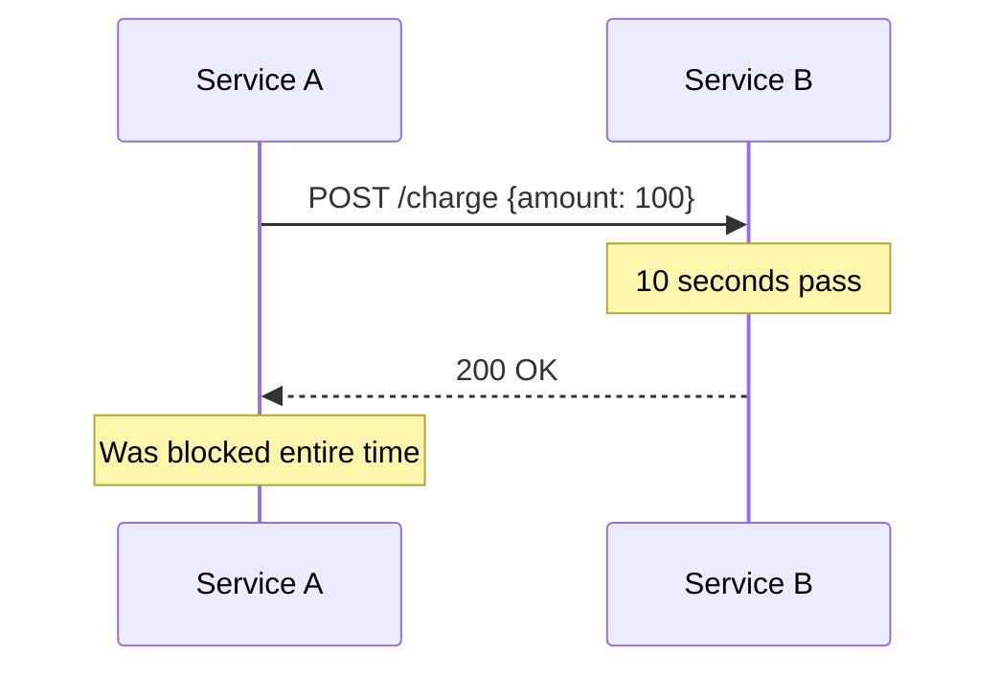

In an asynchronous call (Service A → Queue → Service B), A publishes a message and immediately returns. B picks it up later. A and B are decoupled in time.

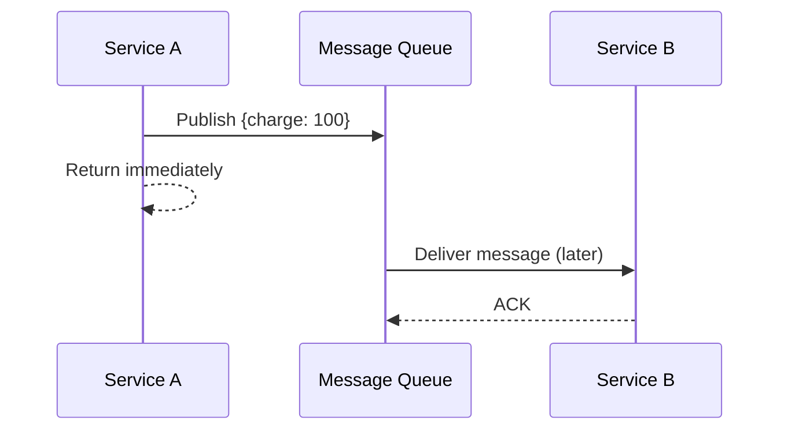

### 1.2. Trade-offs

| Aspect | Synchronous | Asynchronous |
|--------|-------------|--------------|
| Latency to caller | High (must wait) | Low (return immediately) |
| Coupling | Tight (caller needs callee) | Loose (caller needs only queue) |
| Failure handling | Caller must retry | Queue retries automatically |
| Ordering | Natural (request order) | Must be engineered |
| Backpressure | Caller feels it directly | Caller doesn't; queue grows |
| Debugging | Easier (one trace) | Harder (need correlation IDs) |
| User experience | Caller waits for result | Caller gets "we'll process this" |

> [!tip] Default to Synchronous, Switch to Async When Needed
> Asynchronous adds complexity (idempotency, retries, dead-letter queues, ordering). Don't add a message queue unless you have a real reason: long-running work, bursty traffic, decoupling producers from consumers, or fan-out to multiple consumers.

## 2. Queue-Based Brokers (RabbitMQ, SQS)

A queue-based broker models a classic FIFO queue: producers enqueue messages, consumers dequeue them. Once a consumer ACKs a message, it is **deleted** from the queue.

### 2.1. RabbitMQ and AMQP

RabbitMQ implements AMQP 0.9.1 (and 1.0 as a plugin). AMQP has a richer routing model than "just a queue":

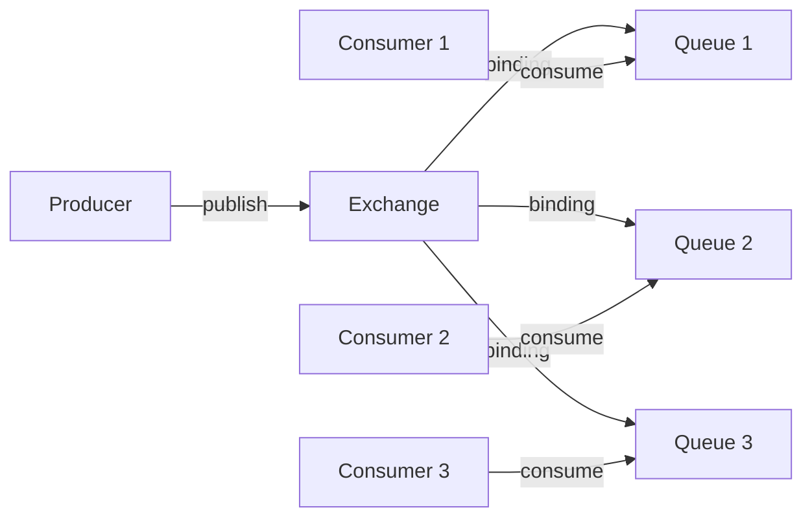

- **Producer** publishes to an **Exchange**, not directly to a queue.
- The **Exchange** routes messages to one or more **Queues** based on the exchange type and **bindings**.
- **Consumers** subscribe to queues.

### 2.2. AMQP Exchange Types

| Type | Routing Logic | Example Use |
|------|---------------|-------------|
| **Direct** | Message goes to queues whose binding key exactly matches the message's routing key | `logs.error` → error queue |
| **Fanout** | Message goes to ALL bound queues, ignoring routing key | Broadcast events to multiple services |
| **Topic** | Routing key matched against wildcard patterns (`*` = one word, `#` = zero or more words) | `logs.*.error` → all error logs |
| **Headers** | Routing based on message headers (any/all match) | Complex routing without key conventions |

Example topic routing:
- Producer sends with routing key `orders.us.premium.created`.
- Queue A bound with `orders.us.*` receives it.
- Queue B bound with `orders.#.created` receives it.
- Queue C bound with `orders.eu.*` does NOT receive it.

### 2.3. Acknowledgments and Dead-Letter Queues

When a consumer receives a message, it must **ACK** it. If the consumer crashes without ACKing, RabbitMQ redelivers the message to another consumer. If the consumer rejects it (NACK), the message can be:
- Requeued (potentially causing an infinite retry loop).
- Dropped.
- Routed to a **Dead-Letter Queue (DLQ)** for inspection.

A DLQ is critical for production: poison messages (those that always crash consumers) would otherwise block the queue forever.

### 2.4. SQS (Simple Queue Service)

AWS SQS is a managed queue-based broker with two modes:

- **Standard**: at-least-once delivery, no ordering guarantee, near-unlimited throughput. Used for most workloads.
- **FIFO**: exactly-once processing, strict ordering per message group, limited to 3000 msgs/s. Used when ordering or deduplication matters.

SQS uses **visibility timeouts**: when a consumer receives a message, it becomes invisible to other consumers for X seconds. The consumer must delete the message within that window; otherwise it becomes visible again and is redelivered. If the consumer crashes mid-processing, the message is automatically redelivered.

## 3. Log-Based Brokers (Kafka, Kinesis)

Kafka and AWS Kinesis are **log-based** brokers. Instead of deleting messages after consumption, they keep an **append-only log** per partition. Consumers track their own position (**offset**) in the log.

### 3.1. Architecture

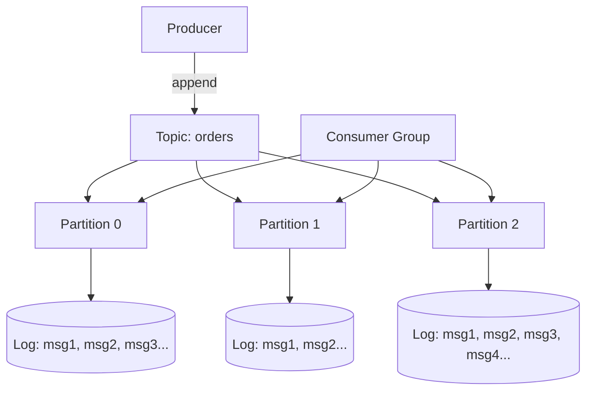

- A **Topic** is a logical stream.
- Each topic is split into **Partitions** (typically 6–100+).
- Each partition is an **append-only, ordered log** stored on disk.
- Producers write to a specific partition (based on key hash or round-robin).
- Consumers in a **Consumer Group** split partitions among themselves — each partition is consumed by exactly one consumer in the group.

### 3.2. Why a Log, Not a Queue?

The log model has powerful properties:

1. **Replayability**: a consumer can rewind its offset and re-process history. Useful for new consumers, bug fixes, or rebuilding a derivative data store.
2. **Multiple independent consumers**: multiple consumer groups can read the same topic independently, each at its own pace. In a queue, once a message is consumed, it's gone.
3. **Ordering within partitions**: messages in the same partition are delivered in the order they were written. (No global ordering across partitions.)
4. **Durability**: messages persist on disk for days/weeks/forever, configurable per topic.
5. **High throughput**: append-only disk writes are very fast (sequential I/O). Kafka can sustain millions of messages per second per cluster.

### 3.3. Partitions and Parallelism

The number of partitions is the **maximum parallelism** for a topic. If a topic has 12 partitions, you can have up to 12 consumers in one consumer group (each handling 1 partition). Adding a 13th consumer does nothing — it sits idle.

> [!tip] Choose Partition Count Carefully
> Too few partitions = limited parallelism. Too many partitions = more overhead (file handles, memory, leader election traffic). Rule of thumb: target 1–10 MB/s per partition; aim for 5–10× your expected consumer count to allow scaling.

### 3.4. Consumer Offsets

Each consumer group tracks its **current offset** in each partition. Kafka stores these offsets in an internal topic `__consumer_offsets`. A consumer can:

- **Auto-commit** offsets periodically (default every 5 s). Easy but risky — if the consumer crashes between processing and commit, you get at-least-once (some messages may be reprocessed).
- **Manual commit** after successful processing. Safer, gives you control over exactly-once semantics.

### 3.5. Replication and Durability

Each partition has **N replicas** (typically 3). One replica is the **leader**; producers and consumers talk to the leader. Followers replicate the leader's log.

- If the leader dies, a follower is elected as the new leader.
- A **min.insync.replicas** setting (usually 2) requires at least that many in-sync replicas to acknowledge a write before considering it committed.
- Producers can choose `acks=0` (fire and forget), `acks=1` (leader only), or `acks=all` (all in-sync replicas). `acks=all` gives the strongest durability.

### 3.6. Kafka vs Kinesis vs Pulsar

| Aspect | Kafka | Kinesis | Pulsar |
|--------|-------|---------|--------|
| Ownership | Open source (Confluent) | AWS managed | Open source (Apache) |
| Architecture | Monolithic brokers | Managed shards | Tiered: brokers + bookies |
| Multi-tenancy | Limited | Native | Native |
| Geo-replication | Manual (MirrorMaker) | Cross-region | Built-in |
| Pricing | Per broker | Per shard hour + per GB | Per broker |
| Best for | Self-hosted, large scale | AWS-only workloads | Multi-region, multi-tenant |

### 3.7. Queue-Based vs Log-Based: When to Choose

| Use Case | Choose |
|----------|--------|
| Task queue (each task processed once, then discarded) | RabbitMQ / SQS |
| Fan-out to many consumers that all need every message | Kafka |
| Replay history (re-build a derived store) | Kafka |
| Strict per-message ordering across all consumers | RabbitMQ (single queue) |
| High throughput (>100k msgs/sec) | Kafka |
| Complex routing (topic patterns, headers) | RabbitMQ |
| Workload with very small messages (<100 bytes) | RabbitMQ |
| Need message retention for days/weeks | Kafka |
| Simplicity above all | SQS |

## 4. Publisher-Subscriber (Pub/Sub) Messaging

Pub/Sub is a **messaging pattern** where producers (publishers) emit messages without knowing who will consume them. A broker routes messages to interested subscribers.

### 4.1. Topic-Based Routing

Subscribers express interest in a topic (a string). All messages published to that topic go to all subscribers.

```
Publishers → Topic "orders.created" → Subscribers A, B, C
Publishers → Topic "orders.cancelled" → Subscribers A, D
```

Used by: Google Cloud Pub/Sub, AWS SNS, MQTT, NATS.

### 4.2. Content-Based Routing

Subscribers express interest in messages matching a predicate:
```
Subscriber A: messages where region = "us"
Subscriber B: messages where amount > 1000
```

Requires the broker to inspect message content. Supported by RabbitMQ (with header exchanges), NATS (with subject patterns), and some stream processors.

### 4.3. Fan-Out Pattern

A single published event is delivered to multiple independent consumer queues, each with its own retry policy, processing rate, and SLA.

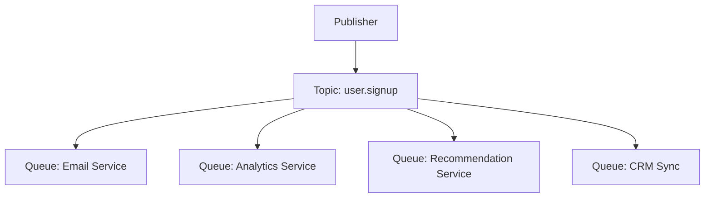

This is the canonical pattern for event-driven microservices: a single event triggers independent downstream actions. Each service can be deployed, scaled, and fail independently.

## 5. Event-Driven Architecture (EDA) Lifecycles

### 5.1. What Is an Event?

An **event** is a record that something happened in the past. Events are immutable — you cannot change history. An event carries:
- **Type** (e.g., `OrderCreated`, `PaymentSucceeded`).
- **Timestamp**.
- **Source** (the service that emitted it).
- **Payload** (the data).
- **Correlation ID** (to trace a single user action across many events).

Contrast with a **command** ("CreateOrder") which is an instruction to do something now. Events are past-tense; commands are imperative.

### 5.2. The Event Lifecycle

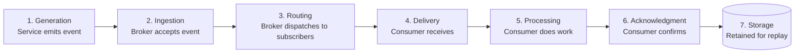

### 5.3. Event Payload Patterns

#### 5.3.1. Event Notification (Lite Payload)

The event contains only an identifier and minimal metadata. Consumers must query the source for details.

```json
{
  "type": "OrderCreated",
  "orderId": "ord_123",
  "timestamp": "2024-01-15T10:30:00Z"
}
```

- **Pros**: small payload, decoupled (consumer schema doesn't need to know order fields).
- **Cons**: requires a synchronous query back to the source (tight coupling in a different way); if the source is down, the consumer can't process.

#### 5.3.2. Event-Carried State Transfer (Full Payload)

The event contains the full state of the entity.

```json
{
  "type": "OrderCreated",
  "orderId": "ord_123",
  "timestamp": "2024-01-15T10:30:00Z",
  "order": {
    "customerId": "cus_456",
    "items": [...],
    "total": 99.99,
    "shippingAddress": {...}
  }
}
```

- **Pros**: consumers are self-sufficient; no need to query back.
- **Cons**: large payloads; consumer schema must match producer's; versioning is harder.

#### 5.3.3. Delta Events

The event contains only the changed fields.

```json
{
  "type": "OrderAddressUpdated",
  "orderId": "ord_123",
  "changes": {
    "shippingAddress": {"street": "123 New St"}
  }
}
```

- **Pros**: small payloads.
- **Cons**: consumers must maintain state to apply deltas; lost events break consistency.

> [!tip] Default to Event-Carried State Transfer
> Unless you have specific bandwidth constraints, send the full state in events. It eliminates synchronous queries back to the source and lets consumers rebuild their views from a log replay. The cost is more bytes per event; the benefit is much simpler consumers.

## 6. Command Query Responsibility Segregation (CQRS)

CQRS is the pattern of **separating the write model from the read model**. In a traditional CRUD app, the same data model handles both writes and reads. CQRS splits them:

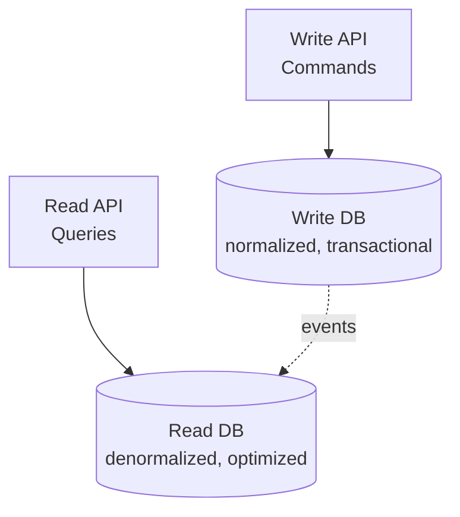

### 6.1. Why CQRS?

Reads and writes have very different access patterns:
- **Writes** need transactions, normalization, validation, business rules.
- **Reads** need denormalization, caching, multiple shapes (by date, by user, by tag), and high throughput.

A single model can serve both, but it's a compromise. CQRS lets each side be optimized independently.

### 6.2. How It Works with Event Sourcing

CQRS often pairs with **Event Sourcing**: instead of storing current state, you store a log of all events that led to the current state. To get current state, you replay the events.

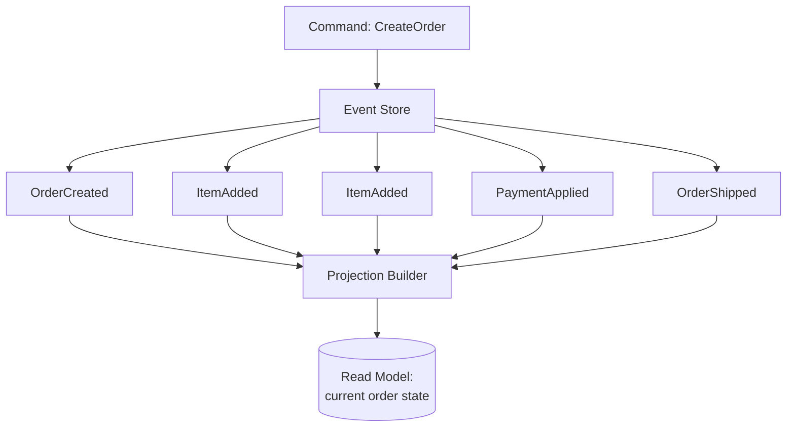

- The **Event Store** is the source of truth — an append-only log of all events.
- The **Read Model** is a projection built from events. It's denormalized and optimized for queries.
- If the read model is corrupted, you can rebuild it by replaying events.

### 6.3. Benefits of Event Sourcing

- **Complete audit trail**: every state change is recorded.
- **Time travel**: query state as of any past time.
- **Replay**: rebuild read models from scratch.
- **Bug analysis**: replay events through a fixed version of code to reproduce bugs.

### 6.4. Drawbacks

- **Complexity**: more moving parts (event store, projections, command handlers).
- **Eventual consistency**: the read model lags the write model by milliseconds to seconds.
- **Schema evolution**: events written years ago must still be readable by current code.
- **No easy deletes**: events are immutable; "deleting" usually means a tombstone event (GDPR complicates this).

> [!warning] Event Sourcing Is Not for Everyone
> Only adopt event sourcing if you genuinely need audit trails, replay, or temporal queries. For most CRUD apps, it adds complexity without proportional benefit. Use CQRS without event sourcing first (separate read model, but normal database for writes).

## 7. Distributed Transactions and the Saga Pattern

### 7.1. Why ACID Doesn't Work Across Services

A traditional database transaction guarantees ACID properties within a single database. But modern microservices each have their own database. A "place order" flow might need to:
1. Create an order in the Orders DB.
2. Charge the customer in the Payments DB.
3. Reserve inventory in the Inventory DB.
4. Send a confirmation email.

If step 3 fails, you must roll back steps 1 and 2. But there is no global transaction coordinator across independent databases.

The two classic solutions are **two-phase commit (2PC)** and the **Saga pattern**.

### 7.2. Two-Phase Commit (Why It Doesn't Scale)

2PC has a coordinator ask all participants to "prepare" the transaction, then "commit" if all agree. Problems:
- **Blocking**: if the coordinator dies, participants hold locks forever.
- **Slow**: every commit takes 2 network round trips.
- **Failure intolerant**: any participant failure blocks the whole transaction.

2PC works inside a single database but is rarely used across services.

### 7.3. Saga Pattern

A Saga is a sequence of local transactions, each with a **compensating action** that undoes its effect. If any step fails, the saga runs compensating actions for all completed steps.

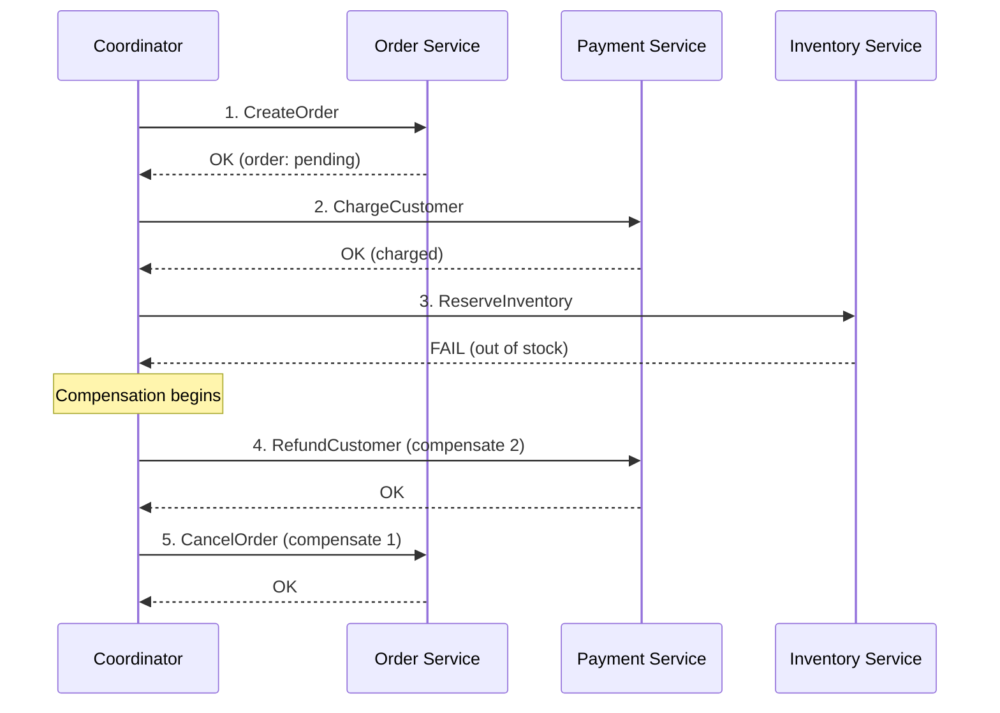

### 7.4. Saga Coordination: Choreography vs Orchestration

#### 7.4.1. Choreography (Decentralized)

Each service listens for events and emits events. No central coordinator.

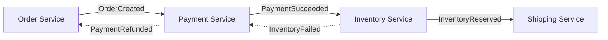

- **Pros**: no single point of failure, services are independent.
- **Cons**: hard to track the workflow; debugging requires correlating events across services; risk of cyclic dependencies.

#### 7.4.2. Orchestration (Centralized)

A dedicated **orchestrator** service tells each service what to do.

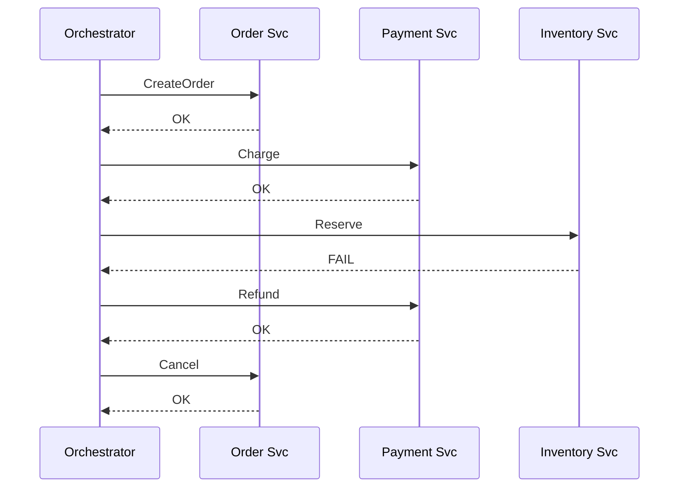

- **Pros**: easy to follow the workflow; central place for retry logic, timeouts, and business rules.
- **Cons**: orchestrator is a SPOF; services become coupled to the orchestrator's API.

> [!tip] Use Orchestration for Complex Sagas
> Choreography is fine for 2–3 services. Beyond that, orchestration is usually cleaner. The orchestrator can be implemented as a state machine (e.g., using Temporal, AWS Step Functions, or Cadence).

### 7.5. Compensating Transactions

A compensating transaction is **not a rollback** in the ACID sense — it's a business-level undo. Examples:

| Step | Compensating Action |
|------|---------------------|
| Charge customer $100 | Refund $100 |
| Reserve 5 units of inventory | Release 5 units |
| Send welcome email | (cannot unsend; usually no compensation, or send "sorry" email) |
| Create user account | Mark as deleted (GDPR may require hard delete) |

Some actions cannot be compensated (sending an email, shipping a package). Sagas must be designed so that all undoable steps happen before any non-undoable step.

### 7.6. Isolation and Anomalies

Sagas do not provide isolation. Intermediate states are visible to other transactions. Anomalies:

- **Dirty read**: another transaction sees the order before payment succeeds.
- **Lost update**: two sagas modify the same inventory item.
- **Phantom read**: a query returns different rows at different points in the saga.

Defenses:
- **Semantic locks**: mark records as "pending" until the saga completes.
- **Commutative operations**: design updates so order doesn't matter (e.g., `balance += 100` is commutative; `balance = 100` is not).
- **Reordering**: do risky steps (inventory reservation) before sure steps (charge).

## 8. Tips, Tricks, and Common Pitfalls

> [!tip] Always Set a Message TTL
> Messages stuck in a queue forever consume memory and disk. Set a TTL (e.g., 7 days) so old messages are dropped or moved to a DLQ.

> [!tip] Use Correlation IDs Everywhere
> Generate a UUID at the start of each user action and propagate it through every event, log, and service call. Without correlation IDs, tracing a single user action across 5 services is impossible.

> [!warning] Don't Block on Synchronous Calls Inside a Consumer
> If a Kafka consumer makes a synchronous HTTP call for each message, you've reintroduced temporal coupling. Either use async calls or accept that your consumer throughput is bounded by the slowest downstream service.

> [!tip] Idempotent Consumers Are Mandatory
> At-least-once delivery means consumers will receive duplicates. The consumer must be idempotent — processing the same message twice must produce the same result as processing it once. Use the event ID as a deduplication key in a database.

> [!warning] Beware of Consumer Lag
> If your Kafka consumer can't keep up with the producer, its offset falls behind. This is **consumer lag**, and it's the #1 operational metric for Kafka. Monitor it; if it grows, scale consumers (add partitions if needed) or optimize the consumer code.

> [!tip] Design Events for Evolution
> - Use a `schema_version` field.
> - Add new fields as optional.
> - Never rename or remove existing fields (deprecate instead).
> - Use a schema registry (Confluent, AWS Glue) to enforce compatibility.

> [!tip] Don't Make Events Too Coarse
> A single `OrderUpdated` event covering all changes forces consumers to diff old and new state. Instead, emit specific events: `OrderAddressChanged`, `OrderItemAdded`, `OrderStatusChanged`. Consumers subscribe only to what they care about.

## 9. Chapter Summary

- Synchronous = simple but coupled. Asynchronous = complex but resilient.
- Queue-based brokers (RabbitMQ, SQS) delete on ACK; good for task queues.
- Log-based brokers (Kafka, Kinesis) keep messages; good for event streams, replay, multiple consumers.
- AMQP offers rich routing: direct, fanout, topic, header exchanges.
- Pub/Sub is the pattern; topic-based is simple, content-based is flexible.
- Events come in three flavors: notification (lite), state transfer (full), delta (changes).
- CQRS separates write and read models; event sourcing stores changes as an immutable log.
- Saga pattern coordinates distributed transactions with compensating actions; orchestration is preferred for complex flows.
- Always: correlation IDs, idempotent consumers, message TTL, schema versioning, consumer lag monitoring.

The next chapter ([[Chapter 8. Resiliency and Fault Tolerance Patterns]]) covers how to keep services alive when their dependencies fail: rate limiting algorithms, circuit breakers, bulkheads, retry with backoff and jitter, and idempotency engines.
