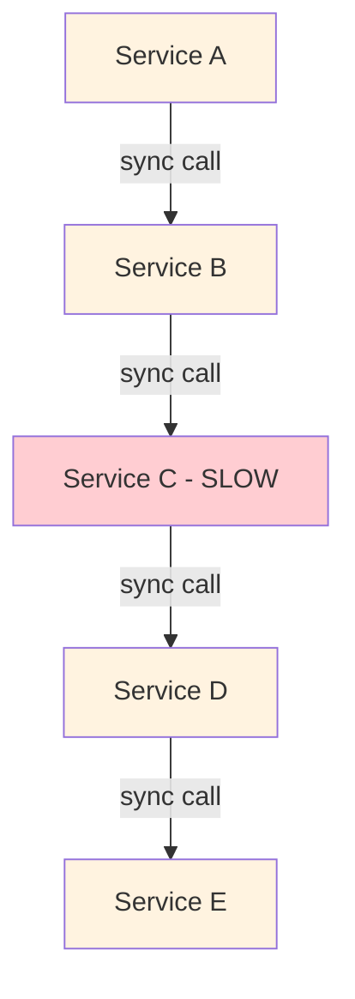
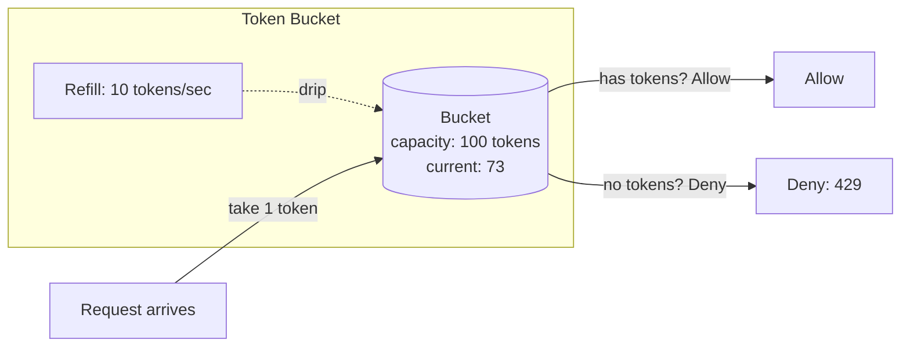
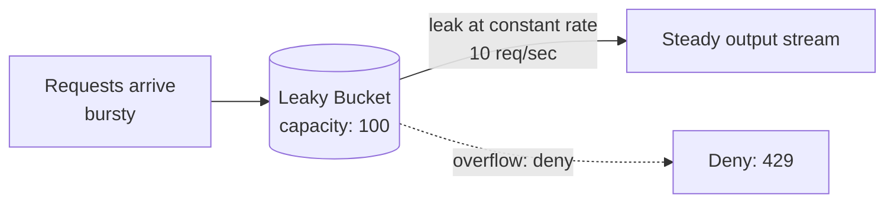
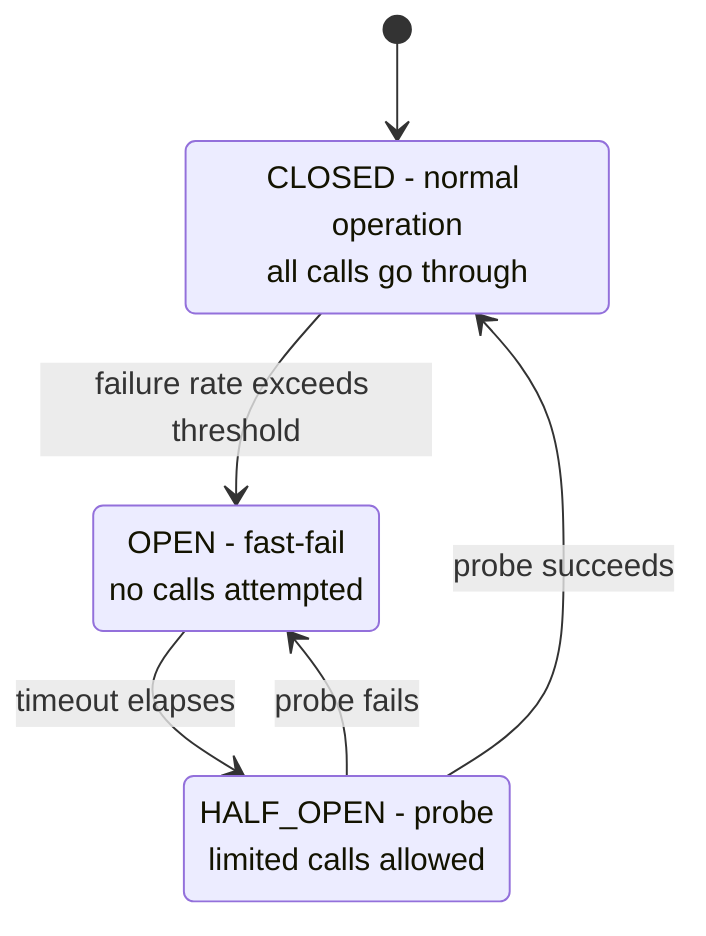
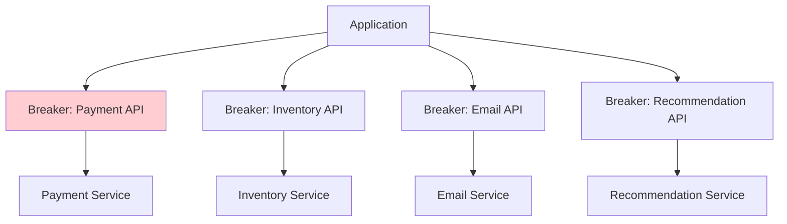
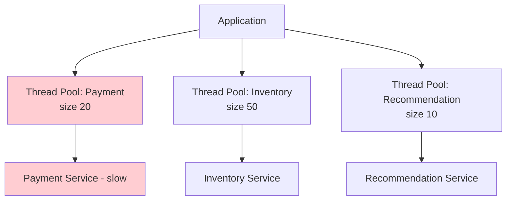
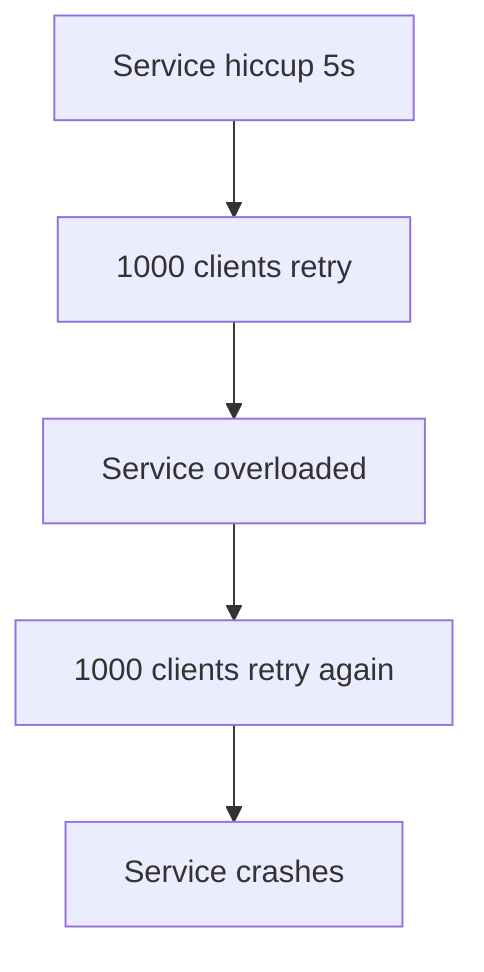
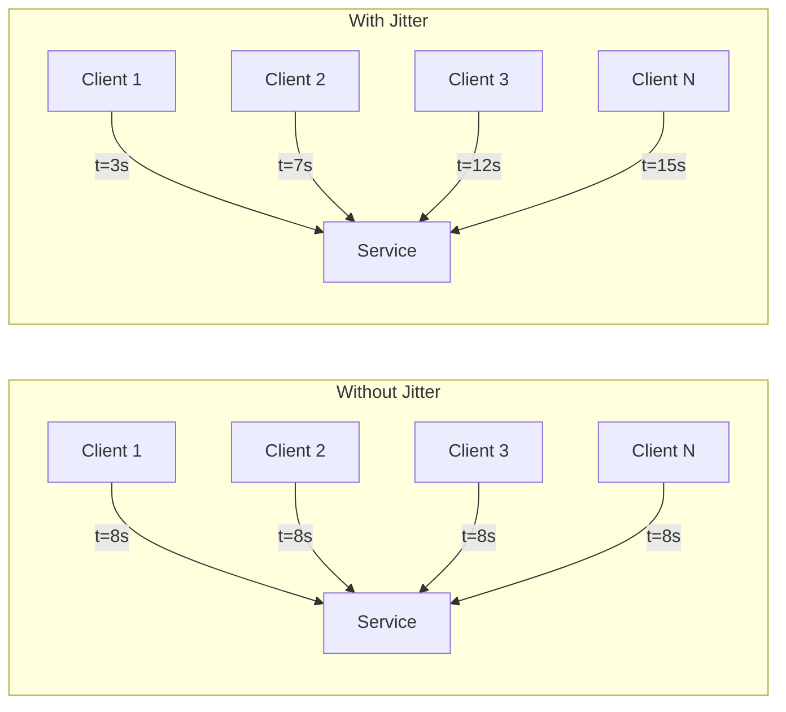
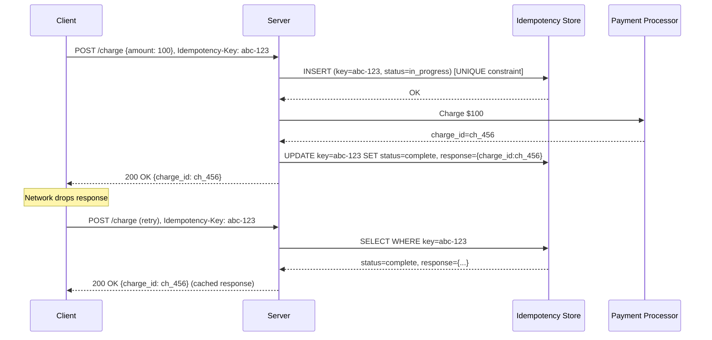
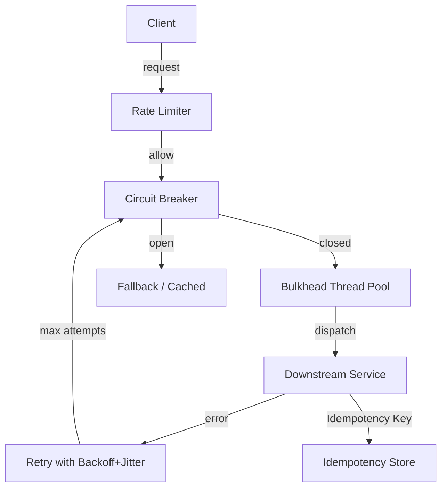

# Chapter 8. Resiliency and Fault Tolerance Patterns

> [!abstract] Chapter Goal
> Distributed systems fail in patterns: cascading failures, retry storms, thundering herds, poison messages, and overload collapse. This chapter covers the standard resiliency patterns that prevent these failures: rate limiting algorithms (Token Bucket, Leaky Bucket, Sliding Window), Circuit Breakers, Bulkheads, Retry with Exponential Backoff and Jitter, and Idempotency Engine design. Mastering these patterns is the difference between a service that survives a dependency outage and one that takes down the entire stack.

## 1. Why Resiliency Patterns Matter

In a distributed system, **every dependency will fail** at some point. Networks partition, databases crash, third-party APIs rate-limit you, disks fill up, DNS goes wonky. A naive service makes a synchronous call to a dependency, the dependency gets slow, the caller blocks waiting, the caller's thread pool fills up, the caller itself becomes slow, the caller's callers block... and the entire system collapses in a cascade.



The cascade above is the **cascading failure** pattern. A single slow service can take down the whole graph in seconds. The patterns in this chapter exist to break these cascades.

## 2. Rate Limiting Algorithms

Rate limiting protects services from being overwhelmed by too many requests. It is also used to enforce **fairness** (each user gets equal access) and **business rules** (free tier = 100 req/day).

The core question every rate limiter answers: **"Should I allow this request now, given the recent request history?"**

### 2.1. Token Bucket

The Token Bucket is the most common rate-limiting algorithm. It models a bucket that holds tokens, refilled at a constant rate.



**Algorithm**:
- Bucket capacity = `B` (max burst size).
- Refill rate = `R` tokens/sec.
- Each request consumes 1 token.
- If the bucket has ≥1 token, consume and allow.
- If the bucket is empty, deny (or queue).

**Properties**:
- **Bursty up to capacity**: if 100 tokens accumulate, 100 requests can be served instantly.
- **Long-term average rate = R**: over time, throughput is bounded by R tokens/sec.
- **Memory efficient**: just two numbers (current tokens, last refill time).

```python
class TokenBucket:
    def __init__(self, capacity, refill_rate):
        self.capacity = capacity
        self.refill_rate = refill_rate
        self.tokens = capacity
        self.last_refill = time.time()

    def allow(self):
        now = time.time()
        elapsed = now - self.last_refill
        self.tokens = min(self.capacity, self.tokens + elapsed * self.refill_rate)
        self.last_refill = now
        if self.tokens >= 1:
            self.tokens -= 1
            return True
        return False
```

**Use case**: APIs that should allow bursts but enforce an average rate. E.g., "100 req/min average, but allow 50-req bursts".

### 2.2. Leaky Bucket

The Leaky Bucket models a bucket that **leaks** at a constant rate. Requests arrive (are added to the bucket) and are processed (leak out) at a fixed rate.



**Algorithm**:
- Bucket capacity = `B`.
- Leak rate = `L` req/sec (constant output).
- Each request arrives → add to bucket.
- If bucket is full, deny the new request.
- A separate process "leaks" requests out at constant rate L.

**Properties**:
- **Strict constant output rate**: regardless of input burstiness, output is steady.
- **No bursts allowed** (unlike token bucket).
- Often implemented as a FIFO queue with a constant-rate consumer.

**Use case**: when downstream requires a steady input rate (e.g., calling a third-party API that bans bursts). Leaky bucket smooths your traffic to a constant rate.

### 2.3. Sliding Window Log

The Sliding Window Log keeps a timestamp for every request in the current window. To decide if a new request is allowed, count requests in the last `T` seconds.

**Algorithm**:
- Maintain a sorted list of timestamps of recent requests.
- On new request: drop timestamps older than `now - T`.
- If list size < limit: append timestamp, allow.
- Else: deny.

**Properties**:
- **Very accurate**: exact count in the window, no approximation.
- **Memory-intensive**: stores every timestamp. At 10k req/sec for a 60 s window, that's 600k timestamps per user.
- **Slow**: O(N) cleanup of old timestamps (mitigated with a deque).

**Use case**: when you need exact rate enforcement and have memory to spare. Rarely used at scale.

### 2.4. Sliding Window Counter

A hybrid: divide time into fixed windows (e.g., 1-minute buckets), and estimate the count in the "current" sliding window using a weighted average of the current and previous buckets.

```
estimated_count = current_bucket_count + previous_bucket_count * (overlap_fraction)
```

If the sliding window is 1 minute and we're 30 seconds into the current minute:
```
estimated = current_minute_count + previous_minute_count * (30/60) = current + 0.5 * prev
```

**Properties**:
- **Memory efficient**: 2 counters per user.
- **Approximate**: up to ~10 % error near window boundaries.
- **Smooth** at window boundaries (no sudden jumps like fixed-window counters).

**Use case**: production rate limiters at scale (Stripe, AWS). Good balance of accuracy and efficiency.

### 2.5. Fixed Window Counter

The simplest: divide time into fixed windows (e.g., 1-minute buckets). Count requests per window. Reset to 0 at window boundaries.

**Properties**:
- Trivially simple.
- **Burst at boundaries**: a user can make 2× the limit by sending requests at 11:59:59 and 12:00:01.
- Use only for non-critical limits.

### 2.6. Distributed Rate Limiting

All algorithms above are per-process. In a distributed system, you need a **shared** counter.

**Approach 1: Redis**
```python
# Token bucket in Redis
key = f"ratelimit:{user_id}"
script = """
local tokens = tonumber(redis.call('get', KEYS[1]) or capacity)
local last_refill = tonumber(redis.call('get', KEYS[2]) or 0)
-- ... refill logic ...
if tokens >= 1 then
  redis.call('set', KEYS[1], tokens - 1)
  return 1
else
  return 0
end
"""
allowed = redis.eval(script, [key, key+":ts"], [capacity, refill_rate])
```

Lua scripts run atomically in Redis, so this is race-free.

**Approach 2: Token server**
A dedicated service hands out tokens. Each instance asks for a batch of 100 tokens; once it uses them, asks for more. Reduces Redis load at the cost of slight over-allowing at the edges.

**Approach 3: Client-side + server-side**
- Client-side: each client rate-limits itself (token bucket with capacity = your share).
- Server-side: enforces the global limit.
- Two-layer defense: client-side reduces server load; server-side catches abusers.

### 2.7. Rate Limit Response Conventions

When denying, return:
- HTTP `429 Too Many Requests`.
- `Retry-After: <seconds>` header indicating when to retry.
- Optionally, `X-RateLimit-Limit`, `X-RateLimit-Remaining`, `X-RateLimit-Reset` headers for transparency.

```http
HTTP/1.1 429 Too Many Requests
Content-Type: application/json
Retry-After: 30
X-RateLimit-Limit: 100
X-RateLimit-Remaining: 0
X-RateLimit-Reset: 1614556830

{
  "error": "rate_limit_exceeded",
  "message": "You have sent too many requests. Please retry after 30 seconds."
}
```

> [!tip] Always Include Retry-After
> Without `Retry-After`, clients retry immediately, making the rate limit worse. The header tells well-behaved clients to back off.

## 3. Circuit Breakers

A Circuit Breaker is a state machine that wraps a remote call. When the remote service starts failing, the breaker "trips" and fast-fails subsequent calls without even attempting them — giving the remote service time to recover.

### 3.1. The Three States



- **CLOSED**: normal operation. All calls go through. Track successes and failures.
- **OPEN**: fast-fail. No calls are made. Return immediately with an error or fallback. This protects the struggling remote service from further load.
- **HALF_OPEN**: trial period. Allow a small number of probe calls. If they succeed, transition to CLOSED. If they fail, transition back to OPEN.

### 3.2. Configuration Parameters

| Parameter | Typical Value | Effect |
|-----------|---------------|--------|
| `failure_rate_threshold` | 50 % | Trip when X% of recent calls fail |
| `minimum_calls` | 20 | Don't trip until this many calls have been observed |
| `sliding_window_size` | 100 | Consider the last 100 calls |
| `wait_duration_in_open_state` | 30 s | How long to stay OPEN before HALF_OPEN |
| `permitted_calls_in_half_open` | 3 | How many probes to allow in HALF_OPEN |
| `slow_call_duration_threshold` | 2 s | A call taking longer than this counts as "slow" |
| `slow_call_rate_threshold` | 80 % | Trip when X% of calls are slow |

### 3.3. Fallback Strategies

When the breaker is OPEN, what do you return?

- **Cached data**: return the last known good value from a cache.
- **Default value**: return a sensible default (empty list, default config).
- **Error**: return a `503 Service Unavailable` with `Retry-After`.
- **Alternative service**: route to a backup service (e.g., a degraded recommendations service).

```python
def get_recommendations(user_id):
    try:
        return circuit_breaker.call(lambda: recommendations_service.get(user_id))
    except CircuitOpenError:
        # Fallback: return cached or default
        return cache.get(f"recs:{user_id}") or DEFAULT_RECS
```

### 3.4. Per-Dependency Breakers

Each remote dependency should have its own breaker. A failing payment service should not trip the breaker for the recommendation service.



If the Payment service is down, CB1 opens. The app still serves pages with inventory, email, and recommendations — only payment is degraded.

### 3.5. Common Implementations

- **Java**: Resilience4j (the modern replacement for Netflix Hystrix).
- **.NET**: Polly.
- **Go**: sony/gobreaker, Hystrix-Go.
- **Python**: pybreaker, circuitbreaker.
- **Service mesh**: Istio and Linkerd can enforce circuit breakers at the proxy layer (Envoy), so your application code is unaware.

## 4. Bulkheads

The Bulkhead pattern **isolates resources** so that a failure in one part of the system cannot consume all resources and bring down the rest. The name comes from ship design: a ship's hull is divided into watertight compartments (bulkheads); if one is breached, the others keep the ship afloat.

### 4.1. Thread Pool Bulkheads

Use separate thread pools for different downstream services:



If the payment service is slow, all 20 payment threads are blocked — but the 50 inventory threads and 10 recommendation threads keep serving their requests. The application degrades gracefully instead of fully locking up.

Without bulkheads, a single shared thread pool means a slow payment service consumes all threads, and inventory/recommendation requests also fail.

### 4.2. Connection Pool Bulkheads

Same idea for database connections, HTTP client connections, etc. Don't share a single connection pool across services; give each downstream its own pool.

### 4.3. Resource Quotas in Kubernetes

Kubernetes offers bulkheads at the pod level via resource limits:
```yaml
resources:
  requests:
    cpu: 500m
    memory: 512Mi
  limits:
    cpu: 1000m
    memory: 1Gi
```

Each pod has its own CPU and memory budget. A misbehaving pod cannot starve its neighbors (mostly — see noisy neighbor problems in multi-tenant clusters).

### 4.4. Queue-Based Bulkheads

Separate message queues per consumer type. A backlog in the email queue doesn't block the order-processing queue.

### 4.5. Bulkheads vs Circuit Breakers

| Aspect | Circuit Breaker | Bulkhead |
|--------|------------------|----------|
| Goal | Stop calling failing services | Isolate resources per service |
| Trigger | Failure rate | Always on |
| Effect | Fast-fail calls to a service | Limit threads/connections to a service |
| Use together? | Yes — bulkheads contain, breakers disconnect |

## 5. Retries with Exponential Backoff and Jitter

Networks are unreliable. Retrying failed requests is essential, but naive retries make things worse.

### 5.1. The Retry Storm Problem

Suppose 1,000 clients are talking to your service. The service has a brief 5-second hiccup. All 1,000 clients get errors and retry immediately. Now your service gets 1,000 *additional* requests on top of the already-failing load. The hiccup becomes a full outage.



### 5.2. Exponential Backoff

Each retry waits longer than the previous one:
```
attempt 1: immediate
attempt 2: wait 1s
attempt 3: wait 2s
attempt 4: wait 4s
attempt 5: wait 8s
```

Formula: `delay = base * 2^attempt`

This spreads retries over time. After 5 attempts, retries are spread over 15 seconds — giving the service time to recover.

### 5.3. Jitter (the Missing Piece)

Even with exponential backoff, 1,000 clients all retrying at the same exponential intervals creates synchronized spikes. **Jitter** adds randomness to break the synchronization.

```python
def backoff_with_jitter(attempt, base=1, cap=60):
    delay = min(cap, base * 2 ** attempt)
    jitter = random.uniform(0, delay)
    return jitter
```

With full jitter, retry 5 waits a random time between 0 and 16 seconds. 1,000 clients now retry at 1,000 different times — the load is smoothed.



### 5.4. Jitter Strategies

AWS published a famous paper ("Exponential Backoff and Jitter") analyzing strategies:

| Strategy | Formula | Notes |
|----------|---------|-------|
| No jitter | `min(cap, base * 2^n)` | Synchronized spikes |
| Full jitter | `random(0, min(cap, base * 2^n))` | Best at spreading load |
| Equal jitter | `(min(cap, base * 2^n) / 2) + random(0, .../2)` | Balanced |
| Decorrelated jitter | `min(cap, random(base, prev * 3))` | Avoids very short retries |

**Full jitter** is the default choice for most systems.

### 5.5. Retry Budgets

Retries multiply traffic. If 1 % of requests fail and every request retries 3 times, retry traffic is 3 % extra. If 50 % of requests fail, retries double the load — making the failure worse.

A **retry budget** limits the fraction of total traffic that can be retries. For example: "if 10 % of requests are retries, stop retrying". This prevents retry-driven collapse.

Implementations:
- Per-client: track recent retry count; stop retrying if above budget.
- Per-service: a shared counter tracks retry rate; the load balancer drops retries when the budget is exhausted.

### 5.6. What to Retry

- **Transient failures**: network timeouts, connection resets, 5xx errors.
- **Idempotent operations**: GET, PUT, DELETE (safe to retry).
- **Non-idempotent with idempotency key**: POST with an idempotency key (see §6) is safe.

### 5.7. What NOT to Retry

- **4xx errors**: the request is wrong; retrying won't help.
- **Non-idempotent POSTs without idempotency key**: could create duplicate resources.
- **Long-running operations**: don't retry a 30-second operation after 29 seconds.

## 6. Idempotency Engine Design

Idempotency means: **calling the same operation multiple times has the same effect as calling it once**. This is critical for retries — if a client retries a payment, you must not charge the customer twice.

### 6.1. Why Idempotency Matters

Without idempotency:
- Client sends `POST /charge` → request times out → client retries → you charge twice.
- Message queue redelivers a message → consumer processes it twice → user gets two emails.
- Network failure mid-write → client retries → database has duplicate rows.

With idempotency:
- Client sends `POST /charge` with `Idempotency-Key: abc-123` → times out → retries with same key → server recognizes the key, returns the original result without re-charging.

### 6.2. The Idempotency Key Pattern



### 6.3. Implementation Details

#### 6.3.1. The Idempotency Store

A database table:
```sql
CREATE TABLE idempotency_keys (
    key TEXT PRIMARY KEY,
    request_hash TEXT NOT NULL,  -- hash of request body, to detect mismatches
    status TEXT NOT NULL,        -- in_progress, complete, failed
    response JSONB,              -- cached response
    created_at TIMESTAMP NOT NULL,
    expires_at TIMESTAMP NOT NULL
);
CREATE INDEX ON idempotency_keys (expires_at);
```

The `key` column has a UNIQUE constraint. Attempts to INSERT a duplicate fail atomically — this is how we detect a retry.

#### 6.3.2. Request Hash Verification

If a client sends the same key but a different request body, that's a bug (or an attack). The server should reject:
```python
existing = db.fetch("SELECT request_hash FROM idempotency_keys WHERE key = %s", key)
if existing and existing.request_hash != hash(current_body):
    return 422  # idempotency key conflict
```

#### 6.3.3. Handling In-Flight Requests

If a request is currently being processed (status = `in_progress`), a concurrent retry should wait, not return a cached response (which doesn't exist yet) or 409.

```python
for _ in range(30):
    row = db.fetch("SELECT status, response FROM idempotency_keys WHERE key = %s", key)
    if row.status == "complete":
        return row.response
    if row.status == "failed":
        return error
    time.sleep(0.1)  # in progress, wait
return 408  # timeout
```

#### 6.3.4. TTL and Cleanup

Idempotency keys should expire after some time (24 hours is typical). Older keys are deleted by a background job.

```python
db.execute("DELETE FROM idempotency_keys WHERE expires_at < NOW()")
```

### 6.4. Idempotency by Design (Without a Store)

Some operations are naturally idempotent without a store:

- **PUT with a client-provided ID**: `PUT /users/abc-123` with full body. Re-running produces the same state.
- **DELETE**: `DELETE /users/42` is idempotent — deleting twice leaves the user in the same (deleted) state.
- **Append-only with key**: `INSERT INTO events (id, ...) VALUES (uuid, ...) ON CONFLICT (id) DO NOTHING`.
- **State machines**: transitioning `order.status` from `pending` to `paid` is idempotent if you check the current state first.

> [!tip] Make All Mutations Idempotent
> Design your API so that every mutation can be retried safely. Use client-generated IDs (UUIDs) for new entities. Use idempotency keys for actions (charge, transfer, send email). This eliminates an entire class of bugs.

## 7. Failure Modes and Combination Patterns

These patterns work best together:



A well-designed client:
1. Checks rate limit (reject if over).
2. Checks circuit breaker (fast-fail or fallback if open).
3. Acquires a thread from the bulkhead (reject if pool full).
4. Sends the request with an idempotency key.
5. On failure, retries with exponential backoff + jitter.
6. After max retries, marks the circuit breaker as failed.

## 8. Tips, Tricks, and Common Pitfalls

> [!tip] Fail Fast
> When a dependency is down, return errors immediately. Don't queue requests hoping the service recovers — that just delays failures and consumes resources.

> [!warning] Don't Retry Without Backoff
> Immediate retries amplify failures. Always use exponential backoff with jitter.

> [!tip] Set Aggressive Timeouts
> A 30-second timeout means a single slow request consumes a thread for 30 seconds. Set timeouts to 1–5 seconds for normal calls; 30 seconds only for known slow operations.

> [!warning] Watch Out for Cascade-Prone Defaults
> Many HTTP clients default to infinite retries or no timeouts. Always explicitly set: `timeout`, `max_retries`, `backoff_strategy`. Don't ship with defaults.

> [!tip] Use a Service Mesh for Cross-Cutting Concerns
> Tools like Istio and Linkerd enforce timeouts, retries, and circuit breakers at the proxy layer. Your application code becomes simpler, and the policies are uniform across services.

> [!tip] Test Your Fallbacks
> A fallback that has never been tested will fail when you need it. Inject failures in staging (Chaos Engineering) and verify your circuit breakers open, fallbacks return correct data, and bulkheads contain failures.

> [!warning] Don't Put Rate Limit Logic in Application Code Only
> Application-level rate limiting is easy to bypass (just hit a different instance). Use a shared store (Redis) or a gateway-level limiter (API gateway, CDN) so the limit is enforced globally.

## 9. Chapter Summary

- Rate limiting algorithms: Token Bucket (bursty), Leaky Bucket (steady), Sliding Window Log (exact, memory-heavy), Sliding Window Counter (good default), Fixed Window (avoid).
- Distributed rate limiting requires a shared store (Redis with Lua scripts) or a dedicated service.
- Circuit Breaker has three states: CLOSED (normal), OPEN (fast-fail), HALF_OPEN (probe). Use per-dependency breakers with fallbacks.
- Bulkheads isolate thread/connection pools per dependency, preventing one slow service from consuming all resources.
- Retries must use exponential backoff AND jitter. Add retry budgets to prevent retry storms.
- Idempotency keys let you retry safely. Store keys with status (in_progress, complete, failed) and cached responses.
- Combine all patterns: rate limiter → circuit breaker → bulkhead → request with idempotency key → retry with backoff.
- Fail fast, test fallbacks, use chaos engineering to verify resiliency.

The next chapter ([[Chapter 9. High Availability and Redundancy]]) zooms out to system-level availability: the "nines" math, SPOF analysis, active-passive vs active-active failover, and the SLA/SLO/SLI hierarchy.
