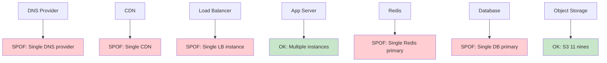
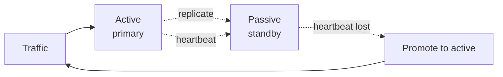
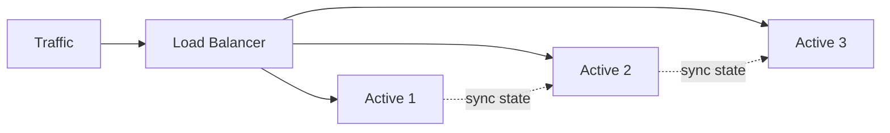
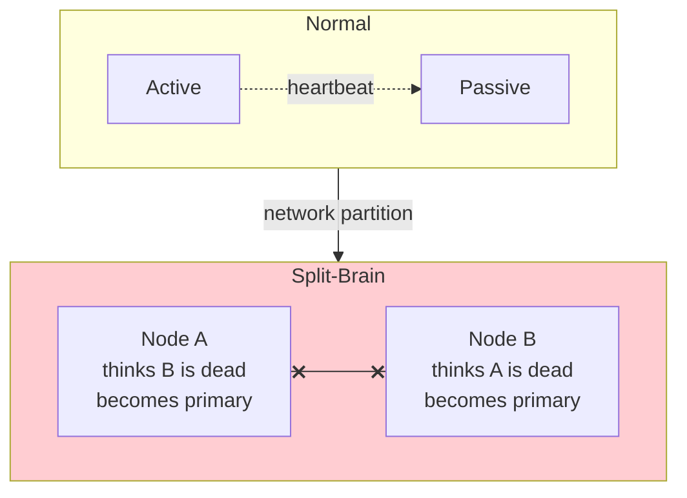
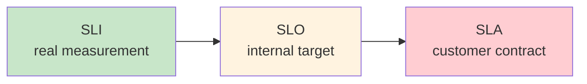
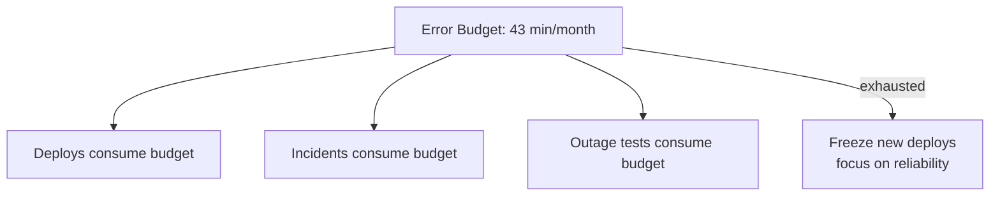
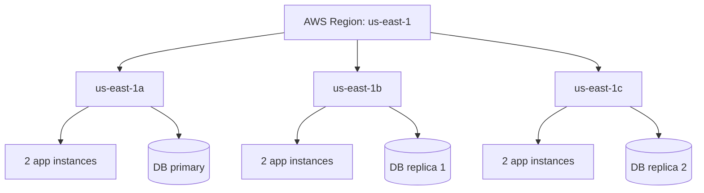

# Chapter 9. High Availability and Redundancy

> [!abstract] Chapter Goal
> Availability is the percentage of time a system is operational and serving users correctly. The industry expresses availability in "nines" (99.9 %, 99.99 %, 99.999 %), each adding an order of magnitude to the engineering investment required. This chapter covers the math behind availability, the identification and elimination of Single Points of Failure (SPOFs), the trade-offs between active-passive and active-active failover, split-brain mitigation, and the SLA / SLO / SLI vocabulary used by modern site reliability engineering.

## 1. Defining Availability

### 1.1. The Basic Formula

```
Availability = (Total Time - Downtime) / Total Time
```

Or equivalently:

```
Availability = MTBF / (MTBF + MTTR)
```

Where:
- **MTBF** = Mean Time Between Failures (how long the system runs, on average, before failing).
- **MTTR** = Mean Time To Repair (how long it takes to recover, on average, after a failure).

Two implications:
- To increase availability, you must either **increase MTBF** (fail less often) or **decrease MTTR** (recover faster).
- Reducing MTTR is often cheaper than increasing MTBF. A system that fails every week but recovers in 10 seconds has the same availability as a system that fails every year but takes 8 minutes to recover.

### 1.2. The "Nines" Table

| Availability | Downtime / Year | Downtime / Month | Downtime / Week | Downtime / Day |
|--------------|------------------|-------------------|------------------|-----------------|
| 99 % (2 nines) | 3.65 days | 7.31 hours | 1.68 hours | 14.4 min |
| 99.9 % (3 nines) | 8.76 hours | 43.8 min | 10.1 min | 1.44 min |
| 99.95 % | 4.38 hours | 21.9 min | 5.04 min | 43.2 s |
| 99.99 % (4 nines) | 52.6 min | 4.32 min | 1.01 min | 8.64 s |
| 99.999 % (5 nines) | 5.26 min | 25.9 s | 6.05 s | 864 ms |
| 99.9999 % (6 nines) | 31.5 s | 2.59 s | 605 ms | 86.4 ms |

> [!warning] Nines Are Aspirational
> A "five nines" claim (5 min/year downtime) requires: redundant power (UPS + generator), multiple network paths, multi-AZ deployment, automated failover, hot replicas, chaos testing, and 24/7 NOC. Most "five nines" systems in the wild are actually 3–4 nines with a generous SLA exclusion clause.

### 1.3. Downtime Causes (Where Does Availability Go?)

A typical year of downtime for a 3-nines system (8.76 hours) is consumed by:

| Cause | Approx % | Notes |
|-------|----------|-------|
| Software bugs (deploys) | 30 % | Bad deploy, missing migration, config error |
| Network / DNS issues | 20 % | BGP leaks, DNS misconfiguration |
| Hardware failure | 15 % | Disk, RAM, NIC |
| Cloud provider outage | 15 % | AWS/GCP regional incident |
| Capacity / overload | 10 % | Traffic spike exceeds capacity |
| Human error (ops) | 10 % | Wrong command, missed step |

The largest bucket is **deploys** — which means the highest-leverage availability improvement is making deploys safe (canaries, rollbacks, blue-green).

## 2. Single Point of Failure (SPOF) Analysis

A SPOF is any component whose failure takes down the entire system. Eliminating SPOFs is the foundation of high availability.

### 2.1. Identifying SPOFs Across the Stack

Walk through every component in the request path and ask: "If this fails, what happens?"



Typical SPOFs at each layer:

| Layer | Common SPOFs |
|-------|--------------|
| DNS | Single DNS provider (one outage = full blackout). Use 2 providers. |
| CDN | Single CDN. Use multi-CDN with DNS failover. |
| Load balancer | Single LB instance. Use 2+ in active-active with keepalived. |
| App servers | Single instance. Always run N≥2. |
| Cache | Single Redis primary. Use Redis Sentinel or Cluster. |
| Database | Single primary. Use replication with automated failover. |
| Object storage | Single region. Use cross-region replication. |
| Power | Single power feed. Use dual feeds + UPS + generator. |
| Network | Single ISP. Use multi-homed BGP. |

### 2.2. The N+1 Rule

For any component, you need at least **N+1** instances: enough to handle peak load (N) plus one spare for failures. If peak load is 6 servers, run 7.

For higher availability, use **N+2**: one spare for failures, one for deploys (so you can take a box out for a rolling deploy without losing your failure spare).

For maintenance windows, you need **N+M** where M = number of boxes you take down simultaneously during deploys.

### 2.3. Eliminating Shared State on Compute Nodes

A subtle SPOF: **stateful application servers**. If session state lives in process memory, you cannot lose any single instance without losing user sessions. Solutions:

- Move session state to Redis (shared, durable).
- Use stateless JWT auth (no server-side session).
- Use sticky sessions (worse — it just hides the problem).

Stateless compute nodes can be added, removed, and replaced freely. This is the foundation of horizontal scaling.

### 2.4. Decoupling Compute from Storage

Another classic SPOF: storing uploaded files on the app server's local disk. If that server dies, the files are gone. Always use external storage (S3, EFS, NAS) for any data that must persist.

## 3. Redundancy and Failover Configurations

### 3.1. Active-Passive Failover

One instance (the **active**) handles all traffic. The other (the **passive**) stands by, replicating data. If the active dies, the passive is promoted.



#### 3.1.1. Cold Standby

The passive is **off** or **paused**. On failover, it boots up, applies the latest data snapshot, and starts serving.

- **Pros**: cheapest (no compute cost for the passive).
- **Cons**: slowest failover (minutes to boot + restore).
- **Use case**: low-criticality systems, dev/test environments.

#### 3.1.2. Warm Standby

The passive is **running** and continuously receiving replication data, but **not serving traffic**. On failover, just point the LB at it.

- **Pros**: fast failover (seconds).
- **Cons**: passive is idle compute cost.
- **Use case**: databases (PostgreSQL warm standby, MySQL async replica).

#### 3.1.3. Hot Standby

The passive is **running, receiving replication, AND ready to serve immediately**. The LB may even send read traffic to it (read-only).

- **Pros**: instant failover (sub-second).
- **Cons**: most expensive.
- **Use case**: PostgreSQL synchronous replica, Redis Sentinel.

### 3.2. Active-Active Failover

All instances serve traffic simultaneously. If one fails, the LB routes around it.



- **Pros**: maximum utilization (no idle capacity); graceful degradation (lose 1 of 3 = 33 % less capacity, not 100 %).
- **Cons**: requires state synchronization across active nodes; harder to reason about consistency.

#### 3.2.1. State Synchronization

For active-active to work, all instances need consistent state. Options:
- **Stateless app + shared storage**: instances are interchangeable; state lives in Redis/DB.
- **Multi-primary database**: writes go to any node; conflicts resolved via CRDTs, last-write-wins, or application logic. Hard.
- **Geo-distributed active-active**: writes go to the nearest region; replicated asynchronously. Strong eventual consistency.

> [!warning] Active-Active Doesn't Double Capacity
> If you have 2 active instances and lose 1, you have 50 % capacity — not 100 % of the original. Always provision each instance to handle 100 % of peak load if you want true N-1 redundancy.

### 3.3. Comparison

| Aspect | Active-Passive | Active-Active |
|--------|----------------|----------------|
| Utilization | 50 % (passive idle) | 100 % |
| Failover speed | Seconds to minutes | Instant (LB reroutes) |
| Cost efficiency | Lower (paying for idle) | Higher |
| Complexity | Lower | Higher (state sync) |
| Consistency | Easier (one writer) | Harder (multi-writer) |
| Best for | Databases | Stateless services |

## 4. Split-Brain Mitigation

Split-brain is the failure mode where the active and passive nodes **lose contact with each other** but are both still running. Each thinks the other is dead and tries to become the primary. Now you have two primaries accepting writes, and when the network heals, their writes conflict.



### 4.1. Quorum-Based Mitigation

Require a **majority (quorum)** of nodes to agree before taking an action. With 3 nodes, 2 must agree. With 5 nodes, 3 must agree. If a network partition splits 3 nodes into 1+2, the side with 2 nodes has quorum and continues; the side with 1 cannot.

```
Quorum = floor(N / 2) + 1
```

This is why distributed systems prefer **odd numbers of nodes**: 3, 5, 7. An even number (e.g., 4) gives no advantage over 3 (both need 3 for quorum).

### 4.2. Fencing (STONITH)

**STONITH** = Shoot The Other Node In The Head. When a node is suspected of being dead, the surviving nodes **forcibly power it off** (via IPMI, cloud API, or remote power switch). This guarantees it cannot continue writing even if it's actually alive.

Without fencing, a node that's actually fine but unreachable could continue writing — a split-brain. With fencing, the surviving side guarantees the "dead" node is really dead before taking over.

### 4.3. Witness Nodes

In a 2-node cluster, neither can have quorum alone (both need 2 votes). Add a **witness node** (often a lightweight third instance in a third AZ) that holds no data but casts the deciding vote. If Node A and the witness agree Node B is dead, A has 2/3 quorum.

### 4.4. Lease-Based Leadership

Instead of heartbeats, use **time-limited leases**. A leader holds a lease for, say, 10 seconds. It must renew before expiry. If it can't (because it's partitioned), the lease expires and another node takes over. The old leader, even if still alive, knows its lease expired and stops acting as leader.

This is how etcd, Consul, and ZooKeeper work internally.

## 5. SLA, SLO, and SLI

### 5.1. Definitions

| Term | Meaning | Audience |
|------|---------|----------|
| **SLI** (Service Level Indicator) | A real measurement: "p99 latency", "error rate", "uptime" | Engineering |
| **SLO** (Service Level Objective) | The target: "p99 latency < 200ms for 99.9% of 28-day windows" | Engineering + Product |
| **SLA** (Service Level Agreement) | The contract: "we promise 99.9% uptime or you get a refund" | Customer + Legal |



### 5.2. The SLO > SLA Rule

Your SLO should always be **stricter** than your SLA. If your SLA promises 99.9 % uptime, your SLO should target 99.95 %. This gives you a buffer: if you miss your SLO, you're still meeting your SLA, and no customer refunds are due.

### 5.3. The Error Budget

The error budget is the inverse of the SLO. If your SLO is 99.9 % uptime over 30 days, your error budget is 0.1 % × 30 days = **43.2 minutes of downtime per month**.

The error budget is a **shared resource** between dev and ops:
- Devs want to spend it on risky deploys.
- Ops wants to save it for unexpected failures.
- When the budget is exhausted, **freezes new deploys** until the budget recovers.



### 5.4. SLI Examples

Good SLIs are **user-visible**:
- Availability: `% of HTTP requests returning non-5xx`.
- Latency: `p99 of request latency`.
- Freshness: `max age of data served to users`.
- Correctness: `% of orders that completed without manual intervention`.
- Throughput: `successful requests per second`.

Bad SLIs:
- CPU utilization (not user-visible).
- Number of replicas running (means nothing to the user).
- "Average" latency (hides the tail).

### 5.5. Multi-Window Multi-Burn-Rate SLOs

Google's recommended pattern: use multiple time windows and burn rates for alerts.

- **1-hour window, 14.4× burn rate**: page immediately (you're consuming the monthly budget in 2 hours).
- **6-hour window, 6× burn rate**: page if sustained (you'd consume the budget in a day).
- **3-day window, 1× burn rate**: ticket for investigation (you're consuming at the long-term rate, but sustained).

This catches both acute outages and slow degradations without alert fatigue.

## 6. Designing for High Availability Across Layers

### 6.1. Multi-AZ Deployment

The first step: run your service in **at least 2 Availability Zones** (AZs). An AZ is an isolated data center within a region. AWS AZs have independent power, cooling, and network. Most outages affect a single AZ.



### 6.2. Multi-Region Deployment

For higher availability (4+ nines), run in **multiple regions**. A region is a geographic area (us-east-1, eu-west-1, ap-southeast-1). Region-level outages happen (AWS us-east-1 has had several).

Multi-region is expensive and complex:
- **Active-passive**: one region serves traffic; the other is warm standby. Failover via DNS (minutes).
- **Active-active**: both regions serve traffic. Requires multi-primary databases or async replication with conflict resolution.

### 6.3. Database Failover

Database failover is the hardest part because:
- Databases hold state (you can't just spin up a new one).
- Strong consistency requires a single primary.
- Replication lag means the replica may be slightly behind.

**Automated failover tools**:
- PostgreSQL: Patroni, RDS Multi-AZ.
- MySQL: Orchestrator, RDS Multi-AZ.
- MongoDB: Replica set election.
- Redis: Sentinel, Cluster.

Failover steps:
1. Detect primary failure (multiple health checks; avoid false positives).
2. Promote the most up-to-date replica.
3. Update DNS or service discovery to point at the new primary.
4. Reconfigure clients (or let them discover via service discovery).
5. Verify the old primary is really dead (fencing) before bringing it back as a replica.

> [!warning] Failover Is Not Free
> A failover is a planned outage for the brief period of the switch. During the seconds-long promotion, writes fail. Applications must handle this gracefully (retry, queue writes).

## 7. Chaos Engineering

Chaos Engineering is the practice of **deliberately injecting failures** in production to verify your redundancy works. Popularized by Netflix's Chaos Monkey.

### 7.1. The Principles

1. Start with a hypothesis: "If we lose one app instance, users should see no impact."
2. Inject the failure: terminate a random instance.
3. Monitor the SLOs.
4. If the hypothesis holds, increase the scope (terminate 2 instances, then an AZ).
5. If it fails, fix the issue and try again.

### 7.2. Common Chaos Experiments

- **Instance termination**: kill a random EC2 / pod.
- **Network latency injection**: add 500 ms latency between services.
- **Network partition**: drop packets between two services.
- **Disk fill**: fill a disk to 90 %.
- **Dependency outage**: block the payment service for 1 minute.
- **Time skew**: shift the clock by 5 minutes.
- **DNS failure**: make a service unresolvable.

### 7.3. Tools

- **Netflix Chaos Monkey**: random instance termination.
- **Gremlin**: commercial chaos engineering platform with many failure modes.
- **Chaos Mesh**: Kubernetes-native chaos engineering.
- **AWS Fault Injection Simulator**: managed chaos service.

> [!tip] Start Small
> Don't run chaos experiments in production on day 1. Start in staging. When you're confident, run small experiments in production during business hours (so you can fix things quickly). Only later move to off-hours and broader scope.

## 8. Tips, Tricks, and Common Pitfalls

> [!tip] Use the Nines Math to Drive Architecture
> If your SLO is 99.9 % (8.76 hours/year downtime), a single-AZ deployment is fine — AZ outages are rare. If you need 99.99 %, you need multi-AZ. If you need 99.999 %, you need multi-region. Don't over-engineer for 5 nines when 3 will do.

> [!warning] Watch Out for Cascading SPOFs
> A system can have redundant app servers, redundant databases, redundant LBs — and still fail because the **DNS provider** is a single point. Map every dependency and ask "what happens if this fails?".

> [!tip] Practice Failover Regularly
> A failover procedure that has never been tested will fail when you need it. Run failover drills quarterly. Better: automate failover so it happens without human intervention.

> [!warning] Don't Forget DNS TTL in Failover
> DNS-based failover is bounded by TTL. If your record has a 1-hour TTL, half the internet won't see the failover for 30 minutes. Lower TTL before planned failovers; use low TTLs always for records that may failover.

> [!tip] Set Your Error Budget and Use It
> If you never miss your SLO, your SLO is too lenient. If you constantly miss it, it's too strict. The error budget should be tight enough to enforce discipline but loose enough to allow innovation.

> [!warning] Beware of "Maintenance Window" Excuses
> Some teams schedule "maintenance windows" every week and exclude them from uptime calculations. This is cheating. Real availability counts all downtime, planned or not. Design for zero-downtime deploys instead.

> [!tip] Audit Cloud Provider SLAs
> AWS EC2 SLA is 99.99 % **regionally**. If a single instance fails, you get a refund only if multiple AZs in the region failed. So even on AWS, you must run multi-AZ to get the SLA benefit.

## 9. Chapter Summary

- Availability = Uptime / Total Time = MTBF / (MTBF + MTTR).
- Each "nine" of availability requires an order of magnitude more engineering investment.
- SPOFs exist at every layer: DNS, CDN, LB, app, cache, DB, storage, power, network. Map and eliminate them.
- N+1 redundancy is the minimum; N+2 is safer; N+M for maintenance windows.
- Active-passive is simpler (one writer) but wastes capacity. Active-active is efficient but harder (state sync).
- Split-brain is prevented by quorum (odd node counts), fencing (STONITH), witness nodes, and leases.
- SLI → SLO → SLA. SLO is stricter than SLA. Error budget is the inverse of SLO.
- Multi-AZ gives 3–4 nines. Multi-region gives 4–5 nines.
- Practice failover with chaos engineering. Untested redundancy is no redundancy.

The next chapter ([[Chapter 10. Distributed Coordination, Consensus, and Time]]) covers the deeper theory of distributed coordination: physical clock drift, Lamport and Vector clocks, Raft consensus, leader election algorithms, and the role of coordination services like etcd and ZooKeeper.
