# System Design Vault

> [!info] Purpose
> This vault is a **complementary** knowledge base focused exclusively on the abstract, non-database system design fundamentals that are **not** covered in the existing cloud / Django / Spark / Consul notes. It deliberately avoids repeating cloud virtualization, containerization, storage primitives, big-data frameworks, REST/DRF mechanics, or service discovery internals that are already documented elsewhere.

## 1. How to Use This Vault

1. Read chapters in order — each builds on the previous one.
2. Every chapter is self-contained, but cross-references use standard Obsidian `[[ wikilinks ]]`.
3. Diagrams are **Mermaid only** — no ASCII art anywhere.
4. Each section follows the pattern: *Background → Concept → Mechanics → Trade-offs → Tips → Common Pitfalls*.

## 2. Chapter Index

```mermaid
graph TD
    Root[System Design Vault]
    Root --> Found[Chapter 1 — Foundations]
    Root --> Net[Chapter 2 — Networking Fundamentals]
    Root --> LB[Chapter 3 — Load Balancing & Routing]
    Root --> CDN[Chapter 4 — Content Delivery & Edge]
    Root --> Cache[Chapter 5 — Caching Patterns]
    Root --> API[Chapter 6 — API Paradigms & Protocols]
    Root --> Res[Chapter 7 — Resiliency & Fault Tolerance]
    Root --> CORS[Chapter 8 — Browser Security & CORS]
    Root --> HA[Chapter 9 — High Availability & Redundancy]
    Root --> Coord[Chapter 10 — Distributed Coordination]
    Root --> Time[Chapter 11 — Time, Clocks & Causality]
    Root --> IAM[Chapter 12 — Modern Identity & Federation]
    Root --> MT[Chapter 13 — Multi-Tenant SaaS]
    Root --> Data[Chapter 14 — Large-Scale Data Architectures]
    Root --> CS1[Chapter 15 — Geospatial Case Studies]
    Root --> CS2[Chapter 16 — News Feed Case Studies]
    Root --> CS3[Chapter 17 — Real-Time Chat Case Studies]
    Root --> CS4[Chapter 18 — Video Processing Case Studies]
```

| # | Chapter | Focus |
|---|---------|-------|
| 1 | [[Chapter 1. Foundations of System Design]] | Latency numbers, back-of-the-envelope estimation, capacity planning |
| 2 | [[Chapter 2. Networking Fundamentals]] | DNS resolution, TCP vs UDP, HTTP/1.1 → HTTP/2 → HTTP/3, forward vs reverse proxy |
| 3 | [[Chapter 3. Load Balancing and Traffic Routing]] | L4 vs L7, scheduling algorithms, GeoDNS, anycast, latency routing |
| 4 | [[Chapter 4. Content Delivery and Edge Computing]] | CDN internals, push vs pull, cache keys, cache invalidation at the edge |
| 5 | [[Chapter 5. Caching Patterns and Strategies]] | Cache-Aside / Write-Through / Write-Behind / Write-Around, eviction, stampede, penetration, avalanche |
| 6 | [[Chapter 6. API Paradigms and Communication Protocols]] | gRPC, GraphQL, WebSockets, SSE, Long Polling, Webhooks, Protobuf/Avro/Thrift |
| 7 | [[Chapter 7. Resiliency and Fault Tolerance Patterns]] | Rate limiting (Token/Leaky/Sliding Window), Circuit Breaker, Bulkheads, Retry + Backoff + Jitter, Idempotency |
| 8 | [[Chapter 8. Browser Security and Cross-Origin Primitives]] | Same-Origin Policy, CORS, preflight, credentials, common pitfalls |
| 9 | [[Chapter 9. High Availability and Redundancy]] | SPOF, Active-Passive, Active-Active, the "Nines" math, MTTR / MTBF |
| 10 | [[Chapter 10. Distributed Coordination and Consensus]] | ZooKeeper / etcd, leader election (Bully / Ring), distributed locks, fencing tokens |
| 11 | [[Chapter 11. Time Clocks and Causal Ordering]] | Clock drift, NTP limits, Lamport Timestamps, Vector Clocks, TrueTime |
| 12 | [[Chapter 12. Modern Identity and Federation]] | OAuth 2.0, OIDC, SAML, SSO architecture, PKCE, refresh token rotation |
| 13 | [[Chapter 13. Multi-Tenant SaaS Architecture]] | Database isolation patterns, tenant routing, noisy neighbor, whitelabeling |
| 14 | [[Chapter 14. Large-Scale Data Architectures]] | Data Lakes vs Warehouses, Lambda vs Kappa, queue vs log brokers |
| 15 | [[Chapter 15. Case Study Geospatial Systems]] | Tinder / Uber, Geohashes, QuadTrees, Hilbert Curves |
| 16 | [[Chapter 16. Case Study News Feed Systems]] | Instagram / TikTok, Push vs Pull vs Hybrid fan-out |
| 17 | [[Chapter 17. Case Study Real-Time Chat]] | WhatsApp, WebSocket gateways, presence, message delivery guarantees |
| 18 | [[Chapter 18. Case Study Video Processing at Scale]] | Netflix / YouTube, ingestion, transcoding, HLS / DASH adaptive streaming |

## 3. Conventions

- **Numbering style**: `1.`, `1.1`, `1.1.1` — never `1_1` or `chapter_one`.
- **File naming**: `Chapter N. Title.md` (space after the period, no underscores).
- **Diagrams**: Mermaid only. Use `sequenceDiagram`, `graph TD`, `graph LR`, `stateDiagram-v2`, `erDiagram`, `classDiagram`.
- **Callouts**: Use Obsidian `> [!note]`, `> [!warning]`, `> [!tip]`, `> [!danger]`.
- **Bold for emphasis**: only on the *first* mention of a new term.

## 4. What Is Intentionally NOT Covered Here

These topics are already in your original vault and are deliberately **not** duplicated:

- NIST cloud characteristics, CapEx vs OpEx, hypervisor execution modes, live migration.
- Linux kernel primitives (Namespaces, Cgroups, OverlayFS), Dockerfile internals, Kubernetes control plane.
- DAS / NAS / SAN, RAID levels, HCI, CAP theorem.
- HDFS, YARN, MapReduce, Spark internals.
- Django MVT, DRF serializers / viewsets / routers.
- SimpleJWT lifecycle, Django RBAC, Consul (Raft + Gossip).
- Consistent hashing fundamentals, basic microservice patterns, API gateway concept, basic message queues.

> [!tip] Cross-Reference
> When you need to review those fundamentals, return to your original vault. Use this vault **only** for the missing abstract system-design layer.
