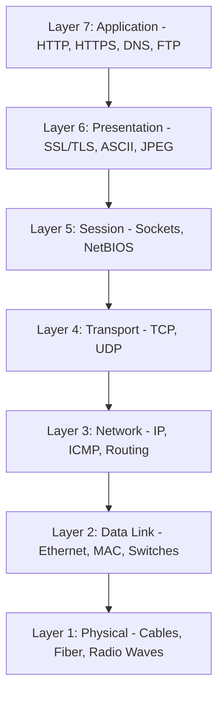
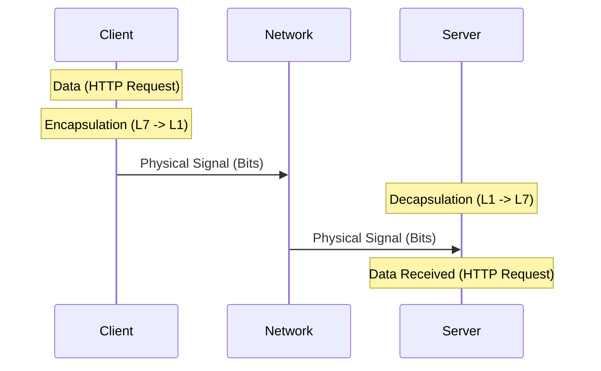

## 1.1. The OSI Model and Network Layer Interactions

To build resilient web automation and security systems, we must understand how data travels across the globe. The Open Systems Interconnection (OSI) model partition this complex process into seven distinct layers. Each layer has a specific contract, serving the layer above it and relying on the layer below it.

### 1. Detailed Layer Breakdown

#### Layer 7: Application Layer
This is the interface closest to the end-user. It provides network services directly to applications. When you use a browser or write a scraping script, your code operates here. Common protocols include HTTP, HTTPS, DNS, SMTP, and SSH. 

#### Layer 6: Presentation Layer
This layer is responsible for translating data between the application's format and the network's format. It handles:
* **Serialization:** Converting memory objects (like a Python dictionary) into byte streams (like JSON or XML).
* **Compression:** Reducing payload sizes.
* **Encryption/Decryption:** SSL/TLS is historically placed here, though it tightly integrates with Layer 4 and Layer 7.

#### Layer 5: Session Layer
Manages, establishes, maintains, and terminates connections (sessions) between local and remote applications. In modern operating systems, Layer 5 is primarily managed via **Network Sockets**—programming abstractions that represent open connections between ports on two host machines.

#### Layer 4: Transport Layer
This layer handles host-to-host communication. It manages flow control, error detection, packet retransmission, and data segmentation.
* **TCP (Transmission Control Protocol):** A connection-oriented protocol that guarantees packet delivery, order, and integrity.
* **UDP (User Datagram Protocol):** A connectionless, lightweight protocol that prioritized speed over reliability.

#### Layer 3: Network Layer
Responsible for addressing and routing packets across different network segments. It operates on **IP Addresses** and is where routers reside. The primary unit of data here is the **Packet**. The Internet Protocol (IP) and Internet Control Message Protocol (ICMP) reside at this layer.

#### Layer 2: Data Link Layer
Responsible for physical node-to-node communication on the same local network. It translates IP packets into **Frames** and routes them using **MAC (Media Access Control) Addresses**. Network switches reside at this layer. Protocols include Ethernet, Wi-Fi (802.11), and ARP (Address Resolution Protocol).

#### Layer 1: Physical Layer
The hardware layer. It deals with the electrical, optical, or radio-wave transmission of raw binary data (bits) over physical media like fiber-optic cables, copper Ethernet wires, or wireless frequencies.

---

### 2. Encapsulation and Decapsulation

When a client sends an HTTP request, the data travels down the OSI stack (encapsulation) on the client side, is transmitted over the wire, and then travels up the stack (decapsulation) on the server side.

During encapsulation, each layer prepends its own header (and sometimes trailing metadata) to the data received from the layer above:

1. **Application Layer:** Creates the raw payload (e.g., `GET /index.html HTTP/1.1\r\nHost: example.com`).
2. **Transport Layer:** Prepends the TCP header, containing the source and destination ports. The data is now a **Segment**.
3. **Network Layer:** Prepends the IP header, containing the source and destination IP addresses. The data is now a **Packet**.
4. **Data Link Layer:** Prepends the MAC header containing source/destination MAC addresses, and appends a frame check sequence (FCS) footer for error detection. The data is now a **Frame**.
5. **Physical Layer:** Converts the frame into physical pulses (voltages or light waves) sent over the physical transmission medium.

###  Common Student Pitfalls & Pro-Tips
* **The "Where is TLS?" Confusion:** Students often debate whether TLS resides at Layer 5, 6, or 7. In modern network programming, TLS is best understood as a security layer wrapped around Layer 4 (TCP), upon which Layer 7 (HTTP) runs. Do not get bogged down in academic definitions; think of TLS as a secure wrapper that encrypts the transport layer's payload.
* **Missing MAC vs. IP Addresses:** IP addresses are used for logical routing across global networks. MAC addresses are used for physical delivery within the local network segment (LAN). Routers constantly rewrite Layer 2 MAC headers as packets jump from router to router, but the Layer 3 IP headers generally remain intact from start to finish.

---
