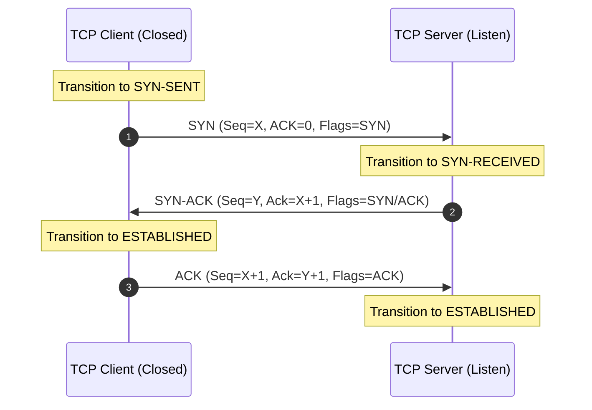
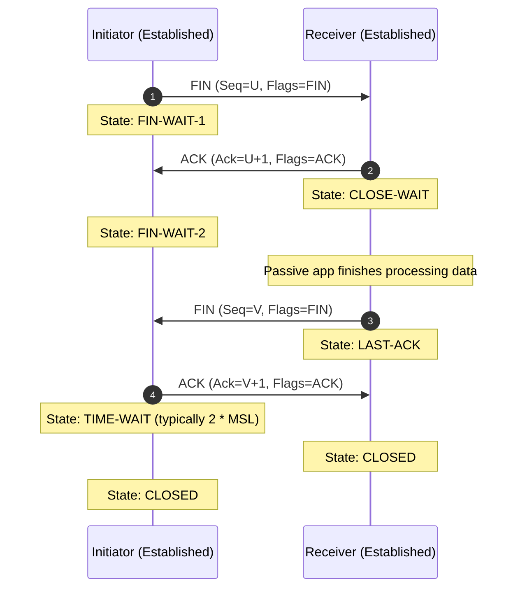

## 1.2. TCP IP Protocol Suite and Handshake Mechanics

While the OSI model is a reference framework, the internet runs on the **TCP/IP Protocol Suite** (or Internet Protocol Suite). This suite combines several OSI layers into a simpler four-layer architecture:

| OSI Layer | TCP/IP Layer | Primary Protocols |
| :--- | :--- | :--- |
| 7. Application, 6. Presentation, 5. Session | **Application** | HTTP, DNS, TLS, SMTP, SSH |
| 4. Transport | **Transport** | TCP, UDP |
| 3. Network | **Internet** | IP, ICMP |
| 2. Data Link, 1. Physical | **Network Access** | Ethernet, Wi-Fi, ARP |

---

### 1. Anatomy of a TCP Packet Header

To understand connection timeouts, rate limiting, and TCP-level blocking, we must look at the key fields in a TCP header:

```
 0                   1                   2                   3
 0 1 2 3 4 5 6 7 8 9 0 1 2 3 4 5 6 7 8 9 0 1 2 3 4 5 6 7 8 9 0 1
+-+-+-+-+-+-+-+-+-+-+-+-+-+-+-+-+-+-+-+-+-+-+-+-+-+-+-+-+-+-+-+-+
|          Source Port          |       Destination Port        |
+-+-+-+-+-+-+-+-+-+-+-+-+-+-+-+-+-+-+-+-+-+-+-+-+-+-+-+-+-+-+-+-+
|                        Sequence Number                        |
+-+-+-+-+-+-+-+-+-+-+-+-+-+-+-+-+-+-+-+-+-+-+-+-+-+-+-+-+-+-+-+-+
|                     Acknowledgment Number                     |
+-+-+-+-+-+-+-+-+-+-+-+-+-+-+-+-+-+-+-+-+-+-+-+-+-+-+-+-+-+-+-+-+
|  Data |           |U|A|P|R|S|F|                               |
| Offset| Reserved  |R|C|S|S|Y|I|            Window             |
|       |           |G|K|H|T|N|N|                               |
+-+-+-+-+-+-+-+-+-+-+-+-+-+-+-+-+-+-+-+-+-+-+-+-+-+-+-+-+-+-+-+-+
|           Checksum            |         Urgent Pointer        |
+-+-+-+-+-+-+-+-+-+-+-+-+-+-+-+-+-+-+-+-+-+-+-+-+-+-+-+-+-+-+-+-+
```

* **Source Port / Destination Port (16 bits each):** Directs the packet to the correct application process on the host operating system.
* **Sequence Number (32 bits):** Tracks the bytes sent, ensuring that out-of-order packets can be reassembled in the correct order.
* **Acknowledgment Number (32 bits):** Informs the sender which bytes have been successfully received.
* **Control Flags (6 bits):** Control the state of the TCP session:
  * **SYN (Synchronize):** Initiates a connection.
  * **ACK (Acknowledgment):** Acknowledges receipt of data or a state transition.
  * **FIN (Finish):** Initiates connection termination gracefully.
  * **RST (Reset):** Terminates a connection abruptly due to an unrecoverable error or host-level rejection.
  * **PSH (Push):** Forces the OS to send data immediately without waiting for buffers to fill.
* **Window Size (16 bits):** Dictates how many bytes the receiver is willing to accept before an acknowledgment is required (used for flow control).

---

### 2. The Three-Way Handshake (Connection Establishment)

Before any application data can be sent, TCP must establish a virtual connection using a precise state exchange:



1. **SYN:** The client generates a random Initial Sequence Number (ISN) `X` and sends a packet with the `SYN` flag set.
2. **SYN-ACK:** The server receives the `SYN` packet. It allocates resources for the connection, generates its own ISN `Y`, and sends a packet back with both the `SYN` and `ACK` flags set. It acknowledges the client's packet by setting the Acknowledgment Number to `X + 1`.
3. **ACK:** The client receives the `SYN-ACK` packet. It acknowledges the server's packet by sending an `ACK` packet with the Acknowledgment Number set to `Y + 1`. Both hosts are now in the `ESTABLISHED` state and can exchange payload data.

---

### 3. Graceful and Ungraceful Termination

#### Graceful Termination (Four-Way Handshake)
When either party wants to close the connection, they must gracefully shut down their side of the data channel:



* **The TIME-WAIT State:** The active initiator must wait in the `TIME-WAIT` state (usually 1 to 4 minutes, representing twice the Maximum Segment Lifetime) to ensure that the final `ACK` reached the receiver, and that any delayed, duplicate packets remaining in the network degrade safely without interfering with future connections on the same port.

#### Ungraceful Termination (RST Packet)
An ungraceful termination bypasses the multi-step handshake entirely. If a client sends a packet to a server on a closed port, or if a security firewall decides to terminate a connection abruptly, a TCP packet is sent with the **RST (Reset)** flag set. This forces the receiving socket to close immediately, discarding any buffered data.

---

### 4. Connection Failures Behind the Scenes

When coding a web scraper or diagnostic script, you will encounter specific socket errors. Understanding their Layer 4 mechanics helps you debug network issues faster:

```
           [ Client attempts connection ]
                         │
         ┌───────────────┴───────────────┐
         ▼                               ▼
  [ Firewall Drops SYN ]        [ Port is Closed ]
         │                               │
         ├───────────────────────────────┤
         ▼                               ▼
  ( Connection Timeout )         ( Connection Refused )
  - SYN-SENT state hangs         - Host returns RST
  - No response packets          - Immediate error returned
```

#### Connection Timeout (`ETIMEDOUT` / `TimeoutError`)
* **Layer 4 Event:** The client sends a `SYN` packet, but receives absolutely nothing in return. The client's operating system retries sending the `SYN` packet at exponential backoff intervals (e.g., 1s, 2s, 4s, 8s, 16s). Eventually, it gives up.
* **Behind the Scenes:** A firewall or network device is silently **dropping** the packet. It does not return any rejection packet. This is common with geofencing, IP blocking, or when a server is completely offline.

#### Connection Refused (`ECONNREFUSED`)
* **Layer 4 Event:** The client sends a `SYN` packet, and immediately receives a packet back with the **RST** flag set.
* **Behind the Scenes:** The destination host is active and reachable, but **no application is listening on that port**. The operating system's kernel rejects the connection directly. Alternatively, a firewall is actively **rejecting** (rather than dropping) the connection.

---

###  Common Student Pitfalls & Pro-Tips
* **Reusing Sockets:** Creating a new TCP connection for every single HTTP request is extremely resource-intensive. It requires a three-way handshake and a four-way handshake each time, consuming CPU, bandwidth, and local ephemeral ports (leading to port exhaustion). Always use an HTTP **session pool** (keep-alive) when writing automation scripts.
* **Half-Open Connections:** If a client dies abruptly without sending a `FIN` or `RST` packet, the server's socket remains open in an `ESTABLISHED` state indefinitely (a "ghost connection"). Servers use **TCP Keep-Alives** (periodic empty probe packets) to detect and reclaim these dead resources.

---
