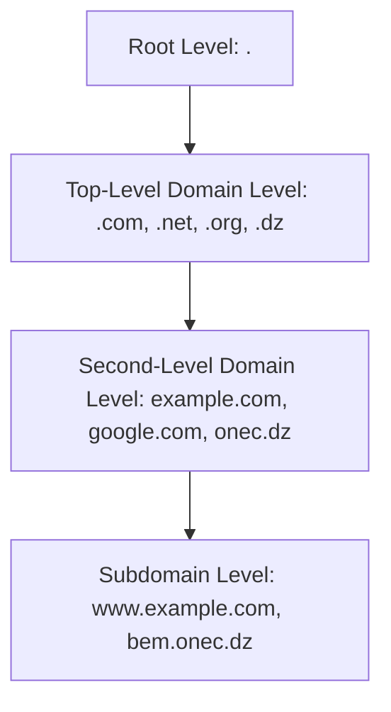
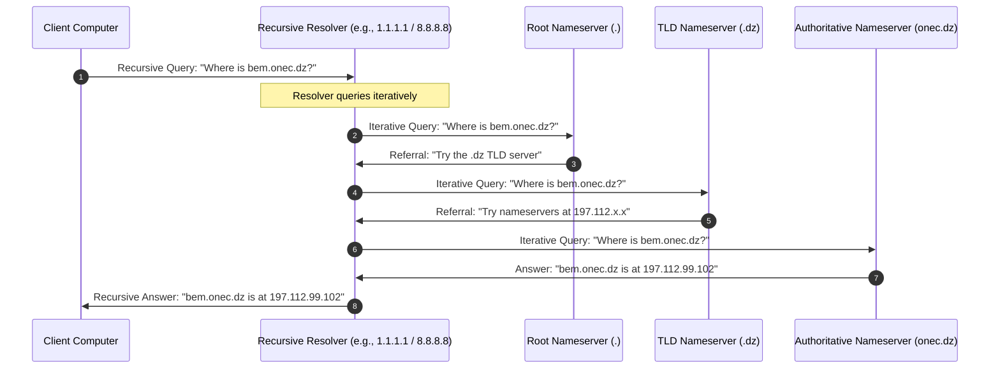

## 1.3. DNS Architecture and Resolution Lifecycle

Computers communicate using IP addresses, but humans prefer domain names. The Domain Name System (DNS) is the distributed database that translates human-readable hostnames (e.g., `example.com`) into routable IP addresses (e.g., `93.184.216.34`).

---

### 1. The Hierarchical DNS Structure

DNS is structured hierarchically, shaped like an inverted tree:



* **Root Servers (`.`):** There are 13 logical root server addresses globally (managed by hundreds of physical locations using Anycast routing). They guide queries toward the appropriate TLD servers.
* **Top-Level Domain (TLD) Servers:** Manage domains grouped under suffixes like `.com`, `.org`, and country codes like `.dz` (Algeria).
* **Authoritative Nameservers:** Configured by the domain owner. These servers hold the actual, definitive DNS resource records for a specific domain (e.g., `onec.dz`).

---

### 2. Recursive vs. Iterative Queries

When your operating system requests an IP address, two distinct query resolution patterns occur:



#### Recursive Queries (Client to Resolver)
The client demands a definitive resolution or an error. The client's operating system requests this from a **Recursive Resolver** (e.g., your ISP's DNS, Google's `8.8.8.8`, or Cloudflare's `1.1.1.1`). The resolver takes on the burden of walking the entire DNS hierarchy on behalf of the client.

#### Iterative Queries (Resolver to Hierarchy)
The recursive resolver queries nameservers one by one. If a nameserver does not know the exact mapping, it returns a **Referral** (pointing to the nameserver of the next layer down) instead of executing the lookup itself. This protects root and TLD servers from excessive processing loads.

---

### 3. Key DNS Resource Record Types

An authoritative DNS server stores resource records in its zone file. The most common record types you will encounter include:

| Record Type | Name | Purpose | Example Value |
| :--- | :--- | :--- | :--- |
| **A** | Address | Maps a hostname to a 32-bit IPv4 address. | `93.184.216.34` |
| **AAAA** | IPv6 Address | Maps a hostname to a 128-bit IPv6 address. | `2606:2800:220:1:248:1893:25c8:1946` |
| **CNAME** | Canonical Name | Maps an alias hostname to another hostname (canonical domain). | `www.example.com` -> `example.com` |
| **MX** | Mail Exchange | Specifies mail servers responsible for receiving email for the domain. | `10 mail.example.com` (includes priority) |
| **TXT** | Text | Stores arbitrary descriptive text (used for SPF, DKIM, site verifications). | `"v=spf1 include:_spf.google.com ~all"` |
| **NS** | Nameserver | Specifies the authoritative nameservers for a domain zone. | `ns1.example.com` |

---

### 4. DNS Geofencing / DNS-Based Blocking

Because DNS is the gateway to any network operation, security firewalls and national authorities often implement controls at the DNS level:

```
[ DNS Query from Client ] ────► [ Recursive Resolver ]
                                        │
                         ┌──────────────┴──────────────┐
                         ▼                             ▼
              [ Client IP is Allowed ]      [ IP is Geo-Blocked ]
                         │                             │
                         ▼                             ▼
               ( Returns Actual IP )           ( SERVFAIL / Blocked IP )
```

#### DNS Geofencing
An authoritative nameserver can detect the origin network IP of the incoming DNS query (or use the EDNS Client Subnet extension). If the query originates from an unauthorized country, the nameserver can choose to:
1. **Ignore the packet:** Causing iterative queries to time out.
2. **Return an error:** Such as `SERVFAIL` (Server Failure) or `REFUSED`.
3. **Poison the response:** Returning an internal loopback IP (like `127.0.0.1`) or pointing the user to an informational warning page.

---

###  Common Student Pitfalls & Pro-Tips
* **Caching Issues:** DNS records are heavily cached at every level: local operating system, web browser, recursive resolver, and routers. Every DNS record contains a **TTL (Time to Live)** value in seconds. The record cannot be guaranteed to update globally until the TTL expires. When writing network-reliant code, remember that changing a DNS record can take hours to propagate.
* **DNS vs. HTTP Proxying:** A DNS resolution failure (e.g., `ERR_NAME_NOT_RESOLVED`) occurs before any HTTP connection can even attempt to start. If your browser cannot resolve a domain name, routing traffic through an application-level HTTP proxy will only work if the proxy itself executes the DNS resolution on its end (remote DNS resolution).

---
