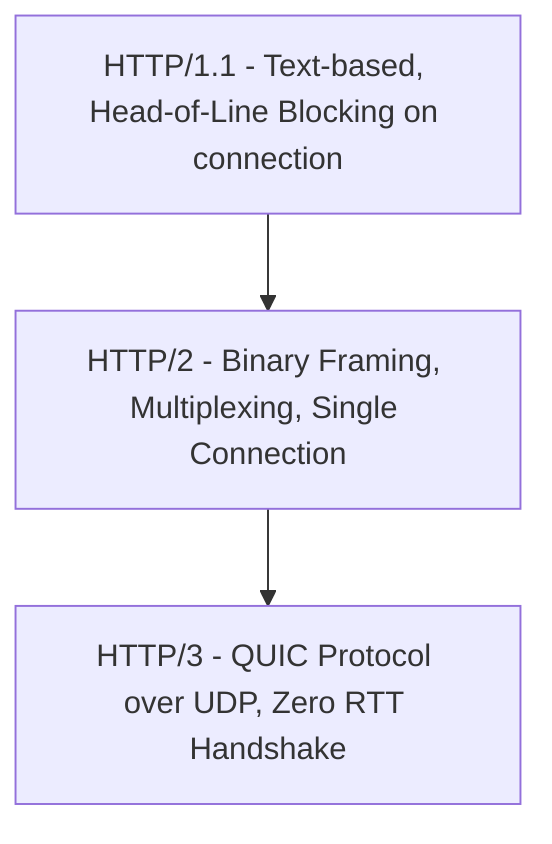

## 1.4. HTTP and HTTPS Protocol Standards

HTTP (Hypertext Transfer Protocol) is the foundation of data exchange on the web. It is a stateless, client-server, request-response protocol running on top of Layer 4.

---

### 1. HTTP Request Architecture

An HTTP request consists of three distinct parts: the Request Line, Headers, and an optional Body.

```
[ Request Line ] ──► GET /api/v1/user HTTP/1.1
[ Headers ]      ──► Host: example.com
                     User-Agent: Mozilla/5.0 ...
                     Accept: application/json
                     Connection: keep-alive
[ Empty Line ]   ──► \r\n
[ Request Body ] ──► { "id": 1001 }  (Optional)
```

#### Request Line
Consists of three elements separated by spaces:
* **HTTP Method:** The operation to perform (e.g., `GET`, `POST`, `PUT`, `DELETE`).
* **URI/Path:** The resource endpoint (e.g., `/index.html` or `/api/v1/search?q=query`).
* **Protocol Version:** (e.g., `HTTP/1.1` or `HTTP/2`).

#### Request Headers
Key-value pairs separated by colons. They pass metadata about the request, the client's capabilities, authentication states, and desired content formatting.

#### Empty Line
A critical protocol requirement: headers and body must be separated by exactly one blank line containing a carriage return and line feed (`\r\n`).

#### Request Body
The raw data payload sent to the server. Typically used with `POST`, `PUT`, or `PATCH` methods to transmit form parameters, JSON datasets, or file uploads.

---

### 2. HTTP Response Architecture

An HTTP response mirrors the request structure, consisting of a Status Line, Headers, and a Body.

```
[ Status Line ]  ──► HTTP/1.1 200 OK
[ Headers ]      ──► Content-Type: text/html; charset=UTF-8
                     Content-Length: 4212
                     Set-Cookie: session_id=abc123xyz
[ Empty Line ]   ──► \r\n
[ Response Body ]──► <html><body>...</body></html>
```

#### Status Line
Contains the protocol version, a numeric status code, and a text phrase explaining the code:
* **1xx (Informational):** Request received, continuing process (e.g., `101 Switching Protocols`).
* **2xx (Success):** Action successfully received, understood, and accepted (e.g., `200 OK`, `201 Created`).
* **3xx (Redirection):** Further action must be taken to complete the request (e.g., `301 Moved Permanently`, `302 Found`).
* **4xx (Client Error):** The request contains bad syntax or cannot be fulfilled (e.g., `400 Bad Request`, `401 Unauthorized`, `403 Forbidden`, `404 Not Found`).
* **5xx (Server Error):** The server failed to fulfill an apparently valid request (e.g., `500 Internal Server Error`, `502 Bad Gateway`, `503 Service Unavailable`, `504 Gateway Timeout`).

---

### 3. HTTP Methods: Idempotency vs. Safety

Understanding the mathematical properties of HTTP methods is vital for designing reliable web scraping and API systems:

| Method | Safe? | Idempotent? | Allows Request Body? | Primary Purpose |
| :--- | :---: | :---: | :---: | :--- |
| **GET** |  Yes |  Yes |  No | Retrieve representation of a resource. |
| **POST** |  No |  No |  Yes | Create a new resource or process data. |
| **PUT** |  No |  Yes |  Yes | Replace/create a resource at a specific URI. |
| **DELETE** |  No |  Yes |  No | Remove a resource at a specific URI. |
| **HEAD** |  Yes |  Yes |  No | Retrieve response headers only (no body). |

* **Safe Methods:** Do not modify the server state. A client can execute safe queries repeatedly without altering database states.
* **Idempotent Methods:** Executing the request multiple times produces the exact same server-state outcome as executing it once. For example, deleting a resource twice leaves the system in the same state as deleting it once. `POST` is **not** idempotent; submitting a checkout form twice can result in double-billing.

---

### 4. HTTP Evolution: HTTP/1.1 vs. HTTP/2 vs. HTTP/3



#### HTTP/1.1
* **Text-Based Parsing:** Easy for humans to read but inefficient for computers to parse.
* **Head-of-Line (HoL) Blocking:** The connection can only handle one request-response cycle at a time. If a large image is requested first, subsequent requests on that TCP socket must wait.

#### HTTP/2
* **Binary Framing Layer:** Encodes headers and frames in binary, drastically reducing CPU overhead.
* **Multiplexing:** Allows multiple request and response streams to be interleaved concurrently over a **single TCP connection**, resolving Application-layer HoL blocking.
* **Header Compression (HPACK):** Huffman-encodes redundant header strings to minimize overhead.

#### HTTP/3
* **Replaces TCP with QUIC:** QUIC (Quick UDP Internet Connections) operates on top of **UDP**.
* **Bypasses Transport-Layer HoL Blocking:** If an individual packet is lost in an HTTP/2 stream, TCP freezes all streams on that connection while waiting for retransmission. HTTP/3 processes unlost packet streams independently.
* **Zero-RTT Handshake:** Combines connection establishment and cryptographic handshakes into a single round trip.

---

###  Common Student Pitfalls & Pro-Tips
* **Confusing 301 vs. 302 Redirects:** A `301 Moved Permanently` redirect is heavily cached by browsers. If you make a mistake, browsers will continue to redirect users automatically without hitting your server again. A `302 Found` (Temporary Redirect) tells the browser to perform the redirection but to check back with the original URL on future requests.
* **Missing `Host` Header:** In HTTP/1.1 and beyond, the `Host` header is mandatory. Since multiple domains can be hosted on a single server IP address (virtual hosting), the web server relies on this header to route requests to the correct host domain configuration.

---
