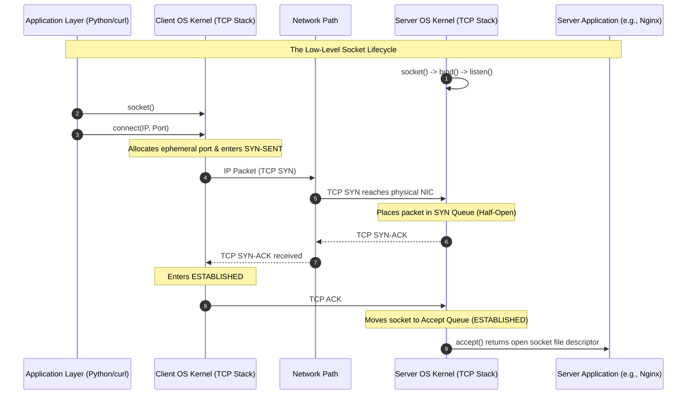
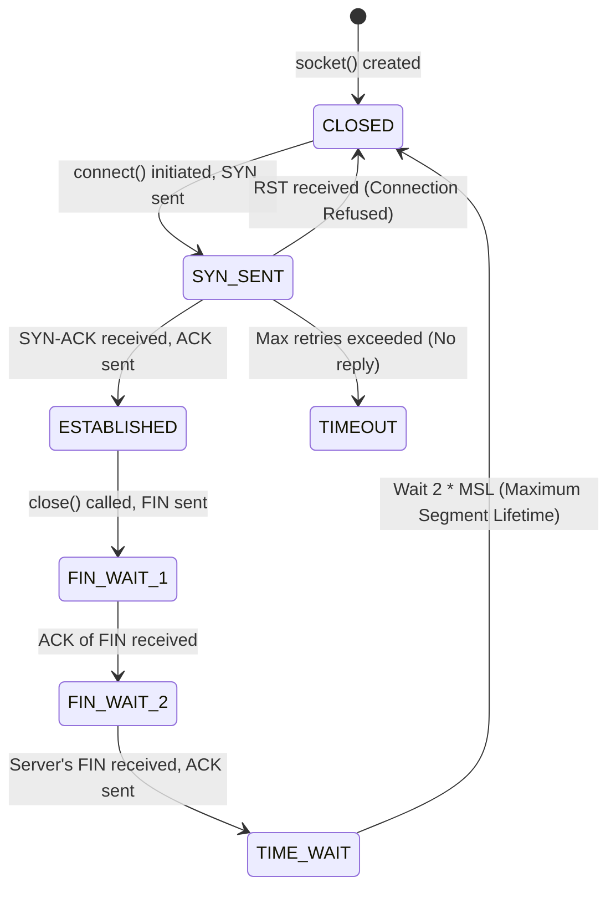

## 1.5. Socket Programming and Kernel-Level Connection States

To understand why connection attempts time out, hang, or are abruptly refused, we must look past high-level HTTP libraries and examine the low-level socket API provided by the operating system kernel.



---

### 1. Sockets as File Descriptors

In Unix-like operating systems (including Linux and macOS), the design philosophy dictates that **"everything is a file."** A network socket is represented in the kernel as a **File Descriptor (FD)**—an integer index in a process's file descriptor table that points to an internal kernel structure managing an I/O channel.

When an application (such as a Python script or a `curl` process) wants to communicate over the network, it makes a series of POSIX system calls:

```c
int socket_fd = socket(AF_INET, SOCK_STREAM, 0);
```

* `AF_INET`: Specifies the Address Family (IPv4).
* `SOCK_STREAM`: Specifies the socket type (connection-oriented byte stream, which maps to **TCP**).

---

### 2. The Kernel Connection Handshake State Machine

The client OS kernel's TCP/IP stack manages the states of active sockets. When a client initiates a connection, the state machine transitions through precise internal phases:



#### SYN-SENT State
The moment the application calls `connect()`, the kernel transitions the socket from `CLOSED` to `SYN_SENT`. It allocates resources, binds the socket to an unused local **ephemeral port** (typically in the range `32768–60999` on Linux), and transmits a TCP packet with the `SYN` flag enabled.

#### The SYN Queue vs. Accept Queue
On the server side, incoming TCP connection requests are managed across two distinct queues within the kernel:

1. **The SYN Queue (Incomplete Connection Queue):** When the server's network interface card (NIC) receives a `SYN` packet, the kernel verifies that a process is listening on the target port. It allocates a minimal memory control block, enters the `SYN-RECEIVED` state, sends a `SYN-ACK` packet, and places the connection in the **SYN Queue**. These are "half-open" connections.
2. **The Accept Queue (Complete Connection Queue):** Once the client responds with the final `ACK` packet, the kernel transitions the state of the socket to `ESTABLISHED`. It moves the socket from the SYN Queue into the **Accept Queue**. When the server-side application (e.g., Nginx, Apache, or a Node.js runtime) calls the blocking `accept()` system call, the kernel retrieves the socket from the Accept Queue and returns a new file descriptor representing the dedicated connection.

---

### 3. Deep Dive on Connection Failure Mechanics

Based on the low-level systems architecture explained above, we can analyze the two most common network errors:

#### A. Connection Timeout (`ETIMEDOUT` / No Route to Host)
If a security firewall drops incoming `SYN` packets, the client's socket remains stuck in the `SYN_SENT` state. Because TCP is built for reliability over unreliable mediums, the client kernel refuses to give up immediately.

1. **Exponential Backoff Retries:** The client kernel initiates a retransmission timer. If no `SYN-ACK` is received before the timer expires, the kernel retransmits the `SYN` packet. It doubles the timeout duration for each consecutive attempt.
2. **System Configurations:** On Linux, the number of retransmission attempts is controlled by the kernel variable `net.ipv4.tcp_syn_retries`. The default is typically `6`.
3. **Timeline of a Timeout:**
   * **Attempt 1:** `SYN` sent, timer set to `1s`.
   * **Attempt 2:** Retransmission at `1s`, timer set to `2s`.
   * **Attempt 3:** Retransmission at `3s`, timer set to `4s`.
   * **Attempt 4:** Retransmission at `7s`, timer set to `8s`.
   * **Attempt 5:** Retransmission at `15s`, timer set to `16s`.
   * **Attempt 6:** Retransmission at `31s`, timer set to `32s`.
   * **Failure:** If no response is received by `63 seconds` after the final attempt, the kernel terminates the system call and returns the error code `ETIMEDOUT` to the application.

#### B. Connection Refused (`ECONNREFUSED`)
If the client attempts to connect to a port where no application is listening, or if a firewall actively rejects the connection, the process is instantaneous:

1. **RST Packet Generation:** The target machine receives the `SYN` packet. Seeing that the destination port is unallocated, the kernel's network stack bypasses all queues and immediately constructs a reply packet with the `RST` (Reset) and `ACK` flags set.
2. **Immediate Socket Tear Down:** The client machine receives the `RST` packet. The client kernel tears down the local socket structure immediately, stops all timers, and returns the error `ECONNREFUSED` to the application. This happens in milliseconds.

---

###  Advanced Engineering Tips & Pitfalls
* **The SYN Flood Vulnerability:** Attackers can exploit the SYN Queue by sending thousands of spoofed `SYN` packets without ever returning the final `ACK`. This fills up the server's SYN Queue, preventing legitimate users from connecting. Modern operating systems defend against this using **SYN Cookies**, where the server encodes connection state details directly into the `SYN-ACK` sequence number, allowing it to discard half-open connection allocations in memory.
* **Ephemeral Port Exhaustion:** If a high-throughput crawler initiates thousands of concurrent connections to external targets, it can consume all available ephemeral ports on the host. When this occurs, the OS system call `connect()` will fail immediately with the error `EADDRNOTAVAIL` (Cannot assign requested address). Using an HTTP connection pool keeps TCP sockets open and reusable, preventing this problem.

---
