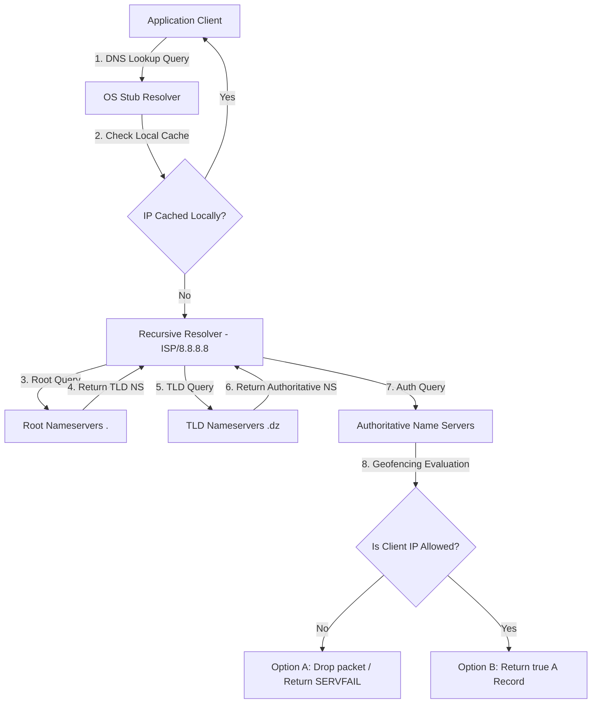

## 1.6. DNS Resolvers and Iterative Failures

When a network connection fails, we must isolate the failure. A common source of errors is the translation phase: the Domain Name System (DNS) query lifecycle.

---

### 1. The Stub Resolver and OS Cache

When an application requests a hostname (e.g., `example.com`), it does not call the DNS network stack directly. It delegates this task to the operating system's local library, known as the **Stub Resolver** (on Linux, this is historically handled by the `getaddrinfo()` function in `glibc`).

The Stub Resolver executes the search in a strict sequence:
1. **Local Host File Check:** It checks the local static database `/etc/hosts` (on Unix/Linux) or `C:\Windows\System32\drivers\etc\hosts` (on Windows). If a mapping is defined here, it is returned immediately, bypassing the network.
2. **Local OS Cache Check:** Modern operating systems run a caching daemon (such as `systemd-resolved` on Linux, or the `DNS Client` service on Windows) to store previously resolved records.
3. **Network DNS Query:** If the record is missing or expired (its Time-To-Live has run out), the stub resolver constructs a UDP packet (usually on destination port `53`) and transmits a **Recursive DNS Query** to the recursive resolver addresses configured in `/etc/resolv.conf`.

---

### 2. DNS Error Codes Behind the Scenes

When a DNS query fails, the recursive resolver or the authoritative nameserver returns specific header status codes. Understanding these is vital for diagnostic debugging:

| Error Code (RCODE) | Formal Name | Meaning | Triggering Scenario |
| :--- | :--- | :--- | :--- |
| **NXDOMAIN** | Non-Existent Domain | The domain name queried does not exist at all in the registrar. | Typo in URL or expired domain registration. |
| **SERVFAIL** | Server Failure | The recursive resolver was unable to retrieve a response from the authoritative servers. | Authoritative nameservers are offline, or dropping queries from the resolver's IP space. |
| **REFUSED** | Query Refused | The DNS server refused to process the query due to policy restrictions. | Attempting to use a private corporate recursive resolver from an external network. |
| **TIMEOUT** | Client-side Timeout | No UDP response was received within the client's socket deadline. | Severe network path loss or nameservers are dropping incoming UDP packets completely. |

---

### 3. EDNS Client Subnet (ECS) and Geofencing

Many developers assume that geofencing is only enforced at the web server firewall level. In reality, geofencing often begins at the **DNS resolution phase** using **EDNS Client Subnet (ECS)** (defined in RFC 7871).

#### How ECS Works
When a client queries a recursive resolver (like Google's `8.8.8.8`), the resolver sends the query to the domain's authoritative nameserver. In a standard setup, the authoritative nameserver only sees the IP address of the recursive resolver, not the client. 

With ECS, the recursive resolver appends a modified option field containing the client's IP address subnet (e.g., `/24` or `/32` range) to the DNS request header.

#### The Geofencing Decision Engine
When the authoritative nameserver receives the query:
1. It reads the client's subnet embedded in the ECS field.
2. It matches the subnet against geographical allocation tables (GeoIP databases).
3. **If blocked:** The authoritative nameserver can choose to drop the incoming UDP packet silently, return a `SERVFAIL` status code, or resolve the query to a loopback address (`127.0.0.1`), preventing the client from discovering the server's actual IP address.

---

###  Advanced Engineering Tips & Pitfalls
* **DNS over HTTPS (DoH) / DNS over TLS (DoT):** Traditional DNS queries are sent in plaintext UDP, making them vulnerable to inspection and tampering by intermediary networks. DoH (RFC 8484) wraps DNS queries inside standard, encrypted HTTPS packets routed to port `443`. This bypasses local DNS censorship and geofencing systems that rely on inspecting or modifying standard port `53` UDP traffic.

---
