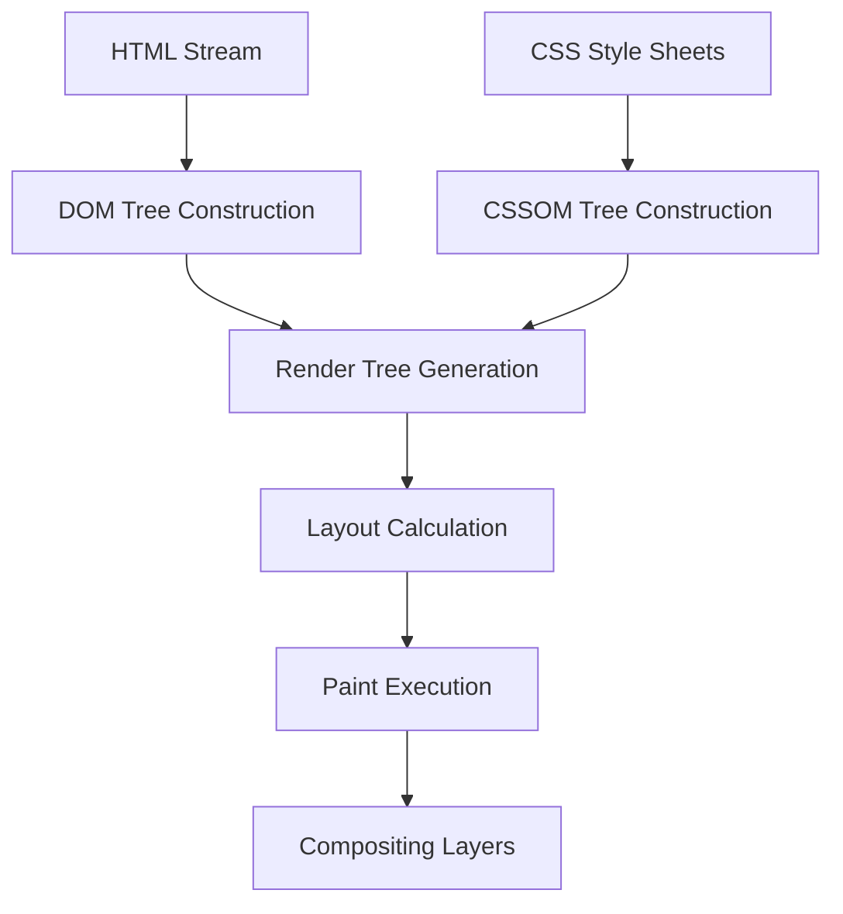

## 2.1. The Critical Rendering Path of Web Browsers

When a user or automated browser requests a webpage, the raw HTML is parsed through a complex execution sequence known as the **Critical Rendering Path (CRP)**.



### 1. The Rendering Steps

1. **Document Object Model (DOM) Tree Construction:** The browser parses raw HTML bytes, decodes them into characters, converts them into tokens, extracts nodes, and builds a hierarchical tree of objects representing the HTML tags.
2. **CSS Object Model (CSSOM) Tree Construction:** The browser parses linked CSS files and `<style>` blocks to build a map of styling rules applied to various selector paths.
3. **Render Tree Generation:** The DOM and CSSOM are combined to form the **Render Tree**. Nodes that do not render visually (like `<head>`, `<script>`, or tags styled with `display: none`) are excluded from this tree.
4. **Layout (Reflow):** The browser calculates the exact physical coordinates and bounding box dimensions for each node on the viewport screen.
5. **Painting (Rasterization):** The browser fills in individual pixels on the display screen with colors, gradients, images, borders, and shadows.
6. **Compositing:** If the page uses separate GPU drawing layers (such as 3D transforms, hardware-accelerated animations, or video elements), the browser draws those layers independently and composites them into the final viewport display.

---

### 2. Blocking Render Elements: Scripts vs. Stylesheets

A primary challenge when automating web browsers is timing. Understanding how scripts and styles block execution is critical:

```
[ HTML Parser ] ───► <link rel="stylesheet"> ───► [ CSSOM Construction ] ───► [ DOM Blocked ]
[ HTML Parser ] ───► <script> ───────────────► [ Download & Execution ] ───► [ DOM Blocked ]
```

#### CSS is Render-Blocking
The browser will not paint anything on the screen until it has finished parsing all stylesheets. This prevents a jarring user experience known as a FOUC (Flash of Unstyled Content). Therefore, large CSS bundles block initial visual page loads.

#### JavaScript is Parser-Blocking
When the HTML parser encounters a `<script>` tag, **parsing of the DOM tree halts immediately**. The browser must download, parse, and execute the JavaScript before resuming HTML tokenization. This is because JavaScript can modify the DOM using APIs like `document.write()`.

#### Bypassing Script Blocking
To prevent JavaScript from blocking DOM construction, modern scripts utilize specific tags:

```
Normal Script:
HTML Parser : ──[Build DOM]──|   Paused   |───[Resume DOM]───
Script Tag  :                └─[Execute]──┘

Defer Script:
HTML Parser : ──[Build DOM completely]───────────────────────
Defer Tag   :    (Downloads in parallel)   ──[Execute script]──

Async Script:
HTML Parser : ──[Build DOM]──|   Paused   |───[Resume DOM]───
Async Tag   : (Parallel)     └─[Execute]──┘
```

* **`defer`:** The script downloads in parallel alongside HTML parsing and executes **only after** DOM construction is completely finished.
* **`async`:** The script downloads in parallel and executes **immediately** once downloading completes, interrupting the HTML parser if it is still running.

---

###  Common Student Pitfalls & Pro-Tips
* **Waiting for selectors in automation:** When writing headless browser tests, never assume an element is interactive immediately after the page load event. The DOM may be loaded, but background JavaScript files might still be executing, rendering elements, or attaching event handlers. Always use explicit waits for target elements to become visible and interactive.

---
