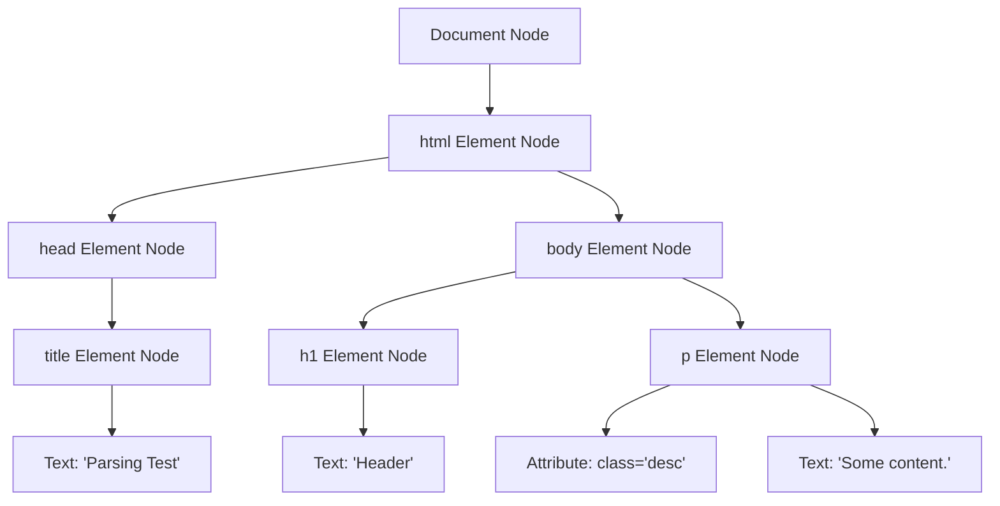

## 2.2. HTML DOM Parsing and Tree Construction

To perform static scraping or analyze web outputs, we must understand how HTML is structured and parsed into memory.

---

### 1. The DOM Tree Structure

Consider this simple HTML fragment:

```html
<!DOCTYPE html>
<html>
  <head>
    <title>Parsing Test</title>
  </head>
  <body>
    <h1>Header</h1>
    <p class="desc">Some content.</p>
  </body>
</html>
```

The browser (or parser libraries like Beautiful Soup or Cheerio) translates this hierarchical text into an in-memory, tree-structured graph composed of nodes:



---

### 2. Node Types in the DOM

Every item in the DOM tree is a **Node**. The DOM specification defines several node types, the most common being:

* **Document Node (Type 1):** The root node of the entire document tree.
* **Element Nodes (Type 1):** Represent HTML tags (e.g., `<body>`, `<div>`, `<a>`). These are the only nodes that can have attributes.
* **Attribute Nodes (Type 2):** Store key-value attribute metadata for elements (e.g., `href="https://example.com"`).
* **Text Nodes (Type 3):** Represent the actual raw text characters contained inside or between tags. Text nodes are always leaf nodes; they cannot have child nodes.
* **Comment Nodes (Type 8):** Store HTML comments (`<!-- comment -->`).

---

###  Common Student Pitfalls & Pro-Tips
* **Malformed HTML Tolerance:** The official HTML standard dictates that parsers must be highly fault-tolerant. If an HTML tag is missing a closing delimiter (e.g., `<div><p>unclosed tag`), the parser will automatically infer closure locations, restructuring the DOM tree to be valid. However, different libraries (e.g., Python's native `html.parser`, `lxml`, or `html5lib`) use different correction algorithms. This is why a scraper might successfully extract an element when using one parser backend, but fail when using another on the same raw HTML string. Always verify which parser library backend your scraper is using.

---
