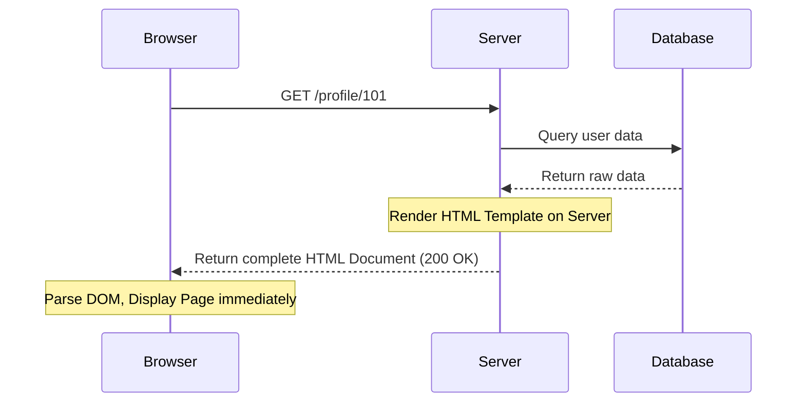
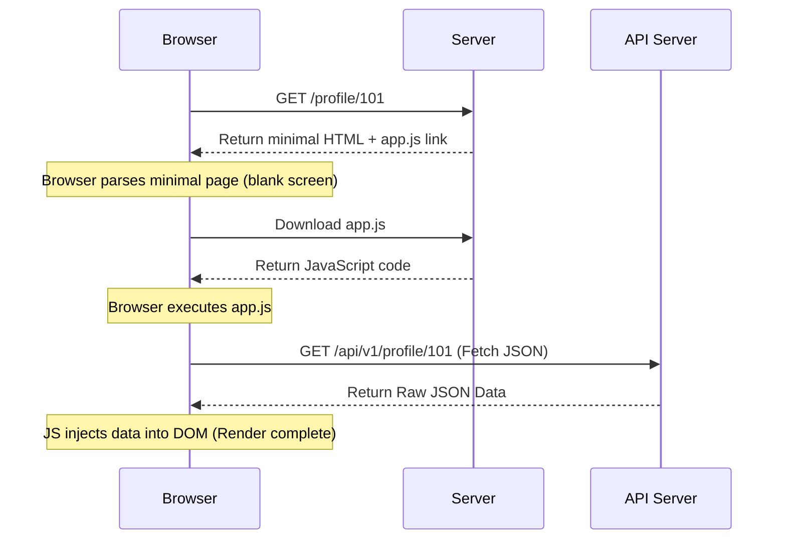

## 2.3. Client-Side Rendering vs. Server-Side Rendering

The architecture of a web application dramatically impacts the tools we use to interact with it, scrap it, or secure it.

---

### 1. Server-Side Rendering (SSR)

In a traditional Server-Side Rendered application, the web server processes the request, pulls data from a database, constructs the final HTML document directly on the server, and returns it to the client.

* **Pros:** Rapid initial page load, great for SEO (search crawlers receive complete indexable text), low client CPU load.
* **Cons:** Higher server load, slow page transitions (requires full page reloads for every navigation).

---

### 2. Client-Side Rendering (CSR / Single-Page Apps)

In a Client-Side Rendered application, the web server returns a minimal, mostly empty HTML shell along with a large JavaScript bundle. The browser downloads the JS, executes it, fetches raw data from an API (using Fetch or Axios), and inserts that data into the empty DOM on the fly.

* **Pros:** Fast page transitions, rich user interfaces, offloads rendering computations to the client.
* **Cons:** Poor SEO if crawlers cannot execute JavaScript, slow initial page load (blank screen until JS runs).

---

### 3. Impact on Web Scraping and Automation

Understanding the difference between SSR and CSR is critical when choosing automation tools:

* **Scraping SSR Sites:** Since the server returns the fully rendered HTML document, you can use simple, high-performance HTTP requests (e.g., Python's `requests` or `urllib`) and parse the static string with a fast library like `BeautifulSoup` or `lxml`. This is fast, consuming negligible CPU and memory.
* **Scraping CSR Sites:** Since the initial HTML is empty, simple static HTML scrapers will only retrieve the blank shell. To scrap CSR pages, you have two options:
  1. **Direct API Consumption (Recommended):** Open your browser's Developer Tools, inspect the **Network** tab, identify the direct API endpoint the JS app uses to fetch data, and write your script to request that clean JSON endpoint directly.
  2. **Headless Browser Execution:** If the API endpoints are heavily secured or difficult to authenticate, use a browser automation framework (e.g., Playwright, Selenium, Puppeteer) to spin up a headless browser instance, let the JavaScript execute, and pull the structured data out of the live in-memory DOM.

---

###  Common Student Pitfalls & Pro-Tips
* **The "View Source" Trap:** When assessing a website's architecture, students often right-click on the page and select "View Page Source". However, this only displays the initial static HTML received from the server. If the site is client-side rendered, the page source will look like an empty shell. To see the actual current DOM populated by JavaScript, always right-click and select **Inspect Element** to open the browser's live, dynamically updated DOM tree inspector.

---
