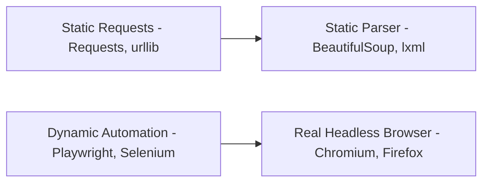

## 3.1. Static Extraction vs. Dynamic Browser Automation

Web scraping spans a spectrum from ultra-high-performance static requests to resource-intensive browser simulation.



### 1. Static Web Extraction

#### Core Architecture
A static scraper works by establishing a TCP connection, executing an HTTP request (typically GET), and reading the response body directly as a raw string of bytes. It does not load external CSS, execute JavaScript, or paint pixels.

#### Technology Stack
* **Python:** `requests`, `urllib3`, `httpx`.
* **Node.js:** `axios`, `got`.
* **Parsing:** `BeautifulSoup`, `lxml` (Python), `cheerio` (Node.js).

#### Performance Profile
* **Memory Footprint:** Very low (~10-30 MB per process).
* **CPU Usage:** Negligible.
* **Network Overhead:** Minimal (only requests the targeted HTML, bypassing massive images, tracking pixels, and CSS scripts).

---

### 2. Dynamic Browser Automation

#### Core Architecture
Spins up a full, headless instance of a real browser engine (e.g., Chromium or WebKit). It parses the HTML, executes linked scripts, handles complex DOM events, handles asynchronous AJAX calls, and maintains a live memory representation of the painted layout.

#### Technology Stack
* **Playwright:** The modern standard for fast, robust, and multi-browser automation.
* **Selenium:** The legacy enterprise standard.
* **Puppeteer:** A popular library focused primarily on Chromium.

#### Performance Profile
* **Memory Footprint:** High (~100-500 MB per browser instance context).
* **CPU Usage:** High (rendering layout, decoding images, executing JavaScript runtimes).
* **Network Overhead:** Substantial (downloads CSS, media, fonts, and third-party trackers unless explicitly blocked).

---

### 3. Strategic Decision Framework

```
                       [ Scraping Target Identified ]
                                     │
                    Is the target content fully rendered
                       inside the raw HTTP response?
                                     │
                     ┌───────────────┴───────────────┐
                    Yes                              No
                     ▼                               ▼
       [ Static HTTP Requests ]          Can you find and query the
       - High speed, low memory           direct API endpoints?
       - Python requests + BS4                       │
                                     ┌───────────────┴───────────────┐
                                    Yes                              No
                                     ▼                               ▼
                       [ Direct API Requests ]          [ Headless Browser ]
                       - Clean JSON data                - Playwright / Selenium
                       - High efficiency                - Simulates full human path
```

---

###  Common Student Pitfalls & Pro-Tips
* **The Static Resource Trap:** When using dynamic automation tools like Playwright, you can significantly optimize speed and reduce server bandwidth by **blocking unnecessary resource requests** (like `.png`, `.jpg`, `.woff2`, and Google Analytics domains). This keeps your automation instance lightweight while retaining the ability to execute application JavaScript.

---
