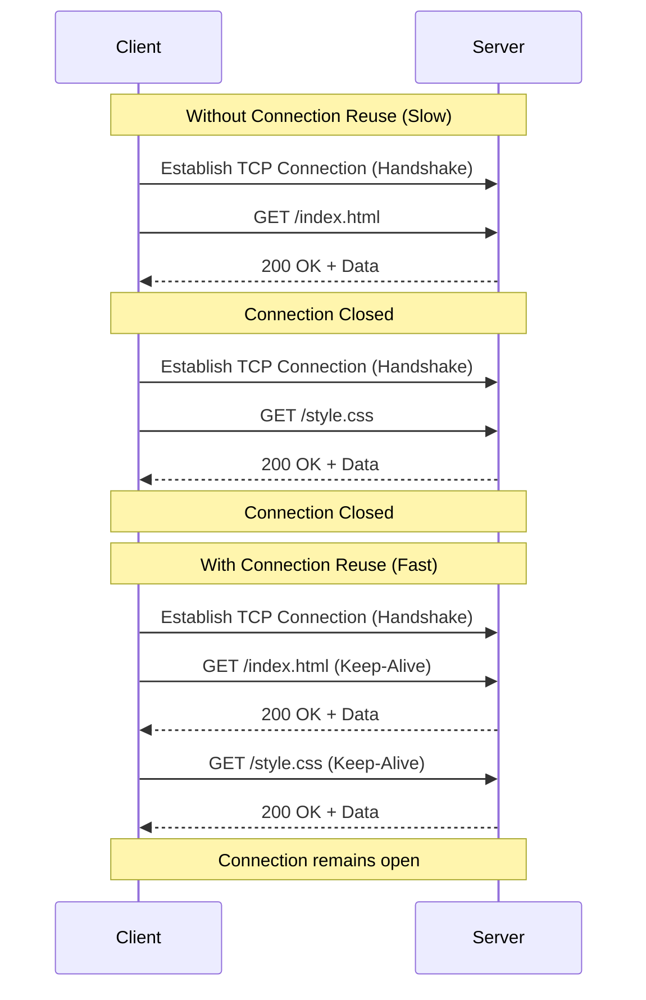

## 3.2. Session and Connection Pool Management

When writing professional web scrapers, managing how your code establishes connections is critical for both application performance and avoiding rate limits.

---

### 1. Keep-Alive and Connection Reuse

In early HTTP protocols, every single request required a fresh TCP connection. In modern systems, we use **HTTP Keep-Alive**. This mechanism allows an established TCP connection to remain open, enabling multiple sequential HTTP requests and responses to pass over the same socket.



---

### 2. Connection Pools

A connection pool is a cache of database or network connections maintained so that connections can be reused when future requests are made.

When writing high-performance scrapers, we utilize HTTP libraries that manage a local **connection pool**. If we execute multiple threads or asynchronous requests, the pool manager allocates connections from a pre-allocated set of open sockets. This prevents:
* **Local Socket Exhaustion:** Running out of local ephemeral ports.
* **TCP Handshake Latency:** Eliminating negotiation delays on every request.

---

###  Common Student Pitfalls & Pro-Tips
* **Not using `requests.Session()` in Python:** When scraping with Python, if you use raw `requests.get()`, Python will spin up and close a fresh connection for each execution. Always wrap your requests inside a `requests.Session()` block to enable automatic connection pooling, cookie persistence, and keep-alive recycling:

```python
import requests

# BAD: No connection reuse
for url in url_list:
    response = requests.get(url)

# GOOD: Automatic keep-alive and connection reuse
with requests.Session() as session:
    for url in url_list:
        response = session.get(url)
```

---
