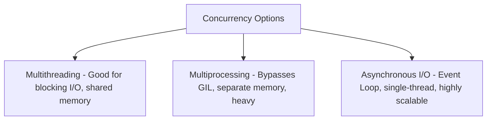

## 3.4. Rate Limiting, Concurrency, and Scaling Crawlers

Scaling a scraper requires understanding how to run requests concurrently without crashing the target server or getting blocked.

---

### 1. Concurrency Patterns

To run multiple HTTP operations simultaneously, developers use three core architectural patterns:

#### Multithreading
Spins up multiple operating system threads. When one thread blocks waiting for a network socket response, the OS context-switches to run another thread. Good for heavy network I/O, but limited in Python by the **Global Interpreter Lock (GIL)**.

#### Multiprocessing
Spins up completely separate operating system processes, bypassing Python's GIL. Each process has its own isolated memory space. This is highly effective but has a heavy memory overhead, making it unsuitable for hundreds of concurrent connections.

#### Asynchronous I/O (Async/Await)
Runs on a **single thread** using an **Event Loop**. Sockets are configured as non-blocking. When a request is sent, the event loop registers a callback and continues executing other tasks immediately. This is the most memory-efficient design, capable of managing thousands of concurrent requests on a single machine (e.g., Python's `asyncio` + `httpx`, or Node.js's event loop).

---

### 2. Implementing Backoff and Jitter

If a scraper requests pages at a static interval, the target server's rate-limiting defenses will quickly detect and block it. To bypass this, scrapers implement backoff and jitter algorithms.

#### Exponential Backoff
When the server returns a rate-limiting status code (like `429 Too Many Requests`), the scraper automatically increases its wait time exponentially before retrying (e.g., 2s, 4s, 8s, 16s).

#### Jitter (Randomization)
If a scraper waits exactly 5 seconds between every request, it creates a highly structured signature on the server's traffic logs. Adding a random factor (jitter) to your wait times breaks up this signature, making requests look more organic.

$$t_{\text{wait}} = t_{\text{base}} + \text{Random}(0, \text{Jitter})$$

---

###  Common Student Pitfalls & Pro-Tips
* **The "Hammer" Problem:** Do not start a web scraping project by executing thousands of raw, concurrent requests immediately. This can look like a Distributed Denial of Service (DDoS) attack, causing the host server to crash or triggering an immediate firewall IP block. Always start with a conservative, metered approach, respect the site's `robots.txt` configuration, and adjust scraping concurrency thresholds based on the target server's response performance.

---
