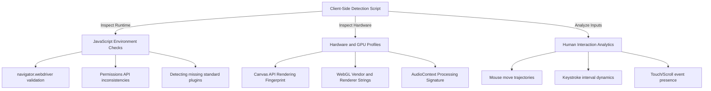

## 4.5. Headless Browser Detection and Fingerprinting Mitigation

When scaling automated web crawlers or scraping engines, you will quickly find that simple HTTP requests are not enough. Many modern sites use complex client-side security scripts to detect and block headless browsers.



---

### 1. Common Headless Browser Signatures

When a tool like Playwright, Puppeteer, or Selenium launches a browser instance, the browser's engine exposes specific variables in its global JavaScript environment. Bot detection engines (such as Cloudflare, Akamai, or PerimeterX) look for these signatures:

#### A. The `navigator.webdriver` Property
The W3C WebDriver specification requires browsers under automated control to set the `navigator.webdriver` property to `true`. This is the easiest signature for detection scripts to check:

```javascript
if (navigator.webdriver) {
    // Immediate block: Browser is automated
}
```

#### B. The Chrome Object Presence
In authentic Google Chrome instances, a global `window.chrome` object containing specific runtime variables is present. In headless Chromium environments launched via typical automation frameworks, this object is often missing or incomplete.

#### C. Inconsistent Permissions API
In a real browser, querying user permissions yields consistent states. Under automated control, the permissions API often returns inconsistent results. For example:

```javascript
navigator.permissions.query({ name: 'notifications' }).then((permissionStatus) => {
    if (Notification.permission === 'denied' && permissionStatus.state === 'prompt') {
        // Inconsistent state: Flagged as automated browser
    }
});
```

---

### 2. Advanced Hardware Fingerprinting

Modern fingerprinting goes beyond checking global variables. It analyzes how the host system's hardware renders graphics and audio:

#### Canvas Fingerprinting
The client-side script instructs the browser to draw a hidden, complex shape with specific text, fonts, and gradients onto an HTML `<canvas>` element. 

The browser converts this rendered image into a Base64-encoded string. Because different operating systems, graphics cards, and display drivers use slightly different rasterization and anti-aliasing sub-pixel rendering algorithms, the resulting Base64 string acts as a highly unique identifier for that specific machine configuration.

#### WebGL Vendor and Renderer
By querying the WebGL graphics context, scripts can read the exact GPU vendor and model name:

```javascript
const canvas = document.createElement('canvas');
const gl = canvas.getContext('webgl');
const debugInfo = gl.getExtension('WEBGL_debug_renderer_info');
const vendor = gl.getParameter(debugInfo.UNMASKED_VENDOR_WEBGL);
const renderer = gl.getParameter(debugInfo.UNMASKED_RENDERER_WEBGL);
// Headless often exposes: "Google SwiftShader" (Software CPU renderer)
// Real browser exposes: "NVIDIA Corporation" or "Intel Inc."
```

---

### 3. Fingerprint Mitigation and Evasion Strategies

To bypass advanced client-side detection, your automated browser instances must mimic organic consumer setups:

```
                  [ Scraper Pipeline ]
                           │
             Does the browser match a human?
                           │
             ┌─────────────┴─────────────┐
             ▼                           ▼
     [ Raw Automation ]         [ Stealth Evasion Engine ]
     - navigator.webdriver=true  - Override properties via JS
     - Soft CPU WebGL renderer  - Inject realistic hardware profiles
     - Default user-agent       - Mimic human touch/mouse movements
     - Fast, linear clicks      - Add random coordinate jitter
             │                           │
             ▼                           ▼
        ( BLOCKED! )               ( SUCCESS! )
```

#### A. Overriding Properties via JS Injection
We can inject scripts into the browser *before* any webpage scripts load, modifying or deleting automated properties. In Playwright, this is handled using custom initialization scripts:

```python
# Playwright Stealth Evasion Example
async def configure_stealth(context):
    await context.add_init_script("""
        // Hide the webdriver property
        Object.defineProperty(navigator, 'webdriver', {
            get: () => undefined
        });
        
        // Mock the chrome object
        window.chrome = {
            runtime: {},
            loadTimes: function() {},
            csi: function() {}
        };
    """)
```

#### B. Using Dedicated Evasion Plugins
Rather than manually spoofing dozens of variables, developers use community-maintained stealth plugins (such as `puppeteer-extra-plugin-stealth` or Playwright equivalents) that dynamically handle fingerprint evasion, including mocking plugins, fonts, permissions, and WebGL renderers.

---

###  Advanced Engineering Tips & Pitfalls
* **The Frame Rate Cap Trap:** Headless browsers often render frames as fast as possible to maximize performance, resulting in unnatural execution speeds. Some advanced detection scripts monitor the browser's requestAnimationFrame timing to detect these execution patterns. Cap or throttle the browser's render rate to match standard consumer displays (e.g., 60Hz).

---
