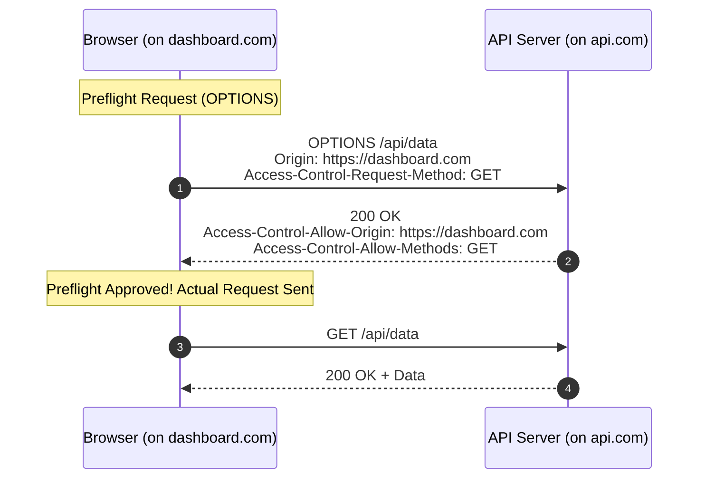

## 4.1. The Core of Web Security: SOP, CORS, and CSP

Modern browsers implement strict security sandboxing to prevent malicious scripts from compromising user sessions.

---

### 1. Same-Origin Policy (SOP)

The Same-Origin Policy is a fundamental security mechanism implemented in browsers. It dictates that **scripts running in one web page can only access data on another page if both pages share the exact same origin**.

An origin is defined by three components: **Protocol**, **Host**, and **Port**.

```
Origin Check against: https://www.example.com:443/

| Target URL | Same Origin? | Reason |
| :--- | :---: | :--- |
| https://www.example.com/index.html |  Yes | Protocol, Host, and Port match |
| http://www.example.com/api/user |  No | Protocol differs (http vs https) |
| https://api.example.com/user |  No | Host differs (subdomain is different) |
| https://www.example.com:8080/ |  No | Port differs (8080 vs 443) |
```

---

### 2. Cross-Origin Resource Sharing (CORS)

Sometimes, legitimate web applications need to bypass the strict boundaries of SOP (e.g., when a client application hosted on `dashboard.example.com` needs to fetch data from an API hosted on `api.example.com`). CORS is the system of HTTP headers that allows servers to declare which origins are permitted to access their resources.



#### The Preflight Request
When a script attempts a "non-simple" cross-origin request (e.g., adding custom headers or using methods other than `GET`, `HEAD`, or simple `POST`), the browser automatically sends a preflight **OPTIONS** request first. It asks the target server if the calling origin is allowed to make the request. Only if the server returns approval headers does the browser execute the actual request.

#### Primary CORS Headers
* `Access-Control-Allow-Origin`: Specifies which calling domains are permitted to read response data (e.g., `https://dashboard.example.com` or the wildcard `*`).
* `Access-Control-Allow-Methods`: Lists permitted HTTP methods (e.g., `GET, POST, OPTIONS`).
* `Access-Control-Allow-Headers`: Lists accepted custom headers.

---

### 3. Content Security Policy (CSP)

A Content Security Policy (CSP) is an HTTP response header that prevents **Cross-Site Scripting (XSS)**, clickjacking, and code-injection attacks by declaring which sources of dynamic resources are trusted.

```
Content-Security-Policy: default-src 'self'; script-src 'self' https://trustedscripts.com; img-src 'self' data:;
```

With CSP configured, the browser will refuse to:
* Execute inline scripts (e.g., `<script>alert('hack')</script>`).
* Load scripts from unauthorized third-party domains.
* Submit forms to endpoints not explicitly listed on the policy's whitelist.

---

###  Common Student Pitfalls & Pro-Tips
* **CORS is a Client-Side Browser Boundary Only:** This is a crucial concept. CORS headers are processed **exclusively by the web browser**. If you write a web scraping script in Python, the Same-Origin Policy does not apply, and your script can execute requests directly without worrying about CORS headers or preflightOPTIONS checks.

---
