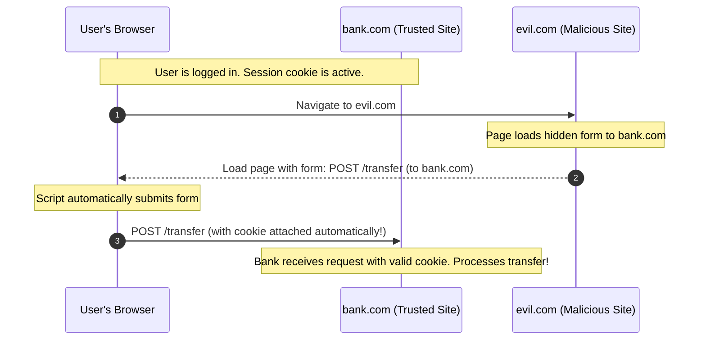
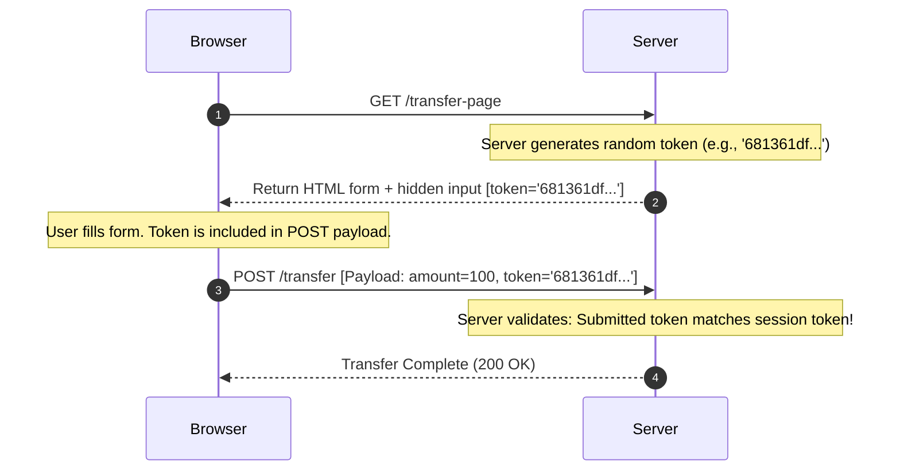

## 4.2. CSRF Attacks and Token-Based Defenses

Cross-Site Request Forgery (CSRF) is an exploit where a malicious website trick a user's browser into executing an unwanted action on a trusted site where the user is currently authenticated.

---

### 1. Mechanics of a CSRF Attack

1. **User Login:** The user logs into `bank.com`, receiving an authentication session cookie.
2. **Accessing the Trap:** While still authenticated, the user is tricked into navigating to `evil.com`.
3. **The Exploit:** `evil.com` loads an invisible, self-submitting HTML form pointing to `https://bank.com/transfer` with fields preset to transfer funds to the attacker.
4. **The Automatic Cookie Attachment:** When the browser submits the request to `bank.com`, **it automatically attaches the `bank.com` authentication session cookies**.
5. **The Server Process:** The server receives the request, reads the valid session cookie, and executes the malicious action.

---

### 2. Defending Against CSRF: CSRF Tokens

To prevent CSRF, servers must verify that the incoming request was initiated by the application's actual interface, not an external source. This is accomplished using **CSRF Tokens**:

1. **Token Generation:** When a user requests a form, the server generates a cryptographically strong, random token and stores it in the user's session variables.
2. **Token Injection:** The token is embedded into a hidden input field within the HTML form before sending it to the client.
3. **Form Submission:** When the user submits the form, the token is included in the POST payload body parameters.
4. **Validation:** The server compares the submitted payload token with the stored session token. Since an external attacker (on `evil.com`) cannot read the token inside the HTML document (due to the Same-Origin Policy blocking cross-site reading), any forged request will fail verification.

---

###  Common Student Pitfalls & Pro-Tips
* **API Tokens vs. Session Cookies:** Modern single-page applications often avoid CSRF vulnerability by bypassing session cookies entirely. Instead, they store a JWT (JSON Web Token) in browser memory or local storage, and attach it manually via JavaScript to the HTTP Authorization header (e.g., `Authorization: Bearer <token>`). Since headers are not automatically attached to requests by the browser (unlike cookies), CSRF attacks are neutralized.

---
