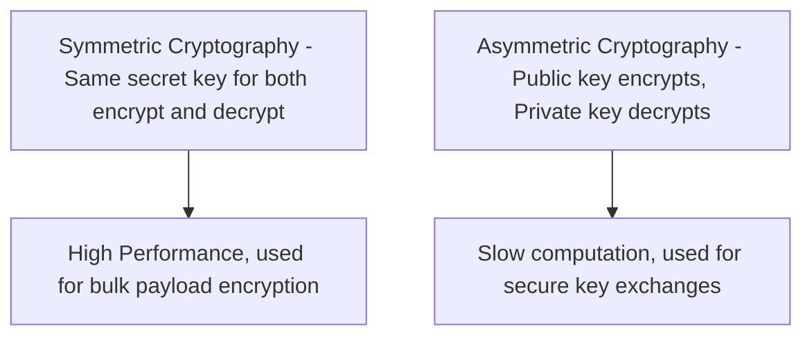
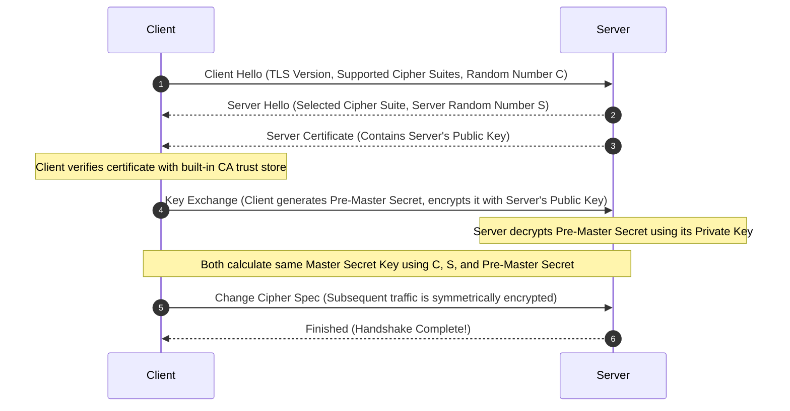

## 4.3. Cryptography and the SSL/TLS Handshake

The secure variant of HTTP is **HTTPS** (HTTP Secure). It wraps standard HTTP traffic inside an encrypted cryptographic tunnel using **SSL/TLS**.

---

### 1. Symmetric vs. Asymmetric Cryptography

#### Symmetric Encryption
* **Mechanism:** The same secret key is used to both encrypt and decrypt the plaintext data.
* **Characteristics:** Extremely fast, mathematically lightweight.
* **Challenge:** How do two remote computers securely share the secret key without an observer sniffing it?

#### Asymmetric (Public-Key) Encryption
* **Mechanism:** Uses a mathematically linked keypair:
  * **Public Key:** Shared publicly with anyone. Used only to **encrypt** data.
  * **Private Key:** Kept strictly secure. Used only to **decrypt** data.
* **Characteristics:** Mathematically complex and resource-intensive. Ideal for proving identity and securely exchanging secret parameters.

---

### 2. The TLS Handshake Mechanics

The TLS handshake establishes a secure session by using **asymmetric cryptography** to securely exchange a session key, which is then used for **symmetric encryption** of the subsequent HTTP traffic:

1. **Client Hello:** The client sends its supported TLS protocol versions, supported encryption algorithms (cipher suites), and a client-generated random string `C`.
2. **Server Hello:** The server responds with the selected TLS protocol version, its selected cipher suite, and a server-generated random string `S`.
3. **Server Certificate:** The server sends its digital certificate. This contains the server's public key, verified by a trusted third-party Certificate Authority (CA).
4. **Pre-Master Secret Exchange:** The client generates a random string called the **Pre-Master Secret**, encrypts it using the server's public key (from the certificate), and sends it to the server.
5. **Decryption:** The server decrypts the Pre-Master Secret using its private key. Now, both client and server possess the identical Pre-Master Secret, which never crossed the wire in plaintext.
6. **Symmetric Session Key Calculation:** Both hosts use the client random `C`, the server random `S`, and the Pre-Master Secret to compute the same **Symmetric Session Key**.
7. **Secure Channel Activated:** The handshake concludes. All subsequent HTTP packets are encrypted using the symmetric key.

---

###  Common Student Pitfalls & Pro-Tips
* **Self-Signed Certificate Failures:** When configuring dev servers, you might encounter browser certificate validation errors. This happens because the browser's trust store does not contain the root CA key that signed your local certificate. In python's requests library, you can bypass this validation block using `verify=False`, but you must **never use this in production** as it leaves you vulnerable to Man-in-the-Middle (MITM) attacks where an attacker can spoof the server's identity.

---
