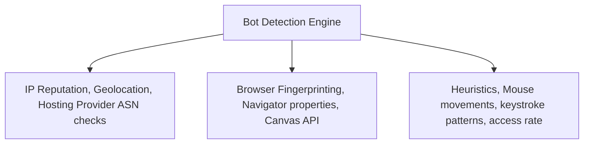

## 4.4. Rate Limiting, Captchas, and Bot Detection

To protect APIs and data portals from scraping, developers implement bot mitigation systems.

---

### 1. Bot Mitigation Strategies

#### Network-Level Filtering
* **IP Reputation:** Restricting traffic originating from known data centers or hosting providers (e.g., AWS, DigitalOcean, Google Cloud) and requiring residential or mobile ISPs.
* **Geofencing:** Restricting traffic strictly to target geographic regions.

#### Browser Fingerprinting
* Checking for typical headless browser signatures (e.g., `navigator.webdriver === true`).
* Evaluating Canvas API rendering performance to uniquely identify hardware layouts.
* Verifying that expected web features and global window properties match standard consumer browsers.

#### Behavior Analysis
* **Rate Limits:** Restricting users to a certain number of requests per minute per IP address.
* **Interaction Analysis:** Tracking mouse trajectories, click coordinates, keystroke patterns, and reading pauses to identify robotic behaviors.

---

### 2. CAPTCHA Challenges

When a bot detection engine flags suspicious traffic, it redirects the user to complete a **CAPTCHA** (Completely Automated Public Turing test to tell Computers and Humans Apart).

* **Classic Math Challenges:** A simple server-rendered script calculates a math problem (like `4+4`) and asks for the answer. While effective at blocking simplistic HTTP scripts, modern OCR (Optical Character Recognition) libraries can solve these with near-perfect accuracy.
* **Puzzle/Image Grids (reCAPTCHA v2):** Challenges users to select specific objects (e.g., "Find all traffic lights"). These rely on tracking pixel interactions and analyzing the user's browser history before displaying the puzzle.
* **Invisible Analysis (reCAPTCHA v3 / hCaptcha Enterprise):** Does not prompt the user with interactive challenges. Instead, it tracks background behaviors, generating a risk score from `0.0` (high bot probability) to `1.0` (human signature).

---

###  Common Student Pitfalls & Pro-Tips
* **Respecting Rate Limits:** If a target website has an explicit rate-limiting policy or warns you with HTTP status `429 Too Many Requests`, **always slow down your scrapers**. Bypassing rate limits using aggressive IP proxy rotation or header manipulation is a high-maintenance approach that often leads to permanent IP blacklisting.

---
