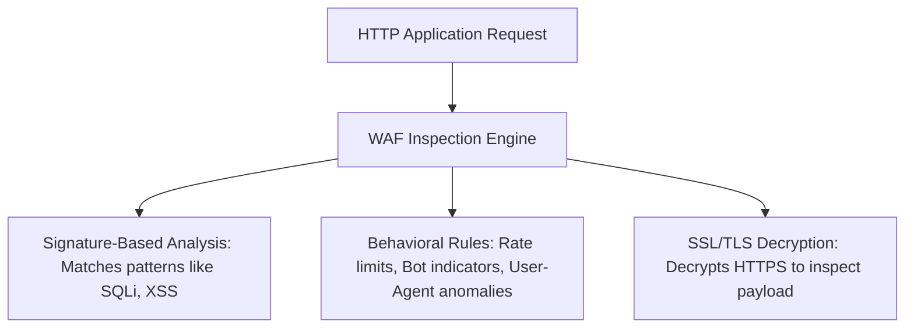

## 5.2. Web Application Firewalls (WAF) and Layer 7 Filtering

Traditional network firewalls are blind to the application-level data payload. They cannot detect if an HTTP POST request contains malicious SQL injection queries. This is the domain of the **Web Application Firewall (WAF)**, which operates at **OSI Layer 7 (Application)**.

---

### 1. How a WAF Analyzes Traffic

#### Signature-Based Inspection
The WAF scans incoming HTTP bodies, headers, and request query parameters for known attack pattern strings. For example:
* **SQL Injection (SQLi):** Looking for keywords like `' OR '1'='1` or `UNION SELECT`.
* **Cross-Site Scripting (XSS):** Looking for sequences like `<script>` or `onerror=`.

#### Behavioral and Custom Rules
A WAF can evaluate complex logical rules. For example, blocking requests if a specific endpoint receives more than 50 POST requests per minute from a single IP, or blocking requests that lack a standard `User-Agent` header.

#### SSL/TLS Termination and Inspection
Since HTTPS encrypts the payload, a WAF must sit at a network termination point where the HTTPS connection is decrypted. The WAF inspects the plaintext request, validates it, and optionally re-encrypts it before forwarding the traffic to the internal application servers.

---

### 2. Modern WAF Platforms

WAFs are deployed in two primary configurations:
1. **Cloud-Based/Reverse Proxy (e.g., Cloudflare, Akamai, AWS WAF):** Domain DNS records are configured to point directly to the WAF's IP addresses. The cloud provider receives all incoming web traffic, filters out malicious requests, and forwards legitimate requests to the origin servers.
2. **On-Premise/Software-Based (e.g., ModSecurity, Nginx WAF modules):** The WAF is installed directly inside the web server software (such as Nginx or Apache) to inspect incoming request vectors before passing them to the application runtime.

---

###  Common Student Pitfalls & Pro-Tips
* **Bypassing the Cloud-Based WAF:** If a website relies on Cloudflare to block automated bots, but the developers left their origin server's direct IP address exposed to the internet, attackers can bypass Cloudflare's security entirely. By configuring their scraping script to connect directly to the origin server's IP address (attaching the target domain name to the `Host` header), they can request the site directly without traffic going through Cloudflare's Cloud WAF. Secure server environments should always use firewalls to drop all traffic that does not originate from the cloud WAF's official IP ranges.

---
