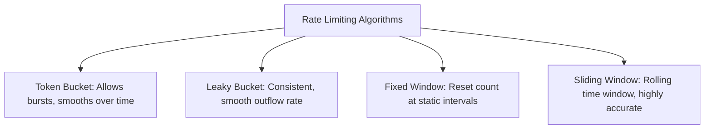
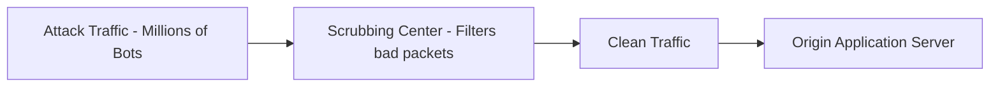

## 5.4. Rate Limiting and DDoS Mitigation Systems

A Distributed Denial of Service (DDoS) attack aims to overwhelm a target server with massive volumes of traffic, rendering it unavailable to legitimate users. Mitigating this risk requires rate-limiting algorithms and traffic filtering.

---

### 1. Common Rate-Limiting Algorithms

Web servers and APIs restrict excessive requests using specific mathematical algorithms:

#### Token Bucket
The system generates "tokens" at a fixed rate and stores them in a "bucket" of defined capacity. Every incoming request consumes one token. If the bucket runs out of tokens, subsequent requests are rejected until new tokens are generated. This allows the system to support sudden bursts of traffic while still maintaining a safe average request rate over time.

#### Leaky Bucket
Requests are poured into a bucket representing a processing queue. The bucket drains from the bottom at a constant, fixed rate. If the incoming request rate exceeds the queue's capacity, the bucket overflows, and subsequent requests are dropped immediately. This guarantees a smooth, constant output rate.

#### Fixed Window Counter
Counts the number of requests received within static, defined time windows (e.g., 60-second intervals starting on the minute). While simple to implement, it is vulnerable to traffic surges near boundary transitions (e.g., a client sending its entire quota at 11:59:59 and another quota at 12:00:01, bypassing the rate-limit rule).

#### Sliding Window Log / Sliding Window Counter
Calculates a rolling time window relative to each incoming request's actual timestamp. This prevents boundary-surging vulnerabilities, but requires more memory to track individual request timestamps.

---

### 2. High-Volume DDoS Mitigation

When an attack scales to gigabits or terabits of traffic, individual server instances cannot handle the load alone. Enterprise protection networks use high-capacity infrastructure to absorb the impact:

#### Anycast Routing
Distributes a single destination IP address across multiple physical data centers globally using BGP routing. This automatically spreads the attack volume across several network locations, preventing any single data center from being overwhelmed.

#### Scrubbing Centers
Massive cloud routing facilities designed to analyze traffic at the packet level. They filter out malicious TCP SYN flood packets or illegitimate UDP packets on the fly, forwarding only clean, validated traffic to the origin servers.

---

###  Common Student Pitfalls & Pro-Tips
* **Checking for the `Retry-After` Header:** When an API rate-limits your script (returning status `429 Too Many Requests`), it often includes a `Retry-After` header in the response. This tells you exactly how many seconds you need to wait before making your next request. Reading and respecting this header in your scraper's error handlers prevents your scraper from making unnecessary requests while blocked, which could lead to permanent IP bans.
