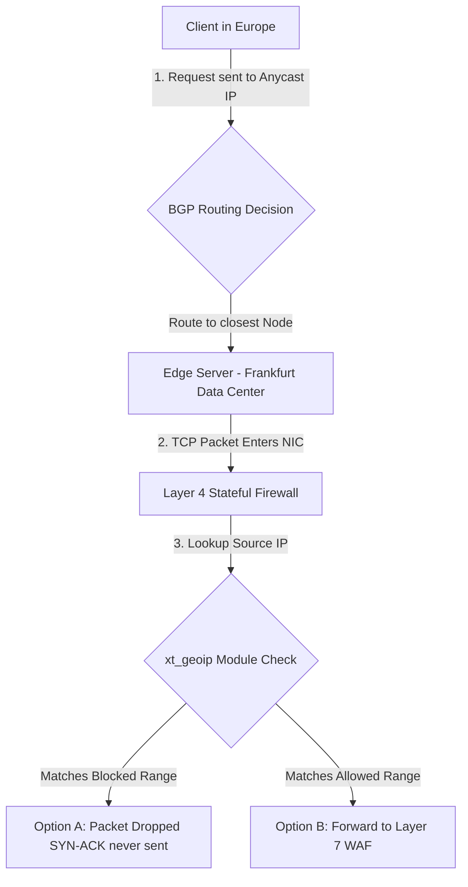

## 5.5. Deep Dive on IP Geofencing and BGP Anycast Routing

To implement regional geofencing at scale without introducing latency, organizations rely on a combination of low-level firewall modules and global routing architectures.



---

### 1. Low-Level Geofencing Execution (IP Tables and Kernel Space)

Checking Geolocation databases inside an application (such as Python or Nginx) for every incoming packet is highly inefficient. It requires parsing the packet, extracting the headers, and executing a database lookup in user space. Under a DDoS attack, this CPU overhead would quickly crash the server.

To avoid this overhead, enterprise firewalls perform geofencing directly in **kernel space** using high-performance firewall frameworks (like Linux `iptables` / `nftables`).

#### The `xt_geoip` Module
Using the `xt_geoip` extension module for Netfilter, a system administrator can compile MaxMind GeoIP databases directly into binary range tables loaded into kernel memory.

When a packet arrives:
1. The kernel reads the source IP from the IP packet header.
2. It executes a high-speed binary search against the compiled memory table.
3. If the country code does not match the permitted zone, the kernel discards the packet immediately, before it can consume any system memory or reach user-space applications.

```bash
# Example Linux iptables rule to drop all traffic not originating from Algeria (DZ)
iptables -A INPUT -m geoip ! --src-cc DZ -j DROP
```

---

### 2. BGP Anycast Routing Mechanics

When a service is protected by a global CDN (like Cloudflare), it uses **Anycast Routing** to handle traffic.

#### What is Anycast?
In standard routing (Unicast), every IP address on the internet maps to a single physical machine. In an Anycast configuration, **multiple physical machines located in different data centers worldwide share the exact same IP address**.

#### How BGP Determines the Path
The internet's backbone uses the **Border Gateway Protocol (BGP)** to route traffic. BGP routers continuously exchange maps of available paths (routing tables) between networks.

When multiple locations advertise the same IP address, BGP routers naturally direct the client's packets to the path with the fewest network hops. This means:
* A client in Algiers connecting to the Anycast IP is automatically routed to a server in Algiers or Marseille.
* A client in London connecting to the same IP is automatically routed to a server in London.

#### The Geofencing Interaction
Because Anycast routes users to the closest physical data center, a regional firewall or geofence configuration can be deployed at the edge servers of each individual data center. The edge nodes drop unauthorized traffic instantly, keeping regional application servers safe from global attacks.

---

###  Advanced Engineering Tips & Pitfalls
* **The Anycast State Desynchronization:** Because Anycast routes packets dynamically, changes in internet routing tables can cause a client's packets to suddenly shift mid-session to a different physical data center. If the servers do not share session states (e.g., via a distributed Redis cluster), the client's connection will be reset, forcing them to authenticate again.

---
