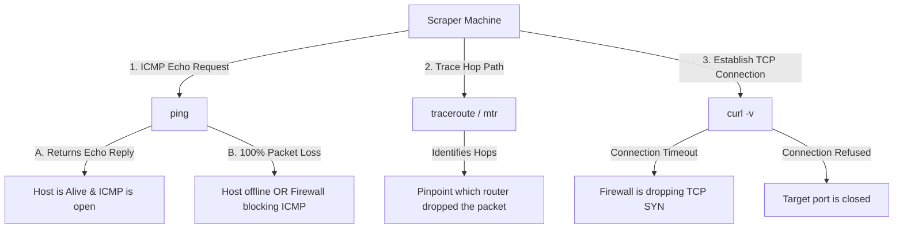

## 5.6. Network Routing Failures, Packet Analysis, and Diagnostic Tools

To debug network failures, we must look past high-level software interfaces and analyze raw packet-level diagnostics.

---

### 1. Packet Troubleshooting with curl, ping, and traceroute

When a connection fails, we can isolate the point of failure along the network path using a standard diagnostic suite:



#### Ping (ICMP Echo Request)
Sends an **ICMP (Internet Control Message Protocol) Type 8 (Echo Request)** packet to the target IP. The target is expected to respond with an **ICMP Type 0 (Echo Reply)**.
* **Limitation:** Many modern firewalls disable ICMP processing entirely to prevent discovery scans. A failed ping does not necessarily mean the web server is offline; it only means the server's firewall is blocking ICMP packets.

#### Traceroute / MTR (My Traceroute)
Traceroute identifies every router hop along the path to the destination. It does this by exploiting the **Time-To-Live (TTL)** field in the IP header.

1. **TTL Decrementation:** Every router that forwards an IP packet decrements the TTL value by `1`. If the TTL reaches `0`, the router discards the packet and returns an **ICMP Type 11 (Time Exceeded)** packet to the sender.
2. **Iterative TTL Expansion:** Traceroute sends a sequence of packets with sequentially increasing TTL values (starting at `1`, then `2`, then `3`, etc.).
3. **Hop Mapping:** By reading the source IP addresses of the returning ICMP Time Exceeded packets, traceroute maps every routing hop along the path. If the route suddenly terminates with asterisks (`* * *`), the node immediately after the last successful hop is where the packet was dropped, pinpointing the location of the network block.

---

### 2. Deciphering curl Verbose Output

Using `curl -v` provides a detailed log of the socket connection sequence:

```bash
$ curl -v https://example.com
```

#### Scenario A: Successful Handshake
```
*   Trying 93.184.216.34:443...
* Connected to example.com (93.184.216.34) port 443 (#0)
* ALPN, offering h2
* ALPN, offering http/1.1
* TLSv1.3 (OUT), TLS handshake, Client hello (1):
* TLSv1.3 (IN), TLS handshake, Server hello (2):
...
> GET / HTTP/1.1
> Host: example.com
```
* **Explanation:** The socket successfully resolved the IP, established a TCP connection on port `443`, performed the TLS handshake, and sent the HTTP request.

#### Scenario B: Connection Timeout (Geofenced / Blocked)
```
*   Trying 197.112.99.102:443...
* ipv4 connect timeout after 15000ms, move on!
* Failed to connect to bem.onec.dz port 443: Connection timed out
* Closing connection 0
```
* **Explanation:** The client sent the `SYN` packet, but the target server's firewall dropped it. The client kernel retried sending the `SYN` packet, but received no response before the timeout deadline was reached.

---

###  Advanced Engineering Tips & Pitfalls
* **The "Asymmetric Routing" Reality:** Network paths are not symmetric. The path a packet takes from your machine to a target server can be entirely different from the path the returning packet takes back to your machine. When diagnostic tools like `traceroute` show a failure, keep in mind that the block could be on the return path, rather than the outbound path.
