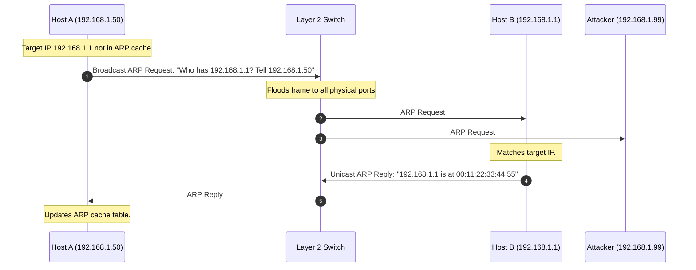
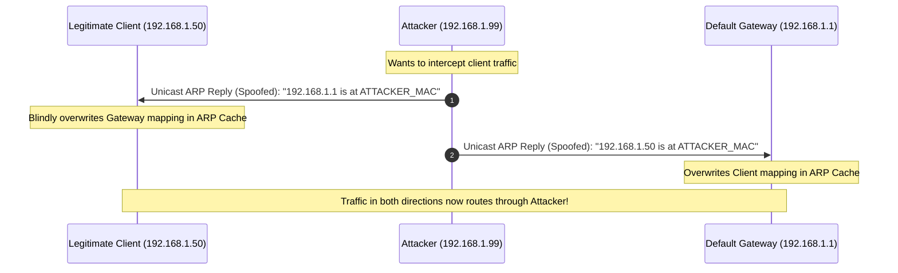

## 6.1. Address Resolution Protocol and Spoofing Mechanics

To understand how an attacker can manipulate local network routing or how security tools defend against it, we must analyze the Address Resolution Protocol (ARP) at the Data Link Layer (Layer 2).

---

### 1. The Core Purpose of ARP

IP packets are routed globally using logical Layer 3 (Network) IP addresses. However, when a packet arrives at the final local network segment (Local Area Network, or LAN), it cannot be delivered using the IP address alone. Physical network interfaces on a local switch communicate using **Layer 2 (Data Link) Media Access Control (MAC) Addresses**.

ARP acts as the translation bridge. When Host A (`192.168.1.50`) wants to send a frame to Host B (`192.168.1.1`), it checks its local in-memory **ARP Cache**. If no mapping exists for `192.168.1.1`, Host A must execute an ARP resolution cycle.

1. **The ARP Request (Broadcast):** Host A broadcasts a frame containing an ARP request to the MAC address `ff:ff:ff:ff:ff:ff`. Every device on the local switch receives and processes this frame.
2. **The ARP Reply (Unicast):** Only the device assigned the target IP address (`192.168.1.1`) responds. It constructs a unicast ARP reply containing its physical MAC address and sends it directly back to Host A's MAC address.
3. **Caching:** Host A receives the reply, links the MAC address to the IP in its local ARP cache table, and begins transmitting the buffered Layer 3 payload wrapped in Layer 2 Ethernet frames.

---

### 2. The Stateless Vulnerability of ARP

The structural flaw of the ARP protocol is that it is **entirely stateless and lacks authentication**.

* **Lack of State Verification:** Operating systems do not keep track of outstanding ARP requests. If a host receives an ARP reply (Operation Code `2`), it does not verify whether it ever sent a matching ARP request (Operation Code `1`). It blindly accepts the incoming mapping and updates its local ARP cache.
* **Unsolicited (Gratuitous) Replies:** A host can transmit an unsolicited ARP reply, known as a **Gratuitous ARP (GARP)** frame, to tell the network of an IP-to-MAC mapping change. The network switches and hosts process this frame and update their tables immediately.
* **Zero Authentication:** There are no cryptographic handshakes, digital signatures, or verification mechanisms inside standard ARP frames. Any device connected to the physical switch can claim to own any IP address on the subnet.

---

### 3. ARP Spoofing (Man-in-the-Middle) Mechanics

Because hosts accept unsolicited ARP replies, an attacker on the same local segment can easily execute an **ARP Spoofing** or **ARP Poisoning** attack.

1. **Poisoning the Client:** The attacker sends a spoofed ARP reply to the client. The packet claims that the default gateway's IP address (`192.168.1.1`) maps to the attacker's physical MAC address.
2. **Poisoning the Gateway:** Simultaneously, the attacker sends a spoofed ARP reply to the default gateway. This packet claims that the client's IP address (`192.168.1.50`) maps to the attacker's physical MAC address.
3. **Intercepting Traffic:** Both the client and the gateway update their ARP caches with the poisoned mappings. When the client transmits packets destined for the internet, the Layer 2 Ethernet frames are addressed to the attacker's MAC address. The attacker's network interface card intercepts the frames, reads or modifies the payloads, and forwards them to the actual gateway to maintain a stealthy connection.

---

###  Common Student Pitfalls & Pro-Tips
* **Switch MAC Tables vs. Host ARP Caches:** Do not confuse a network switch's MAC Address table with a host's ARP Cache. A Layer 2 switch maintains a **MAC table** mapping physical ports to MAC addresses (learned by observing the source MAC of incoming frames). An operating system maintains an **ARP Cache** mapping IP addresses to MAC addresses. ARP spoofing targets the host OS cache, not the switch's port map.
* **The Silent Poisoning Trap:** Many debugging students assume that if they can still ping the gateway, they are not poisoned. However, an attacker executing a Man-in-the-Middle attack will actively forward your packets to the gateway. The connection remains functional, but your traffic is fully exposed to interception.

---
