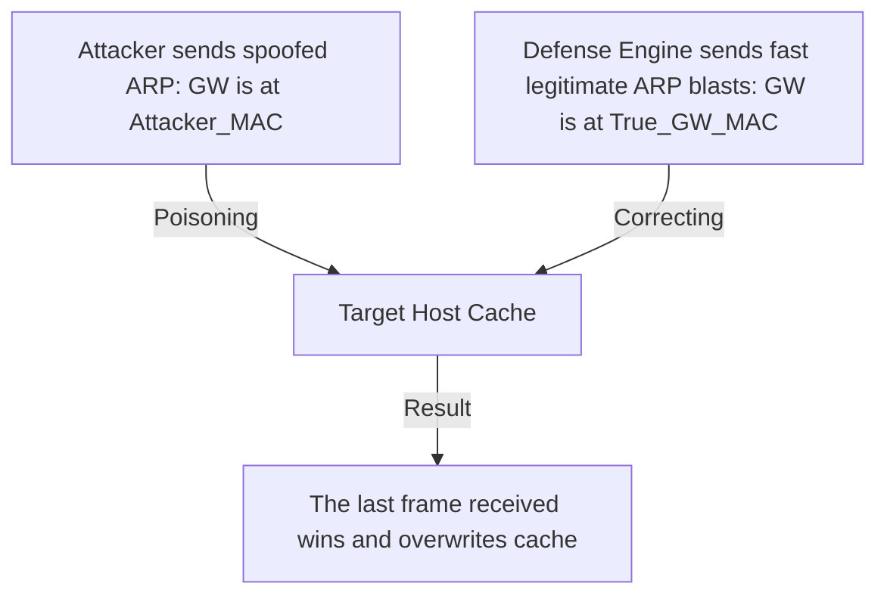
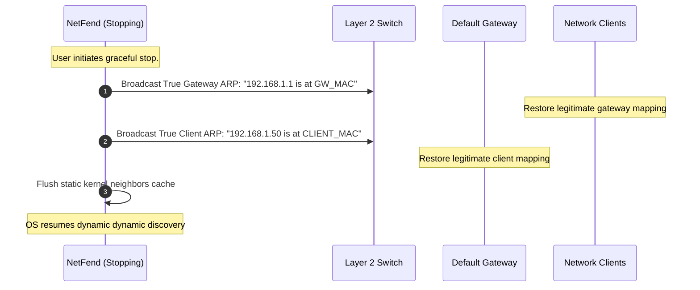

## 6.2. Active Mitigation Blasting and Route Restoration

When an ARP spoofing attack is detected, defenders must act to protect network integrity. Two primary active defense mechanisms are **Corrective Active Mitigation Blasting** and **Graceful Route Restoration**.

---

### 1. Corrective Active Mitigation Blasting

Once an defense system (like NetFend) detects that an attacker is sending fraudulent ARP replies, it initiates a high-frequency broadcast campaign of legitimate ARP replies, known as **Mitigation Blasting**.

#### The Race for the Cache
Because standard operating systems overwrite their ARP tables based on the most recently received ARP packet, the defense engine must outpace the attacker's injection frequency.
* If the attacker sends a poisoned packet once every 2 seconds, the defense engine can transmit legitimate corrective packets at a higher frequency (e.g., 10 to 30 packets in a sub-second burst, repeating at short intervals).
* By flooding the network segment with legitimate mappings, the defense engine ensures that the target host's ARP cache contains the correct mapping for the vast majority of the time, keeping the communication channel open.

---

### 2. Algorithmic Configuration of Mitigation Profiles

To prevent network degradation from excessive broadcast traffic, the intensity of the mitigation blast must scale dynamically with the evaluated threat level of the attacker.

$$\text{Blast Intensity} = f(\text{Threat Level})$$

| Threat Level | Burst Packet Count | Intra-burst Interval (seconds) | Mitigation Loop Sleep (seconds) | Total Packet Rate |
| :--- | :---: | :---: | :---: | :--- |
| **MONITOR** | 3 | 0.05 | 1.0 | ~3 packets/sec |
| **SUSPECT** | 8 | 0.02 | 0.5 | ~16 packets/sec |
| **HOSTILE** | 15 | 0.01 | 0.2 | ~75 packets/sec |
| **CRITICAL** | 30 | 0.005 | 0.05 | ~600 packets/sec |

* **Low-Threat Mode (MONITOR):** Minimizes network overhead by sending a small burst of 3 packets every second, keeping the client's ARP table clean without saturating the local switch's backplane.
* **High-Threat Mode (CRITICAL):** Prioritizes defense over bandwidth conservation. It sends a burst of 30 packets at extremely close intervals (5 milliseconds apart) every 50 milliseconds, overriding the attacker's poisoning attempts.

---

### 3. Graceful Route Restoration

When the defense system shuts down or deactivates, it must cleanly hand routing control back to the operating system's standard dynamic state. Leaving the network in an active defense state after shutdown can cause routing anomalies.

1. **The Restoration Blast:** The stopping defender transmits a series of broadcast ARP reply packets (typically 5 to 10 frames) containing the authentic, validated mappings for both the gateway and local clients. This ensures that any remaining poisoned caches on the subnet are corrected immediately.
2. **Dynamic Cache Unlocking:** The defender removes any static locks or custom firewall rules applied during startup, allowing the kernel to resume normal, dynamic discovery.

---

###  Common Student Pitfalls & Pro-Tips
* **The Mitigation Broadcast Storm Hazard:** Sending too many corrective ARP blasts can inadvertently cause a **Broadcast Storm**, saturating the switch's processing queue and consuming local bandwidth. Always design mitigation loops with strict sleep intervals and backoff algorithms to prevent the defense system from behaving like a Denial-of-Service attack.

---
