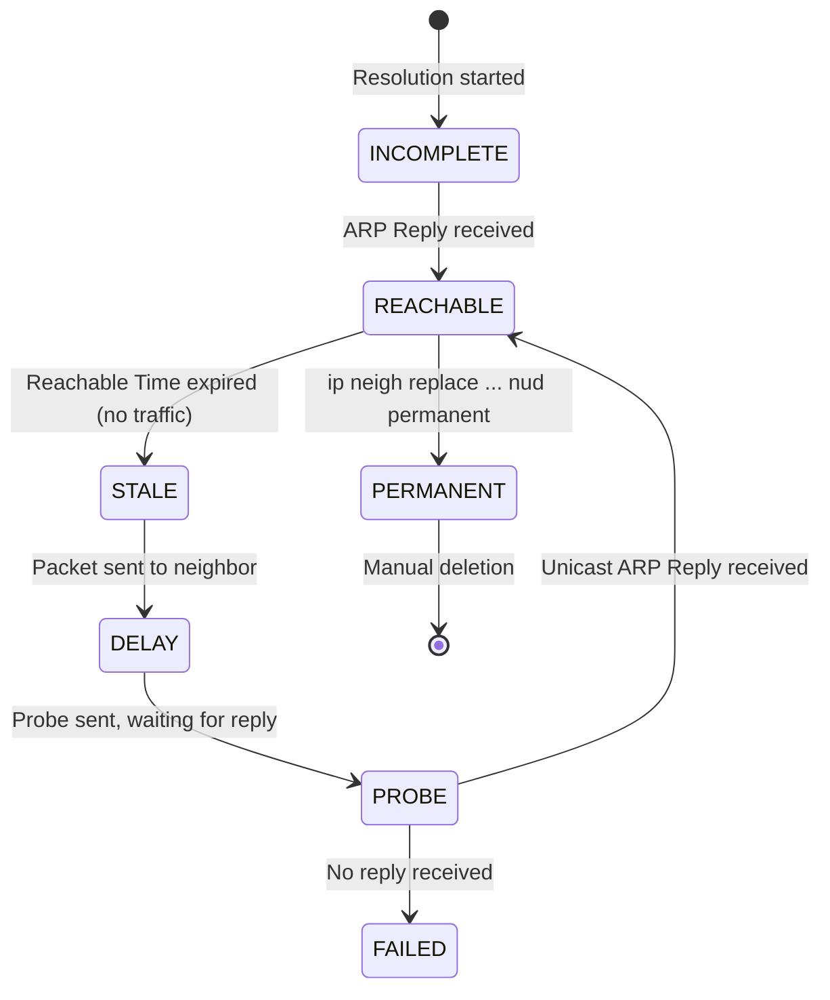

## 6.3. Static Cache Hardening and Kernel Neighbors Table

Active mitigation blasting is an offensive defense mechanism. A more robust, silent approach is **Static Cache Hardening**, which modifies how the operating system kernel handles physical address mappings.

---

### 1. The Linux Kernel Neighbors Table (ARP Cache)

In the Linux kernel, the Data Link Layer mapping table is managed by the **Neighbor Subsystem** (referred to as the ARP cache or IPv4 neighbor table). You can inspect this table directly from the terminal:

```bash
# View the current neighbors table
ip neighbor show
# Or using legacy net-tools
arp -an
```

Every entry in the neighbor table exists in one of several states defined by the kernel state machine:



* **`REACHABLE`:** The mapping is valid, and the neighbor was recently verified as active.
* **`STALE`:** The mapping is still used, but its validity is unconfirmed because no traffic has passed recently. Receiving an unsolicited ARP reply can easily overwrite a `STALE` entry.
* **`PERMANENT`:** The mapping was configured manually by a system administrator. The kernel's neighbor discovery state machine is completely bypassed for this entry.

---

### 2. Hardening via Static ARP Cache Injection

By injecting a static, permanent entry into the kernel's neighbor table, you can protect the host from ARP spoofing:

```bash
# Injecting a permanent entry for the Gateway
ip neigh replace 192.168.1.1 lladdr 00:11:22:33:44:55 dev wlan0 nud permanent
```

* **`nud permanent`:** Sets the Neighbor Unreachability Detection (NUD) state to permanent.
* **Kernel Enforcement:** When an entry is flagged as `permanent`, **the Linux kernel ignores all incoming ARP replies for that IP address**. Even if an attacker sends millions of spoofed ARP frames, the kernel refuses to update the entry, securing the outbound route.

---

### 3. Automated Route Hardening Architecture

In automated defense systems (like NetFend), this hardening is executed programmatically at startup and reverted at shutdown:

```
[ System Startup ]
       │
       ├──► 1. Detect dynamic interface and gateway IP
       ├──► 2. Resolve gateway MAC address using verified ARP requests
       ├──► 3. Call 'ip neigh replace ... nud permanent' to lock the gateway route
       └──► 4. Monitor traffic safely
       │
[ System Shutdown ]
       │
       └──► Call 'ip neigh replace ... nud reachable' to unlock the route
```

This hybrid approach ensures that the default gateway's route is locked during defense monitoring, and returned to a dynamic state upon shutdown.

---

###  Common Student Pitfalls & Pro-Tips
* **IP Changes on Static Routes:** If you configure a static ARP entry for a router, and the router's hardware is replaced (changing its physical MAC address), your host will lose network connectivity immediately. Because the entry is permanent, the kernel will refuse to update the cache dynamically, even if the new router broadcasts its new MAC address. Always remember to unlock or clear static mappings when changing network hardware.

---
