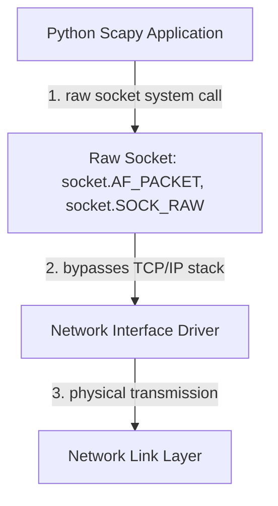

## 7.1. Low-Level Socket Manipulation and Raw Frame Injection

To read and write raw, customized Ethernet packets (bypassing the operating system's standard TCP/IP stack), we must interact directly with the kernel's low-level socket architecture.



---

### 1. Standard Sockets vs. Raw Sockets

Standard application sockets (e.g., `socket(AF_INET, SOCK_STREAM)`) operate in **User Space** and delegate the construction of protocol headers to the kernel.

* **Standard Socket Flow:** When you write `socket.send("hello")`, the kernel's network stack receives the raw string payload and automatically appends the TCP header, the IP header, and the Ethernet frame header before sending it to the network interface card (NIC).
* **Raw Socket Flow:** A raw socket (e.g., `socket(AF_PACKET, SOCK_RAW)`) bypasses the kernel's TCP/IP stack entirely. This allows the application to construct every byte of the packet manually, including the Layer 2 Ethernet headers, Layer 3 IP headers, and Layer 4 protocol fields. This is required for packet crafting tools, security scanners, and active defense engines.

---

### 2. POSIX Raw Socket Construction in Linux

In Linux, constructing a raw socket capable of injecting custom Ethernet frames requires root privileges (`CAP_NET_RAW` capability) and a specific system call configuration:

```c
// POSIX C example of raw Layer 2 socket allocation
int sock_raw = socket(PF_PACKET, SOCK_RAW, htons(ETH_P_ALL));
```

* **`PF_PACKET` (or `AF_PACKET`):** Instructs the operating system kernel that the socket must interface directly with the device driver layer (Layer 2), rather than the logical IP layer (Layer 3).
* **`SOCK_RAW`:** Indicates that the application will provide the complete link-layer Ethernet headers.
* **`ETH_P_ALL`:** Instructs the kernel to capture all incoming and outgoing frames, regardless of the protocol.

---

###  Common Student Pitfalls & Pro-Tips
* **Permissions Barrier:** Because raw sockets allow an application to spoof any network identity, read sensitive raw packets from other users, or inject malicious frames, operating systems strictly block non-root processes from allocating them. If your packet-crafting script fails on startup with `PermissionError: [Errno 1] Operation not permitted`, you must execute the script with root privileges (using `sudo`) or grant the specific capability to the Python binary:
  `sudo setcap cap_net_raw,cap_net_admin+eip /usr/bin/python3.11`.

---
